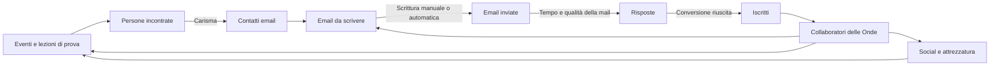

# Oggetto: Nuovi Iscritti

## Game Design Document

**Titolo di lavorazione:** Oggetto: Nuovi Iscritti  
**Sottotitolo:** Un incremental game dell'Ordine delle Onde  
**Versione documento:** 1.0  
**Stato:** concept completo, pronto per la prototipazione  
**Piattaforma:** browser desktop  
**Lingua:** italiano  
**Salvataggio:** locale nel browser  

---

## 1. Sintesi

Oggetto: Nuovi Iscritti è un browser game clicker incrementale ambientato dentro una simulazione quasi perfetta di Outlook per Windows 11.

Il giocatore collabora inizialmente con **LudoSport Genova – Ordine delle Onde** e deve trovare nuovi potenziali interessati, ottenere i loro indirizzi email, scrivere inviti e trasformare i contatti in iscritti. Ogni pressione della tastiera inserisce il carattere successivo di un'email prestabilita, indipendentemente dal tasto premuto. Anche un click nel corpo della mail inserisce un carattere. All'inizio ogni input produce un solo carattere; i potenziamenti aumentano progressivamente la velocità.

Le email completate vengono inviate automaticamente. Dopo un intervallo casuale, ogni destinatario può iscriversi oppure non rispondere. Il tasso di conversione dipende soprattutto dalla qualità della scrittura, dalla qualità del contatto e dai potenziamenti della scuola.

I contatti non sono infiniti. Per continuare a inviare email bisogna organizzare eventi, dimostrazioni e lezioni di prova. Queste attività producono potenziali contatti in base al Carisma del gruppo, all'efficacia dei collaboratori, alla disponibilità di spade in buono stato e alla qualità dell'evento.

Con la crescita della scuola, alcuni iscritti diventano **Collaboratori delle Onde**. I collaboratori possono scrivere email automaticamente, partecipare agli eventi, raccogliere contatti, gestire i social o occuparsi dell'attrezzatura. Possono essere potenziati attraverso le sette Forme LudoSport, usate come riferimenti narrativi e rami di specializzazione, non come simulazione del combattimento.

Raggiunta una dimensione significativa, al giocatore viene proposto di trasferirsi e fondare una nuova scuola, scegliendone nome e sede. Questa è la meccanica di prestigio: una parte dei progressi locali riparte, mentre l'esperienza accumulata e la rete delle scuole fondate forniscono bonus permanenti. Il gioco non ha un finale e può continuare indefinitamente.

---

## 2. Visione del gioco

### 2.1 Fantasia principale

Il giocatore deve sentirsi contemporaneamente:

- una persona che sta rispondendo alle email in ufficio;
- un reclutatore instancabile dell'Ordine delle Onde;
- il coordinatore di una piccola organizzazione che cresce fino a diventare una rete di scuole;
- il protagonista di una commedia amministrativa sempre più assurda, raccontata esclusivamente attraverso email, calendari, contatti e documenti apparentemente professionali.

### 2.2 Pilastri di design

1. **Camuffamento credibile**  
   A colpo d'occhio il gioco deve sembrare Outlook per Windows 11. Le informazioni ludiche devono essere presentate come normali elementi di posta, calendario, contatti e attività.

2. **Input immediato e soddisfacente**  
   Qualunque tasto utile fa avanzare il testo. Non si può sbagliare a scrivere. Il giocatore deve poter martellare la tastiera come in Hacker Typer.

3. **Una catena produttiva leggibile**  
   Eventi e lezioni generano contatti; i contatti ricevono email; le email generano iscritti; gli iscritti generano collaboratori; i collaboratori migliorano tutte le fasi.

4. **Umorismo crescente**  
   Il gioco parte con messaggi realistici e professionali. Con il progresso, le email, gli oggetti e le iniziative diventano più stravaganti, pur restando leggibili e funzionali.

5. **Crescita senza fine**  
   Il giocatore passa dalla singola email alla gestione automatizzata di più scuole, mantenendo sempre utile l'interazione manuale.

6. **Rispetto dell'identità LudoSport**  
   Il gioco può citare Forme, spade, Ordini, scuole, lezioni, eventi e terminologia LudoSport. I riferimenti a franchise cinematografici esterni restano indiretti e comici.

### 2.3 Tono

Il tono combina:

- comunicazione sportiva autentica;
- vita amministrativa da scuola o associazione;
- satira leggera del lavoro d'ufficio;
- entusiasmo genuino per LudoSport;
- escalation surreale ma mai aggressiva o denigratoria.

Esempio di escalation:

1. «Vieni a provare una disciplina sportiva originale a Genova.»
2. «Scopri quanto può essere elegante un lunedì sera con una spada luminosa.»
3. «Il tuo divano sostiene che non sei pronto. Dimostragli che si sbaglia.»
4. «Partecipa alla prova prima che quel famoso grande topo venga a chiederci perché le nostre spade fanno luce.»

---

## 3. Pubblico e sessioni

### 3.1 Pubblico principale

- membri e amici della comunità LudoSport;
- appassionati di incremental e idle game;
- giocatori che apprezzano interfacce diegetiche;
- utenti desktop che vogliono sessioni brevi durante la giornata.

### 3.2 Durata delle sessioni

- **Micro-sessione:** 30–90 secondi per completare una mail o controllare le risposte.
- **Sessione normale:** 5–15 minuti per scrivere, acquistare potenziamenti e organizzare attività.
- **Sessione di gestione:** 15–30 minuti per assegnare collaboratori, pianificare eventi e preparare un prestigio.
- **Ritorno idle:** riepilogo dei progressi maturati mentre il gioco era chiuso.

---

## 4. Struttura dell'esperienza



### 4.1 Loop attivo

1. Il giocatore apre una bozza già indirizzata a un contatto disponibile.
2. Preme tasti o clicca nel corpo della mail.
3. Ogni input rivela il prossimo carattere del testo prestabilito.
4. Quando il corpo è completo, la mail viene inviata automaticamente.
5. Il contatto viene consumato dalla lista dei contatti disponibili e la risposta viene programmata.
6. Se esiste un altro contatto, si apre immediatamente una nuova mail.
7. Se i contatti sono terminati, Outlook mostra una comunicazione plausibile che invita a pianificare un evento o una lezione di prova.

### 4.2 Loop gestionale

1. Controllare risposte, iscritti e contatti rimasti.
2. Assegnare collaboratori alle attività.
3. Sbloccare o migliorare Carisma, Scrittura, Velocità, Social e Attrezzatura.
4. Pianificare eventi nel Calendario.
5. Mantenere le spade disponibili e in buono stato.
6. Preparare nuove campagne email.

### 4.3 Loop di lungo periodo

1. Far crescere l'Ordine delle Onde.
2. Costruire una squadra di collaboratori specializzati.
3. Automatizzare raccolta contatti, scrittura e manutenzione.
4. Raggiungere la soglia per ricevere l'offerta di fondare una nuova scuola.
5. Scegliere città e nome della scuola.
6. Trasferire l'esperienza permanente alla nuova sede.
7. Ripetere con costi, numeri e moltiplicatori crescenti.

---

## 5. Risorse

### 5.1 Iscritti

Gli **Iscritti** sono la valuta, il punteggio e il principale indicatore di progresso.

Per evitare l'effetto narrativamente sgradevole di “spendere persone”, sono divisi in:

- **Iscritti totali:** tutti gli iscritti ottenuti nella scuola corrente; non diminuiscono.
- **Iscritti disponibili:** iscritti non ancora impegnati in iniziative permanenti.
- **Iscritti coinvolti:** iscritti assegnati a potenziamenti, progetti o attività.
- **Iscritti storici:** totale ottenuto in tutte le scuole e in tutti i cicli di prestigio.

Acquistare un potenziamento significa coinvolgere o dedicare un certo numero di iscritti al progetto. L'iscritto non scompare: passa da disponibile a coinvolto. Alcuni potenziamenti successivi possono liberare iscritti precedentemente impegnati.

### 5.2 Contatti

I Contatti sono indirizzi email inventati ottenuti attraverso eventi, lezioni di prova, social e collaboratori.

Ogni contatto contiene:

- nome e cognome generati;
- indirizzo email fittizio;
- fonte del contatto;
- data di acquisizione;
- livello di interesse;
- qualità del contatto;
- eventuali tag;
- stato: nuovo, in coda, contattato, iscritto, non interessato.

I contatti sono una risorsa limitante. Se finiscono, la produzione di email si ferma.

### 5.3 Email

Stati possibili:

- bozza;
- in scrittura;
- completata;
- inviata;
- in attesa di risposta;
- risposta positiva;
- risposta negativa;
- nessuna risposta.

### 5.4 Collaboratori

I Collaboratori delle Onde sono iscritti che decidono di aiutare attivamente la scuola. Sono una sottocategoria degli Iscritti e non una valuta separata.

### 5.5 Attrezzatura

Le spade della scuola sono gestite come inventario operativo:

- disponibili;
- assegnate a un evento;
- da controllare;
- in manutenzione;
- temporaneamente inutilizzabili.

La quantità e lo stato delle spade limitano la capacità di eventi e lezioni di prova.

### 5.6 Reputazione di rete

La **Reputazione di rete** è la risorsa permanente ottenuta fondando e facendo crescere nuove scuole. Aumenta i moltiplicatori globali dopo il prestigio.

---

## 6. Scrittura delle email

### 6.1 Regole di input

- Il gioco ascolta gli eventi `keydown` quando il corpo della mail ha il focus.
- Ogni pressione valida produce il numero attuale di caratteri per input.
- Un click nel corpo produce lo stesso avanzamento.
- I tasti modificatori premuti da soli non producono caratteri: Shift, Control, Alt, Meta, Caps Lock, Tab ed Escape.
- Le combinazioni di sistema e del browser non devono essere bloccate.
- Tenere premuto un tasto può produrre ripetizioni, con un limite configurabile per evitare velocità anomale.
- Incollare testo non completa la mail.
- Il testo rivelato è sempre quello del modello corrente; ciò che il giocatore preme non viene registrato.
- L'input manuale rimane utile anche nelle fasi avanzate tramite bonus combo e campagne speciali.

### 6.2 Caratteri per input

Formula iniziale:

```text
caratteriPerInput = 1
  + bonusVelocità
  + bonusStrumenti
  + bonusPrestigio
```

Valori consigliati per la prima curva:

| Fase | Caratteri per input |
|---|---:|
| Inizio | 1 |
| Primo potenziamento | 2 |
| Inizio automazione | 3–5 |
| Metà ciclo | 8–15 |
| Fine ciclo | 25–50 |

### 6.3 Combo manuale

Per mantenere piacevole la scrittura manuale:

- input consecutivi aumentano una combo discreta;
- la combo decade dopo 1,5 secondi senza input;
- la combo non deve apparire come un indicatore arcade;
- viene rappresentata dalla voce plausibile “Velocità di digitazione” nella barra di stato;
- il bonus massimo iniziale è +25% caratteri per input;
- potenziamenti avanzati possono aumentarlo.

### 6.4 Completamento e invio

Al completamento:

1. il cursore si ferma alla fine del testo;
2. compare per 250–400 ms lo stato Outlook “Invio in corso…”;
3. la mail passa in Posta inviata;
4. il risultato della conversione viene deciso e salvato immediatamente, ma mostrato solo alla scadenza del tempo di risposta;
5. si apre la mail successiva entro 300–600 ms;
6. non viene riprodotto alcun suono.

Decidere l'esito al momento dell'invio impedisce di cambiare il risultato ricaricando la pagina.

### 6.5 Lunghezza delle email

Distribuzione iniziale dei 100 testi:

| Tipo | Percentuale | Lunghezza indicativa |
|---|---:|---:|
| Molto breve | 15% | 180–300 caratteri |
| Breve | 35% | 301–550 caratteri |
| Media | 35% | 551–900 caratteri |
| Lunga | 15% | 901–1.400 caratteri |

La lunghezza deve influenzare la qualità potenziale: una mail lunga non è automaticamente migliore. Oggetto, personalizzazione e chiarezza contano più del numero di caratteri.

---

## 7. Conversione delle email

### 7.1 Flusso

Ogni email inviata crea un record di risposta futura con:

- orario minimo di risposta;
- orario effettivo di risposta;
- risultato già determinato;
- testo della risposta;
- eventuale iscrizione;
- eventuale disponibilità a collaborare.

### 7.2 Tempo di risposta

Per il primo prototipo:

| Esito | Tempo suggerito |
|---|---:|
| Risposta rapida | 20–90 secondi |
| Risposta normale | 2–8 minuti |
| Risposta lenta | 10–30 minuti |
| Nessuna risposta | archiviata dopo 30 minuti |

Con la progressione, il gioco può simulare ore e giorni usando tempi compressi. I tempi devono essere configurabili dai dati e non scritti direttamente nella logica.

### 7.3 Formula di conversione

```text
probabilitàIscrizione = clamp(
  conversioneBase
  × qualitàContatto
  × moltiplicatoreScrittura
  × moltiplicatoreReputazione
  × bonusCampagna
  × bonusPrestigio,
  minimo,
  massimo
)
```

Valori di partenza consigliati:

- conversione base: 2%;
- qualità contatto freddo: ×0,7;
- contatto da evento: ×1,0;
- contatto da lezione di prova: ×1,8;
- minimo: 0,25%;
- massimo ordinario: 45%;
- campagne o eventi speciali possono superare temporaneamente il massimo.

Questi numeri sono ipotesi di bilanciamento e andranno corretti dopo i primi test.

### 7.4 Risposte negative

Le risposte negative non devono risultare punitive. Servono a:

- dare vita alla casella di posta;
- raccontare piccole storie;
- rendere visibile che non tutte le mail convertono;
- offrire spunti comici;
- alimentare statistiche utili ai potenziamenti.

Categorie:

- nessuna risposta;
- non interessato;
- interessato ma senza tempo;
- ha confuso LudoSport con un'altra attività;
- chiede informazioni aggiuntive;
- promette di partecipare “il prossimo mese” per sempre.

---

## 8. Acquisizione dei contatti

### 8.1 Eventi

Gli eventi sono programmati attraverso il Calendario di Outlook. Ogni evento richiede:

- un tempo di preparazione;
- uno o più collaboratori;
- un numero minimo di spade disponibili;
- una durata;
- talvolta una soglia di iscritti;
- eventuali requisiti di Carisma, Social o Attrezzatura.

Tipi iniziali:

| Evento | Durata | Rischio | Contatti | Nota |
|---|---:|---:|---:|---|
| Lezione di prova | breve | basso | pochi, alta qualità | evento fondamentale |
| Dimostrazione pubblica | media | medio | medi | richiede spade pronte |
| Stand sportivo | lunga | basso | molti | forte effetto Carisma |
| Evento locale | media | medio | variabili | pubblico generalista |
| Evento a tema | lunga | medio | molti | evitare riferimenti diretti a franchise |
| Open day della scuola | media | basso | medi, alta qualità | migliora con la scuola |
| Volantinaggio organizzato benissimo | breve | alto | imprevedibili | volutamente comico |

### 8.2 Persone incontrate e contatti ottenuti

Un evento non genera direttamente indirizzi email garantiti. Prima calcola le persone incontrate, poi applica la conversione del Carisma.

```text
personeIncontrate = capienzaBase
  × qualitàEvento
  × disponibilitàSpade
  × bonusSocial
  × variabilitàCasuale

contattiOttenuti = personeIncontrate
  × conversioneCarisma
  × efficaciaCollaboratori
```

Valori iniziali suggeriti:

- conversione Carisma base: 15%;
- lezione di prova: 35%;
- dimostrazione: 12%;
- stand: 18%;
- massimo ordinario: 75%.

### 8.3 Lezioni di prova

Le lezioni di prova sono una variante ad alta qualità:

- generano meno persone rispetto a un grande evento;
- producono contatti più interessati;
- richiedono almeno un collaboratore e spade disponibili;
- possono generare una piccola probabilità di iscrizione diretta;
- migliorano sensibilmente il tasso della successiva email.

### 8.4 Esaurimento dei contatti

Quando non esistono contatti disponibili:

- la bozza corrente non viene creata;
- compare una normale email interna con oggetto “Elenco contatti esaurito”;
- il testo suggerisce di aprire il Calendario;
- la produzione automatica di email si mette in pausa;
- i collaboratori assegnati alla scrittura risultano “In attesa di destinatari”;
- nessun progresso viene perso.

Questa situazione è intenzionale e rappresenta il principale collo di bottiglia strategico.

---

## 9. Collaboratori delle Onde

### 9.1 Reclutamento

Ogni nuovo iscritto ha una probabilità di diventare collaboratore dopo un ritardo casuale.

Valore base consigliato: **8%**.

La probabilità può aumentare con:

- qualità dell'accoglienza;
- dimensione della scuola;
- reputazione;
- progetti interni;
- potenziamenti organizzativi.

### 9.2 Attributi

Ogni collaboratore possiede:

- nome inventato;
- data di ingresso;
- livello;
- specializzazione;
- Velocità;
- Scrittura;
- Carisma;
- Organizzazione;
- Tecnica dell'attrezzatura;
- Forme sbloccate;
- stato e assegnazione attuale.

### 9.3 Ruoli

| Ruolo | Funzione |
|---|---|
| Redazione | scrive caratteri automaticamente |
| Eventi | aumenta persone incontrate e contatti ottenuti |
| Lezioni di prova | aumenta capienza e qualità dei contatti |
| Social | genera interesse e contatti nel tempo |
| Attrezzatura | controlla e ripristina le spade |
| Coordinamento | fornisce bonus a più collaboratori |

### 9.4 Scrittura automatica

```text
caratteriAutomaticiAlSecondo = velocitàBaseCollaboratore
  × livello
  × bonusForma
  × bonusScritturaScuola
  × efficienzaAssegnazione
```

I caratteri automatici avanzano la stessa mail del giocatore. L'input manuale si somma senza conflitti.

### 9.5 Raccolta automatica dei contatti

I collaboratori assegnati a eventi o promozione possono:

- aumentare il rendimento di un evento pianificato;
- organizzare piccole attività ricorrenti;
- produrre lentamente nuovi contatti offline;
- alimentare i social;
- migliorare la qualità media dei contatti.

La raccolta automatica deve essere più lenta degli eventi gestiti attivamente, ma sufficiente a impedire un blocco totale nelle fasi avanzate.

### 9.6 Le sette Forme come potenziamenti

Le Forme non rappresentano combattimenti nel gioco. Sono percorsi narrativi di crescita dei collaboratori.

| Forma | Identità ludica proposta | Bonus principale |
|---|---|---|
| Forma 1 | fondamentali e affidabilità | efficienza generale e minori errori organizzativi |
| Forma 2 | rapidità e iniziativa | raffiche di scrittura automatica |
| Forma 3 | osservazione e adattamento | qualità delle email e conversione |
| Forma 4 | movimento e presenza | rendimento degli eventi |
| Forma 5 | forza e gestione delle risorse | capacità e manutenzione attrezzatura |
| Forma 6 | complessità e coordinamento | social, sinergie e più ruoli |
| Forma 7 | intensità e leadership | moltiplicatore globale del collaboratore |

Regole:

- non tutti i collaboratori devono sbloccare tutte le Forme;
- ogni Forma richiede livello e anzianità;
- alcune specializzazioni offrono percorsi diversi;
- il livello massimo deve crescere con il prestigio;
- le descrizioni definitive dovranno usare terminologia LudoSport approvata.

---

## 10. Potenziamenti

### 10.1 Carisma

Influenza la conversione da persone incontrate a indirizzi email.

| Potenziamento | Effetto indicativo |
|---|---|
| Presentazione preparata | +10% conversione Carisma |
| Biglietti con QR code | +15% contatti agli eventi |
| Dimostrazione coordinata | +20% qualità evento |
| Stand riconoscibile | +25% persone incontrate |
| Accoglienza dell'Ordine | +15% qualità contatti |
| Risposte alle domande difficili | riduce contatti persi |
| “No, non è esattamente quella cosa” | bonus comico alle spiegazioni |

### 10.2 Scrittura

Influenza il tasso da email inviata a iscritto.

| Potenziamento | Effetto indicativo |
|---|---|
| Oggetto chiaro | +8% conversione email |
| Invito personalizzato | +12% conversione email |
| Call to action | +15% conversione email |
| Revisione collettiva | +10% e riduzione tempi risposta |
| Testimonianze | +20% sui contatti da evento |
| Il paragrafo che convince davvero | bonus alle mail lunghe |
| Pubblicità sorprendentemente onesta | bonus globale avanzato |

### 10.3 Velocità

Influenza caratteri per pressione e automazione.

| Potenziamento | Effetto indicativo |
|---|---|
| Tastiera comoda | +1 carattere per input |
| Modelli di Outlook | +1 carattere per input |
| Frasi rapide | +2 caratteri per input |
| Firma automatica | completa automaticamente la chiusura |
| Campi intelligenti | completa nome e luogo automaticamente |
| Revisione istantanea | aumenta combo massima |
| Fusione documenti | grande bonus di fine ciclo |

### 10.4 Social

Genera persone interessate e contatti anche senza eventi.

| Potenziamento | Effetto indicativo |
|---|---|
| Pagina aggiornata | flusso minimo di interesse |
| Calendario editoriale | produzione più regolare |
| Foto delle lezioni | migliore qualità dei contatti |
| Video dimostrativo | maggiore portata |
| Rubrica settimanale | bonus cumulativo |
| Post inspiegabilmente virale | evento casuale positivo |
| Gestione professionale | automazione social |

### 10.5 Attrezzatura

Influenza capienza, qualità e frequenza degli eventi.

| Potenziamento | Effetto indicativo |
|---|---|
| Controllo pre-evento | meno guasti |
| Kit di manutenzione | riparazioni più veloci |
| Rastrelliera ordinata | più spade disponibili |
| Ricambi essenziali | riduce tempi di fermo |
| Set da dimostrazione | aumenta capienza eventi |
| Registro dell'attrezzatura | automazione dei controlli |
| “Le abbiamo messe a posto tutte” | moltiplicatore avanzato |

### 10.6 Organizzazione

| Potenziamento | Effetto indicativo |
|---|---|
| Calendario condiviso | più eventi pianificabili |
| Turni dei collaboratori | maggiore efficienza assegnazioni |
| Lista di controllo | riduce imprevisti |
| Modulo di iscrizione | conversione più rapida |
| Segreteria dell'Ordine | automazione delle risposte |
| Coordinamento multi-sede | bonus di prestigio |

### 10.7 Costi

I costi seguono una curva esponenziale moderata:

```text
costoLivello = costoBase × crescita^(livelloCorrente)
```

Valore iniziale consigliato di `crescita`: 1,55.

Gli iscritti usati come costo vengono **coinvolti** nel progetto e restano conteggiati negli Iscritti totali.

---

## 11. Interfaccia Outlook per Windows 11

### 11.1 Obiettivo di camuffamento

Il gioco deve raggiungere un camuffamento percepito del 99%:

- alla prima occhiata sembra una normale finestra di Outlook;
- non mostra barre di risorse, monete, gemme o pulsanti da videogioco;
- usa il linguaggio dell'email e dell'organizzazione;
- mantiene colori, spaziatura e gerarchia visiva plausibili;
- tutta l'interazione ludica avviene dentro elementi credibili di Outlook.

Il progetto imita l'esperienza visiva, ma deve evitare di presentarsi come prodotto ufficiale Microsoft. Per una distribuzione pubblica è preferibile usare icone ricreate o generiche e inserire una nota di non affiliazione nelle informazioni del progetto.

### 11.2 Struttura dello schermo

```text
┌─────────────────────────────────────────────────────────────────────────────┐
│ Barra titolo / Ricerca / Controlli finestra                                │
├────┬────────────────┬─────────────────────────┬─────────────────────────────┤
│App │ Cartelle       │ Elenco messaggi         │ Lettura / Composizione      │
│rail│                │                         │                             │
│    │ Posta in arrivo│ Oggetto                 │ A: nome@email.test          │
│    │ Bozze          │ Mittente                │ Oggetto: ...                │
│    │ Inviata        │ Data                    │                             │
│    │ Contatti       │                         │ Corpo della mail            │
│    │                │                         │                             │
├────┴────────────────┴─────────────────────────┴─────────────────────────────┤
│ Stato sincronizzazione / digitazione / elementi                            │
└─────────────────────────────────────────────────────────────────────────────┘
```

### 11.3 Mappatura tra Outlook e gioco

| Elemento apparente | Funzione ludica |
|---|---|
| Posta in arrivo | risposte, tutorial, notifiche e storia |
| Bozze | email in coda o interrotte |
| Posta inviata | storico delle campagne |
| Posta indesiderata | risposte comiche e fallimenti |
| Archivio | statistiche delle vecchie scuole |
| Calendario | eventi e lezioni di prova |
| Persone | contatti e collaboratori |
| Attività / To Do | manutenzione, social e progetti |
| Impostazioni | opzioni reali, export e reset salvataggio |
| Ricerca | filtri e statistiche avanzate |
| Cartelle personalizzate | rami di potenziamento |
| Conteggi non letti | risorse disponibili e notifiche |

### 11.4 Presentazione dei valori

I numeri del gioco vengono nascosti in elementi plausibili:

- Contatti disponibili: conteggio accanto alla cartella Contatti;
- Risposte in attesa: conteggio accanto a Posta inviata o una cartella dedicata;
- Iscritti: gruppo contatti “Iscritti attivi”;
- Collaboratori: gruppo contatti “Collaboratori delle Onde”;
- Caratteri al secondo: stato “Sincronizzazione” nella barra inferiore;
- Conversione: pannello “Statistiche campagna”;
- Spade disponibili: calendario risorse o elenco Attività;
- Prestigio: email formale ricevuta dalla rete LudoSport.

### 11.5 Animazioni

- nessuna particella;
- nessun tremolio o flash da gioco;
- cursore e selezione simili a un editor reale;
- transizioni tra pannelli da 120–200 ms;
- indicatori di sincronizzazione discreti;
- notifiche in stile Windows 11, senza audio;
- eventuali accenti acquatici dell'Ordine delle Onde limitati a dettagli quasi invisibili.

### 11.6 Risoluzioni target

- primaria: 1920×1080;
- secondaria: 1366×768;
- minima supportata: 1280×720;
- nessuna interfaccia mobile nella prima versione.

---

## 12. Navigazione e schermate

### 12.1 Posta

È la schermata predefinita e contiene il loop di scrittura.

Azioni:

- scrivere la mail;
- consultare risposte;
- leggere tutorial diegetici;
- controllare campagne;
- aprire comunicazioni di sblocco.

### 12.2 Calendario

Mostra:

- eventi programmati;
- lezioni di prova;
- attività ricorrenti dei collaboratori;
- disponibilità di persone e spade;
- previsioni non garantite sui risultati.

Creare un evento usa un modulo simile a un vero appuntamento Outlook.

### 12.3 Persone

Tre viste:

- Potenziali interessati;
- Iscritti;
- Collaboratori.

La scheda di un collaboratore presenta statistiche e Forme come informazioni di profilo e formazione.

### 12.4 Attività

Gestisce:

- manutenzione spade;
- preparazione eventi;
- campagne social;
- potenziamenti;
- progetti della scuola.

I costi appaiono come “Persone richieste” o “Collaboratori coinvolti”.

### 12.5 Statistiche

Presentate come report di campagna:

- persone incontrate;
- contatti ottenuti;
- email inviate;
- tempo medio di scrittura;
- risposte positive;
- iscritti;
- conversione per fonte;
- conversione per modello email;
- rendimento collaboratori;
- andamento nel tempo.

---

## 13. Tutorial diegetico

Il tutorial avviene tramite email ricevute.

### Sequenza iniziale

1. **Benvenuto nell'Ordine delle Onde**  
   Introduce il contesto e assegna i primi 10 contatti fittizi.

2. **Prima campagna inviti**  
   Chiede di aprire una bozza e scriverla premendo qualunque tasto.

3. **Risposte in arrivo**  
   Spiega che non tutti risponderanno e introduce Scrittura.

4. **Stiamo finendo i contatti**  
   Introduce Calendario, eventi e Carisma.

5. **Una mano in più**  
   Il primo collaboratore garantito si rende disponibile e introduce l'automazione.

6. **Le spade non si sistemano da sole**  
   Introduce attrezzatura e manutenzione. Più avanti si scopre che, tecnicamente, con abbastanza collaboratori si sistemano quasi da sole.

Il tutorial non deve usare frecce luminose o overlay da gioco. Può evidenziare gli elementi con i normali stati di focus di Windows.

---

## 14. Contenuti email

### 14.1 Archivio previsto

La prima versione completa contiene almeno 100 modelli unici, divisi in cinque fasi da 20:

| Fase | Tono |
|---|---|
| 1 | realistico e professionale |
| 2 | caloroso e personale |
| 3 | creativo e pubblicitario |
| 4 | audace e comico |
| 5 | surreale ma ancora efficace |

### 14.2 Struttura del modello

Ogni modello contiene:

- identificativo;
- fase minima;
- categoria;
- oggetto;
- corpo;
- intervallo di lunghezza;
- bonus o penalità impliciti;
- tag del destinatario;
- peso di selezione;
- variabili inseribili.

Variabili previste:

```text
{{nome}}
{{cognome}}
{{nomeCompleto}}
{{fonteContatto}}
{{nomeEvento}}
{{dataEvento}}
{{nomeScuola}}
{{città}}
{{nomeCollaboratore}}
```

### 14.3 Esempio provvisorio realistico

**Oggetto:** Ti va di provare LudoSport a Genova?

> Ciao {{nome}},  
> ci siamo conosciuti durante {{nomeEvento}} e mi ha fatto piacere raccontarti qualcosa di LudoSport. L'Ordine delle Onde organizza lezioni di prova a Genova per chi vuole scoprire una disciplina sportiva originale, dinamica e accessibile anche a chi parte da zero.  
>  
> Se ti va di partecipare, rispondi pure a questa mail: ti invieremo tutte le informazioni sulla prossima prova.  
>  
> A presto,  
> {{nomeScuola}}

Questo testo è un segnaposto. L'email di esempio fornita dal committente definirà tono, informazioni obbligatorie, firma e call to action della prima fascia di contenuti.

### 14.4 Regole editoriali

- non promettere benefici falsi;
- mantenere sempre comprensibile l'invito;
- non usare dati personali reali;
- non citare direttamente Star Wars;
- sono ammessi riferimenti indiretti come “quel film famoso”;
- la battuta sul “grande topo e i suoi avvocati” deve essere rara, non un tormentone continuo;
- non ridicolizzare LudoSport o i potenziali partecipanti;
- differenziare davvero i 100 testi, evitando semplici sostituzioni di sinonimi;
- ogni mail deve avere una call to action riconoscibile.

### 14.5 Risposte generate

Servono almeno:

- 25 risposte positive;
- 35 risposte negative o interlocutorie;
- 20 risposte comiche;
- 10 comunicazioni interne;
- 10 messaggi di sistema diegetici.

---

## 15. Generazione dei destinatari

### 15.1 Dati inventati

Tutti i destinatari vengono generati localmente. Non si utilizzano indirizzi reali.

Formato consigliato:

```text
nome.cognome@example.test
iniziale.cognome@example.test
nickname@example.test
```

Il dominio `.test` è riservato a scopi di test e rende evidente a livello tecnico che gli indirizzi non sono reali.

### 15.2 Generatore

Il generatore combina:

- liste italiane di nomi;
- liste italiane di cognomi;
- occasionali nickname plausibili;
- fonte del contatto;
- fascia di interesse;
- qualità;
- data di acquisizione.

I nomi reali pubblicati sui portali LudoSport non vengono usati automaticamente come personaggi. Potranno essere aggiunti in seguito solo con approvazione esplicita.

---

## 16. Eventi casuali

Gli eventi casuali arrivano come email o modifiche al Calendario.

### Positivi

- un post ottiene più attenzione del previsto;
- un collaboratore porta amici a una prova;
- una spada torna disponibile prima del previsto;
- una dimostrazione viene spostata in una posizione migliore;
- una vecchia email riceve finalmente risposta.

### Negativi leggeri

- pioggia durante un evento;
- sovrapposizione nel Calendario;
- una parte dell'attrezzatura richiede manutenzione;
- il pubblico dell'evento era interessato soprattutto al buffet;
- un destinatario risponde alla persona sbagliata;

### Assurdi avanzati

- richiesta di una dimostrazione in una sala riunioni troppo piccola;
- dibattito di 37 email sull'esatta dicitura di un volantino;
- il “famoso grande topo” sembra aver visualizzato il profilo social;
- un contatto chiede se la spada è inclusa nell'abbonamento della palestra;
- un evento genera più collaboratori che partecipanti.

Gli eventi negativi non devono cancellare grandi quantità di progresso. Devono creare variazione, non frustrazione.

---

## 17. Prestigio e fondazione di nuove scuole

### 17.1 Primo ciclo

Ogni nuova partita inizia presso **LudoSport Genova – Ordine delle Onde**.

Il primo ciclo racconta la crescita del giocatore da collaboratore operativo a persona capace di coordinare una scuola.

### 17.2 Sblocco

L'offerta di fondare una nuova scuola arriva tramite un'email formale quando sono soddisfatti requisiti come:

- soglia di Iscritti totali;
- numero minimo di collaboratori;
- almeno un certo numero di eventi completati;
- livello minimo di organizzazione;
- disponibilità di attrezzatura;
- reputazione sufficiente.

Soglia provvisoria del primo ciclo: 100 iscritti, 8 collaboratori e 12 eventi.

### 17.3 Creazione della scuola

Il giocatore sceglie:

- nome dell'Ordine;
- città da una lista o campo libero controllato;
- colore di accento discreto;
- motto facoltativo;
- specializzazione iniziale.

Il modulo appare come una procedura amministrativa ricevuta via email.

### 17.4 Cosa si azzera

- contatti locali;
- email in coda;
- iscritti disponibili della scuola precedente;
- potenziamenti operativi locali;
- eventi programmati;
- parte dell'attrezzatura;
- collaboratori non trasferiti.

### 17.5 Cosa rimane

- Iscritti storici;
- scuole fondate;
- Reputazione di rete;
- archivio delle email e statistiche storiche;
- bonus permanenti;
- modelli email sbloccati;
- traguardi;
- un collaboratore mentore selezionato, se sbloccato.

### 17.6 Progressione infinita

Ogni scuola fondata aumenta:

- costi;
- obiettivi;
- pubblico raggiungibile;
- numero di attività simultanee;
- complessità organizzativa;
- moltiplicatori permanenti.

La rete delle scuole precedenti produce un piccolo contributo passivo e appare nell'Archivio come struttura organizzativa, non come mappa fantasy.

---

## 18. Progresso offline

### 18.1 Regole

Quando il gioco viene riaperto:

1. calcola il tempo trascorso;
2. simula risposte già programmate;
3. applica la scrittura automatica;
4. consuma contatti solo se erano disponibili;
5. completa eventi terminati;
6. genera contatti dalle attività automatiche;
7. applica manutenzione e social;
8. mostra un riepilogo in forma di email “Riepilogo attività”.

### 18.2 Limiti

- limite offline iniziale: 8 ore;
- potenziabile fino a 24 ore;
- nessuna produzione di email senza contatti;
- nessun evento parte senza requisiti;
- gli esiti casuali vengono determinati con un seed salvato;
- il cambio manuale dell'orologio non deve produrre vantaggi estremi.

### 18.3 Riepilogo

Il riepilogo mostra:

- tempo trascorso;
- email completate;
- contatti utilizzati;
- risposte ricevute;
- nuovi iscritti;
- nuovi collaboratori;
- contatti acquisiti;
- attività bloccate e motivo.

---

## 19. Bilanciamento iniziale

### 19.1 Obiettivi temporali

| Traguardo | Tempo desiderato |
|---|---:|
| Prima mail | meno di 1 minuto |
| Prima risposta | 1–3 minuti |
| Primo iscritto | 3–8 minuti |
| Primo potenziamento | 5–10 minuti |
| Primo esaurimento contatti | 10–20 minuti |
| Primo evento | entro 20 minuti |
| Primo collaboratore | 20–40 minuti |
| Automazione percepibile | 30–60 minuti |
| Primo prestigio | 4–8 ore attive distribuite |

### 19.2 Avvio consigliato

- 10 contatti disponibili;
- 1 carattere per input;
- 0 collaboratori;
- 6 spade disponibili;
- conversione email base 2%;
- il primo iscritto può essere assistito dal tutorial per evitare sfortuna estrema;
- il primo collaboratore può essere garantito entro il quinto iscritto;
- la prima lezione di prova è gratuita e guidata.

### 19.3 Protezione dalla sfortuna

- dopo una serie di email senza iscritti, aumenta temporaneamente la probabilità;
- il bonus non viene mostrato esplicitamente;
- viene azzerato alla prima conversione;
- gli eventi tutorial hanno un risultato minimo garantito;
- il giocatore non può rimanere senza contatti e senza alcun modo gratuito di ottenerne altri.

---

## 20. Salvataggio locale

### 20.1 Strategia

- `localStorage` per la prima versione;
- salvataggio automatico ogni 10 secondi;
- salvataggio dopo invio email, acquisto, assegnazione, evento e prestigio;
- schema versionato;
- backup precedente mantenuto per recupero;
- export/import JSON nelle Impostazioni;
- reset completo con doppia conferma.

### 20.2 Stato minimo

```ts
interface GameState {
  version: number;
  createdAt: number;
  lastSavedAt: number;
  school: SchoolState;
  network: NetworkState;
  player: PlayerState;
  contacts: Contact[];
  messages: Message[];
  responseQueue: PendingResponse[];
  collaborators: Collaborator[];
  equipment: EquipmentItem[];
  calendar: CalendarEvent[];
  upgrades: UpgradeState[];
  statistics: StatisticsState;
  settings: SettingsState;
  randomSeed: string;
}
```

### 20.3 Sicurezza e privacy

- nessuna connessione a Outlook;
- nessun invio di email reali;
- nessun accesso alla rubrica;
- nessun testo digitato dall'utente viene memorizzato;
- nessun indirizzo email reale viene generato;
- nessun backend nella prima versione;
- tutto il progresso rimane nel browser dell'utente.

---

## 21. Architettura tecnica proposta

### 21.1 Stack

- Vite;
- React;
- TypeScript;
- CSS Modules o CSS organizzato per componenti;
- stato applicativo tramite store leggero o reducer centralizzato;
- Vitest per test unitari;
- Playwright per flussi end-to-end;
- ESLint e Prettier.

Non serve un backend per la prima versione.

### 21.2 Moduli

```text
src/
  app/
    App.tsx
    routes.ts
  game/
    engine.ts
    actions.ts
    selectors.ts
    formulas.ts
    offline.ts
    random.ts
    save.ts
    migrations.ts
  features/
    mail/
    calendar/
    contacts/
    collaborators/
    equipment/
    upgrades/
    prestige/
    statistics/
    tutorial/
  content/
    emailTemplates.ts
    responseTemplates.ts
    names.ts
    events.ts
    upgrades.ts
  components/
    outlook-shell/
    common/
  styles/
    tokens.css
    global.css
```

### 21.3 Motore di gioco

- tick visivo: `requestAnimationFrame`;
- tick economico: 4 volte al secondo;
- formule pure e testabili;
- azioni timestampate;
- casualità con seed persistente;
- risultati delle email determinati all'invio;
- contenuti e bilanciamento separati dal codice;
- nessuna formula dipendente dal frame rate.

### 21.4 Accessibilità e tastiera

Anche se il gioco usa tutta la tastiera:

- Tab deve continuare a navigare l'interfaccia;
- Escape deve chiudere finestre e menu;
- scorciatoie del browser non devono essere intercettate;
- il focus del corpo della mail deve essere evidente ma discreto;
- contrasto e dimensioni devono restare leggibili;
- deve esistere un'opzione per ridurre le animazioni;
- il gioco deve distinguere input di scrittura e navigazione.

---

## 22. Modello dati essenziale

### Contatto

```ts
interface Contact {
  id: string;
  firstName: string;
  lastName: string;
  email: string;
  source: "event" | "trial" | "social" | "collaborator" | "tutorial";
  quality: number;
  interest: number;
  acquiredAt: number;
  status: "available" | "queued" | "contacted" | "enrolled" | "lost";
  tags: string[];
}
```

### Email

```ts
interface CampaignEmail {
  id: string;
  contactId: string;
  templateId: string;
  subject: string;
  body: string;
  revealedCharacters: number;
  createdAt: number;
  sentAt?: number;
  status: "draft" | "writing" | "sent" | "resolved";
}
```

### Collaboratore

```ts
interface Collaborator {
  id: string;
  displayName: string;
  joinedAt: number;
  level: number;
  writing: number;
  charisma: number;
  organization: number;
  equipment: number;
  speed: number;
  forms: number[];
  assignment: CollaboratorAssignment | null;
}
```

### Evento

```ts
interface GameEvent {
  id: string;
  definitionId: string;
  title: string;
  startsAt: number;
  endsAt: number;
  assignedCollaboratorIds: string[];
  assignedEquipmentIds: string[];
  status: "planned" | "running" | "completed" | "cancelled";
  resolvedOutcome?: EventOutcome;
}
```

---

## 23. Audio e feedback

- audio completamente assente;
- nessun effetto sonoro al click, alla scrittura o alla conversione;
- feedback solo visivo;
- nessuna richiesta di autorizzazione audio;
- nessun avvio automatico di media;
- eventuale audio futuro deve essere opzionale e disattivato per impostazione predefinita.

---

## 24. Traguardi

I traguardi appaiono come email amministrative o riconoscimenti interni.

Esempi:

- Prima email inviata;
- Primo iscritto;
- Dieci risposte senza perdere l'ottimismo;
- Primo evento completato;
- Cento contatti raccolti;
- Prima spada rimessa in ordine;
- Primo collaboratore;
- Prima Forma sbloccata da un collaboratore;
- Mille email inviate;
- Prima nuova scuola fondata;
- “Nessun riferimento legalmente riconoscibile”;
- Rete di dieci scuole.

I traguardi possono dare piccoli bonus permanenti, ma non devono diventare il sistema economico principale.

---

## 25. Roadmap di produzione

### Fase 1 — Prototipo del loop principale

- shell base simile a Outlook;
- composizione email;
- input da tastiera e click;
- testi prestabiliti;
- invio automatico;
- coda delle risposte;
- contatti limitati;
- primi iscritti;
- salvataggio locale.

**Criterio di completamento:** il giocatore può scrivere, inviare e convertire email per almeno 15 minuti senza errori bloccanti.

### Fase 2 — Calendario ed eventi

- calendario navigabile;
- lezioni di prova;
- eventi;
- Carisma;
- persone incontrate e contatti;
- attrezzatura di base;
- esaurimento e recupero contatti.

**Criterio di completamento:** la catena eventi → contatti → email → iscritti è completa.

### Fase 3 — Collaboratori e automazione

- generazione collaboratori;
- assegnazioni;
- scrittura automatica;
- raccolta contatti;
- social;
- manutenzione;
- prime Forme.

**Criterio di completamento:** il gioco progredisce lentamente anche senza input manuale.

### Fase 4 — Camuffamento Outlook completo

- layout fedele a Windows 11;
- Posta, Calendario, Persone e Attività;
- notifiche e finestre coerenti;
- contenuti ludici interamente diegetici;
- supporto 1366×768 e 1920×1080;
- nessun elemento apertamente arcade.

**Criterio di completamento:** osservando la schermata per alcuni secondi, sembra un'applicazione di posta reale.

### Fase 5 — Contenuti e bilanciamento

- 100 email;
- risposte e comunicazioni interne;
- eventi casuali;
- tutti i potenziamenti;
- curve economiche;
- protezione dalla sfortuna;
- statistiche.

### Fase 6 — Prestigio e offline

- fondazione nuova scuola;
- scelta nome e città;
- rete permanente;
- progresso offline;
- migrazioni del salvataggio;
- export e import.

### Fase 7 — Rifinitura

- test completi;
- accessibilità;
- ottimizzazione;
- revisione dei testi;
- verifica del camuffamento;
- nota di non affiliazione per marchi esterni;
- preparazione alla pubblicazione.

---

## 26. Test e criteri di accettazione

### Input

- ogni tasto valido avanza il testo;
- il testo ottenuto è sempre quello previsto;
- i modificatori non scrivono;
- le scorciatoie del browser funzionano;
- un click fuori dal corpo non scrive;
- un click nel corpo scrive;
- l'automazione e l'input manuale non duplicano caratteri.

### Economia

- un contatto può ricevere una sola campagna alla volta;
- nessuna email viene inviata senza contatto;
- ogni risposta viene risolta una sola volta;
- ricaricare non cambia l'esito già determinato;
- gli iscritti totali non diminuiscono acquistando potenziamenti;
- i collaboratori non possono svolgere due incarichi incompatibili;
- un evento non usa spade non disponibili.

### Offline

- il progresso non supera il limite stabilito;
- non vengono create email senza contatti;
- gli eventi completati vengono risolti una volta sola;
- il riepilogo corrisponde alle variazioni reali;
- orologi anomali non producono valori negativi o infiniti.

### Salvataggio

- una partita può essere ricaricata;
- il backup recupera un salvataggio corrotto;
- le migrazioni mantengono i dati importanti;
- export e import producono lo stesso stato;
- il reset richiede conferma esplicita.

### Interfaccia

- è utilizzabile a 1366×768 senza elementi essenziali nascosti;
- non compare alcun controllo tipico da clicker nella vista principale;
- i valori sono leggibili senza rompere il camuffamento;
- tutte le funzioni principali sono raggiungibili da tastiera;
- non viene riprodotto audio.

---

## 27. Rischi di design

### Camuffamento contro leggibilità

Un Outlook troppo fedele può nascondere eccessivamente il gioco. La soluzione è usare conteggi, email automatiche e report che sembrino naturali nell'applicazione.

### Esaurimento dei contatti

È un collo di bottiglia interessante, ma può bloccare il giocatore. Deve sempre esistere almeno una lezione di prova gratuita o un'attività minima utilizzabile.

### Casualità della conversione

Una lunga serie negativa può sembrare un malfunzionamento. Servono protezione dalla sfortuna, report chiari e tempi di risposta contenuti all'inizio.

### Automazione e perdita di interazione

Se i collaboratori fanno tutto, scrivere manualmente perde significato. Combo, campagne speciali e bonus manuali devono mantenere utile la tastiera.

### Quantità di testi

Cento email uniche richiedono coerenza editoriale. Vanno prodotte per famiglie, revisionate e testate per lunghezza, tono e call to action.

### Marchi e somiglianza visiva

L'uso pubblico di un'interfaccia quasi identica a Outlook richiede attenzione a logo, nome, icone e dichiarazioni di affiliazione. La simulazione deve evitare qualunque funzione che possa far credere di inviare davvero email.

---

## 28. Decisioni già approvate

- Le email sono completamente simulate.
- L'interfaccia di riferimento è Outlook su Windows 11.
- Il camuffamento richiesto è del 99%.
- Posta, Calendario, Persone e altri elementi possono ospitare meccaniche di gioco.
- Ogni input parte da un carattere e viene migliorato con i potenziamenti.
- Solo i click nel corpo della mail producono caratteri.
- L'invio è automatico e apre subito la mail successiva.
- Gli iscritti all'Ordine delle Onde sono la valuta principale.
- Le risposte arrivano dopo un tempo casuale e possono non convertire.
- Eventi e lezioni di prova generano indirizzi email.
- I contatti possono esaurirsi.
- I Collaboratori delle Onde possono scrivere, partecipare agli eventi, raccogliere contatti, gestire i social e mantenere le spade.
- Carisma e Scrittura sono statistiche fondamentali.
- Velocità, Social, Attrezzatura e Organizzazione completano il sistema.
- Le sette Forme sono potenziamenti narrativi dei collaboratori.
- Il prestigio consiste nel trasferirsi e fondare una nuova scuola con nome scelto dal giocatore.
- Ogni nuova partita parte dall'Ordine delle Onde di Genova.
- Il gioco è infinito.
- Il progresso offline è attivo.
- Sono previsti almeno 100 testi email.
- I destinatari sono inventati.
- La lingua è soltanto italiana.
- I riferimenti diretti a Star Wars devono essere evitati.
- Il gioco non ha audio.
- Non esiste una modalità di emergenza.
- Il target è desktop.
- Il salvataggio resta nel browser.
- Lo stack tecnico può essere scelto liberamente.

---

## 29. Elementi ancora da fornire o validare

Questi elementi non bloccano il prototipo, ma servono prima della versione completa:

1. email reale di esempio per definire il tono della prima fascia;
2. firma esatta da usare nelle email simulate;
3. informazioni pratiche che devono sempre comparire negli inviti;
4. eventuali logo e materiali grafici autorizzati;
5. terminologia ufficiale desiderata per le sette Forme;
6. lista di battute o riferimenti interni all'Ordine delle Onde;
7. conferma sull'eventuale uso di persone reali come personaggi;
8. revisione dei valori di bilanciamento dopo il primo prototipo.

---

## 30. Fonti di riferimento

- Profilo ufficiale di LudoSport Genova – Ordine delle Onde:  
  https://ludosportplus.com/school-profile/ludosport-genova-ordine-delle-onde
- LudoSport Alpha e sedi italiane:  
  https://www.italia.ludosport.net/accademia/alpha/
- Presentazione e struttura generale LudoSport:  
  https://www.ludosport.net/sommario.html
- Learning Path e sette Forme:  
  https://ludosport.net/Learning-Path.html
- Riferimento di interazione Hacker Typer:  
  https://hackertyper.net/

---

## 31. Definizione dell'MVP

L'MVP è pronto quando il giocatore può:

1. aprire il gioco e credere di trovarsi davanti a Outlook;
2. ricevere i primi contatti tramite il tutorial;
3. scrivere email premendo tasti o cliccando nel corpo;
4. inviare automaticamente almeno dieci modelli diversi;
5. aspettare e ricevere risposte;
6. ottenere iscritti;
7. terminare i contatti;
8. organizzare una lezione di prova dal Calendario;
9. ottenere nuovi contatti tramite Carisma;
10. acquistare potenziamenti di Scrittura e Velocità;
11. ottenere e assegnare il primo Collaboratore delle Onde;
12. chiudere e riaprire il browser senza perdere i progressi.

Il prestigio, i 100 testi, tutte le Forme, i social avanzati e la rete infinita appartengono alla versione completa successiva all'MVP.
