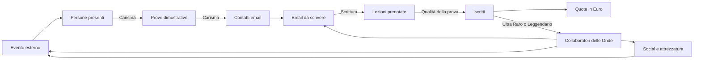

# Oggetto: Nuovi Iscritti

## Game Design Document

**Titolo di lavorazione:** Oggetto: Nuovi Iscritti\
**Sottotitolo:** Un incremental game dell'Ordine delle Onde\
**Versione documento:** 1.1\
**Stato:** concept avanzato, economia e progressione definite, pronto per la
prototipazione\
**Piattaforma:** browser desktop\
**Lingua:** italiano\
**Salvataggio:** locale nel browser

---

## 1. Sintesi

Oggetto: Nuovi Iscritti è un browser game clicker incrementale ambientato dentro
una simulazione quasi perfetta di Outlook per Windows 11.

Il giocatore collabora inizialmente con **LudoSport Genova – Ordine delle Onde**
e deve trovare nuovi potenziali interessati, ottenere i loro indirizzi email,
scrivere inviti e trasformare i contatti in iscritti. Ogni pressione della
tastiera inserisce il carattere successivo di un'email prestabilita,
indipendentemente dal tasto premuto. Anche un click nel corpo della mail
inserisce un carattere. All'inizio ogni input produce un solo carattere; i
potenziamenti aumentano progressivamente la velocità.

Le email completate vengono inviate automaticamente per impostazione predefinita
e invitano il destinatario a partecipare a una singola lezione di prova in
palestra. Il giocatore può disattivare l'invio automatico per rileggere la mail
completa e confermarla con un ulteriore input. Dopo un intervallo
compresso, il contatto può prenotare oppure sparire definitivamente. Chi
partecipa alla lezione ha un'alta probabilità, ma non la certezza, di
iscriversi.

I contatti non sono infiniti. Per continuare a inviare email bisogna organizzare
eventi reali in luoghi di Genova. Ogni evento attira un certo numero di persone;
una porzione prova la disciplina sul posto, una porzione lascia il proprio
indirizzo email, una porzione accetta l'invito alla prova in palestra e infine
una porzione si iscrive. Carisma, Scrittura, Social, organizzazione,
collaboratori e attrezzatura migliorano fasi diverse del funnel.

Gli iscritti generano periodicamente **Euro** tramite le quote associative. Gli
Euro sono l'unica risorsa spendibile. Gli iscritti **Ultra Rari** diventano
Collaboratori delle Onde dopo il Corso Y e possono essere assegnati liberamente
alla scrittura, agli eventi, ai social o alla manutenzione. Possono apprendere
le Forme LudoSport seguendo il percorso `1 → X → 2 → Y → 3/4/5 → 6 → 7` e i tre
rami Spada Lunga, Staffa e Doppia spada corta.

Raggiunta una dimensione significativa, al giocatore viene proposto di
trasferirsi e fondare una nuova scuola, scegliendone nome e sede. Questa è la
meccanica di prestigio: una parte dei progressi locali riparte, mentre
l'esperienza accumulata e la rete delle scuole fondate forniscono bonus
permanenti. Il gioco non ha un finale e può continuare indefinitamente.

---

## 2. Visione del gioco

### 2.1 Fantasia principale

Il giocatore deve sentirsi contemporaneamente:

- una persona che sta rispondendo alle email in ufficio;
- un reclutatore instancabile dell'Ordine delle Onde;
- il coordinatore di una piccola organizzazione che cresce fino a diventare una
  rete di scuole;
- il protagonista di una commedia amministrativa sempre più assurda, raccontata
  esclusivamente attraverso email, calendari, contatti e documenti
  apparentemente professionali.

### 2.2 Pilastri di design

1. **Camuffamento credibile**\
   A colpo d'occhio il gioco deve sembrare Outlook per Windows 11. Le
   informazioni ludiche devono essere presentate come normali elementi di posta,
   calendario, contatti e attività.

2. **Input immediato e soddisfacente**\
   Qualunque tasto utile fa avanzare il testo. Non si può sbagliare a scrivere.
   Il giocatore deve poter martellare la tastiera come in Hacker Typer.

3. **Una catena produttiva leggibile**\
   Eventi generano pubblico; il pubblico genera prove dimostrative; le prove
   generano contatti; le email generano prenotazioni; le lezioni in palestra
   generano iscritti; le quote generano Euro; gli Ultra Rari e i Leggendari
   generano automazione.

4. **Umorismo crescente**\
   Il gioco parte con messaggi realistici e professionali. Con il progresso, le
   email, gli oggetti e le iniziative diventano più stravaganti, pur restando
   leggibili e funzionali.

5. **Crescita senza fine**\
   Il giocatore passa dalla singola email alla gestione automatizzata di più
   scuole, mantenendo sempre utile l'interazione manuale.

6. **Rispetto dell'identità LudoSport**\
   Il gioco può citare Forme, spade, Ordini, scuole, lezioni, eventi e
   terminologia LudoSport. I riferimenti a franchise cinematografici esterni
   restano indiretti e comici.

7. **Svelamento progressivo**\
   Il gioco comincia quasi vuoto. Nuove cartelle, funzioni e sistemi di Outlook
   compaiono soltanto quando il giocatore raggiunge traguardi comprensibili o
   completa speciali comunicazioni interne manuali.

### 2.3 Tono

Il tono combina:

- comunicazione sportiva autentica;
- vita amministrativa da scuola o associazione;
- satira leggera del lavoro d'ufficio;
- entusiasmo genuino per LudoSport;
- escalation surreale ma mai aggressiva o denigratoria.

Esempio di escalation:

1. «Vieni a provare una disciplina sportiva originale a Genova.»
2. «Scopri quanto può essere elegante un lunedì sera con una spada luminosa.»
3. «Il tuo divano sostiene che non sei pronto. Dimostragli che si sbaglia.»
4. «Partecipa alla prova prima che quel famoso grande topo venga a chiederci
   perché le nostre spade fanno luce.»

---

## 3. Pubblico e sessioni

### 3.1 Pubblico principale

- membri e amici della comunità LudoSport;
- appassionati di incremental e idle game;
- giocatori che apprezzano interfacce diegetiche;
- utenti desktop che vogliono sessioni brevi durante la giornata.

### 3.2 Durata delle sessioni

- **Micro-sessione:** 30–90 secondi per completare una mail o controllare
  prenotazioni e quote.
- **Sessione normale:** 5–15 minuti per scrivere, acquistare potenziamenti e
  organizzare attività.
- **Sessione di gestione:** 15–30 minuti per assegnare collaboratori,
  pianificare eventi e preparare un prestigio.
- **Ritorno idle:** riepilogo dei progressi maturati mentre il gioco era chiuso.

---

## 4. Struttura dell'esperienza



### 4.1 Loop attivo

1. Il giocatore apre una bozza già indirizzata a un contatto disponibile.
2. Preme tasti o clicca nel corpo della mail.
3. Ogni input rivela il prossimo carattere del testo prestabilito.
4. Quando il corpo è completo, la mail viene inviata automaticamente se il
   relativo toggle è attivo; altrimenti resta pronta fino al successivo input.
5. Il contatto viene consumato e viene programmato l'esito ritardato dell'invito
   alla prova in palestra.
6. Se esiste un altro contatto, si apre immediatamente una nuova mail.
7. Il giocatore può continuare a premere tasti senza interrompersi: il sistema
   passa da una mail alla successiva in modo trasparente.
8. Se i contatti sono terminati, Outlook mostra una comunicazione plausibile che
   invita a pianificare un evento o a partecipare a uno sparring esterno.

### 4.2 Loop gestionale

1. Controllare prenotazioni, prove in palestra, iscritti, Euro e contatti
   rimasti.
2. Assegnare collaboratori alle attività.
3. Sbloccare o migliorare Carisma, Scrittura, Velocità, Social e Attrezzatura.
4. Pianificare eventi nel Calendario.
5. Mantenere le spade disponibili e in buono stato.
6. Preparare nuove campagne email.

### 4.3 Loop di lungo periodo

1. Far crescere l'Ordine delle Onde.
2. Costruire una squadra di collaboratori specializzati.
3. Automatizzare raccolta contatti, scrittura e manutenzione.
4. Raggiungere la soglia per ricevere l'offerta di fondare una nuova scuola.
5. Scegliere città e nome della scuola.
6. Trasferire l'esperienza permanente alla nuova sede.
7. Ripetere con costi, numeri e moltiplicatori crescenti.

---

## 5. Risorse

### 5.1 Iscritti

Gli **Iscritti** sono il punteggio principale, la dimensione della scuola e una
sorgente di entrate ricorrenti. Non sono spendibili.

- **Iscritti attivi:** membri attuali della scuola; possono aumentare o
  diminuire tramite eventi narrativi.
- **Fama della scuola:** totale cumulativo delle iscrizioni ottenute nella
  partita e nei cicli di prestigio. Non diminuisce quando un iscritto lascia o
  viene rimosso dalla scuola.
- **Ultra Rari:** contatti rossi che diventano Collaboratori delle Onde dopo il
  Corso Y.

Ogni nuovo iscritto accredita immediatamente un bonus di iscrizione di **€20**.
In seguito, ogni iscritto attivo genera una quota base di **€40 per mese di
gioco**, aumentata di **€5 per ogni Forma o corso permanente registrato sul
singolo allievo**. Corso X e Corso Y concorrono al conteggio; il Corso Agonisti
è escluso perché potenzia Arena e Stile ma non assegna un badge permanente. Ogni
badge permanente può essere registrato una sola volta sullo stesso allievo: un
duplicato rappresenta uno stato non valido e non viene corretto nel calcolo
economico. Un mese dura **60 secondi reali** e segue il normale ciclo da Gennaio
a Dicembre; dopo Dicembre torna Gennaio. L'anno scolastico, sempre visibile
nella barra superiore, va da Settembre ad Agosto; la formazione si ferma a
Luglio e Agosto e gli eventuali abbandoni vengono verificati nel passaggio tra
Giugno e Luglio. Un evento positivo di passaparola può produrre più potenziali
iscritti; un litigio o un mancato rinnovo può ridurre il totale.

### 5.2 Euro

Gli **Euro (€)** sono l'unica risorsa spendibile. Provengono principalmente
dalle quote periodiche degli iscritti e vengono usati per:

- potenziamenti di Carisma, Scrittura e Velocità;
- campagne social;
- manutenzione e miglioramento delle spade;
- organizzazione di eventi;
- strumenti amministrativi e organizzativi.

Gli iscritti possono fungere da requisito di sblocco, ma non vengono mai
consumati per acquistare qualcosa.

### 5.3 Contatti

I Contatti sono indirizzi email inventati ottenuti attraverso eventi, lezioni di
prova, social e collaboratori.

Nella scuola iniziale i primi otto contatti sono sempre Comuni. Il nono contatto
è sempre Andrea Simonazzi, il primo Leggendario della partita; dal decimo
contatto si sbloccano le estrazioni Rare, Ultra Rare e Leggendarie. Nelle scuole
successive tutte le rarità sono disponibili fin dal primo contatto e Andrea
torna nel normale pool Leggendario.

Ogni contatto riceve una rarità al momento dell'acquisizione. La rarità
determina la probabilità di prenotare una prova dopo la mail e quella di
iscriversi dopo la prova:

| Rarità      | Comparsa | Prova dopo la mail | Iscrizione base | Effettiva base mail → iscritto | Massimo ordinario | Collaboratore            |
| ----------- | -------: | -----------------: | --------------: | -----------------------------: | ----------------: | ------------------------ |
| Comune      |      80% |                40% |           62,5% |                            25% |              100% | Mai                      |
| Raro        |    12,5% |                50% |             40% |                            20% |               90% | Mai                      |
| Ultra Raro  |     5,5% |                75% |          23,33% |                          17,5% |               50% | Dopo il Corso Y          |
| Leggendario |       2% |               100% |             15% |                            15% |               35% | Subito dopo l'iscrizione |

I potenziamenti di Scrittura migliorano la prenotazione della prova fino al
100%. I potenziamenti di Accoglienza fanno avanzare ogni rarità dalla propria
probabilità base d'iscrizione al proprio massimo specifico.

Il **Pity** è un contatore globale interno e non viene mostrato nell'interfaccia.
Ogni prova in palestra che non produce un'iscrizione, comprese quelle annullate
per mancanza di spade, aggiunge 1 al contatore. Nelle prove dei Leggendari
ordinari e Segreti, ogni punto Pity aggiunge un punto percentuale alla
probabilità già calcolata, fino al 100%. L'iscrizione di un Leggendario ordinario
o Segreto riporta Pity a zero; l'iscrizione di qualunque altra rarità lo lascia
invariato. Il bonus personale dei Leggendari resta separato: ogni loro precedente
tentativo fallito aggiunge 3 punti percentuali entro il massimo ordinario del
35%, poi si applica Pity oltre quel limite.

Ogni contatto contiene:

- nome e cognome generati;
- indirizzo email fittizio;
- fonte del contatto;
- data di acquisizione;
- eventuali tag tecnici o narrativi;
- stato: disponibile, in scrittura, invitato, prova prenotata, convertito o
  perso.

I contatti sono una risorsa limitante. Se finiscono, la produzione di email si
ferma.

### 5.4 Follower

I **Follower** misurano il pubblico raggiunto dall'automazione Social. Quando si
sblocca Social, partono dalla Fama già raggiunta e diventano visibili nella
barra superiore. Non sono spendibili. Ogni nuovo Follower aggiunge anche un
punto Fama, aumenta la probabilità dei contenuti Social di ottenere contatti e
produce una rendita mensile da sponsorizzazioni. I Follower non modificano
direttamente le prove o le iscrizioni.

### 5.5 Email

Stati possibili:

- bozza;
- in scrittura;
- completata;
- inviata;
- in attesa dell'esito;
- prova prenotata;
- contatto perso.

Non esistono follow-up né conversazioni di risposta: ogni contatto riceve una
sola mail e viene poi convertito o eliminato.

### 5.5 Collaboratori

I Collaboratori delle Onde sono iscritti che decidono di aiutare attivamente la
scuola. Sono una sottocategoria degli Iscritti e non una valuta separata.

### 5.6 Attrezzatura

Le spade della scuola sono gestite come inventario operativo:

- disponibili;
- riservate da corsi, lezioni di prova o eventi;
- cariche di usura;
- in manutenzione;
- rotte e temporaneamente inutilizzabili.

Le spade impongono una capienza operativa: quelle riservate non sono disponibili
fino alla conclusione dell'attività. Corsi e Corso Agonisti restano in attesa se
non possono riservare tutte le spade richieste, senza consumare denaro, tempo o
capienza dell'Istruttore. Una lezione di prova viene invece annullata allo
scadere dell'attesa, tranne quando l'iscrizione è garantita al 100%: in quel
caso si conclude senza usare né caricare una spada. Un evento non può essere
avviato.

Il carico viene applicato alla conclusione riuscita dell'attività ed è
aggregato. Se un evento in corso viene annullato, si applica metà del carico
previsto e non si ottengono contatti. Ogni 100 punti rompe una spada; più soglie superate rompono più spade
e tutto il carico eccedente viene conservato. La manutenzione preventiva costa
€2 per punto, mentre una spada già rotta costa €250 e torna da 100 a 0.

I collaboratori assegnati all'Attrezzatura riducono prima il carico delle spade
sane non riservate e poi riparano le spade rotte. Pagano il 75% dei costi
manuali, ottenendo uno sconto del 25%: €187,50 per spada e €1,50 per punto.
Producono un punto-lavoro ogni 1,5 secondi base; una spada completa richiede 150
punti-lavoro, pur ripristinando 100 punti di condizione.

La manutenzione può procedere mentre corsi, prove o eventi sono attivi, ma
interviene soltanto sulle spade non riservate. Le spade rotte sono sempre
riparabili perché non possono essere in uso. Se tutte le spade sane sono
impegnate, il carico residuo resta in attesa; le riparazioni parziali già
possibili non modificano il numero di spade prenotate. In questo caso il
collaboratore può riparare una spada rotta e torna subito al carico residuo non
appena la spada riparata diventa disponibile.

L'interfaccia rappresenta la capacità complessiva come una barra divisa in un
blocco da 100 punti per ogni spada della scuola. Il rosso indica una spada
rotta, il grigio una spada riservata e temporaneamente non riparabile, l'oro il
carico normale ancora rimovibile e lo spazio vuoto la condizione sana residua.
Il riepilogo numerico mostra l'usura totale includendo 100 punti per ogni spada
rotta. Fino a 20 spade i blocchi restano individuali; da 21 spade in poi la
barra diventa continua e aggrega proporzionalmente le quattro condizioni. Nella
scheda dei Collaboratori assegnati all'Attrezzatura viene usata sempre la stessa
barra aggregata in formato compatto.

Gli imprevisti narrativi dell'Attrezzatura sostituiscono quelli precedenti:

| Evento | Descrizione breve | Effetto |
| ------ | ----------------- | -------: |
| Un piccolo disastro | Non so cosa sia successo, non sono stato io! | +30 carico e 1 spada rotta |
| Spada caduta: Fanne 5 | Capita a tutti prima o poi... | +10 carico |
| Il portaspade di legno perfetto | Direttamente dall'Ordine del Vento di Trieste, è stupendo! | -20 carico |
| Un nuovo Sabersmith all’orizzonte? | Sembra proprio che uno dei nostri sappia saldare... | -30 carico e 1 spada riparata |
| Si può avere nera? | Certe domande dovrebbero non essere mai fatte. | +30 carico |
| Un Pini al lavoro | Darth Modificus alla riscossa! | -30 carico |

### 5.7 Reputazione di rete

La **Reputazione di rete** è la risorsa permanente ottenuta fondando e facendo
crescere nuove scuole. Aumenta i moltiplicatori globali dopo il prestigio.

---

## 6. Scrittura delle email

### 6.1 Regole di input

- Il gioco ascolta gli eventi `keydown` quando la vista di composizione è attiva
  e nessun controllo dell'interfaccia richiede l'input.
- Ogni tasto, inclusi modificatori e tasti di navigazione, produce una sola
  unità di input; `event.repeat` viene ignorato.
- Un click nel corpo produce lo stesso avanzamento.
- I click su cartelle, menu, Calendario, Contatti e altre opzioni eseguono la
  loro funzione e non scrivono.
- Le combinazioni di sistema e del browser non devono essere bloccate, anche
  quando il relativo `keydown` fa avanzare il testo.
- Tenere premuto un tasto conta come una singola pressione.
- Incollare testo non completa la mail.
- Il testo rivelato è sempre quello del modello corrente; ciò che il giocatore
  preme non viene registrato.
- L'input manuale rimane utile nelle fasi avanzate perché la stessa potenza di
  scrittura moltiplica anche il lavoro dei collaboratori.

### 6.2 Caratteri per input

Formula iniziale:

```text
potenzaScrittura = 1 + livelliVelocità

caratteriPerInput = floor(
  potenzaScrittura
  × moltiplicatoreScrittura
  × moltiplicatoreForme
  × moltiplicatorePrestigio
)
```

Valori consigliati per la prima curva:

| Fase                | Caratteri per input |
| ------------------- | ------------------: |
| Inizio              |                   1 |
| Primo potenziamento |                   2 |
| Inizio automazione  |                 3–5 |
| Metà ciclo          |                8–15 |
| Fine ciclo          |               25–50 |

### 6.3 Rapporto tra scrittura manuale e automatica

La velocità non dipende da combo o precisione, ma esclusivamente dai
potenziamenti e dai moltiplicatori permanenti. I bonus generali alla scrittura
migliorano contemporaneamente:

- caratteri prodotti da ogni input manuale;
- caratteri prodotti dai Collaboratori delle Onde;
- efficacia di eventuali strumenti automatici futuri.

Questo collegamento impedisce che la potenza manuale diventi un ramo morto dopo
lo sblocco dell'automazione.

### 6.4 Completamento e invio

Il toggle **Invio automatico** è attivo di default e la sua scelta viene salvata
nella partita. Al completamento:

1. il cursore si ferma alla fine del testo;
2. con l'invio automatico attivo la mail parte subito; con l'opzione disattivata
   resta completamente visibile finché il giocatore non preme un tasto o fa clic;
3. compare per 250–400 ms lo stato Outlook “Invio in corso…”;
4. la mail passa in Posta inviata;
5. viene determinato e salvato l'esito ritardato
   `prenota la prova / contatto perso`;
6. si apre la mail successiva entro 300–600 ms;
7. non viene riprodotto alcun suono.

Decidere l'esito al momento dell'invio impedisce di cambiare il risultato
ricaricando la pagina. L'esito della successiva lezione in palestra viene invece
determinato quando la lezione viene risolta.

### 6.5 Lunghezza delle email

La progressione dei testi delle email segue otto livelli:

| Livello | Potenziamento         | Formato e lunghezza                                                   |
| ------: | --------------------- | --------------------------------------------------------------------- |
|       0 | Nessun potenziamento  | Testo breve con piccoli refusi, 150–200 caratteri                     |
|       1 | Controllo ortografico | Stesso testo senza errori                                             |
|       2 | Email professionale   | Firma completa, struttura e spaziatura coerenti, ancora in plain text |
|       3 | Invito personalizzato | Nuovo set di testi, 250–450 caratteri                                 |
|       4 | Call to action        | Link e pulsanti, massimo 500 caratteri                                |
|       5 | Impaginazione         | Struttura CSS, massimo 600 caratteri                                  |
|       6 | Pubblicità vincente   | Volantino completo con immagini, massimo 800 caratteri                |
|       7 | Corso di Marketing    | Presentazione approfondita, massimo 2.000 caratteri                   |

Il corpo iniziale usa il formato `Ciao {nome},` seguito dal testo e dal solo
nome del giocatore. Il primo controllo ortografico rimuove gli errori senza
cambiare il messaggio; i livelli successivi aggiungono struttura, contenuto e
strumenti di conversione in modo progressivo.

Ai livelli 0, 1 e 2 ogni input rivela subito il testo della mail in plain text.
Dal livello 3, **Invito personalizzato**, gli input scrivono invece il sorgente
HTML: la composizione mostra il codice in un riquadro secondario e l'anteprima
reale della mail in un riquadro più grande e preponderante.

---

## 7. Conversione delle email

### 7.1 Flusso

Ogni email inviata crea un esito futuro con due possibili risultati:

- il contatto prenota una singola lezione di prova in palestra;
- il contatto non converte e sparisce definitivamente.

Non vengono mostrate risposte personali e non esistono follow-up. Se la prova
viene prenotata, il sistema crea una presenza nel Calendario. Quando la lezione
si conclude, viene risolto un secondo esito:

- la persona si iscrive;
- la persona non si iscrive e sparisce definitivamente.

Gli Ultra Rari diventano Collaboratori delle Onde dopo il Corso Y; i Leggendari
lo diventano immediatamente dopo l'iscrizione.

### 7.2 Tempi compressi

Per il primo prototipo:

| Passaggio                        |                                                                  Tempo suggerito |
| -------------------------------- | -------------------------------------------------------------------------------: |
| Esito dell'email                 |                                                                       10 secondi |
| Attesa della lezione in palestra |                                                                       1–5 minuti |
| Esito della lezione              |                                                             immediato al termine |
| Bonus di iscrizione              |                                                                  immediato (€20) |
| Accredito della quota mensile    | al cambio mese (€40 base + €5 per Forma o corso permanente del singolo iscritto) |

Il mese di gioco dura 60 secondi e il calendario scorre da Gennaio a Dicembre.
La formazione segue invece l'anno scolastico Settembre–Agosto: le lezioni sono
attive da Settembre a Giugno, Luglio e Agosto sono pausa estiva e gli abbandoni
vengono elaborati nel passaggio da Giugno a Luglio. L'anno scolastico indicato
accanto al mese corrente nella barra superiore riparte a Settembre. Gli altri
tempi devono essere configurabili dai dati e non scritti direttamente nella
logica.

### 7.3 Formule di conversione

```text
probabilitàPrenotazione = clamp(
  prenotazioneBase
  × moltiplicatoreScrittura
  × moltiplicatoreReputazione
  × bonusPrestigio,
  minimo,
  massimo
)

probabilitàIscrizioneDopoProva = clamp(
  iscrizioneBaseDopoProva
  × qualitàLezione
  × bonusAccoglienza
  × efficaciaCollaboratori
  × statoAttrezzatura
  × bonusPrestigio,
  minimo,
  massimo
)

probabilitàIscrizioneLeggendario = clamp(
  probabilitàIscrizioneDopoProva
  + bonusTentativiPersonali
  + Pity / 100,
  0,
  1
)
```

I valori di prenotazione e iscrizione dipendono dalla rarità e sono definiti
nella tabella dei Contatti. La prima email e la quinta dopo quattro fallimenti
consecutivi conservano la protezione tutorial/anti-sfortuna.

### 7.4 Comunicazione degli esiti

Gli esiti positivi vengono comunicati come messaggi automatici interni, non come
risposte dei destinatari:

- “Nuovo iscritto registrato”;
- “Quota associativa accreditata”;
- “Nuovo collaboratore disponibile”.

Le prenotazioni delle lezioni di prova non generano messaggi in Posta in arrivo:
sono visibili nel Calendario e nello stato dell'email inviata.

Nel prototipo l'attesa è fissata a 30 secondi. La prova ordinaria dura 15
secondi, riserva una spada e aggiunge 2 punti di carico alla conclusione. La
prova di un Leggendario Segreto dura 30 secondi e aggiunge 40 punti. Se al
termine dell'attesa manca una spada, la prova è annullata come una mancata
iscrizione; se l'iscrizione è garantita al 100%, la prova si svolge invece senza
spada e senza aggiungere carico.

Gli esiti negativi dei singoli contatti non producono messaggi: sono visibili
soltanto nelle statistiche aggregate del funnel.

---

## 8. Acquisizione dei contatti

### 8.1 Eventi

Gli eventi sono programmati attraverso il Calendario di Outlook e si svolgono in
tempo compresso. Esistono eventi fissi ed eventi che compaiono casualmente.
Nella prima versione gli esiti sono automatici: il sistema decisionale verrà
valutato successivamente.

Ogni evento richiede:

- un numero di iscritti da impiegare;
- un numero di spade da impiegare;
- una durata base di 10 secondi, riducibile dalla Maestria del collaboratore;
- un costo in Euro;
- eventuali requisiti di Carisma, Social o Attrezzatura.

Non esiste un limite numerico separato agli eventi contemporanei. Il giocatore
può avviarne più di uno finché restano disponibili sia gli iscritti sia le spade
richieste; entrambe le risorse tornano disponibili al termine dell'attività.
Al completamento parte un conto alla rovescia specifico prima che lo stesso
evento possa essere selezionato di nuovo. I tempi brevi usano secondi reali;
fiere e manifestazioni usano mesi o anni del calendario di gioco. Durante
questo intervallo iscritti e spade restano disponibili. Se l'evento viene
annullato, il costo e le risorse sono ripristinati, non parte alcun conto alla
rovescia e viene applicato soltanto il 25% del carico previsto.

Le nuove spade possono essere acquistate dall'area Attività tramite **LamaDiLuce
(Abridge S.r.l.)**, partner tecnico e fornitore ufficiale LudoSport. Il
riferimento di gioco è la **Polaris EVO Basic combat-ready** a €330: costruzione
modulare, lama autorizzata per pratica ed eventi ufficiali e marcatura dell'anno
di produzione. L'acquisto è immediato per non introdurre microgestione
logistica; la presentazione conserva un tono goliardico senza alterare i
riferimenti reali del produttore.

La fama della scuola è misurata attraverso il **record massimo di iscritti
attivi mai raggiunto** e sblocca progressivamente cinque tier di potenzialità:
**Molto bassa**, **Bassa**, **Media**, **Alta** e **Altissima**. Il record non
diminuisce quando alcuni iscritti lasciano la scuola: se la scuola raggiunge 100
iscritti e torna a 70, la fama resta 100 fino al superamento di quel picco.
All'inizio sono visibili soltanto Sparring e Volantinaggio; l'interfaccia
anticipa esclusivamente il prossimo sblocco e non mostra previsioni numeriche
sui contatti.

| Evento                              | Sblocco |   Costo | Impiegati | Spade | Carico | Potenzialità |
| ----------------------------------- | ------: | ------: | --------: | ----: | -----: | -----------: |
| Sparring al parco                   |       0 |      €0 |         0 |     2 |     10 |  molto bassa |
| Volantinaggio organizzato benissimo |       0 |     €40 |         1 |     2 |      0 |  molto bassa |
| Lezioni all'aperto                  |       5 |    €120 |         2 |     4 |     20 |        bassa |
| Evento sportivo                     |      10 |    €240 |         4 |     6 |     40 |        bassa |
| Mele Comics                         |      20 |    €400 |         6 |     8 |     60 |        media |
| CairoMix                            |      35 |    €640 |         8 |    10 |    100 |        media |
| CogoComix                           |      60 |  €1.200 |        12 |    12 |    150 |         alta |
| Burtomics                           |      90 |  €1.800 |        16 |    16 |    200 |         alta |
| Genova Comics & Games               |     120 |  €2.600 |        20 |    20 |    250 |         alta |
| Megacon Genova                      |     180 |  €4.200 |        28 |    24 |    500 |    altissima |
| Lucca Comics & Games                |     250 |  €7.000 |        40 |    30 |    700 |    altissima |
| Milan Games Week & Cartoomics       |     350 | €10.000 |        50 |    36 |  1.000 |    altissima |

I conti alla rovescia sono: 5 secondi per Sparring, 10 secondi per
Volantinaggio, 30 secondi per Lezioni all'aperto, un mese di gioco per Evento
sportivo, tre mesi per Mele Comics e CairoMix, sei mesi per CogoComix e
Burtomics, un anno per Genova Comics & Games e Megacon Genova, due anni per
Lucca Comics & Games e Milan Games Week & Cartoomics. Un conto basato sul
calendario scade all'inizio del mese di destinazione, anche quando il calendario
viene avanzato dagli strumenti Admin.

### 8.2 Persone incontrate e contatti ottenuti

Un evento determina separatamente l'affluenza e il numero di contatti. Le
persone incontrate e le prove dimostrative conservano il funnel dell'evento;
i contatti sono invece estratti da una distribuzione pesata specifica, scelta
all'avvio e mostrata soltanto alla conclusione. L'usura delle spade non riduce
più il risultato.

```text
personeIncontrate = capienzaBase
  × variabilitàCasuale
  × bonusAffluenza
  × efficaciaCollaboratori

proveDimostrative = personeIncontrate
  × probabilitàProvaSulPosto
  × moltiplicatoreCarisma

contattiOttenuti = estrazionePesataEvento
  + bonusIndipendenteSulValoreMedio
```

Le distribuzioni base sono:

| Evento                              | Distribuzione base dei contatti                                      |
| ----------------------------------- | -------------------------------------------------------------------- |
| Sparring al parco                   | 50%: 0; 40%: 1; 10%: 2                                             |
| Volantinaggio organizzato benissimo | 30%: 0; 67%: 1; 3%: 2                                              |
| Lezioni all'aperto                  | 10%: 0; 50%: 1; 35%: 2; 5%: 3                                     |
| Evento sportivo                     | 54%: 1; 36%: 2; 10%: 3                                             |
| Mele Comics                         | 20%: 1; 35%: 2; 30%: 3; 14%: 4; 1%: 5                            |
| CairoMix                            | 10%: 1; 20%: 2; 40%: 3; 20%: 4; 10%: 5                           |
| CogoComix                           | 30%: 2–3; 50%: 4; 15%: 5–6; 5%: 7–10                               |
| Burtomics                           | 23%: 3–4; 45%: 5–6; 22%: 7–8; 8%: 9–11; 2%: 12–15               |
| Genova Comics & Games               | 11%: 4–5; 41%: 6–7; 36%: 8–10; 10%: 11–14; 2%: 15–20             |
| Megacon Genova                      | 12%: 5–7; 17%: 8–10; 54%: 11–14; 15%: 15–19; 2%: 20–25           |
| Lucca Comics & Games                | 18%: 10–12; 20%: 13–15; 48%: 16–18; 12%: 19–23; 2%: 24–30        |
| Milan Games Week & Cartoomics       | 5%: 10–15; 18%: 16–22; 60%: 23–28; 12%: 29–34; 5%: 35–40         |

Gli intervalli sono uniformi: per esempio, una fascia 2–3 sceglie 2 o 3 con la
stessa probabilità. I bonus positivi di affluenza, Carisma e collaboratori
generano un'aggiunta indipendente calcolata sul valore medio base. Possono
quindi trasformare uno zero in un contatto o superare il massimo della
distribuzione base, senza essere applicati due volte. L'interfaccia mostra solo
indicazioni generiche di rischio e potenzialità, mai queste percentuali.

### 8.3 Lezioni in palestra, Social e sparring

La **lezione di prova in palestra** non genera nuovi indirizzi: consuma una
prenotazione ottenuta tramite email e produce il possibile iscritto finale. Per
lo scopo del gioco, ogni persona partecipa a una sola lezione.

I **Social** sviluppano la presenza online della scuola. La Redazione si evolve
in Social al raggiungimento di 35 iscritti attivi: non nasce un nuovo ruolo e i
collaboratori già assegnati conservano incarico e Maestria. Le email hanno
sempre priorità; in loro assenza la stessa potenza di scrittura produce un
contenuto ogni 7.500 caratteri. Ogni contenuto effettua due tiri indipendenti:
5% per ottenere un Follower e `min(5%, 0,5% + Follower × 0,01%)` per ottenere un
contatto. Social non genera prove dirette, non migliora la qualità dei contatti
e non accredita denaro per ciclo. Le sponsorizzazioni vengono riscosse con le
rette mensili, a partire da 0,01 € per Follower. Le campagne manuali del vecchio
sistema non esistono più.

Lo **sparring esterno** è sempre disponibile come attività di sicurezza quando
mancano contatti o denaro. Costa poco o nulla, ma produce soltanto pochi
indirizzi.

### 8.4 Esaurimento dei contatti

Quando non esistono contatti disponibili:

- la bozza corrente non viene creata;
- compare una normale email interna con oggetto “Elenco contatti esaurito”;
- il testo suggerisce di aprire il Calendario;
- la produzione automatica di email si mette in pausa;
- i collaboratori assegnati alla scrittura risultano “In attesa di destinatari”;
- nessun progresso viene perso.

Questa situazione è intenzionale e rappresenta il principale collo di bottiglia
strategico.

---

## 9. Collaboratori delle Onde

### 9.1 Reclutamento

Comuni e Rari non diventano Collaboratori delle Onde. Gli Ultra Rari diventano
collaboratori dopo aver completato il **Corso Y**. I Leggendari diventano
collaboratori fin dall'iscrizione.

La probabilità può aumentare con:

- qualità dell'accoglienza;
- dimensione della scuola;
- reputazione;
- progetti interni;
- potenziamenti organizzativi.

### 9.2 Dati e regole

Ogni collaboratore possiede:

- nome inventato;
- data di ingresso;
- Forme sbloccate;
- stato e assegnazione attuale.

Ogni collaboratore accumula inoltre una **Maestria** separata per ciascun ruolo
operativo: Redazione/Social, Eventi, Attrezzatura e Istruttore. La Preparazione
atletica usa la Maestria Istruttore. I cinque gradi condividono la stessa curva
di esperienza in tutti i ruoli:

| Grado      | Tempo dal grado precedente | Tempo cumulativo | XP cumulativi | Bonus |
|------------|----------------------------:|-----------------:|--------------:|------:|
| Novizio    |                           — |                0 |             0 |    0% |
| Iniziato   |                    1 minuto |         1 minuto |            60 |   20% |
| Accademico |                    5 minuti |         6 minuti |           360 |   40% |
| Cavaliere  |                   30 minuti |        36 minuti |         2.160 |   65% |
| Maestro    |                       1 ora |     1 ora e 36 m |         5.760 |  100% |

Durante il gioco attivo, ogni collaboratore assegnato riceve **1 XP al secondo**
esclusivamente nella Maestria del proprio ruolo corrente, indipendentemente
dall'attività svolta. Un collaboratore non assegnato non riceve XP; cambiando
ruolo, inizia ad avanzare nel nuovo percorso e conserva gli XP già guadagnati
negli altri. Il progresso non avanza mentre il gioco è chiuso. Il passaggio di
grado viene comunicato tramite un messaggio automatico nella Posta.

Regole:

- alcuni personaggi reali potranno essere aggiunti in seguito;
- nella prima versione non esistono livelli, ritratti o personalità individuali;
- non esiste un limite massimo di collaboratori;
- ogni collaboratore svolge un solo incarico alla volta;
- fino a otto collaboratori la riassegnazione individuale è libera e immediata;
- al raggiungimento del nono collaboratore si sblocca definitivamente la vista
  aggregata per settori, accompagnata da un tutorial che mette il gioco in
  pausa; la vista individuale non torna disponibile anche se l'organico scende;
- la vista aggregata mostra il rapporto **Non assegnati/Totali** e tre preset
  numerici personalizzabili, inizialmente vuoti;
- ogni preset conserva il numero desiderato di persone per Redazione/Social,
  Eventi, Preparatore Atletico, Attrezzatura e Istruttore, senza legarsi alle
  identità dei singoli collaboratori;
- applicando un preset, i collaboratori liberi vengono riallocati subito e
  quelli in eccesso restano non assegnati;
- un collaboratore impegnato in un evento o in una formazione conserva
  temporaneamente il proprio incarico, conclude l'attività e viene riallocato
  prima che possa avviarne un'altra automaticamente; i lavori continui e
  condivisi sono invece riassegnabili subito;
- se un preset richiede più persone di quelle presenti, i posti mancanti
  restano memorizzati e vengono occupati automaticamente dai nuovi
  collaboratori liberi;
- un collaboratore non leggendario può lasciare la scuola soltanto tramite
  eventi narrativi casuali;
- i Leggendari non possono lasciare la scuola per inattività, mancato rinnovo o
  altri eventi generici.

Regole interne dei Leggendari, mai esplicitate nell'interfaccia:

- Andrea Simonazzi è garantito come 9° contatto nella scuola iniziale; nelle
  scuole successive la sua comparsa torna casuale come per ogni altro
  Leggendario, senza garanzie di prenotazione o iscrizione;
- la probabilità annuale di abbandono di tutti i Leggendari è sempre 0%,
  indipendentemente dalla formazione e dal numero di scuole fondate;
- l'unico modo previsto per perdere un Leggendario sarà un evento narrativo
  dedicato, non ancora implementato; finché l'evento non esiste, un Leggendario
  iscritto resta nella scuola per sempre;
- la probabilità di comparsa del pool Leggendario è 2% per ogni nuovo contatto
  idoneo: dal decimo nella scuola iniziale e fin dal primo nelle scuole
  successive;
- Pity modifica allo stesso modo le prove dei Leggendari ordinari e Segreti;
  raggiunto il 100%, la prova è garantita e può concludersi anche senza spade;
- ogni profilo Leggendario è unico: finché esiste già come contatto attivo,
  prova in palestra, iscritto o collaboratore non può essere generato una
  seconda volta;
- dopo una prova non convertita, il profilo resta occupato finché l'esito **Non
  iscritto** è visibile in **La mia giornata**; quando la notifica scade, torna
  disponibile per nuovi contatti, prove, premi dei tornei e strumenti Admin;
- se nessun profilo del pool è disponibile, qualsiasi nuova assegnazione
  Leggendaria genera invece un Ultra Raro dello stesso tipo di premio;
- con il prestigio tutti i profili Leggendari tornano disponibili nel pool della
  nuova scuola;
- dopo l'eventuale abbandono causato dall'evento dedicato tornano disponibili
  per incontri futuri;
- una nuova iscrizione successiva all'evento dedicato ripristina integralmente
  Forme, attestati da Istruttore, anzianità e storico formativo; l'incarico
  operativo torna invece non assegnato.

La pagina **Admin**, disponibile soltanto in sviluppo, può avviare direttamente
la prova in palestra di un profilo Leggendario scelto casualmente tra quelli
ancora disponibili. Il comando non iscrive il personaggio: crea una prova della
durata ordinaria, che usa le stesse probabilità di conversione, le stesse regole
di unicità e lo stesso reclutamento automatico dei Leggendari del flusso
normale.

La stessa pagina può forzare il passaggio al mese successivo. Il comando porta
la scadenza mensile all'istante corrente ed esegue la normale pipeline di gioco:
entrate, tornei, rinnovi annuali, cambio del calendario e automazioni. Le
attività che hanno una propria scadenza futura non vengono completate in anticipo.

### 9.3 Ruoli

| Ruolo                | Funzione                                                                                                           |
| -------------------- | ------------------------------------------------------------------------------------------------------------------ |
| Redazione → Social   | scrive le email; dopo lo sblocco produce contenuti Social quando non ci sono email attive                           |
| Eventi               | aumenta persone incontrate e contatti ottenuti                                                                     |
| Preparatore Atletico | migliora Arena o Stile degli iscritti evitando ripetizioni consecutive                                             |
| Attrezzatura         | controlla e ripristina le spade                                                                                    |
| Istruttore           | insegna le Forme già attestate agli iscritti, una persona alla volta, e migliora la conversione prova → iscrizione |
| Coordinamento        | funzione futura, non inclusa nell'MVP                                                                              |

Il Preparatore Atletico opera solo durante il gioco online. La selezione è
casuale senza priorità legata alla debolezza dell'atleta e impedisce di
scegliere lo stesso iscritto nel potenziamento immediatamente successivo, salvo
il caso in cui sia l'unico iscritto disponibile. Nel 97,5% dei casi il tiro usa
tutti gli iscritti disponibili; nel restante 2,5% usa soltanto gli iscritti nei
preferiti ancora disponibili.

### 9.4 Scrittura automatica

```text
caratteriAutomaticiAlSecondo = velocitàBaseCollaboratore
  × collaboratoriAssegnati
  × potenzaScrittura
  × bonusForma
  × bonusScritturaScuola
  × moltiplicatorePrestigio
```

I caratteri automatici avanzano la stessa mail visibile al giocatore. L'input
manuale si somma senza conflitti. Con **Invio automatico** attivo, la Redazione
invia la mail appena raggiunge la lunghezza richiesta. Se è disattivato, anche i
collaboratori si fermano sulla mail completa finché il giocatore non conferma
l'invio. Dopo lo sblocco Social, quando non esiste una mail attiva, gli stessi
collaboratori spostano automaticamente la produzione sui contenuti online.

### 9.5 Raccolta automatica dei contatti

I collaboratori assegnati agli Eventi possono:

- aumentare il rendimento di un evento pianificato;
- organizzare piccole attività ricorrenti;
- produrre nuovi contatti tramite le attività automatiche previste.

La raccolta automatica deve essere più lenta degli eventi gestiti attivamente,
ma sufficiente a impedire un blocco totale nelle fasi avanzate.

### 9.6 Percorso delle Forme

Le Forme non simulano il combattimento: rappresentano formazione e
moltiplicatori del collaboratore. Il percorso è:

```text
Forma 1
  → Corso X
  → Forma 2
  → Corso Y
  → Forme 3, 4 e 5 in uno o più rami:
      - Spada Lunga
      - Staffa
      - Doppia spada corta
  → Forma 6
  → Forma 7
```

Ogni Forma ha un nome lungo, usato nei testi descrittivi, e un nome corto per le
interfacce compatte:

| Percorso           | Nome lungo                     | Nome corto      |
| ------------------ | ------------------------------ | --------------- |
| Iniziale           | Forma 1                        | F1              |
| Iniziale           | Corso X                        | CX              |
| Iniziale           | Forma 2                        | F2              |
| Iniziale           | Corso Y                        | CY              |
| Spada Lunga        | Forma 3/4/5 Spada Lunga        | F3L / F4L / F5L |
| Doppie Spade Corte | Forma 3/4/5 Doppie Spade Corte | F3D / F4D / F5D |
| Staffa             | Forma 3/4/5 Staffa             | F3S / F4S / F5S |
| Finale             | Forma 6                        | F6              |
| Finale             | Forma 7                        | F7              |

Gli effetti ludici non devono riprodurre fedelmente le caratteristiche tecniche
reali delle Forme.

Regole:

- ogni iscritto può conoscere più Forme;
- ogni iscritto o collaboratore può iniziare al massimo una Forma per anno
  formativo; **Doppio Corso** porta questo limite a due e il livello 1 di
  **PagoSport** lo porta a tre;
- gli slot annuali delle Forme si rinnovano a luglio e coprono il periodo
  luglio–giugno: una Forma iniziata a luglio consuma quindi uno slot valido
  anche nel settembre immediatamente successivo;
- Luglio e Agosto sono pausa estiva per gli atleti normali, che pur avendo
  ricevuto i nuovi slot non possono usarli fino a settembre; gli Istruttori
  possono invece iniziare in estate una formazione pagata con qualifica inclusa;
- l'anno scolastico ordinario resta da Settembre ad Agosto;
- completare un solo ramo fino alla Forma 5 è sufficiente per accedere alla
  Forma 6;
- durante Corso Y ogni allievo sviluppa automaticamente da una a tre preferenze
  fra Spada Lunga, Staffa e Doppia spada corta;
- gli altri rami preferiti restano percorsi facoltativi che l'automazione può
  completare dopo la Forma 7;
- la formazione richiede Euro e/o tempo, ma non livelli personali;
- ogni corso riserva le spade per tutta la sua durata e applica il carico solo
  al completamento;
- le descrizioni definitive dovranno usare terminologia LudoSport approvata.

| Corso o Forma | Spade per atleta | Carico per spada |
| ------------- | ----------------: | ----------------: |
| Forma 1, Corso X, Forma 2 | 1 | 10 |
| Corso Y | 2 | 10 |
| Forme 3 e 4 Spada Lunga | 1 | 10 |
| Forme 3 e 4 Staffa o Doppie Spade | 2 | 10 |
| Forma 5 Spada Lunga | 1 | 32 |
| Forma 5 Staffa o Doppie Spade | 2 | 32 |
| Forma 6 | 2 | 20 |
| Forma 7 | 3 | 20 |
| Arena Tecnica / Corso Agonisti | da 1 a 3 secondo le Forme note | 20 |

Forma 5 ha intenzionalmente il carico per spada più alto del gioco. Forma 6 e
Forma 7 possono produrre più carico totale perché impiegano rispettivamente due
e tre spade, ma non superano Forma 5 nell'aggressività della singola arma.

Costi base: Forma 1 €50, Corso X €100, Forma 2 €250, Corso Y €500, Forma 3 €1.000,
Forma 4 €1.500, Forma 5 €2.000, Forma 6 €3.000, Forma 7 €5.000. Lo scoglio
economico principale inizia dopo Corso Y.

### 9.7 Istruttori e attestati

Un Collaboratore delle Onde può essere assegnato al ruolo di **Istruttore**. Non
esiste un corso separato per ottenere il ruolo: l'abilitazione è legata alle
singole Forme numerate e consiste esclusivamente nel pagamento del relativo
attestato.

Regole:

- l'assegnazione al ruolo è gratuita e non converte automaticamente le Forme
  pregresse;
- un Istruttore può insegnare soltanto le Forme già completate e qualificate;
  ogni Forma, inclusi Corso X e Corso Y, richiede la relativa qualifica;
- una nuova Forma o un nuovo Corso appreso da Istruttore include sempre la
  relativa qualifica;
- un Istruttore può iniziare o continuare una nuova formazione anche mentre
  insegna; in questo caso la durata è tripla rispetto alla velocità normale e
  torna normale quando non ha più allievi attivi o l'insegnamento automatico
  viene disabilitato;
- una qualifica pregressa viene acquistata esplicitamente dal comando di
  formazione e costa il **300% del costo base**;
- una nuova Forma appresa mentre si è Istruttore costa il costo base della Forma
  più il relativo attestato, per un totale pari al **400% del costo base**; con
  PagoSport al livello 2 la qualifica
  è automatica e gratuita, quindi rimane soltanto il costo base della Forma;
- se nessun Collaboratore è assegnato al ruolo di Istruttore, il singolo allievo
  può iniziare manualmente la prossima Forma pagando il costo base;
- se almeno un Collaboratore è assegnato al ruolo di Istruttore, il comando
  manuale scompare e la pagina Iscritti mostra al suo posto tutte le prossime
  Forme che l'atleta può apprendere; le lezioni vengono avviate soltanto
  dall'automazione e, con un Istruttore compatibile, ricevono una riduzione del
  **25%** e costano quindi il **75% del costo base**;
- **Arena Tecnica** è il primo potenziamento del ramo Istruttori, è disponibile
  appena si sbloccano gli upgrade e non richiede Fama della scuola. Descrizione:
  “Sblocca i corsi per atleti agonisti: protegge la scuola dal rischio di perdere
  atleti alla fine dell'anno e, con la giusta attenzione, li renderà sempre più
  competitivi.”;
- al livello 1 Arena Tecnica costa **€1.000** e sblocca l'omonima formazione
  automatica, sempre attiva e non disabilitabile separatamente. La formazione
  costa **€300 per atleta**, dura 42 secondi, non migliora le statistiche ma
  protegge subito l'allievo dal controllo annuale degli abbandoni;
- il livello 2 costa **€2.000** e porta la durata base di Arena Tecnica a
  **30 secondi**;
- il livello 3 costa **€5.000**, trasforma la formazione in **Corso Agonisti**,
  ne porta il costo base a **€1.000** e attiva integralmente i miglioramenti
  permanenti di Arena e Stile; la durata base resta di 30 secondi;
- il livello 4 costa **€7.500** e riduce il costo base del Corso Agonisti a
  **€500**;
- l'automazione propone Arena Tecnica o il Corso Agonisti a un atleta o a un collaboratore
  inserito nella coda automatica quando ha ancora uno slot
  formativo libero e ha completato il proprio percorso oppure nessun Istruttore
  automatico possiede le qualifiche per le sue prossime Forme;
- iniziare Arena Tecnica o il Corso Agonisti consuma **tutti gli slot formativi annuali ancora
  disponibili** e protegge subito l'atleta dal controllo degli abbandoni. Lo
  stesso atleta non può
  iniziarlo più di una volta nello stesso periodo luglio–giugno, anche quando i
  potenziamenti gli concedono altri slot;
- Arena Tecnica ai livelli 1 e 2 non modifica Arena, Stile o il totale storico
  dei Corsi Agonisti. Dal livello 3, completare il Corso Agonisti aumenta
  permanentemente Arena e Stile. Senza
  potenziamenti assegna **+1 Arena** e **+1 Stile**; **Intensità agonistica** ha
  quattro livelli e aumenta il massimo casuale di entrambe le caratteristiche
  fino a **+5**, mantenendo +1 come minimo. Il risultato casuale di ciascuna
  caratteristica viene moltiplicato per il numero di slot residui consumati dal
  corso. I bonus effettivi e il numero di completamenti si accumulano senza
  limite negli anni successivi e sono
  registrati nella riga dell'atleta, senza creare notifiche o messaggi
  nell'inbox;
- i costi di Arena Tecnica e Corso Agonisti sono importi diretti per atleta e
  non ricevono la riduzione applicata alle Forme insegnate. PagoSport al livello
  3 li azzera insieme agli altri costi di formazione;
- l'automazione ordina gli allievi per rischio effettivo di abbandono annuale
  decrescente; a parità privilegia gli allievi preferiti, poi i collaboratori,
  poi la prossima formazione secondo la progressione dalla Forma 1 verso l'alto,
  includendo il Corso Agonisti come fallback, e infine il contatto con
  `acquiredAt` più recente; a parità completa conserva l'ordine originale;
- disattivare l'automazione del singolo Istruttore o riassegnarlo lascia
  terminare le lezioni già iniziate, ma non ne avvia altre;
- annullare manualmente un'iscrizione è disponibile fin dall'inizio. La X nella
  riga di ogni persona nella schermata Iscritti richiede una conferma esplicita
  e annulla definitivamente l'iscrizione senza rimborso e senza ridurre la Fama
  della scuola. La formazione personale e le lezioni tenute dal collaboratore
  rimosso vengono interrotte;
- gli iscritti non leggendari rimossi non possono tornare, ma email ed eventi
  narrativi già avvenuti restano nello storico. I Leggendari conservano Forme,
  attestati, Maestria, Arena, Stile, esperienza nei tornei, Corsi Agonisti e
  anzianità; perdono soltanto incarico e automazione. I Leggendari ordinari
  tornano nel normale bacino di acquisizione, mentre i Leggendari Segreti devono
  essere nuovamente sconfitti nel rispettivo torneo;
- acquistare il livello 1 di Arena Tecnica sblocca subito **Polivalenza
  didattica**; i livelli 2, 3 e 4 di Arena restano acquistabili in parallelo e non
  bloccano il resto del ramo. Polivalenza didattica ha due livelli e permette di
  apprendere fino a tutti e tre i rami d'arma;
- il livello 3, insieme al Corso Agonisti, sblocca **Intensità agonistica**, un potenziamento parallelo
  in quattro livelli che porta il bonus massimo casuale del Corso Agonisti da
  +1 a +5 per ciascuna caratteristica senza bloccare gli altri potenziamenti;
- **Istruttore Promisquo** è un potenziamento unico e porta da uno a due gli
  allievi contemporanei di ogni Istruttore;
- **Doppio Corso** è un potenziamento unico del ramo Istruttori e concede a ogni
  atleta della scuola un secondo slot di formazione nel periodo luglio–giugno;
- **Istruttore Tiamat** ha quattro livelli molto costosi e, dopo Istruttore
  Promisquo, porta la capacità massima a sei allievi;
- **PagoSport** segue Istruttore Tiamat: il livello 1 concede uno slot di
  formazione annuale aggiuntivo; il livello 2 assegna gratuitamente e
  retroattivamente a ogni collaboratore l'attestato da Istruttore per tutte le
  Forme già apprese e lo assegna automaticamente per ogni nuova Forma, senza
  cambiare l'incarico operativo; il livello 3 rende gratuiti tutte le Forme,
  tutti i corsi, tutti gli attestati e ogni altro costo di istruttoraggio;
- esclusa Intensità agonistica, che resta parallela, dopo Arena Tecnica il ramo
  è lineare: ogni potenziamento deve essere
  completato prima di accedere al successivo. L'ordine è **Polivalenza didattica
  → Istruttore Promisquo → Doppio Corso → Istruttore Tiamat → PagoSport → Tocco
  DiGilo**;
- **Tocco DiGilo** è l'ultimo potenziamento del ramo Istruttori: costa
  **€1.000.000** e aumenta del **9999%** la velocità con cui un Istruttore
  insegna le Forme agli allievi;
- i completamenti automatici confluiscono in una notifica riepilogativa
  impilata.

### 9.8 Abbandono degli iscritti ignorati

Nel passaggio tra Giugno e Luglio, un iscritto vulnerabile che non ha iniziato
alcuna formazione durante l'anno scolastico appena concluso può lasciare la
scuola. Le immunità degli atleti sono centralizzate e distinguono il controllo
annuale dai futuri eventi imprevisti:

| Motivo                                               | Controllo annuale Giugno → Luglio | Eventi imprevisti | Scadenza                                                                             |
| ---------------------------------------------------- | --------------------------------: | ----------------: | ------------------------------------------------------------------------------------ |
| Iscrizione effettuata da Gennaio ad Agosto           |                            Immune |            Immune | Inizio di Settembre                                                                  |
| Qualificazione al prossimo torneo                    |                            Immune |            Immune | Conclusione del torneo: resta protetto soltanto chi si qualifica a quello successivo |
| Forma, Corso X/Y, Arena Tecnica o Corso Agonisti iniziato nell'anno |             Immune |       Vulnerabile | Successivo controllo annuale                                                         |

Le iscrizioni effettuate da Settembre a Dicembre non ricevono l'immunità da
nuova iscrizione. Dopo la Champion's Arena la qualificazione viene azzerata: non
essendoci un torneo successivo prima di Dicembre, gli atleti tornano vulnerabili
salvo altre immunità attive. Sono inoltre sempre esclusi dal controllo annuale:

- tutti i Leggendari, anche se ignorati per più anni;
- i Collaboratori delle Onde non leggendari;
- chi ha iniziato una formazione durante l'anno, anche se non l'ha ancora
  completata.

La probabilità annuale dipende dalla Forma numerata più alta completata. I Corsi
X e Y non riducono da soli il rischio. Comuni, Rari e Ultra Rari seguono la
curva ordinaria fino alla Forma 6; a Forma 7 si applicano valori specifici per
rarità. I Leggendari hanno sempre probabilità 0%. Normalmente un Ultra Raro è
già collaboratore dal Corso Y ed è quindi escluso da questo controllo.

| Forma più alta        | Comuni | Rari | Ultra Rari | Leggendari |
| --------------------- | -----: | ---: | ---------: | ---------: |
| Nessuna Forma         |    80% |  80% |        80% |         0% |
| Forma 1               |    65% |  65% |        65% |         0% |
| Forma 2               |    50% |  50% |        50% |         0% |
| Forma 3               |    35% |  35% |        35% |         0% |
| Forma 4               |    25% |  25% |        25% |         0% |
| Forma 5               |    15% |  15% |        15% |         0% |
| Forma 6               |    10% |  10% |        10% |         0% |
| Forma 7, prima scuola |   2,5% | 0,5% |      0,25% |         0% |

Per ogni nuova scuola già fondata, i valori di **Forma 7** di Comuni, Rari e
Ultra Rari aumentano di **0,5 punti percentuali**. Per esempio, nella seconda
scuola diventano rispettivamente 3%, 1% e 0,75%. I Leggendari restano sempre
allo 0%.

---

## 10. Potenziamenti

### 10.1 Carisma

Influenza due passaggi degli eventi: la probabilità che una persona provi la
disciplina sul posto e la probabilità che, dopo la prova dimostrativa, lasci il
proprio indirizzo email.

| Potenziamento                       | Effetto indicativo            |
| ----------------------------------- | ----------------------------- |
| Presentazione preparata             | +10% prove dimostrative       |
| Biglietti con QR code               | +15% contatti agli eventi     |
| Dimostrazione coordinata            | +20% qualità evento           |
| Stand riconoscibile                 | +25% persone incontrate       |
| Accoglienza dell'Ordine             | +15% indirizzi lasciati       |
| Risposte alle domande difficili     | riduce contatti persi         |
| “No, non è esattamente quella cosa” | bonus comico alle spiegazioni |

### 10.2 Scrittura

Influenza sia il moltiplicatore generale di digitazione sia il tasso da email
inviata a lezione di prova prenotata. Non modifica direttamente l'esito della
lezione in palestra.

| Potenziamento         | Effetto indicativo                               |
| --------------------- | ------------------------------------------------ |
| Controllo ortografico | +8% prenotazioni e rimozione dei refusi          |
| Email professionale   | +12% prenotazioni e struttura ordinata           |
| Invito personalizzato | +15% prenotazioni e testi da 250–450 caratteri   |
| Call to action        | +15% prenotazioni, link e pulsanti               |
| Impaginazione         | +10% prenotazioni e struttura CSS                |
| Pubblicità vincente   | +20% prenotazioni e volantino completo           |
| Corso di Marketing    | +35% prenotazioni e testi fino a 2.000 caratteri |

### 10.3 Accoglienza e qualità della lezione

Influenza la conversione finale da partecipante alla lezione in palestra a
iscritto.

| Potenziamento                   | Effetto indicativo                     |
| ------------------------------- | -------------------------------------- |
| Procedura di benvenuto          | +10% iscrizioni dopo la prova          |
| Lezione introduttiva collaudata | +15% qualità lezione                   |
| Materiale informativo chiaro    | +10% iscrizioni dopo la prova          |
| Collaboratore dedicato          | bonus per ogni collaboratore assegnato |
| Sala preparata                  | riduce gli esiti negativi narrativi    |
| Esperienza memorabile           | moltiplicatore avanzato                |

### 10.4 Velocità

Influenza caratteri per pressione e automazione.

| Potenziamento        | Effetto indicativo                    |
| -------------------- | ------------------------------------- |
| Tastiera comoda      | +1 carattere per input                |
| Modelli di Outlook   | +1 carattere per input                |
| Frasi rapide         | +2 caratteri per input                |
| Firma automatica     | completa automaticamente la chiusura  |
| Campi intelligenti   | completa nome e luogo automaticamente |
| Revisione istantanea | moltiplica manuale e collaboratori    |
| Fusione documenti    | grande bonus di fine ciclo            |

### 10.5 Social

Social è lo stadio evoluto della Redazione e usa la sua stessa assegnazione,
produttività e Maestria. Si sblocca definitivamente a 35 iscritti attivi con un
tutorial in pausa. Allo sblocco i Follower vengono inizializzati alla Fama
esistente, senza aumentarla una seconda volta.

Un contenuto richiede 7.500 caratteri. La produzione avanza soltanto durante il
gioco online e si interrompe, conservando il buffer, quando una email richiede
la priorità. Al completamento vengono risolti separatamente:

```text
probabilitàFollower = 5%
probabilitàContatto = min(capContatti, 0,5% + Follower × 0,01%)
renditaMensileSocial = Follower × valoreFollower × moltiplicatoreA.N.D.E.R.
```

Ogni Follower ottenuto aumenta di 1 anche la Fama. Un contatto Social entra nel
normale funnel email → prova → iscrizione senza bonus di rarità o conversione.

| Potenziamento             | Progressione completa                                      |
| ------------------------- | ---------------------------------------------------------- |
| Sintesi dei contenuti     | 7.500 → 5.000 → 3.500 → 2.000 → 1.000 caratteri           |
| Piano editoriale          | probabilità Follower 5% → 6% → 7% → 8% → 9% → 10%        |
| Diffusione dei contenuti  | cap contatti 5% → 7,5% → 10% → 15% → 20% → 25%           |
| Sponsorizzazioni          | 0,01 € → 0,05 € → 0,075 € → 0,10 € → 0,20 € → 0,50 €     |

### 10.6 Attrezzatura

Influenza qualità e frequenza degli eventi e riduce il rischio di eventi
narrativi negativi. Le spade disponibili determinano la capienza contemporanea
insieme agli iscritti liberi.

| Potenziamento                    | Effetto indicativo        |
| -------------------------------- | ------------------------- |
| Controllo pre-evento             | meno guasti               |
| Kit di manutenzione              | riparazioni più veloci    |
| Rastrelliera ordinata            | più spade disponibili     |
| Ricambi essenziali               | riduce tempi di fermo     |
| Set da dimostrazione             | aumenta capienza eventi   |
| Registro dell'attrezzatura       | automazione dei controlli |
| “Le abbiamo messe a posto tutte” | moltiplicatore avanzato   |

### 10.7 Organizzazione

| Potenziamento            | Effetto indicativo                   |
| ------------------------ | ------------------------------------ |
| Calendario condiviso     | più eventi pianificabili             |
| Turni dei collaboratori  | maggiore efficienza assegnazioni     |
| Lista di controllo       | riduce imprevisti                    |
| Modulo di iscrizione     | accredito e registrazione più rapidi |
| A.N.D.E.R.               | automatizza notifiche e quote        |
| Coordinamento multi-sede | bonus di prestigio                   |

### 10.8 Costi

Tutti i potenziamenti vengono acquistati esclusivamente in Euro. Non esistono
rimborsi, ma nel lungo periodo è possibile comprare ogni ramo. La curva iniziale
riprende la crescita graduale del gioco di riferimento:

```text
costoLivello = costoBase × crescita^(livelloCorrente)
```

Il prototipo usa normalmente una crescita di **1,30** per livello. I
potenziamenti avanzati possono usare costi espliciti per livello; il prezzo
massimo è **€1.000.000** per Tocco DiGilo.

Alcuni livelli richiedono anche soglie non spendibili, come numero di iscritti,
eventi completati, collaboratori o Forme conosciute.

### 10.9 Sblocco progressivo

L'interfaccia non mostra tutti i sistemi dall'inizio. Una prima sequenza
consigliata è:

| Traguardo                      | Sblocco diegetico                             |
| ------------------------------ | --------------------------------------------- |
| Avvio                          | sola composizione della mail e primi contatti |
| Prima email                    | Posta inviata e statistiche minime            |
| 3 email                        | comunicazione “Configurazione campagna”       |
| Comunicazione completata       | Potenziamenti di Scrittura e Velocità         |
| Primo esaurimento contatti     | Calendario, eventi e sparring esterno         |
| Prima prova prenotata          | report aggregato del funnel                   |
| Primo iscritto                 | Euro e quote associative                      |
| Primo Ultra Raro collaboratore | Iscritti, Collaboratori e assegnazioni        |
| 35 iscritti attivi             | Redazione si evolve in Social                 |
| 20 iscritti                    | Attrezzatura e usura narrativa                |
| 50 iscritti                    | Forme dei collaboratori                       |
| 150 iscritti                   | procedura per fondare una nuova scuola        |

Le soglie sono configurabili e andranno calibrate per raggiungere il primo
prestigio dopo circa 3–4 ore.

### 10.10 Comunicazioni di sistema

Alcuni traguardi aprono una breve **comunicazione di sistema**, equivalente ai
file di sistema del gioco di riferimento. Esempi:

- Configurazione modelli di invito;
- Attivazione calendario condiviso;
- Registro quote associative;
- Procedura manutenzione attrezzatura;
- Configurazione account social;
- Richiesta apertura nuova scuola.

Queste comunicazioni:

- vengono completate con la stessa meccanica di tastiera;
- devono essere scritte manualmente e ignorano l'automazione;
- sono brevi e rare;
- sbloccano un'intera funzione al completamento;
- impediscono che il progresso idle faccia saltare l'introduzione di una nuova
  meccanica.

---

## 11. Interfaccia Outlook per Windows 11

### 11.1 Obiettivo di camuffamento

Il gioco deve raggiungere un camuffamento percepito del 99%:

- alla prima occhiata sembra una normale finestra di Outlook;
- non mostra barre di risorse, monete, gemme o pulsanti da videogioco;
- usa il linguaggio dell'email e dell'organizzazione;
- mantiene colori, spaziatura e gerarchia visiva plausibili;
- tutta l'interazione ludica avviene dentro elementi credibili di Outlook.

Il progetto imita l'esperienza visiva, ma deve evitare di presentarsi come
prodotto ufficiale Microsoft. Per una distribuzione pubblica è preferibile usare
icone ricreate o generiche e inserire una nota di non affiliazione nelle
informazioni del progetto.

### 11.2 Struttura dello schermo

```text
┌─────────────────────────────────────────────────────────────────────────────┐
│ Barra titolo / Ricerca / Controlli finestra                                │
├────┬────────────────┬─────────────────────────┬─────────────────────────────┤
│App │ Cartelle       │ Elenco messaggi         │ Lettura / Composizione      │
│rail│                │                         │                             │
│    │ Posta in arrivo│ Oggetto                 │ A: nome@email.test          │
│    │ Bozze          │ Mittente                │ Oggetto: ...                │
│    │ Inviata        │ Data                    │                             │
│    │ Contatti       │                         │ Corpo della mail            │
│    │                │                         │                             │
├────┴────────────────┴─────────────────────────┴─────────────────────────────┤
│ Stato sincronizzazione / digitazione / elementi                            │
└─────────────────────────────────────────────────────────────────────────────┘
```

### 11.3 Mappatura tra Outlook e gioco

| Elemento apparente      | Funzione ludica                                     |
| ----------------------- | --------------------------------------------------- |
| Posta in arrivo         | comunicazioni interne, tutorial, notifiche e storia |
| Bozze                   | email in coda o interrotte                          |
| Posta inviata           | storico delle campagne                              |
| Posta indesiderata      | eventi comici, anomalie e messaggi narrativi        |
| Archivio                | statistiche delle vecchie scuole                    |
| Calendario              | eventi e lezioni di prova                           |
| Iscritti                | iscritti e collaboratori                            |
| Attività / To Do        | manutenzione, social e progetti                     |
| Impostazioni            | opzioni reali, export e reset salvataggio           |
| Ricerca                 | filtri e statistiche avanzate                       |
| Cartelle personalizzate | rami di potenziamento                               |
| Conteggi non letti      | risorse disponibili e notifiche                     |

### 11.4 Presentazione dei valori

I numeri del gioco vengono nascosti in elementi plausibili:

- Contatti disponibili: conteggio accanto alla cartella Contatti;
- Esiti in attesa: conteggio accanto a Posta inviata o Calendario;
- Euro disponibili: saldo in un report amministrativo o nella cartella Quote;
- Iscritti: gruppo contatti “Iscritti attivi”;
- Collaboratori: gruppo contatti “Collaboratori delle Onde”;
- Caratteri al secondo: stato “Sincronizzazione” nella barra inferiore;
- Conversione: pannello “Statistiche campagna”;
- Spade disponibili: calendario risorse o elenco Attività;
- Prestigio: email formale ricevuta dalla rete LudoSport.

### 11.5 Animazioni

- nessuna particella;
- nessun tremolio o flash da gioco;
- cursore e selezione simili a un editor reale;
- transizioni tra pannelli da 120–200 ms;
- indicatori di sincronizzazione discreti;
- notifiche in stile Windows 11, senza audio;
- eventuali accenti acquatici dell'Ordine delle Onde limitati a dettagli quasi
  invisibili.

### 11.6 Risoluzioni target

- primaria: 1920×1080;
- secondaria: 1366×768;
- minima supportata: 1280×720;
- nessuna interfaccia mobile nella prima versione.

---

## 12. Navigazione e schermate

### 12.1 Posta

È la schermata predefinita e contiene il loop di scrittura.

Azioni:

- scrivere la mail;
- consultare prenotazioni, iscrizioni e notifiche interne;
- leggere tutorial diegetici;
- controllare campagne;
- aprire comunicazioni di sblocco.

### 12.2 Calendario

Mostra:

- eventi programmati;
- lezioni di prova;
- attività ricorrenti dei collaboratori;
- disponibilità di persone e spade;
- previsioni non garantite sui risultati.

Creare un evento usa un modulo simile a un vero appuntamento Outlook.

### 12.3 Iscritti

Due viste:

- Iscritti;
- Collaboratori.

La scheda di un collaboratore presenta statistiche e Forme come informazioni di
profilo e formazione.

### 12.4 Attività

Gestisce:

- manutenzione spade;
- preparazione eventi;
- campagne social;
- potenziamenti;
- progetti della scuola.

I costi appaiono come “Persone richieste” o “Collaboratori coinvolti”.

### 12.5 Statistiche

Presentate come report di campagna:

- persone incontrate;
- contatti ottenuti;
- email inviate;
- tempo medio di scrittura;
- prove prenotate;
- prove completate;
- iscritti;
- conversione per fonte;
- conversione aggregata delle email;
- rendimento collaboratori;
- andamento nel tempo.

---

## 13. Tutorial narrativo e interattivo

Il tutorial combina le email ricevute con scene di dialogo attivate da
condizioni di gioco. Le email restano parte del mondo narrativo; le scene
servono a fermare il ritmo, spiegare il passaggio appena raggiunto e guidare
l'azione successiva.

Ogni scena è composta da due tipi di passaggio:

- **dialogo**: mostra testi lineari senza scelte, mette in pausa il tempo di
  gioco e permette soltanto di continuare o usare **Salta** nell'angolo della
  pagina;
- **obiettivo guidato**: lascia interattive solo le aree necessarie e avanza
  automaticamente quando rileva l'azione richiesta. Ogni scena dichiara se il
  tempo debba restare fermo oppure ripartire durante l'obiettivo.

Ogni passaggio dichiara quali aree dell'interfaccia restano a fuoco, quali
vengono oscurate e sfocate e quali possono essere nascoste. Il completamento o
il salto di una scena viene salvato, così la stessa scena non si ripete dopo il
caricamento. Quando un obiettivo richiede di agire su un controllo preciso, quel
controllo deve essere evidenziato direttamente con contrasto e pulsazione:
mantenere visibile la sola sezione che lo contiene non è considerato
sufficiente. Gli obiettivi di attesa evidenziano invece la scheda o il pannello
nel quale osservare l'avanzamento.

### Sequenza iniziale

1. **Benvenuto nell'Ordine delle Onde**\
   Introduce il contesto e assegna i primi 5 contatti fittizi.

2. **Prima campagna inviti**\
   Chiede di scrivere premendo qualunque tasto mentre il tempo resta fermo. La
   scena termina quando la bozza passa a “Invio in corso...”; a quel punto il
   tempo riparte e inizia la missione di tre email ulteriori. Gli Eventi si
   sbloccano soltanto al completamento di questa missione.

3. **Configurazione campagna**\
   È la prima comunicazione di sistema manuale e sblocca Scrittura e Velocità.

4. **Primi Eventi e attrezzatura**\
   Dopo la missione dei tre inviti guida il giocatore ad aprire Eventi, spiega
   che le attività possono usurare o danneggiare le spade e richiede di avviare
   lo **Sparring al parco** gratuito. Soltanto in questo passaggio lo sparring
   dura 5 secondi e garantisce esattamente un nuovo contatto. La scena attende la
   fine dell'evento e mette in evidenza il contatore **Contatti** nella barra
   superiore mentre spiega l'aumento.

5. **Nuova lezione prenotata** Dopo la spiegazione sull'aumento dei contatti,
   **Continua** riporta automaticamente il giocatore in **Posta**. Una delle
   email della campagna iniziale garantisce una prova soltanto in questo
   momento; quando la prova compare in **La mia giornata** con il conto alla
   rovescia, un dialogo introduce il passaggio email → prova in palestra →
   possibile iscrizione. Il pannello resta leggibile sotto il velo del tutorial,
   mentre l'intera riga della prova viene portata in primo piano ed evidenziata.
   La prima sequenza di tutorial termina premendo **Continua** in questo
   dialogo.

6. **Primo bonus e quota associativa** Introduce il bonus immediato di €20, la
   quota mensile base di €40, il bonus di €5 per ogni Forma o corso permanente e
   il finanziamento dei potenziamenti.

7. **Il primo Leggendario** Quando Andrea Simonazzi diventa il nono contatto e
   la sua email entra in scrittura, il gioco torna in **Posta**, mette in
   evidenza la zona superiore della mail con il destinatario e spiega le quattro
   rarità. Da questo momento possono apparire contatti Rari, Ultra Rari e
   Leggendari. Il dialogo ricorda che i Leggendari sono profili unici e si
   chiude con **“Collezionali tutti!”**.

8. **Una mano in più** Il primo Ultra Raro che completa il Corso Y introduce
   l'automazione.

9. **Le spade non si sistemano da sole** Introduce attrezzatura e manutenzione.
   Più avanti si scopre che, tecnicamente, con abbastanza collaboratori si
   sistemano quasi da sole.

L'evidenziazione deve restare coerente con l'interfaccia ispirata a Windows:
niente frecce luminose o decorazioni estranee, ma contorni di focus, oscuramento
e sfocatura controllata delle aree non necessarie.

---

## 14. Contenuti email

### 14.1 Archivio previsto

La prima versione completa contiene almeno 100 modelli unici, divisi in cinque
fasi da 20:

| Fase | Tono                        |
| ---- | --------------------------- |
| 1    | realistico e professionale  |
| 2    | caloroso e personale        |
| 3    | creativo e pubblicitario    |
| 4    | audace e comico             |
| 5    | surreale ma ancora efficace |

### 14.2 Struttura del modello

Ogni modello contiene:

- identificativo;
- fase minima;
- categoria;
- oggetto;
- corpo;
- intervallo di lunghezza;
- bonus o penalità impliciti;
- tag del destinatario;
- peso di selezione;
- variabili inseribili.

Variabili previste:

```text
{{nome}}
{{cognome}}
{{nomeCompleto}}
{{fonteContatto}}
{{nomeEvento}}
{{dataEvento}}
{{nomeScuola}}
{{città}}
{{nomeCollaboratore}}
```

### 14.3 Esempio provvisorio realistico

**Oggetto:** Ti va di provare LudoSport a Genova?

> Ciao {{nome}},\
> ci siamo conosciuti durante {{nomeEvento}} e mi ha fatto piacere raccontarti
> qualcosa di LudoSport. L'Ordine delle Onde organizza lezioni di prova a Genova
> per chi vuole scoprire una disciplina sportiva originale, dinamica e
> accessibile anche a chi parte da zero.
>
> Se ti va di partecipare, rispondi pure a questa mail: ti invieremo tutte le
> informazioni sulla prossima prova.
>
> A presto,\
> {{nomeScuola}}

Questo testo è un segnaposto. L'email di esempio fornita dal committente
definirà tono, informazioni obbligatorie, firma e call to action della prima
fascia di contenuti.

### 14.4 Regole editoriali

- non promettere benefici falsi;
- mantenere sempre comprensibile l'invito;
- non usare dati personali reali;
- non citare direttamente Star Wars;
- sono ammessi riferimenti indiretti come “quel film famoso”;
- la battuta sul “grande topo e i suoi avvocati” deve essere rara, non un
  tormentone continuo;
- non ridicolizzare LudoSport o i potenziali partecipanti;
- differenziare davvero i 100 testi, evitando semplici sostituzioni di sinonimi;
- ogni mail deve avere una call to action riconoscibile.

### 14.5 Comunicazioni generate

Servono almeno:

- 20 notifiche di prenotazione, iscrizione e pagamento;
- 20 comunicazioni interne;
- 20 eventi narrativi positivi o negativi;
- 20 messaggi comici;
- 10 comunicazioni di sistema che sbloccano funzioni;
- 10 riepiloghi e report diegetici.

---

## 15. Generazione dei destinatari

### 15.1 Dati inventati

Tutti i destinatari vengono generati localmente. Non si utilizzano indirizzi
reali.

Formato consigliato:

```text
nome.cognome@example.test
iniziale.cognome@example.test
nickname@example.test
```

Il dominio `.test` è riservato a scopi di test e rende evidente a livello
tecnico che gli indirizzi non sono reali.

### 15.2 Generatore

Il generatore combina:

- liste italiane di nomi;
- liste italiane di cognomi;
- occasionali nickname plausibili;
- fonte del contatto;
- fascia di interesse;
- qualità;
- data di acquisizione.

I nomi reali pubblicati sui portali LudoSport non vengono usati automaticamente
come personaggi. Potranno essere aggiunti in seguito solo con approvazione
esplicita.

---

## 16. Eventi casuali

Gli eventi casuali arrivano come email o modifiche al Calendario. Nella prima
versione il loro esito è automatico; in seguito potranno offrire scelte. Possono
aumentare o diminuire iscritti, Euro, contatti, collaboratori e stato
dell'attrezzatura.

### Positivi

- un post ottiene più attenzione del previsto;
- un collaboratore porta amici a una prova;
- un gruppo di amici si iscrive grazie al passaparola;
- una spada torna disponibile prima del previsto;
- una dimostrazione viene spostata in una posizione migliore;
- una vecchia email riceve finalmente risposta.

### Negativi leggeri

- pioggia durante un evento;
- sovrapposizione nel Calendario;
- una parte dell'attrezzatura richiede manutenzione;
- un litigio provoca uno o più abbandoni;
- il pubblico dell'evento era interessato soprattutto al buffet;
- un destinatario risponde alla persona sbagliata;

### Assurdi avanzati

- richiesta di una dimostrazione in una sala riunioni troppo piccola;
- dibattito di 37 email sull'esatta dicitura di un volantino;
- il “famoso grande topo” sembra aver visualizzato il profilo social;
- un contatto chiede se la spada è inclusa nell'abbonamento della palestra;
- un evento genera più collaboratori che partecipanti.

Gli eventi negativi non devono cancellare grandi quantità di progresso. Devono
creare variazione, non frustrazione. Una protezione impedisce lunghe serie di
eventi negativi consecutivi.

---

## 17. Prestigio e fondazione di nuove scuole

### 17.1 Primo ciclo

Ogni nuova partita inizia presso **LudoSport Genova – Ordine delle Onde**.

Il primo ciclo racconta la crescita del giocatore da collaboratore operativo a
persona capace di coordinare una scuola e deve durare indicativamente **3–4 ore
di gioco**.

### 17.2 Sblocco

L'offerta di fondare una nuova scuola arriva tramite una comunicazione di
sistema manuale quando sono soddisfatti requisiti come:

- soglia di Iscritti totali;
- numero minimo di collaboratori;
- almeno un certo numero di eventi completati;
- livello minimo di organizzazione;
- disponibilità di attrezzatura;
- reputazione sufficiente.

Soglia del primo ciclo: 150 iscritti, 8 collaboratori, 25 eventi completati e
almeno una vittoria alla Champion's Arena.

Il prestigio è una scelta volontaria. A differenza del gioco di riferimento, il
primo prestigio deve concedere immediatamente un bonus permanente chiaramente
percepibile; non deve richiedere più reset prima di diventare utile.

### 17.3 Creazione della scuola

Il giocatore sceglie:

- nome dell'Ordine;
- città da una lista o campo libero controllato;
- colore di accento discreto;
- motto facoltativo;
- specializzazione iniziale.

Il modulo appare come una procedura amministrativa ricevuta via email.

### 17.4 Cosa si azzera

- contatti locali;
- email in coda;
- potenziamenti operativi locali;
- eventi programmati;
- parte dell'attrezzatura e degli Euro locali;
- collaboratori che rimangono assegnati alla scuola precedente.

Gli iscritti della scuola precedente non vengono cancellati: passano allo
storico e, nel modello provvisorio, contribuiscono a una piccola rendita di
rete.

### 17.5 Cosa rimane

- Fama della scuola;
- scuole fondate;
- Reputazione di rete;
- archivio delle email e statistiche storiche;
- bonus permanenti;
- modelli email sbloccati;
- traguardi;
- un collaboratore mentore selezionato, se sbloccato.

Bonus iniziale consigliato per la prima fondazione: almeno **+25%** alla
velocità complessiva del nuovo ciclo oppure un vantaggio equivalente distribuito
tra Carisma, Scrittura ed entrate. Il valore è provvisorio, ma l'effetto deve
essere immediato.

### 17.6 Progressione infinita

Ogni scuola fondata aumenta:

- costi;
- obiettivi;
- pubblico raggiungibile;
- numero di attività simultanee;
- complessità organizzativa;
- moltiplicatori permanenti.

La rete delle scuole precedenti produce un piccolo contributo passivo e appare
nell'Archivio come struttura organizzativa, non come mappa fantasy.

---

## 18. Progresso offline

### 18.1 Regole

Quando il gioco viene chiuso o messo in pausa, il calendario e tutte le attività
temporizzate restano fermi. Non vengono prodotti caratteri, contenuti Social,
Follower, contatti, rette o sponsorizzazioni e non viene creato alcun riepilogo
offline. Alla ripresa tutte le scadenze vengono spostate in avanti della durata
dell'interruzione, conservando il tempo residuo.

### 18.2 Limiti

- nessun limite offline, perché non esiste produzione durante la chiusura;
- nessuna produzione di email o Social;
- nessun evento parte o termina;
- nessuna scadenza mensile viene riscossa;
- gli esiti casuali vengono determinati con un seed salvato.

### 18.3 Riepilogo

Non viene mostrato alcun riepilogo offline, perché lo stato operativo non cambia.

---

## 19. Bilanciamento iniziale

### 19.1 Obiettivi temporali

| Traguardo                  |           Tempo desiderato |
| -------------------------- | -------------------------: |
| Prima mail                 |           meno di 1 minuto |
| Prima prova prenotata      |                 1–3 minuti |
| Primo iscritto             |                 3–8 minuti |
| Primo potenziamento        |                5–10 minuti |
| Primo esaurimento contatti |               10–20 minuti |
| Primo evento               |            entro 20 minuti |
| Primo collaboratore        |               20–40 minuti |
| Automazione percepibile    |               30–60 minuti |
| Primo prestigio            | 3–4 ore attive distribuite |

### 19.2 Avvio consigliato

- 5 contatti disponibili;
- 1 carattere per input;
- 0 collaboratori;
- 6 spade disponibili;
- prenotazione e iscrizione dipendono dalla rarità secondo la tabella dei
  Contatti;
- bonus immediato per ogni nuova iscrizione: €20;
- quota ricorrente: €40 base per iscritto attivo, più €5 per ogni Forma o corso
  permanente registrato sul singolo allievo, a ogni mese di gioco; il Corso
  Agonisti è escluso;
- durata di un mese di gioco: 60 secondi, ciclo Gennaio–Dicembre e anno
  scolastico Settembre–Agosto sempre visibile;
- il primo iscritto può essere assistito dal tutorial per evitare sfortuna
  estrema;
- il primo Ultra Raro deve comparire abbastanza presto da introdurre
  l'automazione senza spezzare il ritmo;
- il primo evento e il primo sparring sono gratuiti e guidati.

### 19.3 Protezione dalla sfortuna

- dopo una serie di funnel senza iscritti, aumenta temporaneamente la
  probabilità del passaggio più debole;
- il bonus non viene mostrato esplicitamente;
- viene azzerato alla prima conversione;
- gli eventi tutorial hanno un risultato minimo garantito;
- il giocatore non può rimanere senza contatti e senza alcun modo gratuito di
  ottenerne altri.

---

## 20. Salvataggio locale

### 20.1 Strategia

- `localStorage` per la prima versione;
- salvataggio automatico ogni 10 secondi;
- salvataggio dopo invio email, acquisto, assegnazione, evento e prestigio;
- schema versionato;
- backup precedente mantenuto per recupero;
- export/import JSON nelle Impostazioni;
- reset completo con doppia conferma.

### 20.2 Stato minimo

```ts
interface GameState {
  version: number;
  createdAt: number;
  lastSavedAt: number;
  school: SchoolState;
  network: NetworkState;
  player: PlayerState;
  contacts: Contact[];
  messages: Message[];
  pendingEmailOutcomes: PendingEmailOutcome[];
  scheduledTrials: ScheduledTrial[];
  collaborators: Collaborator[];
  legendaryPity: number;
  equipment: EquipmentItem[];
  calendar: CalendarEvent[];
  upgrades: UpgradeState[];
  statistics: StatisticsState;
  settings: SettingsState;
  randomSeed: string;
}
```

### 20.3 Sicurezza e privacy

- nessuna connessione a Outlook;
- nessun invio di email reali;
- nessun accesso alla rubrica;
- nessun testo digitato dall'utente viene memorizzato;
- nessun indirizzo email reale viene generato;
- nessun backend nella prima versione;
- tutto il progresso rimane nel browser dell'utente.

---

## 21. Architettura tecnica proposta

### 21.1 Stack

- Vite;
- React;
- TypeScript;
- CSS Modules o CSS organizzato per componenti;
- stato applicativo tramite store leggero o reducer centralizzato;
- Vitest per test unitari;
- Playwright per flussi end-to-end;
- ESLint e Prettier.

Non serve un backend per la prima versione.

### 21.2 Moduli

```text
src/
  app/
    App.tsx
    routes.ts
  game/
    engine.ts
    actions.ts
    selectors.ts
    formulas.ts
    offline.ts
    random.ts
    save.ts
    migrations.ts
  features/
    mail/
    calendar/
    contacts/
    collaborators/
    equipment/
    upgrades/
    prestige/
    statistics/
    tutorial/
  content/
    emailTemplates.ts
    notificationTemplates.ts
    names.ts
    events.ts
    upgrades.ts
  components/
    outlook-shell/
    common/
  styles/
    tokens.css
    global.css
```

### 21.3 Motore di gioco

- tick visivo: `requestAnimationFrame`;
- tick economico: 4 volte al secondo;
- formule pure e testabili;
- azioni timestampate;
- casualità con seed persistente;
- esito `prenotazione / contatto perso` determinato all'invio;
- esito `iscrizione / prova non convertita` determinato alla risoluzione della
  lezione;
- contenuti e bilanciamento separati dal codice;
- nessuna formula dipendente dal frame rate.

### 21.4 Accessibilità e tastiera

Anche se il gioco usa tutta la tastiera:

- Tab deve continuare a navigare l'interfaccia;
- Escape deve chiudere finestre e menu;
- scorciatoie del browser non devono essere intercettate;
- il focus del corpo della mail deve essere evidente ma discreto;
- contrasto e dimensioni devono restare leggibili;
- deve esistere un'opzione per ridurre le animazioni;
- il gioco deve distinguere input di scrittura e navigazione.

---

## 22. Modello dati essenziale

### Contatto

```ts
interface Contact {
  id: string;
  firstName: string;
  lastName: string;
  email: string;
  source: "event" | "sparring" | "social" | "collaborator" | "tutorial";
  acquiredAt: number;
  status:
    | "available"
    | "writing"
    | "invited"
    | "trialScheduled"
    | "enrolled"
    | "lost";
  tags: string[];
}
```

### Email

```ts
interface CampaignEmail {
  id: string;
  contactId: string;
  templateId: string;
  subject: string;
  body: string;
  revealedCharacters: number;
  createdAt: number;
  sentAt?: number;
  status: "draft" | "writing" | "sent" | "trialBooked" | "lost";
}
```

### Collaboratore

```ts
interface Collaborator {
  id: string;
  displayName: string;
  joinedAt: number;
  forms: FormQualification[];
  assignment: CollaboratorAssignment | null;
}
```

### Evento

```ts
interface GameEvent {
  id: string;
  definitionId: string;
  title: string;
  startsAt: number;
  endsAt: number;
  assignedCollaboratorIds: string[];
  assignedEquipmentIds: string[];
  status: "planned" | "running" | "completed";
  resolvedOutcome?: EventOutcome;
}
```

### Esiti del funnel

```ts
interface PendingEmailOutcome {
  id: string;
  emailId: string;
  contactId: string;
  resolvesAt: number;
  result: "trialBooked" | "lost";
}

interface ScheduledTrial {
  id: string;
  contactId: string;
  startsAt: number;
  resolvesAt: number;
  resultSeed: string;
  status: "scheduled" | "completed";
}
```

---

## 23. Audio e feedback

- audio completamente assente;
- nessun effetto sonoro al click, alla scrittura o alla conversione;
- feedback solo visivo;
- nessuna richiesta di autorizzazione audio;
- nessun avvio automatico di media;
- eventuale audio futuro deve essere opzionale e disattivato per impostazione
  predefinita.

---

## 24. Traguardi

I traguardi appaiono come email amministrative o riconoscimenti interni.

Esempi:

- Prima email inviata;
- Primo iscritto;
- Dieci inviti senza una prenotazione, ma senza perdere l'ottimismo;
- Primo evento completato;
- Cento contatti raccolti;
- Prima spada rimessa in ordine;
- Primo collaboratore;
- Prima Forma sbloccata da un collaboratore;
- Mille email inviate;
- Prima nuova scuola fondata;
- “Nessun riferimento legalmente riconoscibile”;
- Rete di dieci scuole.

I traguardi possono dare piccoli bonus permanenti, ma non devono diventare il
sistema economico principale.

---

## 25. Roadmap di produzione

### Fase 1 — Prototipo del loop principale

- shell base simile a Outlook;
- composizione email;
- input da tastiera e click;
- testi prestabiliti;
- invio automatico;
- esito ritardato delle email;
- prenotazioni e lezioni in palestra semplificate;
- contatti limitati;
- primi iscritti;
- prime quote in Euro;
- primo sblocco tramite comunicazione di sistema;
- salvataggio locale.

**Criterio di completamento:** il giocatore può scrivere, inviare e convertire
email per almeno 15 minuti senza errori bloccanti.

### Fase 2 — Calendario ed eventi

- calendario navigabile;
- prove dimostrative agli eventi;
- lezioni di prova in palestra;
- eventi;
- Carisma;
- persone incontrate e contatti;
- attrezzatura di base;
- esaurimento e recupero contatti.

**Criterio di completamento:** la catena eventi → prove dimostrative → contatti
→ email → lezioni in palestra → iscritti → Euro è completa.

### Fase 3 — Collaboratori e automazione

- generazione degli Ultra Rari secondo la quota del 5,5%;
- assegnazioni;
- scrittura automatica;
- raccolta contatti;
- social;
- manutenzione;
- prime Forme.

**Criterio di completamento:** il gioco progredisce lentamente anche senza input
manuale.

### Fase 4 — Camuffamento Outlook completo

- layout fedele a Windows 11;
- Posta, Calendario, Iscritti e Attività;
- notifiche e finestre coerenti;
- contenuti ludici interamente diegetici;
- supporto 1366×768 e 1920×1080;
- nessun elemento apertamente arcade.

**Criterio di completamento:** osservando la schermata per alcuni secondi,
sembra un'applicazione di posta reale.

### Fase 5 — Contenuti e bilanciamento

- 100 email;
- notifiche, comunicazioni interne e comunicazioni di sistema;
- eventi casuali;
- tutti i potenziamenti;
- curve economiche;
- protezione dalla sfortuna;
- statistiche.

### Fase 6 — Prestigio e offline

- fondazione nuova scuola;
- scelta nome e città;
- rete permanente;
- progresso offline;
- migrazioni del salvataggio;
- export e import.

### Fase 7 — Rifinitura

- test completi;
- accessibilità;
- ottimizzazione;
- revisione dei testi;
- verifica del camuffamento;
- nota di non affiliazione per marchi esterni;
- preparazione alla pubblicazione.

---

## 26. Test e criteri di accettazione

### Input

- ogni `keydown` non ripetuto avanza il testo quando la composizione è attiva;
- il testo ottenuto è sempre quello previsto;
- anche modificatori e tasti di navigazione possono avanzare il testo senza
  bloccare il loro comportamento normale;
- tenere premuto un tasto conta una sola volta;
- le scorciatoie del browser funzionano;
- un click fuori dal corpo non scrive;
- un click nel corpo scrive;
- l'automazione e l'input manuale non duplicano caratteri.

### Economia

- un contatto può ricevere una sola campagna alla volta;
- nessuna email viene inviata senza contatto;
- ogni esito email e ogni lezione vengono risolti una sola volta;
- ricaricare non cambia l'esito già determinato;
- soltanto gli Euro vengono spesi per acquistare potenziamenti;
- gli iscritti generano quote una sola volta per ogni mese di gioco;
- il contatore dei mesi avanza anche quando non ci sono iscritti attivi;
- i collaboratori non possono svolgere due incarichi incompatibili;
- gli iscritti possono aumentare o diminuire soltanto tramite esiti ed eventi
  validi.

### Offline

- il progresso non supera il limite stabilito;
- non vengono create email senza contatti;
- gli eventi completati vengono risolti una volta sola;
- il riepilogo corrisponde alle variazioni reali;
- orologi anomali non producono valori negativi o infiniti.

### Salvataggio

- una partita può essere ricaricata;
- il backup recupera un salvataggio corrotto;
- le migrazioni mantengono i dati importanti;
- export e import producono lo stesso stato;
- il reset richiede conferma esplicita.

### Interfaccia

- è utilizzabile a 1366×768 senza elementi essenziali nascosti;
- non compare alcun controllo tipico da clicker nella vista principale;
- i valori sono leggibili senza rompere il camuffamento;
- tutte le funzioni principali sono raggiungibili da tastiera;
- non viene riprodotto audio.

---

## 27. Rischi di design

### Camuffamento contro leggibilità

Un Outlook troppo fedele può nascondere eccessivamente il gioco. La soluzione è
usare conteggi, email automatiche e report che sembrino naturali
nell'applicazione.

### Esaurimento dei contatti

È un collo di bottiglia interessante, ma può bloccare il giocatore. Deve sempre
esistere lo sparring esterno come attività minima gratuita o quasi gratuita.

### Casualità della conversione

Una lunga serie negativa può sembrare un malfunzionamento. Servono protezione
dalla sfortuna, report chiari e tempi di risposta contenuti all'inizio.

### Automazione e perdita di interazione

Se i collaboratori fanno tutto, scrivere manualmente perde significato. La
potenza di scrittura deve moltiplicare sia input manuale sia automazione;
comunicazioni di sistema e campagne speciali mantengono inoltre una componente
manuale.

### Prestigio troppo punitivo

Un reset che richiede più cicli prima di produrre un vantaggio concreto crea una
fase morta. La prima nuova scuola deve offrire immediatamente un bonus
significativo e visibile.

### Quantità di testi

Cento email uniche richiedono coerenza editoriale. Vanno prodotte per famiglie,
revisionate e testate per lunghezza, tono e call to action.

### Marchi e somiglianza visiva

L'uso pubblico di un'interfaccia quasi identica a Outlook richiede attenzione a
logo, nome, icone e dichiarazioni di affiliazione. La simulazione deve evitare
qualunque funzione che possa far credere di inviare davvero email.

---

## 28. Decisioni già approvate

- Le email sono completamente simulate.
- L'interfaccia di riferimento è Outlook su Windows 11.
- Il camuffamento richiesto è del 99%.
- Posta, Calendario, Iscritti e altri elementi possono ospitare meccaniche di
  gioco.
- Ogni input parte da un carattere e viene migliorato con i potenziamenti.
- Solo i click nel corpo della mail producono caratteri.
- Ogni tasto conta una volta; tenere premuto non genera ripetizioni.
- L'invio è automatico e apre subito la mail successiva.
- Le email e i relativi modelli sono scelti automaticamente e possono ripetersi.
- Oggetto, destinatario, saluto, corpo, firma e allegati fanno parte del testo
  da generare.
- Ogni contatto riceve una sola mail; non esistono follow-up né risposte
  personali.
- Il funnel è: evento → persone → prove dimostrative → contatti → email → prova
  in palestra → iscritti.
- Ogni persona partecipa a una sola lezione di prova in palestra.
- Gli iscritti non sono spendibili e generano periodicamente quote in Euro.
- Gli Euro sono l'unica valuta spendibile.
- Gli iscritti possono aumentare o diminuire tramite eventi narrativi casuali.
- Gli eventi possono essere fissi o casuali e usano tempo compresso.
- Gli eventi iniziali hanno esito automatico; un sistema decisionale potrà
  essere aggiunto in futuro.
- Gli eventi usano luoghi reali; meteo e giorno della settimana non influenzano
  i risultati.
- I contatti possono esaurirsi.
- Lo sparring esterno rimane una fonte gratuita o economica di pochi contatti.
- A 35 iscritti attivi Redazione si evolve definitivamente in Social. In assenza
  di email, 7.500 caratteri completano un contenuto con tiri indipendenti per un
  Follower e un contatto. I Follower aumentano Fama e sponsorizzazioni mensili;
  non esistono prove dirette, bonus di rarità o campagne manuali a pagamento.
- Gli Ultra Rari diventano Collaboratori delle Onde dopo il Corso Y; i
  Leggendari dall'iscrizione.
- I collaboratori possono scrivere email e contenuti Social, partecipare agli
  eventi, gestire lezioni e spade.
- I collaboratori assegnati alle spade riducono prima il carico sulle spade sane
  e poi riparano quelle rotte; una spada richiede 150 punti-lavoro da 1,5
  secondi ciascuno.
- Ogni collaboratore svolge un incarico alla volta, può essere riassegnato
  liberamente e non ha livelli.
- Non esiste un limite massimo di collaboratori.
- I collaboratori scrivono sulla stessa mail visibile e la loro automazione non
  può essere messa in pausa.
- Carisma e Scrittura sono statistiche fondamentali.
- Accoglienza, Velocità, Social, Attrezzatura e Organizzazione completano il
  sistema.
- Il carico delle spade aumenta tramite corsi, prove, eventi e imprevisti
  narrativi; ogni soglia di 100 rompe una spada.
- Una prova con iscrizione garantita al 100% si conclude anche senza spade
  disponibili e in quel caso non aggiunge carico.
- Ogni prova fallita aumenta Pity di 1; Pity aggiunge altrettanti punti
  percentuali alle prove Leggendarie e si azzera soltanto quando si iscrive un
  Leggendario ordinario o Segreto.
- I potenziamenti non sono rimborsabili, ma nel tempo si può acquistare tutto.
- Le Forme seguono `1 → X → 2 → Y → 3/4/5 → 6 → 7`, con rami Spada Lunga, Staffa
  e Doppia spada corta.
- Le Forme sono potenziamenti narrativi dei collaboratori e non simulazioni
  tecniche del combattimento.
- Le funzioni vengono introdotte progressivamente tramite comunicazioni di
  sistema manuali.
- Il prestigio consiste nel trasferirsi e fondare una nuova scuola con nome
  scelto dal giocatore.
- Ogni nuova partita parte dall'Ordine delle Onde di Genova.
- Il primo prestigio deve arrivare dopo circa 3–4 ore e offrire subito un bonus
  significativo.
- Il gioco è infinito.
- Il progresso offline è attivo.
- Sono previsti almeno 100 testi email.
- I destinatari sono inventati.
- La lingua è soltanto italiana.
- I riferimenti diretti a Star Wars devono essere evitati.
- Il gioco non ha audio.
- Non esiste una modalità di emergenza.
- Il target è desktop.
- Il salvataggio resta nel browser.
- Lo stack tecnico può essere scelto liberamente.

---

## 29. Elementi ancora da fornire o validare

Questi elementi non bloccano il prototipo, ma servono prima della versione
completa:

1. email reale di esempio per definire il tono della prima fascia;
2. firma esatta da usare nelle email simulate;
3. informazioni pratiche che devono sempre comparire negli inviti;
4. eventuali logo e materiali grafici autorizzati;
5. terminologia ufficiale desiderata per le sette Forme;
6. lista di battute o riferimenti interni all'Ordine delle Onde;
7. conferma sull'eventuale uso di persone reali come personaggi;
8. revisione dei valori di bilanciamento dopo il primo prototipo;
9. importo e frequenza compressa delle quote associative;
10. ritmo con cui il 5,5% di Ultra Rari introduce i primi collaboratori;
11. regole di accesso multiplo ai tre rami delle Forme 3/4/5;
12. elenco iniziale degli eventi e dei luoghi reali di Genova;
13. nomi e comportamento definitivo delle spade reali;
14. elementi esatti mantenuti o azzerati dal prestigio;
15. durata massima definitiva del progresso offline.

---

## 30. Fonti di riferimento

- Profilo ufficiale di LudoSport Genova – Ordine delle Onde:\
  https://ludosportplus.com/school-profile/ludosport-genova-ordine-delle-onde
- LudoSport Alpha e sedi italiane:\
  https://www.italia.ludosport.net/accademia/alpha/
- Presentazione e struttura generale LudoSport:\
  https://www.ludosport.net/sommario.html
- Learning Path e sette Forme:\
  https://ludosport.net/Learning-Path.html
- Riferimento di interazione Hacker Typer:\
  https://hackertyper.net/
- Riferimento incrementale interattivo YAIG:\
  https://yetanotherincrementalgamebutthistimeaboutcoding.com/
- Descrizione completa dei sistemi YAIG:\
  https://poptocrack.itch.io/yet-another-incremental-game-but-this-time-about-coding
- Pagina ufficiale Steam di YAIG:\
  https://store.steampowered.com/app/3729810/Yet_Another_Incremental_Game_but_this_time_about_coding/

---

## 31. Definizione dell'MVP

L'MVP è pronto quando il giocatore può:

1. aprire il gioco e credere di trovarsi davanti a Outlook;
2. ricevere i primi contatti tramite il tutorial;
3. scrivere email premendo tasti o cliccando nel corpo;
4. inviare automaticamente almeno dieci modelli diversi;
5. aspettare l'esito delle email senza ricevere risposte personali;
6. vedere una prova prenotata nel Calendario;
7. risolvere la lezione in palestra e ottenere o perdere il potenziale iscritto;
8. ottenere iscritti e incassare quote in Euro;
9. terminare i contatti e utilizzare lo sparring esterno;
10. organizzare un evento e attraversare il funnel completo;
11. ottenere nuovi contatti tramite Carisma;
12. acquistare potenziamenti in Euro;
13. completare una comunicazione di sistema e sbloccare una funzione;
14. ottenere un Ultra Raro, completare il Corso Y e assegnarlo;
15. osservare un collaboratore scrivere sulla stessa mail;
16. chiudere e riaprire il browser senza perdere i progressi.

Il prestigio, i 100 testi, tutte le Forme, i social avanzati e la rete infinita
appartengono alla versione completa successiva all'MVP.
