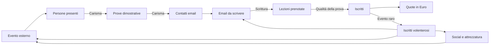

# Oggetto: Nuovi Iscritti

## Game Design Document

**Titolo di lavorazione:** Oggetto: Nuovi Iscritti  
**Sottotitolo:** Un incremental game dell'Ordine delle Onde  
**Versione documento:** 1.1  
**Stato:** concept avanzato, economia e progressione definite, pronto per la prototipazione  
**Piattaforma:** browser desktop  
**Lingua:** italiano  
**Salvataggio:** locale nel browser  

---

## 1. Sintesi

Oggetto: Nuovi Iscritti è un browser game clicker incrementale ambientato dentro una simulazione quasi perfetta di Outlook per Windows 11.

Il giocatore collabora inizialmente con **LudoSport Genova – Ordine delle Onde** e deve trovare nuovi potenziali interessati, ottenere i loro indirizzi email, scrivere inviti e trasformare i contatti in iscritti. Ogni pressione della tastiera inserisce il carattere successivo di un'email prestabilita, indipendentemente dal tasto premuto. Anche un click nel corpo della mail inserisce un carattere. All'inizio ogni input produce un solo carattere; i potenziamenti aumentano progressivamente la velocità.

Le email completate vengono inviate automaticamente e invitano il destinatario a partecipare a una singola lezione di prova in palestra. Dopo un intervallo compresso, il contatto può prenotare oppure sparire definitivamente. Chi partecipa alla lezione ha un'alta probabilità, ma non la certezza, di iscriversi.

I contatti non sono infiniti. Per continuare a inviare email bisogna organizzare eventi reali in luoghi di Genova. Ogni evento attira un certo numero di persone; una porzione prova la disciplina sul posto, una porzione lascia il proprio indirizzo email, una porzione accetta l'invito alla prova in palestra e infine una porzione si iscrive. Carisma, Scrittura, Social, organizzazione, collaboratori e attrezzatura migliorano fasi diverse del funnel.

Gli iscritti generano periodicamente **Euro** tramite le quote associative. Gli Euro sono l'unica risorsa spendibile. Una piccola percentuale degli iscritti è composta da rari **Iscritti volenterosi**, equivalenti ludicamente a una variante rara: possono essere assegnati liberamente come Collaboratori delle Onde alla scrittura, agli eventi, ai social o alla manutenzione. Possono apprendere le Forme LudoSport seguendo il percorso `1 → X → 2 → Y → 3/4/5 → 6 → 7` e i tre rami Spada Lunga, Staffa e Doppia spada corta.

Raggiunta una dimensione significativa, al giocatore viene proposto di trasferirsi e fondare una nuova scuola, scegliendone nome e sede. Questa è la meccanica di prestigio: una parte dei progressi locali riparte, mentre l'esperienza accumulata e la rete delle scuole fondate forniscono bonus permanenti. Il gioco non ha un finale e può continuare indefinitamente.

---

## 2. Visione del gioco

### 2.1 Fantasia principale

Il giocatore deve sentirsi contemporaneamente:

- una persona che sta rispondendo alle email in ufficio;
- un reclutatore instancabile dell'Ordine delle Onde;
- il coordinatore di una piccola organizzazione che cresce fino a diventare una rete di scuole;
- il protagonista di una commedia amministrativa sempre più assurda, raccontata esclusivamente attraverso email, calendari, contatti e documenti apparentemente professionali.

### 2.2 Pilastri di design

1. **Camuffamento credibile**  
   A colpo d'occhio il gioco deve sembrare Outlook per Windows 11. Le informazioni ludiche devono essere presentate come normali elementi di posta, calendario, contatti e attività.

2. **Input immediato e soddisfacente**  
   Qualunque tasto utile fa avanzare il testo. Non si può sbagliare a scrivere. Il giocatore deve poter martellare la tastiera come in Hacker Typer.

3. **Una catena produttiva leggibile**  
   Eventi generano pubblico; il pubblico genera prove dimostrative; le prove generano contatti; le email generano prenotazioni; le lezioni in palestra generano iscritti; le quote generano Euro; gli iscritti volenterosi generano automazione.

4. **Umorismo crescente**  
   Il gioco parte con messaggi realistici e professionali. Con il progresso, le email, gli oggetti e le iniziative diventano più stravaganti, pur restando leggibili e funzionali.

5. **Crescita senza fine**  
   Il giocatore passa dalla singola email alla gestione automatizzata di più scuole, mantenendo sempre utile l'interazione manuale.

6. **Rispetto dell'identità LudoSport**  
   Il gioco può citare Forme, spade, Ordini, scuole, lezioni, eventi e terminologia LudoSport. I riferimenti a franchise cinematografici esterni restano indiretti e comici.

7. **Svelamento progressivo**  
   Il gioco comincia quasi vuoto. Nuove cartelle, funzioni e sistemi di Outlook compaiono soltanto quando il giocatore raggiunge traguardi comprensibili o completa speciali comunicazioni interne manuali.

### 2.3 Tono

Il tono combina:

- comunicazione sportiva autentica;
- vita amministrativa da scuola o associazione;
- satira leggera del lavoro d'ufficio;
- entusiasmo genuino per LudoSport;
- escalation surreale ma mai aggressiva o denigratoria.

Esempio di escalation:

1. «Vieni a provare una disciplina sportiva originale a Genova.»
2. «Scopri quanto può essere elegante un lunedì sera con una spada luminosa.»
3. «Il tuo divano sostiene che non sei pronto. Dimostragli che si sbaglia.»
4. «Partecipa alla prova prima che quel famoso grande topo venga a chiederci perché le nostre spade fanno luce.»

---

## 3. Pubblico e sessioni

### 3.1 Pubblico principale

- membri e amici della comunità LudoSport;
- appassionati di incremental e idle game;
- giocatori che apprezzano interfacce diegetiche;
- utenti desktop che vogliono sessioni brevi durante la giornata.

### 3.2 Durata delle sessioni

- **Micro-sessione:** 30–90 secondi per completare una mail o controllare prenotazioni e quote.
- **Sessione normale:** 5–15 minuti per scrivere, acquistare potenziamenti e organizzare attività.
- **Sessione di gestione:** 15–30 minuti per assegnare collaboratori, pianificare eventi e preparare un prestigio.
- **Ritorno idle:** riepilogo dei progressi maturati mentre il gioco era chiuso.

---

## 4. Struttura dell'esperienza



### 4.1 Loop attivo

1. Il giocatore apre una bozza già indirizzata a un contatto disponibile.
2. Preme tasti o clicca nel corpo della mail.
3. Ogni input rivela il prossimo carattere del testo prestabilito.
4. Quando il corpo è completo, la mail viene inviata automaticamente.
5. Il contatto viene consumato e viene programmato l'esito ritardato dell'invito alla prova in palestra.
6. Se esiste un altro contatto, si apre immediatamente una nuova mail.
7. Il giocatore può continuare a premere tasti senza interrompersi: il sistema passa da una mail alla successiva in modo trasparente.
8. Se i contatti sono terminati, Outlook mostra una comunicazione plausibile che invita a pianificare un evento o a partecipare a uno sparring esterno.

### 4.2 Loop gestionale

1. Controllare prenotazioni, prove in palestra, iscritti, Euro e contatti rimasti.
2. Assegnare collaboratori alle attività.
3. Sbloccare o migliorare Carisma, Scrittura, Velocità, Social e Attrezzatura.
4. Pianificare eventi nel Calendario.
5. Mantenere le spade disponibili e in buono stato.
6. Preparare nuove campagne email.

### 4.3 Loop di lungo periodo

1. Far crescere l'Ordine delle Onde.
2. Costruire una squadra di collaboratori specializzati.
3. Automatizzare raccolta contatti, scrittura e manutenzione.
4. Raggiungere la soglia per ricevere l'offerta di fondare una nuova scuola.
5. Scegliere città e nome della scuola.
6. Trasferire l'esperienza permanente alla nuova sede.
7. Ripetere con costi, numeri e moltiplicatori crescenti.

---

## 5. Risorse

### 5.1 Iscritti

Gli **Iscritti** sono il punteggio principale, la dimensione della scuola e una sorgente di entrate ricorrenti. Non sono spendibili.

- **Iscritti attivi:** membri attuali della scuola; possono aumentare o diminuire tramite eventi narrativi.
- **Iscritti storici:** totale lordo ottenuto nella partita e nei cicli di prestigio.
- **Iscritti volenterosi:** variante rara degli iscritti, assegnabile ai progetti come Collaboratore delle Onde.

Ogni nuovo iscritto accredita immediatamente un bonus di iscrizione di **€20**. In seguito, ogni iscritto attivo genera una quota di **€40 per mese di gioco**. Un mese dura **60 secondi reali** e segue il normale ciclo da Gennaio a Dicembre; dopo Dicembre torna Gennaio. Il gioco non mostra né tiene traccia degli anni. Un evento positivo di passaparola può produrre più potenziali iscritti; un litigio o un mancato rinnovo può ridurre il totale.

### 5.2 Euro

Gli **Euro (€)** sono l'unica risorsa spendibile. Provengono principalmente dalle quote periodiche degli iscritti e vengono usati per:

- potenziamenti di Carisma, Scrittura e Velocità;
- campagne social;
- manutenzione e miglioramento delle spade;
- organizzazione di eventi;
- strumenti amministrativi e organizzativi.

Gli iscritti possono fungere da requisito di sblocco, ma non vengono mai consumati per acquistare qualcosa.

### 5.3 Contatti

I Contatti sono indirizzi email inventati ottenuti attraverso eventi, lezioni di prova, social e collaboratori.

Ogni contatto contiene:

- nome e cognome generati;
- indirizzo email fittizio;
- fonte del contatto;
- data di acquisizione;
- eventuali tag tecnici o narrativi;
- stato: disponibile, in scrittura, invitato, prova prenotata, convertito o perso.

I contatti sono una risorsa limitante. Se finiscono, la produzione di email si ferma.

### 5.4 Email

Stati possibili:

- bozza;
- in scrittura;
- completata;
- inviata;
- in attesa dell'esito;
- prova prenotata;
- contatto perso.

Non esistono follow-up né conversazioni di risposta: ogni contatto riceve una sola mail e viene poi convertito o eliminato.

### 5.5 Collaboratori

I Collaboratori delle Onde sono iscritti che decidono di aiutare attivamente la scuola. Sono una sottocategoria degli Iscritti e non una valuta separata.

### 5.6 Attrezzatura

Le spade della scuola sono gestite come inventario operativo:

- disponibili;
- assegnate a un evento;
- da controllare;
- in manutenzione;
- temporaneamente inutilizzabili.

Le spade impongono una capienza operativa: quelle assegnate a un evento non sono disponibili fino alla sua conclusione. Un valore di usura più alto riduce inoltre l'efficacia degli eventi.

### 5.7 Reputazione di rete

La **Reputazione di rete** è la risorsa permanente ottenuta fondando e facendo crescere nuove scuole. Aumenta i moltiplicatori globali dopo il prestigio.

---

## 6. Scrittura delle email

### 6.1 Regole di input

- Il gioco ascolta gli eventi `keydown` quando la vista di composizione è attiva e nessun controllo dell'interfaccia richiede l'input.
- Ogni tasto, inclusi modificatori e tasti di navigazione, produce una sola unità di input; `event.repeat` viene ignorato.
- Un click nel corpo produce lo stesso avanzamento.
- I click su cartelle, menu, Calendario, Contatti e altre opzioni eseguono la loro funzione e non scrivono.
- Le combinazioni di sistema e del browser non devono essere bloccate, anche quando il relativo `keydown` fa avanzare il testo.
- Tenere premuto un tasto conta come una singola pressione.
- Incollare testo non completa la mail.
- Il testo rivelato è sempre quello del modello corrente; ciò che il giocatore preme non viene registrato.
- L'input manuale rimane utile nelle fasi avanzate perché la stessa potenza di scrittura moltiplica anche il lavoro dei collaboratori.

### 6.2 Caratteri per input

Formula iniziale:

```text
potenzaScrittura = 1 + livelliVelocità

caratteriPerInput = floor(
  potenzaScrittura
  × moltiplicatoreScrittura
  × moltiplicatoreForme
  × moltiplicatorePrestigio
)
```

Valori consigliati per la prima curva:

| Fase | Caratteri per input |
|---|---:|
| Inizio | 1 |
| Primo potenziamento | 2 |
| Inizio automazione | 3–5 |
| Metà ciclo | 8–15 |
| Fine ciclo | 25–50 |

### 6.3 Rapporto tra scrittura manuale e automatica

La velocità non dipende da combo o precisione, ma esclusivamente dai potenziamenti e dai moltiplicatori permanenti. I bonus generali alla scrittura migliorano contemporaneamente:

- caratteri prodotti da ogni input manuale;
- caratteri prodotti dai Collaboratori delle Onde;
- efficacia di eventuali strumenti automatici futuri.

Questo collegamento impedisce che la potenza manuale diventi un ramo morto dopo lo sblocco dell'automazione.

### 6.4 Completamento e invio

Al completamento:

1. il cursore si ferma alla fine del testo;
2. compare per 250–400 ms lo stato Outlook “Invio in corso…”;
3. la mail passa in Posta inviata;
4. viene determinato e salvato l'esito ritardato `prenota la prova / contatto perso`;
5. si apre la mail successiva entro 300–600 ms;
6. non viene riprodotto alcun suono.

Decidere l'esito al momento dell'invio impedisce di cambiare il risultato ricaricando la pagina. L'esito della successiva lezione in palestra viene invece determinato quando la lezione viene risolta.

### 6.5 Lunghezza delle email

Distribuzione iniziale dei 100 testi:

| Tipo | Percentuale | Lunghezza indicativa |
|---|---:|---:|
| Molto breve | 15% | 180–300 caratteri |
| Breve | 35% | 301–550 caratteri |
| Media | 35% | 551–900 caratteri |
| Lunga | 15% | 901–1.400 caratteri |

La lunghezza deve influenzare la qualità potenziale: una mail lunga non è automaticamente migliore. Oggetto, personalizzazione e chiarezza contano più del numero di caratteri.

---

## 7. Conversione delle email

### 7.1 Flusso

Ogni email inviata crea un esito futuro con due possibili risultati:

- il contatto prenota una singola lezione di prova in palestra;
- il contatto non converte e sparisce definitivamente.

Non vengono mostrate risposte personali e non esistono follow-up. Se la prova viene prenotata, il sistema crea una presenza nel Calendario. Quando la lezione si conclude, viene risolto un secondo esito:

- la persona si iscrive;
- la persona non si iscrive e sparisce definitivamente.

Un nuovo iscritto può inoltre risultare, con probabilità rara, un Iscritto volenteroso.

### 7.2 Tempi compressi

Per il primo prototipo:

| Passaggio | Tempo suggerito |
|---|---:|
| Esito dell'email | 20 secondi–3 minuti |
| Attesa della lezione in palestra | 1–5 minuti |
| Esito della lezione | immediato al termine |
| Bonus di iscrizione | immediato (€20) |
| Accredito della quota mensile | al cambio mese (€40 per iscritto) |

Il mese di gioco dura 60 secondi e il calendario scorre da Gennaio a Dicembre, ricominciando poi da Gennaio senza un contatore degli anni. Gli altri tempi devono essere configurabili dai dati e non scritti direttamente nella logica.

### 7.3 Formule di conversione

```text
probabilitàPrenotazione = clamp(
  prenotazioneBase
  × moltiplicatoreScrittura
  × moltiplicatoreReputazione
  × bonusSocial
  × bonusPrestigio,
  minimo,
  massimo
)

probabilitàIscrizioneDopoProva = clamp(
  iscrizioneBaseDopoProva
  × qualitàLezione
  × bonusAccoglienza
  × efficaciaCollaboratori
  × statoAttrezzatura
  × bonusPrestigio,
  minimo,
  massimo
)
```

Ipotesi iniziali da verificare con il prototipo:

- prenotazione della prova dopo l'email: 20%;
- iscrizione dopo la lezione in palestra: 50%;
- probabilità minima di ogni passaggio: 1%;
- massimo ordinario della prenotazione: 70%;
- massimo ordinario dell'iscrizione dopo la prova: 90%.

Questi numeri sono ipotesi di bilanciamento e andranno corretti dopo i primi test.

### 7.4 Comunicazione degli esiti

Gli esiti positivi vengono comunicati come messaggi automatici interni, non come risposte dei destinatari:

- “Nuovo iscritto registrato”;
- “Quota associativa accreditata”;
- “Nuovo collaboratore disponibile”.

Le prenotazioni delle lezioni di prova non generano messaggi in Posta in arrivo: sono visibili nel Calendario e nello stato dell'email inviata.

Gli esiti negativi dei singoli contatti non producono messaggi: sono visibili soltanto nelle statistiche aggregate del funnel.

---

## 8. Acquisizione dei contatti

### 8.1 Eventi

Gli eventi sono programmati attraverso il Calendario di Outlook e si svolgono in tempo compresso. Esistono eventi fissi ed eventi che compaiono casualmente. Nella prima versione gli esiti sono automatici: il sistema decisionale verrà valutato successivamente.

Ogni evento richiede:

- un tempo di preparazione;
- un numero di iscritti da impiegare;
- un numero di spade da impiegare;
- una durata;
- un costo in Euro;
- eventuali requisiti di Carisma, Social o Attrezzatura.

Non esiste un limite numerico separato agli eventi contemporanei. Il giocatore può avviarne più di uno finché restano disponibili sia gli iscritti sia le spade richieste; entrambe le risorse tornano disponibili al termine dell'attività.

Le nuove spade possono essere acquistate dall'area Attività tramite **LamaDiLuce (Abridge S.r.l.)**, partner tecnico e fornitore ufficiale LudoSport. Il riferimento di gioco è la **Polaris EVO Basic combat-ready** a €330: costruzione modulare, lama autorizzata per pratica ed eventi ufficiali e marcatura dell'anno di produzione. L'acquisto è immediato per non introdurre microgestione logistica; la presentazione conserva un tono goliardico senza alterare i riferimenti reali del produttore.

La fama della scuola, misurata attraverso gli iscritti attivi, sblocca progressivamente cinque tier di potenzialità: **Molto bassa**, **Bassa**, **Media**, **Alta** e **Altissima**. All'inizio sono visibili soltanto Sparring e Volantinaggio; l'interfaccia anticipa esclusivamente il prossimo sblocco e non mostra previsioni numeriche sui contatti.

| Evento | Sblocco | Costo | Impiegati | Spade | Potenzialità |
|---|---:|---:|---:|---:|---:|
| Sparring al parco | 0 | €0 | 0 | 2 | molto bassa |
| Volantinaggio organizzato benissimo | 0 | €40 | 1 | 2 | molto bassa |
| Lezioni all'aperto | 5 | €120 | 2 | 4 | bassa |
| Evento sportivo | 10 | €240 | 4 | 6 | bassa |
| Mele Comics | 20 | €400 | 6 | 8 | media |
| CairoMix | 35 | €640 | 8 | 10 | media |
| CogoComix | 60 | €1.200 | 12 | 12 | alta |
| Burtomics | 90 | €1.800 | 16 | 16 | alta |
| Genova Comics & Games | 120 | €2.600 | 20 | 20 | alta |
| Megacon Genova | 180 | €4.200 | 28 | 24 | altissima |
| Lucca Comics & Games | 250 | €7.000 | 40 | 30 | altissima |
| Milan Games Week & Cartoomics | 350 | €10.000 | 50 | 36 | altissima |

### 8.2 Persone incontrate e contatti ottenuti

Un evento attraversa tre passaggi distinti prima di generare indirizzi email.

```text
personeIncontrate = capienzaBase
  × qualitàEvento
  × bonusSocial
  × variabilitàCasuale

proveDimostrative = personeIncontrate
  × probabilitàProvaSulPosto
  × moltiplicatoreCarisma

contattiOttenuti = proveDimostrative
  × probabilitàRilascioEmail
  × moltiplicatoreCarisma
  × efficaciaCollaboratori
```

Ipotesi iniziali:

- persone che provano sul posto: 35%;
- persone che lasciano l'email dopo la prova: 25–35% secondo l'evento;
- entrambi i passaggi sono migliorabili tramite Carisma;
- il numero di persone presenti varia in base al tipo di evento, non al meteo o al giorno della settimana.

### 8.3 Lezioni in palestra, Social e sparring

La **lezione di prova in palestra** non genera nuovi indirizzi: consuma una prenotazione ottenuta tramite email e produce il possibile iscritto finale. Per lo scopo del gioco, ogni persona partecipa a una sola lezione.

I **Social** generano passivamente contatti email e possono ricevere campagne pagate in Euro. Le piattaforme sono inventate e i loro contatti seguono lo stesso percorso degli altri: email → prova in palestra → possibile iscrizione. Un evento virale può generare un picco casuale di contatti.

Lo **sparring esterno** è sempre disponibile come attività di sicurezza quando mancano contatti o denaro. Costa poco o nulla, ma produce soltanto pochi indirizzi.

### 8.4 Esaurimento dei contatti

Quando non esistono contatti disponibili:

- la bozza corrente non viene creata;
- compare una normale email interna con oggetto “Elenco contatti esaurito”;
- il testo suggerisce di aprire il Calendario;
- la produzione automatica di email si mette in pausa;
- i collaboratori assegnati alla scrittura risultano “In attesa di destinatari”;
- nessun progresso viene perso.

Questa situazione è intenzionale e rappresenta il principale collo di bottiglia strategico.

---

## 9. Collaboratori delle Onde

### 9.1 Reclutamento

Ogni nuovo iscritto ha una probabilità rara e casuale di essere un **Iscritto volenteroso**. Questi iscritti possono essere assegnati come Collaboratori delle Onde. La probabilità iniziale consigliata per il prototipo è **2%**, da validare con i test.

La probabilità può aumentare con:

- qualità dell'accoglienza;
- dimensione della scuola;
- reputazione;
- progetti interni;
- potenziamenti organizzativi.

### 9.2 Dati e regole

Ogni collaboratore possiede:

- nome inventato;
- data di ingresso;
- Forme sbloccate;
- stato e assegnazione attuale.

Regole:

- alcuni personaggi reali potranno essere aggiunti in seguito;
- nella prima versione non esistono livelli, ritratti o personalità individuali;
- non esiste un limite massimo di collaboratori;
- ogni collaboratore svolge un solo incarico alla volta;
- la riassegnazione è libera e immediata;
- un collaboratore può lasciare la scuola soltanto tramite eventi narrativi casuali.

### 9.3 Ruoli

| Ruolo | Funzione |
|---|---|
| Redazione | scrive caratteri automaticamente |
| Eventi | aumenta persone incontrate e contatti ottenuti |
| Lezioni in palestra | aumenta la probabilità di iscrizione finale |
| Social | genera interesse e contatti nel tempo |
| Attrezzatura | controlla e ripristina le spade |
| Coordinamento | funzione futura, non inclusa nell'MVP |

### 9.4 Scrittura automatica

```text
caratteriAutomaticiAlSecondo = velocitàBaseCollaboratore
  × collaboratoriAssegnati
  × potenzaScrittura
  × bonusForma
  × bonusScritturaScuola
  × moltiplicatorePrestigio
```

I caratteri automatici avanzano la stessa mail visibile al giocatore. L'input manuale si somma senza conflitti. La scrittura automatica non può essere messa in pausa, ma si ferma naturalmente quando finiscono i contatti.

### 9.5 Raccolta automatica dei contatti

I collaboratori assegnati a eventi o promozione possono:

- aumentare il rendimento di un evento pianificato;
- organizzare piccole attività ricorrenti;
- produrre lentamente nuovi contatti offline;
- alimentare i social;
- migliorare la qualità media dei contatti.

La raccolta automatica deve essere più lenta degli eventi gestiti attivamente, ma sufficiente a impedire un blocco totale nelle fasi avanzate.

### 9.6 Percorso delle Forme

Le Forme non simulano il combattimento: rappresentano formazione e moltiplicatori del collaboratore. Il percorso è:

```text
Forma 1
  → Corso X
  → Forma 2
  → Corso Y
  → Forme 3, 4 e 5 in uno o più rami:
      - Spada Lunga
      - Staffa
      - Doppia spada corta
  → Forma 6
  → Forma 7
```

Nomi e numeri sono sufficienti nella prima versione; gli effetti ludici non devono riprodurre fedelmente le caratteristiche tecniche reali delle Forme.

Regole:

- un collaboratore può conoscere più Forme;
- l'eventuale accesso a più rami 3/4/5 resta configurabile;
- la formazione richiede Euro e/o tempo, ma non livelli personali;
- le descrizioni definitive dovranno usare terminologia LudoSport approvata.

---

## 10. Potenziamenti

### 10.1 Carisma

Influenza due passaggi degli eventi: la probabilità che una persona provi la disciplina sul posto e la probabilità che, dopo la prova dimostrativa, lasci il proprio indirizzo email.

| Potenziamento | Effetto indicativo |
|---|---|
| Presentazione preparata | +10% prove dimostrative |
| Biglietti con QR code | +15% contatti agli eventi |
| Dimostrazione coordinata | +20% qualità evento |
| Stand riconoscibile | +25% persone incontrate |
| Accoglienza dell'Ordine | +15% indirizzi lasciati |
| Risposte alle domande difficili | riduce contatti persi |
| “No, non è esattamente quella cosa” | bonus comico alle spiegazioni |

### 10.2 Scrittura

Influenza sia il moltiplicatore generale di digitazione sia il tasso da email inviata a lezione di prova prenotata. Non modifica direttamente l'esito della lezione in palestra.

| Potenziamento | Effetto indicativo |
|---|---|
| Oggetto chiaro | +8% prenotazioni |
| Invito personalizzato | +12% prenotazioni |
| Call to action | +15% prenotazioni |
| Revisione collettiva | +10% prenotazioni e moltiplicatore di scrittura |
| Testimonianze | +20% prenotazioni |
| Il paragrafo che convince davvero | bonus alle mail lunghe |
| Pubblicità sorprendentemente onesta | bonus globale avanzato |

### 10.3 Accoglienza e qualità della lezione

Influenza la conversione finale da partecipante alla lezione in palestra a iscritto.

| Potenziamento | Effetto indicativo |
|---|---|
| Procedura di benvenuto | +10% iscrizioni dopo la prova |
| Lezione introduttiva collaudata | +15% qualità lezione |
| Materiale informativo chiaro | +10% iscrizioni dopo la prova |
| Collaboratore dedicato | bonus per ogni volenteroso assegnato |
| Sala preparata | riduce gli esiti negativi narrativi |
| Esperienza memorabile | moltiplicatore avanzato |

### 10.4 Velocità

Influenza caratteri per pressione e automazione.

| Potenziamento | Effetto indicativo |
|---|---|
| Tastiera comoda | +1 carattere per input |
| Modelli di Outlook | +1 carattere per input |
| Frasi rapide | +2 caratteri per input |
| Firma automatica | completa automaticamente la chiusura |
| Campi intelligenti | completa nome e luogo automaticamente |
| Revisione istantanea | moltiplica manuale e collaboratori |
| Fusione documenti | grande bonus di fine ciclo |

### 10.5 Social

Genera passivamente contatti email anche senza eventi. Le campagne social consumano Euro, usano piattaforme inventate e possono diventare casualmente virali.

| Potenziamento | Effetto indicativo |
|---|---|
| Pagina aggiornata | flusso minimo di interesse |
| Calendario editoriale | produzione più regolare |
| Foto delle lezioni | migliore qualità dei contatti |
| Video dimostrativo | maggiore portata |
| Rubrica settimanale | bonus cumulativo |
| Post inspiegabilmente virale | evento casuale positivo |
| Gestione professionale | automazione social |

### 10.6 Attrezzatura

Influenza qualità e frequenza degli eventi e riduce il rischio di eventi narrativi negativi. Le spade disponibili determinano la capienza contemporanea insieme agli iscritti liberi.

| Potenziamento | Effetto indicativo |
|---|---|
| Controllo pre-evento | meno guasti |
| Kit di manutenzione | riparazioni più veloci |
| Rastrelliera ordinata | più spade disponibili |
| Ricambi essenziali | riduce tempi di fermo |
| Set da dimostrazione | aumenta capienza eventi |
| Registro dell'attrezzatura | automazione dei controlli |
| “Le abbiamo messe a posto tutte” | moltiplicatore avanzato |

### 10.7 Organizzazione

| Potenziamento | Effetto indicativo |
|---|---|
| Calendario condiviso | più eventi pianificabili |
| Turni dei collaboratori | maggiore efficienza assegnazioni |
| Lista di controllo | riduce imprevisti |
| Modulo di iscrizione | accredito e registrazione più rapidi |
| Segreteria dell'Ordine | automatizza notifiche e quote |
| Coordinamento multi-sede | bonus di prestigio |

### 10.8 Costi

Tutti i potenziamenti vengono acquistati esclusivamente in Euro. Non esistono rimborsi, ma nel lungo periodo è possibile comprare ogni ramo. La curva iniziale riprende la crescita graduale del gioco di riferimento:

```text
costoLivello = costoBase × crescita^(livelloCorrente)
```

Il prototipo usa una crescita di **1,30** per livello. I prezzi base vanno da **€50** per i primi acquisti fino a **€6.500** per i sistemi avanzati, calibrati sulle quote mensili disponibili alla rispettiva soglia di iscritti.

Alcuni livelli richiedono anche soglie non spendibili, come numero di iscritti, eventi completati, collaboratori o Forme conosciute.

### 10.9 Sblocco progressivo

L'interfaccia non mostra tutti i sistemi dall'inizio. Una prima sequenza consigliata è:

| Traguardo | Sblocco diegetico |
|---|---|
| Avvio | sola composizione della mail e primi contatti |
| Prima email | Posta inviata e statistiche minime |
| 3 email | comunicazione “Configurazione campagna” |
| Comunicazione completata | Potenziamenti di Scrittura e Velocità |
| Primo esaurimento contatti | Calendario, eventi e sparring esterno |
| Prima prova prenotata | report aggregato del funnel |
| Primo iscritto | Euro e quote associative |
| Primo Iscritto volenteroso | Iscritti, Collaboratori e assegnazioni |
| 10 iscritti | Social |
| 20 iscritti | Attrezzatura e usura narrativa |
| 50 iscritti | Forme dei collaboratori |
| Circa 100 iscritti | procedura per fondare una nuova scuola |

Le soglie sono configurabili e andranno calibrate per raggiungere il primo prestigio dopo circa 3–4 ore.

### 10.10 Comunicazioni di sistema

Alcuni traguardi aprono una breve **comunicazione di sistema**, equivalente ai file di sistema del gioco di riferimento. Esempi:

- Configurazione modelli di invito;
- Attivazione calendario condiviso;
- Registro quote associative;
- Procedura manutenzione attrezzatura;
- Configurazione account social;
- Richiesta apertura nuova scuola.

Queste comunicazioni:

- vengono completate con la stessa meccanica di tastiera;
- devono essere scritte manualmente e ignorano l'automazione;
- sono brevi e rare;
- sbloccano un'intera funzione al completamento;
- impediscono che il progresso idle faccia saltare l'introduzione di una nuova meccanica.

---

## 11. Interfaccia Outlook per Windows 11

### 11.1 Obiettivo di camuffamento

Il gioco deve raggiungere un camuffamento percepito del 99%:

- alla prima occhiata sembra una normale finestra di Outlook;
- non mostra barre di risorse, monete, gemme o pulsanti da videogioco;
- usa il linguaggio dell'email e dell'organizzazione;
- mantiene colori, spaziatura e gerarchia visiva plausibili;
- tutta l'interazione ludica avviene dentro elementi credibili di Outlook.

Il progetto imita l'esperienza visiva, ma deve evitare di presentarsi come prodotto ufficiale Microsoft. Per una distribuzione pubblica è preferibile usare icone ricreate o generiche e inserire una nota di non affiliazione nelle informazioni del progetto.

### 11.2 Struttura dello schermo

```text
┌─────────────────────────────────────────────────────────────────────────────┐
│ Barra titolo / Ricerca / Controlli finestra                                │
├────┬────────────────┬─────────────────────────┬─────────────────────────────┤
│App │ Cartelle       │ Elenco messaggi         │ Lettura / Composizione      │
│rail│                │                         │                             │
│    │ Posta in arrivo│ Oggetto                 │ A: nome@email.test          │
│    │ Bozze          │ Mittente                │ Oggetto: ...                │
│    │ Inviata        │ Data                    │                             │
│    │ Contatti       │                         │ Corpo della mail            │
│    │                │                         │                             │
├────┴────────────────┴─────────────────────────┴─────────────────────────────┤
│ Stato sincronizzazione / digitazione / elementi                            │
└─────────────────────────────────────────────────────────────────────────────┘
```

### 11.3 Mappatura tra Outlook e gioco

| Elemento apparente | Funzione ludica |
|---|---|
| Posta in arrivo | comunicazioni interne, tutorial, notifiche e storia |
| Bozze | email in coda o interrotte |
| Posta inviata | storico delle campagne |
| Posta indesiderata | eventi comici, anomalie e messaggi narrativi |
| Archivio | statistiche delle vecchie scuole |
| Calendario | eventi e lezioni di prova |
| Iscritti | iscritti e collaboratori |
| Attività / To Do | manutenzione, social e progetti |
| Impostazioni | opzioni reali, export e reset salvataggio |
| Ricerca | filtri e statistiche avanzate |
| Cartelle personalizzate | rami di potenziamento |
| Conteggi non letti | risorse disponibili e notifiche |

### 11.4 Presentazione dei valori

I numeri del gioco vengono nascosti in elementi plausibili:

- Contatti disponibili: conteggio accanto alla cartella Contatti;
- Esiti in attesa: conteggio accanto a Posta inviata o Calendario;
- Euro disponibili: saldo in un report amministrativo o nella cartella Quote;
- Iscritti: gruppo contatti “Iscritti attivi”;
- Collaboratori: gruppo contatti “Collaboratori delle Onde”;
- Caratteri al secondo: stato “Sincronizzazione” nella barra inferiore;
- Conversione: pannello “Statistiche campagna”;
- Spade disponibili: calendario risorse o elenco Attività;
- Prestigio: email formale ricevuta dalla rete LudoSport.

### 11.5 Animazioni

- nessuna particella;
- nessun tremolio o flash da gioco;
- cursore e selezione simili a un editor reale;
- transizioni tra pannelli da 120–200 ms;
- indicatori di sincronizzazione discreti;
- notifiche in stile Windows 11, senza audio;
- eventuali accenti acquatici dell'Ordine delle Onde limitati a dettagli quasi invisibili.

### 11.6 Risoluzioni target

- primaria: 1920×1080;
- secondaria: 1366×768;
- minima supportata: 1280×720;
- nessuna interfaccia mobile nella prima versione.

---

## 12. Navigazione e schermate

### 12.1 Posta

È la schermata predefinita e contiene il loop di scrittura.

Azioni:

- scrivere la mail;
- consultare prenotazioni, iscrizioni e notifiche interne;
- leggere tutorial diegetici;
- controllare campagne;
- aprire comunicazioni di sblocco.

### 12.2 Calendario

Mostra:

- eventi programmati;
- lezioni di prova;
- attività ricorrenti dei collaboratori;
- disponibilità di persone e spade;
- previsioni non garantite sui risultati.

Creare un evento usa un modulo simile a un vero appuntamento Outlook.

### 12.3 Iscritti

Due viste:

- Iscritti;
- Collaboratori.

La scheda di un collaboratore presenta statistiche e Forme come informazioni di profilo e formazione.

### 12.4 Attività

Gestisce:

- manutenzione spade;
- preparazione eventi;
- campagne social;
- potenziamenti;
- progetti della scuola.

I costi appaiono come “Persone richieste” o “Collaboratori coinvolti”.

### 12.5 Statistiche

Presentate come report di campagna:

- persone incontrate;
- contatti ottenuti;
- email inviate;
- tempo medio di scrittura;
- prove prenotate;
- prove completate;
- iscritti;
- conversione per fonte;
- conversione aggregata delle email;
- rendimento collaboratori;
- andamento nel tempo.

---

## 13. Tutorial diegetico

Il tutorial avviene tramite email ricevute.

### Sequenza iniziale

1. **Benvenuto nell'Ordine delle Onde**  
   Introduce il contesto e assegna i primi 5 contatti fittizi.

2. **Prima campagna inviti**  
   Chiede di scrivere premendo qualunque tasto. L'invio e l'apertura della mail successiva sono automatici.

3. **Configurazione campagna**  
   È la prima comunicazione di sistema manuale e sblocca Scrittura e Velocità.

4. **Nuova lezione prenotata**
   Introduce il passaggio email → prova in palestra → possibile iscrizione.

5. **Primo bonus e quota associativa**
   Introduce il bonus immediato di €20, la quota mensile di €40 e il finanziamento dei potenziamenti.

6. **Una mano in più**
   Il primo Iscritto volenteroso può essere garantito dal tutorial e introduce l'automazione.

7. **Le spade non si sistemano da sole**
   Introduce attrezzatura e manutenzione. Più avanti si scopre che, tecnicamente, con abbastanza collaboratori si sistemano quasi da sole.

Il tutorial non deve usare frecce luminose o overlay da gioco. Può evidenziare gli elementi con i normali stati di focus di Windows.

---

## 14. Contenuti email

### 14.1 Archivio previsto

La prima versione completa contiene almeno 100 modelli unici, divisi in cinque fasi da 20:

| Fase | Tono |
|---|---|
| 1 | realistico e professionale |
| 2 | caloroso e personale |
| 3 | creativo e pubblicitario |
| 4 | audace e comico |
| 5 | surreale ma ancora efficace |

### 14.2 Struttura del modello

Ogni modello contiene:

- identificativo;
- fase minima;
- categoria;
- oggetto;
- corpo;
- intervallo di lunghezza;
- bonus o penalità impliciti;
- tag del destinatario;
- peso di selezione;
- variabili inseribili.

Variabili previste:

```text
{{nome}}
{{cognome}}
{{nomeCompleto}}
{{fonteContatto}}
{{nomeEvento}}
{{dataEvento}}
{{nomeScuola}}
{{città}}
{{nomeCollaboratore}}
```

### 14.3 Esempio provvisorio realistico

**Oggetto:** Ti va di provare LudoSport a Genova?

> Ciao {{nome}},  
> ci siamo conosciuti durante {{nomeEvento}} e mi ha fatto piacere raccontarti qualcosa di LudoSport. L'Ordine delle Onde organizza lezioni di prova a Genova per chi vuole scoprire una disciplina sportiva originale, dinamica e accessibile anche a chi parte da zero.  
>  
> Se ti va di partecipare, rispondi pure a questa mail: ti invieremo tutte le informazioni sulla prossima prova.  
>  
> A presto,  
> {{nomeScuola}}

Questo testo è un segnaposto. L'email di esempio fornita dal committente definirà tono, informazioni obbligatorie, firma e call to action della prima fascia di contenuti.

### 14.4 Regole editoriali

- non promettere benefici falsi;
- mantenere sempre comprensibile l'invito;
- non usare dati personali reali;
- non citare direttamente Star Wars;
- sono ammessi riferimenti indiretti come “quel film famoso”;
- la battuta sul “grande topo e i suoi avvocati” deve essere rara, non un tormentone continuo;
- non ridicolizzare LudoSport o i potenziali partecipanti;
- differenziare davvero i 100 testi, evitando semplici sostituzioni di sinonimi;
- ogni mail deve avere una call to action riconoscibile.

### 14.5 Comunicazioni generate

Servono almeno:

- 20 notifiche di prenotazione, iscrizione e pagamento;
- 20 comunicazioni interne;
- 20 eventi narrativi positivi o negativi;
- 20 messaggi comici;
- 10 comunicazioni di sistema che sbloccano funzioni;
- 10 riepiloghi e report diegetici.

---

## 15. Generazione dei destinatari

### 15.1 Dati inventati

Tutti i destinatari vengono generati localmente. Non si utilizzano indirizzi reali.

Formato consigliato:

```text
nome.cognome@example.test
iniziale.cognome@example.test
nickname@example.test
```

Il dominio `.test` è riservato a scopi di test e rende evidente a livello tecnico che gli indirizzi non sono reali.

### 15.2 Generatore

Il generatore combina:

- liste italiane di nomi;
- liste italiane di cognomi;
- occasionali nickname plausibili;
- fonte del contatto;
- fascia di interesse;
- qualità;
- data di acquisizione.

I nomi reali pubblicati sui portali LudoSport non vengono usati automaticamente come personaggi. Potranno essere aggiunti in seguito solo con approvazione esplicita.

---

## 16. Eventi casuali

Gli eventi casuali arrivano come email o modifiche al Calendario. Nella prima versione il loro esito è automatico; in seguito potranno offrire scelte. Possono aumentare o diminuire iscritti, Euro, contatti, collaboratori e stato dell'attrezzatura.

### Positivi

- un post ottiene più attenzione del previsto;
- un collaboratore porta amici a una prova;
- un gruppo di amici si iscrive grazie al passaparola;
- una spada torna disponibile prima del previsto;
- una dimostrazione viene spostata in una posizione migliore;
- una vecchia email riceve finalmente risposta.

### Negativi leggeri

- pioggia durante un evento;
- sovrapposizione nel Calendario;
- una parte dell'attrezzatura richiede manutenzione;
- un litigio provoca uno o più abbandoni;
- il pubblico dell'evento era interessato soprattutto al buffet;
- un destinatario risponde alla persona sbagliata;

### Assurdi avanzati

- richiesta di una dimostrazione in una sala riunioni troppo piccola;
- dibattito di 37 email sull'esatta dicitura di un volantino;
- il “famoso grande topo” sembra aver visualizzato il profilo social;
- un contatto chiede se la spada è inclusa nell'abbonamento della palestra;
- un evento genera più collaboratori che partecipanti.

Gli eventi negativi non devono cancellare grandi quantità di progresso. Devono creare variazione, non frustrazione. Una protezione impedisce lunghe serie di eventi negativi consecutivi.

---

## 17. Prestigio e fondazione di nuove scuole

### 17.1 Primo ciclo

Ogni nuova partita inizia presso **LudoSport Genova – Ordine delle Onde**.

Il primo ciclo racconta la crescita del giocatore da collaboratore operativo a persona capace di coordinare una scuola e deve durare indicativamente **3–4 ore di gioco**.

### 17.2 Sblocco

L'offerta di fondare una nuova scuola arriva tramite una comunicazione di sistema manuale quando sono soddisfatti requisiti come:

- soglia di Iscritti totali;
- numero minimo di collaboratori;
- almeno un certo numero di eventi completati;
- livello minimo di organizzazione;
- disponibilità di attrezzatura;
- reputazione sufficiente.

Soglia provvisoria del primo ciclo: 100 iscritti, 8 collaboratori e 12 eventi, da bilanciare sulla durata obiettivo.

Il prestigio è una scelta volontaria. A differenza del gioco di riferimento, il primo prestigio deve concedere immediatamente un bonus permanente chiaramente percepibile; non deve richiedere più reset prima di diventare utile.

### 17.3 Creazione della scuola

Il giocatore sceglie:

- nome dell'Ordine;
- città da una lista o campo libero controllato;
- colore di accento discreto;
- motto facoltativo;
- specializzazione iniziale.

Il modulo appare come una procedura amministrativa ricevuta via email.

### 17.4 Cosa si azzera

- contatti locali;
- email in coda;
- potenziamenti operativi locali;
- eventi programmati;
- parte dell'attrezzatura e degli Euro locali;
- collaboratori che rimangono assegnati alla scuola precedente.

Gli iscritti della scuola precedente non vengono cancellati: passano allo storico e, nel modello provvisorio, contribuiscono a una piccola rendita di rete.

### 17.5 Cosa rimane

- Iscritti storici;
- scuole fondate;
- Reputazione di rete;
- archivio delle email e statistiche storiche;
- bonus permanenti;
- modelli email sbloccati;
- traguardi;
- un collaboratore mentore selezionato, se sbloccato.

Bonus iniziale consigliato per la prima fondazione: almeno **+25%** alla velocità complessiva del nuovo ciclo oppure un vantaggio equivalente distribuito tra Carisma, Scrittura ed entrate. Il valore è provvisorio, ma l'effetto deve essere immediato.

### 17.6 Progressione infinita

Ogni scuola fondata aumenta:

- costi;
- obiettivi;
- pubblico raggiungibile;
- numero di attività simultanee;
- complessità organizzativa;
- moltiplicatori permanenti.

La rete delle scuole precedenti produce un piccolo contributo passivo e appare nell'Archivio come struttura organizzativa, non come mappa fantasy.

---

## 18. Progresso offline

### 18.1 Regole

Quando il gioco viene riaperto:

1. calcola il tempo trascorso;
2. risolve esiti delle email e lezioni già programmati;
3. applica la scrittura automatica;
4. consuma contatti solo se erano disponibili;
5. completa eventi terminati;
6. genera contatti dalle attività automatiche;
7. accredita le quote maturate in Euro;
8. applica manutenzione, social ed eventi narrativi consentiti offline;
9. mostra un riepilogo in forma di email “Riepilogo attività”.

### 18.2 Limiti

- limite offline iniziale: 8 ore;
- potenziabile fino a 24 ore;
- nessuna produzione di email senza contatti;
- nessun evento parte senza requisiti;
- gli esiti casuali vengono determinati con un seed salvato;
- il cambio manuale dell'orologio non deve produrre vantaggi estremi.

### 18.3 Riepilogo

Il riepilogo mostra:

- tempo trascorso;
- email completate;
- contatti utilizzati;
- prove prenotate e completate;
- nuovi iscritti;
- nuovi collaboratori;
- Euro incassati;
- contatti acquisiti;
- attività bloccate e motivo.

---

## 19. Bilanciamento iniziale

### 19.1 Obiettivi temporali

| Traguardo | Tempo desiderato |
|---|---:|
| Prima mail | meno di 1 minuto |
| Prima prova prenotata | 1–3 minuti |
| Primo iscritto | 3–8 minuti |
| Primo potenziamento | 5–10 minuti |
| Primo esaurimento contatti | 10–20 minuti |
| Primo evento | entro 20 minuti |
| Primo collaboratore | 20–40 minuti |
| Automazione percepibile | 30–60 minuti |
| Primo prestigio | 3–4 ore attive distribuite |

### 19.2 Avvio consigliato

- 5 contatti disponibili;
- 1 carattere per input;
- 0 collaboratori;
- 6 spade disponibili;
- prenotazione prova dopo email: 20% provvisorio;
- iscrizione dopo prova in palestra: 50% provvisorio;
- bonus immediato per ogni nuova iscrizione: €20;
- quota ricorrente: €40 per iscritto attivo a ogni mese di gioco;
- durata di un mese di gioco: 60 secondi, ciclo Gennaio–Dicembre senza conteggio degli anni;
- il primo iscritto può essere assistito dal tutorial per evitare sfortuna estrema;
- il primo Iscritto volenteroso può essere garantito entro i primi iscritti;
- il primo evento e il primo sparring sono gratuiti e guidati.

### 19.3 Protezione dalla sfortuna

- dopo una serie di funnel senza iscritti, aumenta temporaneamente la probabilità del passaggio più debole;
- il bonus non viene mostrato esplicitamente;
- viene azzerato alla prima conversione;
- gli eventi tutorial hanno un risultato minimo garantito;
- il giocatore non può rimanere senza contatti e senza alcun modo gratuito di ottenerne altri.

---

## 20. Salvataggio locale

### 20.1 Strategia

- `localStorage` per la prima versione;
- salvataggio automatico ogni 10 secondi;
- salvataggio dopo invio email, acquisto, assegnazione, evento e prestigio;
- schema versionato;
- backup precedente mantenuto per recupero;
- export/import JSON nelle Impostazioni;
- reset completo con doppia conferma.

### 20.2 Stato minimo

```ts
interface GameState {
  version: number;
  createdAt: number;
  lastSavedAt: number;
  school: SchoolState;
  network: NetworkState;
  player: PlayerState;
  contacts: Contact[];
  messages: Message[];
  pendingEmailOutcomes: PendingEmailOutcome[];
  scheduledTrials: ScheduledTrial[];
  collaborators: Collaborator[];
  equipment: EquipmentItem[];
  calendar: CalendarEvent[];
  upgrades: UpgradeState[];
  statistics: StatisticsState;
  settings: SettingsState;
  randomSeed: string;
}
```

### 20.3 Sicurezza e privacy

- nessuna connessione a Outlook;
- nessun invio di email reali;
- nessun accesso alla rubrica;
- nessun testo digitato dall'utente viene memorizzato;
- nessun indirizzo email reale viene generato;
- nessun backend nella prima versione;
- tutto il progresso rimane nel browser dell'utente.

---

## 21. Architettura tecnica proposta

### 21.1 Stack

- Vite;
- React;
- TypeScript;
- CSS Modules o CSS organizzato per componenti;
- stato applicativo tramite store leggero o reducer centralizzato;
- Vitest per test unitari;
- Playwright per flussi end-to-end;
- ESLint e Prettier.

Non serve un backend per la prima versione.

### 21.2 Moduli

```text
src/
  app/
    App.tsx
    routes.ts
  game/
    engine.ts
    actions.ts
    selectors.ts
    formulas.ts
    offline.ts
    random.ts
    save.ts
    migrations.ts
  features/
    mail/
    calendar/
    contacts/
    collaborators/
    equipment/
    upgrades/
    prestige/
    statistics/
    tutorial/
  content/
    emailTemplates.ts
    notificationTemplates.ts
    names.ts
    events.ts
    upgrades.ts
  components/
    outlook-shell/
    common/
  styles/
    tokens.css
    global.css
```

### 21.3 Motore di gioco

- tick visivo: `requestAnimationFrame`;
- tick economico: 4 volte al secondo;
- formule pure e testabili;
- azioni timestampate;
- casualità con seed persistente;
- esito `prenotazione / contatto perso` determinato all'invio;
- esito `iscrizione / prova non convertita` determinato alla risoluzione della lezione;
- contenuti e bilanciamento separati dal codice;
- nessuna formula dipendente dal frame rate.

### 21.4 Accessibilità e tastiera

Anche se il gioco usa tutta la tastiera:

- Tab deve continuare a navigare l'interfaccia;
- Escape deve chiudere finestre e menu;
- scorciatoie del browser non devono essere intercettate;
- il focus del corpo della mail deve essere evidente ma discreto;
- contrasto e dimensioni devono restare leggibili;
- deve esistere un'opzione per ridurre le animazioni;
- il gioco deve distinguere input di scrittura e navigazione.

---

## 22. Modello dati essenziale

### Contatto

```ts
interface Contact {
  id: string;
  firstName: string;
  lastName: string;
  email: string;
  source: "event" | "sparring" | "social" | "collaborator" | "tutorial";
  acquiredAt: number;
  status: "available" | "writing" | "invited" | "trialScheduled" | "enrolled" | "lost";
  tags: string[];
}
```

### Email

```ts
interface CampaignEmail {
  id: string;
  contactId: string;
  templateId: string;
  subject: string;
  body: string;
  revealedCharacters: number;
  createdAt: number;
  sentAt?: number;
  status: "draft" | "writing" | "sent" | "trialBooked" | "lost";
}
```

### Collaboratore

```ts
interface Collaborator {
  id: string;
  displayName: string;
  joinedAt: number;
  forms: FormQualification[];
  assignment: CollaboratorAssignment | null;
}
```

### Evento

```ts
interface GameEvent {
  id: string;
  definitionId: string;
  title: string;
  startsAt: number;
  endsAt: number;
  assignedCollaboratorIds: string[];
  assignedEquipmentIds: string[];
  status: "planned" | "running" | "completed";
  resolvedOutcome?: EventOutcome;
}
```

### Esiti del funnel

```ts
interface PendingEmailOutcome {
  id: string;
  emailId: string;
  contactId: string;
  resolvesAt: number;
  result: "trialBooked" | "lost";
}

interface ScheduledTrial {
  id: string;
  contactId: string;
  startsAt: number;
  resolvesAt: number;
  resultSeed: string;
  status: "scheduled" | "completed";
}
```

---

## 23. Audio e feedback

- audio completamente assente;
- nessun effetto sonoro al click, alla scrittura o alla conversione;
- feedback solo visivo;
- nessuna richiesta di autorizzazione audio;
- nessun avvio automatico di media;
- eventuale audio futuro deve essere opzionale e disattivato per impostazione predefinita.

---

## 24. Traguardi

I traguardi appaiono come email amministrative o riconoscimenti interni.

Esempi:

- Prima email inviata;
- Primo iscritto;
- Dieci inviti senza una prenotazione, ma senza perdere l'ottimismo;
- Primo evento completato;
- Cento contatti raccolti;
- Prima spada rimessa in ordine;
- Primo collaboratore;
- Prima Forma sbloccata da un collaboratore;
- Mille email inviate;
- Prima nuova scuola fondata;
- “Nessun riferimento legalmente riconoscibile”;
- Rete di dieci scuole.

I traguardi possono dare piccoli bonus permanenti, ma non devono diventare il sistema economico principale.

---

## 25. Roadmap di produzione

### Fase 1 — Prototipo del loop principale

- shell base simile a Outlook;
- composizione email;
- input da tastiera e click;
- testi prestabiliti;
- invio automatico;
- esito ritardato delle email;
- prenotazioni e lezioni in palestra semplificate;
- contatti limitati;
- primi iscritti;
- prime quote in Euro;
- primo sblocco tramite comunicazione di sistema;
- salvataggio locale.

**Criterio di completamento:** il giocatore può scrivere, inviare e convertire email per almeno 15 minuti senza errori bloccanti.

### Fase 2 — Calendario ed eventi

- calendario navigabile;
- prove dimostrative agli eventi;
- lezioni di prova in palestra;
- eventi;
- Carisma;
- persone incontrate e contatti;
- attrezzatura di base;
- esaurimento e recupero contatti.

**Criterio di completamento:** la catena eventi → prove dimostrative → contatti → email → lezioni in palestra → iscritti → Euro è completa.

### Fase 3 — Collaboratori e automazione

- generazione rara degli Iscritti volenterosi;
- assegnazioni;
- scrittura automatica;
- raccolta contatti;
- social;
- manutenzione;
- prime Forme.

**Criterio di completamento:** il gioco progredisce lentamente anche senza input manuale.

### Fase 4 — Camuffamento Outlook completo

- layout fedele a Windows 11;
- Posta, Calendario, Iscritti e Attività;
- notifiche e finestre coerenti;
- contenuti ludici interamente diegetici;
- supporto 1366×768 e 1920×1080;
- nessun elemento apertamente arcade.

**Criterio di completamento:** osservando la schermata per alcuni secondi, sembra un'applicazione di posta reale.

### Fase 5 — Contenuti e bilanciamento

- 100 email;
- notifiche, comunicazioni interne e comunicazioni di sistema;
- eventi casuali;
- tutti i potenziamenti;
- curve economiche;
- protezione dalla sfortuna;
- statistiche.

### Fase 6 — Prestigio e offline

- fondazione nuova scuola;
- scelta nome e città;
- rete permanente;
- progresso offline;
- migrazioni del salvataggio;
- export e import.

### Fase 7 — Rifinitura

- test completi;
- accessibilità;
- ottimizzazione;
- revisione dei testi;
- verifica del camuffamento;
- nota di non affiliazione per marchi esterni;
- preparazione alla pubblicazione.

---

## 26. Test e criteri di accettazione

### Input

- ogni `keydown` non ripetuto avanza il testo quando la composizione è attiva;
- il testo ottenuto è sempre quello previsto;
- anche modificatori e tasti di navigazione possono avanzare il testo senza bloccare il loro comportamento normale;
- tenere premuto un tasto conta una sola volta;
- le scorciatoie del browser funzionano;
- un click fuori dal corpo non scrive;
- un click nel corpo scrive;
- l'automazione e l'input manuale non duplicano caratteri.

### Economia

- un contatto può ricevere una sola campagna alla volta;
- nessuna email viene inviata senza contatto;
- ogni esito email e ogni lezione vengono risolti una sola volta;
- ricaricare non cambia l'esito già determinato;
- soltanto gli Euro vengono spesi per acquistare potenziamenti;
- gli iscritti generano quote una sola volta per ogni mese di gioco;
- il contatore dei mesi avanza anche quando non ci sono iscritti attivi;
- i collaboratori non possono svolgere due incarichi incompatibili;
- gli iscritti possono aumentare o diminuire soltanto tramite esiti ed eventi validi.

### Offline

- il progresso non supera il limite stabilito;
- non vengono create email senza contatti;
- gli eventi completati vengono risolti una volta sola;
- il riepilogo corrisponde alle variazioni reali;
- orologi anomali non producono valori negativi o infiniti.

### Salvataggio

- una partita può essere ricaricata;
- il backup recupera un salvataggio corrotto;
- le migrazioni mantengono i dati importanti;
- export e import producono lo stesso stato;
- il reset richiede conferma esplicita.

### Interfaccia

- è utilizzabile a 1366×768 senza elementi essenziali nascosti;
- non compare alcun controllo tipico da clicker nella vista principale;
- i valori sono leggibili senza rompere il camuffamento;
- tutte le funzioni principali sono raggiungibili da tastiera;
- non viene riprodotto audio.

---

## 27. Rischi di design

### Camuffamento contro leggibilità

Un Outlook troppo fedele può nascondere eccessivamente il gioco. La soluzione è usare conteggi, email automatiche e report che sembrino naturali nell'applicazione.

### Esaurimento dei contatti

È un collo di bottiglia interessante, ma può bloccare il giocatore. Deve sempre esistere lo sparring esterno come attività minima gratuita o quasi gratuita.

### Casualità della conversione

Una lunga serie negativa può sembrare un malfunzionamento. Servono protezione dalla sfortuna, report chiari e tempi di risposta contenuti all'inizio.

### Automazione e perdita di interazione

Se i collaboratori fanno tutto, scrivere manualmente perde significato. La potenza di scrittura deve moltiplicare sia input manuale sia automazione; comunicazioni di sistema e campagne speciali mantengono inoltre una componente manuale.

### Prestigio troppo punitivo

Un reset che richiede più cicli prima di produrre un vantaggio concreto crea una fase morta. La prima nuova scuola deve offrire immediatamente un bonus significativo e visibile.

### Quantità di testi

Cento email uniche richiedono coerenza editoriale. Vanno prodotte per famiglie, revisionate e testate per lunghezza, tono e call to action.

### Marchi e somiglianza visiva

L'uso pubblico di un'interfaccia quasi identica a Outlook richiede attenzione a logo, nome, icone e dichiarazioni di affiliazione. La simulazione deve evitare qualunque funzione che possa far credere di inviare davvero email.

---

## 28. Decisioni già approvate

- Le email sono completamente simulate.
- L'interfaccia di riferimento è Outlook su Windows 11.
- Il camuffamento richiesto è del 99%.
- Posta, Calendario, Iscritti e altri elementi possono ospitare meccaniche di gioco.
- Ogni input parte da un carattere e viene migliorato con i potenziamenti.
- Solo i click nel corpo della mail producono caratteri.
- Ogni tasto conta una volta; tenere premuto non genera ripetizioni.
- L'invio è automatico e apre subito la mail successiva.
- Le email e i relativi modelli sono scelti automaticamente e possono ripetersi.
- Oggetto, destinatario, saluto, corpo, firma e allegati fanno parte del testo da generare.
- Ogni contatto riceve una sola mail; non esistono follow-up né risposte personali.
- Il funnel è: evento → persone → prove dimostrative → contatti → email → prova in palestra → iscritti.
- Ogni persona partecipa a una sola lezione di prova in palestra.
- Gli iscritti non sono spendibili e generano periodicamente quote in Euro.
- Gli Euro sono l'unica valuta spendibile.
- Gli iscritti possono aumentare o diminuire tramite eventi narrativi casuali.
- Gli eventi possono essere fissi o casuali e usano tempo compresso.
- Gli eventi iniziali hanno esito automatico; un sistema decisionale potrà essere aggiunto in futuro.
- Gli eventi usano luoghi reali; meteo e giorno della settimana non influenzano i risultati.
- I contatti possono esaurirsi.
- Lo sparring esterno rimane una fonte gratuita o economica di pochi contatti.
- I Social generano contatti passivamente e possono ricevere campagne pagate in Euro.
- Le piattaforme social sono inventate e possono produrre eventi virali.
- Gli Iscritti volenterosi sono una variante rara degli iscritti e diventano Collaboratori delle Onde.
- I collaboratori possono scrivere, partecipare agli eventi, gestire lezioni, social e spade.
- Ogni collaboratore svolge un incarico alla volta, può essere riassegnato liberamente e non ha livelli.
- Non esiste un limite massimo di collaboratori.
- I collaboratori scrivono sulla stessa mail visibile e la loro automazione non può essere messa in pausa.
- Carisma e Scrittura sono statistiche fondamentali.
- Accoglienza, Velocità, Social, Attrezzatura e Organizzazione completano il sistema.
- L'usura delle spade aumenta soprattutto tramite eventi narrativi.
- I potenziamenti non sono rimborsabili, ma nel tempo si può acquistare tutto.
- Le Forme seguono `1 → X → 2 → Y → 3/4/5 → 6 → 7`, con rami Spada Lunga, Staffa e Doppia spada corta.
- Le Forme sono potenziamenti narrativi dei collaboratori e non simulazioni tecniche del combattimento.
- Le funzioni vengono introdotte progressivamente tramite comunicazioni di sistema manuali.
- Il prestigio consiste nel trasferirsi e fondare una nuova scuola con nome scelto dal giocatore.
- Ogni nuova partita parte dall'Ordine delle Onde di Genova.
- Il primo prestigio deve arrivare dopo circa 3–4 ore e offrire subito un bonus significativo.
- Il gioco è infinito.
- Il progresso offline è attivo.
- Sono previsti almeno 100 testi email.
- I destinatari sono inventati.
- La lingua è soltanto italiana.
- I riferimenti diretti a Star Wars devono essere evitati.
- Il gioco non ha audio.
- Non esiste una modalità di emergenza.
- Il target è desktop.
- Il salvataggio resta nel browser.
- Lo stack tecnico può essere scelto liberamente.

---

## 29. Elementi ancora da fornire o validare

Questi elementi non bloccano il prototipo, ma servono prima della versione completa:

1. email reale di esempio per definire il tono della prima fascia;
2. firma esatta da usare nelle email simulate;
3. informazioni pratiche che devono sempre comparire negli inviti;
4. eventuali logo e materiali grafici autorizzati;
5. terminologia ufficiale desiderata per le sette Forme;
6. lista di battute o riferimenti interni all'Ordine delle Onde;
7. conferma sull'eventuale uso di persone reali come personaggi;
8. revisione dei valori di bilanciamento dopo il primo prototipo;
9. importo e frequenza compressa delle quote associative;
10. probabilità definitiva di generare un Iscritto volenteroso;
11. regole di accesso multiplo ai tre rami delle Forme 3/4/5;
12. elenco iniziale degli eventi e dei luoghi reali di Genova;
13. nomi e comportamento definitivo delle spade reali;
14. elementi esatti mantenuti o azzerati dal prestigio;
15. durata massima definitiva del progresso offline.

---

## 30. Fonti di riferimento

- Profilo ufficiale di LudoSport Genova – Ordine delle Onde:  
  https://ludosportplus.com/school-profile/ludosport-genova-ordine-delle-onde
- LudoSport Alpha e sedi italiane:  
  https://www.italia.ludosport.net/accademia/alpha/
- Presentazione e struttura generale LudoSport:  
  https://www.ludosport.net/sommario.html
- Learning Path e sette Forme:  
  https://ludosport.net/Learning-Path.html
- Riferimento di interazione Hacker Typer:  
  https://hackertyper.net/
- Riferimento incrementale interattivo YAIG:  
  https://yetanotherincrementalgamebutthistimeaboutcoding.com/
- Descrizione completa dei sistemi YAIG:  
  https://poptocrack.itch.io/yet-another-incremental-game-but-this-time-about-coding
- Pagina ufficiale Steam di YAIG:  
  https://store.steampowered.com/app/3729810/Yet_Another_Incremental_Game_but_this_time_about_coding/

---

## 31. Definizione dell'MVP

L'MVP è pronto quando il giocatore può:

1. aprire il gioco e credere di trovarsi davanti a Outlook;
2. ricevere i primi contatti tramite il tutorial;
3. scrivere email premendo tasti o cliccando nel corpo;
4. inviare automaticamente almeno dieci modelli diversi;
5. aspettare l'esito delle email senza ricevere risposte personali;
6. vedere una prova prenotata nel Calendario;
7. risolvere la lezione in palestra e ottenere o perdere il potenziale iscritto;
8. ottenere iscritti e incassare quote in Euro;
9. terminare i contatti e utilizzare lo sparring esterno;
10. organizzare un evento e attraversare il funnel completo;
11. ottenere nuovi contatti tramite Carisma;
12. acquistare potenziamenti in Euro;
13. completare una comunicazione di sistema e sbloccare una funzione;
14. ottenere e assegnare il primo Iscritto volenteroso;
15. osservare un collaboratore scrivere sulla stessa mail;
16. chiudere e riaprire il browser senza perdere i progressi.

Il prestigio, i 100 testi, tutte le Forme, i social avanzati e la rete infinita appartengono alla versione completa successiva all'MVP.
