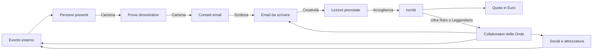

# Oggetto: Nuovi Iscritti

## Game Design Document

**Titolo di lavorazione:** Oggetto: Nuovi Iscritti\
**Sottotitolo:** Un incremental game dell'Ordine delle Onde\
**Versione documento:** 1.1\
**Stato:** concept avanzato, economia e progressione definite, pronto per la
prototipazione\
**Piattaforma:** browser desktop\
**Lingua:** italiano\
**Salvataggio:** locale nel browser

---

## 1. Sintesi

Oggetto: Nuovi Iscritti è un browser game clicker incrementale ambientato dentro
una simulazione quasi perfetta di Outlook per Windows 11.

Il giocatore collabora inizialmente con **LudoSport Genova – Ordine delle Onde**
e deve trovare nuovi potenziali interessati, ottenere i loro indirizzi email,
scrivere inviti e trasformare i contatti in iscritti. Ogni pressione della
tastiera inserisce i caratteri successivi di un'email prestabilita,
indipendentemente dal tasto premuto (esclusi F9, il tasto Windows e la
ripetizione automatica di un tasto tenuto premuto). Anche un click nel corpo
della mail conta come input. All'inizio ogni input produce un solo carattere; i
potenziamenti di Scrittura aumentano i caratteri per input e sbloccano il
Flusso e la Frase perfetta.

Le email completate vengono inviate automaticamente per impostazione predefinita
e invitano il destinatario a partecipare a una singola lezione di prova in
palestra. Il giocatore può disattivare l'invio automatico per rileggere la mail
completa e confermarla con un ulteriore input. Dopo un intervallo compresso, il
contatto può prenotare oppure sparire definitivamente. Chi partecipa alla
lezione ha una probabilità di iscriversi che dipende dalla sua rarità, ma non
la certezza.

I contatti non sono infiniti. Per continuare a inviare email bisogna organizzare
eventi reali in luoghi di Genova. Ogni evento attira un certo numero di persone;
una porzione prova la disciplina sul posto, una porzione lascia il proprio
indirizzo email, una porzione accetta l'invito alla prova in palestra e infine
una porzione si iscrive. Carisma, Scrittura, Social, organizzazione,
collaboratori e attrezzatura migliorano fasi diverse del funnel.

Gli iscritti generano periodicamente **Euro** tramite le quote associative. Gli
Euro sono l'unica valuta spendibile. Gli iscritti **Ultra Rari** diventano
Collaboratori delle Onde dopo il Corso Y, i **Leggendari** subito
all'iscrizione; i collaboratori possono essere assegnati liberamente a
Redazione (che diventa Social con 15 collaboratori), Eventi, Attrezzatura,
Istruttore e Gadget. Gli iscritti possono apprendere le Forme LudoSport
seguendo il percorso `1 → X → 2 → Y → 3/4/5 → 6 → 7` (il Corso X esiste solo
dopo l'acquisto del relativo Percorso Segreto) e i tre rami Spada Lunga, Staffa
e Doppia spada corta.

Raggiunti i requisiti di Fama, collaboratori, eventi completati e una vittoria
(Arena o Stile) di un proprio atleta alla Champion's Arena, al giocatore viene
proposto di trasferirsi e fondare una nuova scuola, scegliendone nome, città e colore.
Questa è la meccanica di prestigio: una parte dei progressi locali riparte,
mentre la Reputazione, la rete delle scuole fondate e le scoperte
forniscono bonus permanenti. Il gioco non ha un finale e può continuare
indefinitamente.

> **Da implementare:** la fondazione esiste solo come azione del motore (`FOUND_SCHOOL`): il messaggio di offerta rimanda alle Impostazioni, ma nessuna schermata permette di inserire i dati e confermare il trasferimento.

---

## 2. Visione del gioco

### 2.1 Fantasia principale

Il giocatore deve sentirsi contemporaneamente:

- una persona che sta rispondendo alle email in ufficio;
- un reclutatore instancabile dell'Ordine delle Onde;
- il coordinatore di una piccola organizzazione che cresce fino a diventare una
  rete di scuole;
- il protagonista di una commedia amministrativa sempre più assurda, raccontata
  esclusivamente attraverso email, calendari, contatti e documenti
  apparentemente professionali.

### 2.2 Pilastri di design

1. **Camuffamento credibile**\
   A colpo d'occhio il gioco deve sembrare Outlook per Windows 11. Le
   informazioni ludiche devono essere presentate come normali elementi di posta,
   calendario, contatti e attività. F9 alterna in ogni momento la veste Outlook
   chiara e il tema scuro «Modalità Onde».

2. **Input immediato e soddisfacente**\
   Qualunque tasto utile fa avanzare il testo. Non si può sbagliare a scrivere.
   Il giocatore deve poter martellare la tastiera come in Hacker Typer: conta
   ogni pressione distinta, mentre un tasto tenuto premuto non ripete l'input.

3. **Una catena produttiva leggibile**\
   Eventi generano pubblico; il pubblico genera prove dimostrative; le prove
   generano contatti; le email generano prenotazioni; le lezioni in palestra
   generano iscritti; le quote generano Euro; gli Ultra Rari e i Leggendari
   generano automazione.

4. **Umorismo crescente**\
   Il gioco parte con messaggi realistici e professionali. Con il progresso, le
   email, gli oggetti e le iniziative diventano più stravaganti, pur restando
   leggibili e funzionali.

5. **Crescita senza fine**\
   Il giocatore passa dalla singola email alla gestione automatizzata di più
   scuole, mantenendo sempre utile l'interazione manuale.

6. **Rispetto dell'identità LudoSport**\
   Il gioco può citare Forme, spade, Ordini, scuole, lezioni, eventi e
   terminologia LudoSport. I riferimenti a franchise cinematografici esterni
   restano indiretti e comici.

7. **Svelamento progressivo**\
   Il gioco comincia quasi vuoto. Nuove cartelle, funzioni e sistemi di Outlook
   compaiono soltanto quando il giocatore raggiunge traguardi comprensibili o
   completa speciali comunicazioni interne manuali. Nella scuola iniziale:
   Upgrade e Scuola dopo il primo iscritto, Contatti dalla prima Fama, Eventi
   dopo l'obiettivo «Tre inviti in partenza» (3 email inviate), Tornei da 6 di
   Fama; dalla seconda
   scuola in poi tutte le aree principali sono aperte fin dall'inizio.

### 2.3 Tono

Il tono combina:

- comunicazione sportiva autentica;
- vita amministrativa da scuola o associazione;
- satira leggera del lavoro d'ufficio;
- entusiasmo genuino per LudoSport;
- escalation surreale ma mai aggressiva o denigratoria.

Esempio di escalation:

1. «Vieni a provare una disciplina sportiva originale a Genova.»
2. «Scopri quanto può essere elegante un lunedì sera con una spada luminosa.»
3. «Il tuo divano sostiene che non sei pronto. Dimostragli che si sbaglia.»
4. «Partecipa alla prova prima che quel famoso grande topo venga a chiederci
   perché le nostre spade fanno luce.»

---

## 3. Pubblico e sessioni

### 3.1 Pubblico principale

- membri e amici della comunità LudoSport;
- appassionati di incremental e idle game;
- giocatori che apprezzano interfacce diegetiche;
- utenti desktop che vogliono sessioni brevi durante la giornata.

### 3.2 Durata delle sessioni

- **Micro-sessione:** 30–90 secondi per completare una mail o controllare
  prenotazioni e quote.
- **Sessione normale:** 5–15 minuti per scrivere, acquistare potenziamenti e
  organizzare attività.
- **Sessione di gestione:** 15–30 minuti per assegnare collaboratori,
  pianificare eventi e preparare un prestigio.
- **Ritorno idle:** riepilogo dei progressi maturati mentre il gioco era chiuso.

> **Da implementare:** oggi il gioco non matura progressi a gioco chiuso: alla riapertura tutti i timer (quote, email, prove, eventi, corsi, eventi narrativi) vengono traslati del tempo trascorso e la partita riprende esattamente da dove era stata lasciata, senza riepilogo.

---

## 4. Struttura dell'esperienza


```mermaid
flowchart LR
    A["Evento esterno"] --> B["Persone presenti"]
    B -->|Carisma| C["Prove dimostrative"]
    C -->|Carisma| D["Contatti email"]
    D -->|Scrittura| E["Email da scrivere"]
    E -->|Creatività| F["Lezioni prenotate"]
    F -->|Accoglienza| G["Iscritti"]
    G --> H["Quote in Euro"]
    G -->|Ultra Raro o Leggendario| I["Collaboratori delle Onde"]
    I --> A
    I --> E
    I --> J["Social e attrezzatura"]
    J --> A
```

### 4.1 Loop attivo

1. Il giocatore apre una bozza già indirizzata a un contatto disponibile.
2. Preme tasti o clicca nel corpo della mail.
3. Ogni input rivela i prossimi `writingPower` caratteri del testo prestabilito
   (moltiplicati dal Flusso e, con una certa probabilità, estesi da una Frase
   perfetta, quando sbloccati).
4. Quando il corpo è completo, la mail viene inviata automaticamente se il
   toggle «Invio automatico» (attivo per impostazione predefinita) è acceso;
   altrimenti resta pronta fino al successivo input o al pulsante Invia.
   L'invio mostra «Invio in corso…» per 0,35 secondi, ma non blocca: la mail
   va in Posta in uscita e la bozza successiva si apre nello stesso istante.
5. Il contatto viene consumato e viene programmato l'esito ritardato dell'invito
   alla prova in palestra (10 secondi). Se la prova viene prenotata, la lezione
   inizia dopo 30 secondi e dura 15 secondi di base.
6. Se esiste un altro contatto, si apre immediatamente una nuova mail.
7. Il giocatore può continuare a premere tasti senza interrompersi: il sistema
   passa da una mail alla successiva in modo trasparente.
8. Se i contatti sono terminati, Outlook mostra una comunicazione plausibile che
   invita a pianificare un evento o a partecipare a uno sparring esterno. Il
   riquadro di scrittura mostra «Nessuna bozza disponibile — Hai utilizzato
   tutti i contatti disponibili. Le prossime fonti arrivano dalle attività
   esterne.»; nel tutorial la prima fonte è l'evento gratuito «Volantinaggio».

### 4.2 Loop gestionale

1. Controllare prenotazioni, prove in palestra, iscritti, Euro e contatti
   rimasti.
2. Assegnare collaboratori alle attività.
3. Sbloccare o migliorare gli otto rami: Scrittura, Creatività, Carisma,
   Accoglienza, Attrezzatura, Gadget, Insegnamento e Organizzazione.
4. Pianificare eventi nel Calendario.
5. Mantenere le spade disponibili e in buono stato.
6. Preparare nuove campagne email.

### 4.3 Loop di lungo periodo

1. Far crescere l'Ordine delle Onde.
2. Costruire una squadra di collaboratori specializzati.
3. Automatizzare raccolta contatti, scrittura e manutenzione.
4. Raggiungere la soglia per ricevere l'offerta di fondare una nuova scuola:
   Fama pari a 150 × ciclo, 8 collaboratori (+2 per ogni scuola già fondata),
   25 × ciclo eventi completati, una vittoria di un proprio atleta alla
   Champion's Arena nella scuola corrente e nessun Leggendario Segreto in prova.
5. Scegliere città, nome e colore della scuola e spendere la Reputazione
   nei sei potenziamenti permanenti o nella rendita.
6. Trasferire l'esperienza permanente alla nuova sede.
7. Ripetere con costi, numeri e moltiplicatori crescenti.

---

## 5. Risorse

### 5.1 Iscritti

Gli **Iscritti** sono il punteggio principale, la dimensione della scuola e una
sorgente di entrate ricorrenti. Non sono spendibili.

- **Iscritti attivi:** membri attuali della scuola; aumentano con le
  iscrizioni e diminuiscono con gli abbandoni annuali o quando il giocatore
  annulla l'iscrizione di un allievo (non preferito).
- **Fama della scuola:** punteggio cumulativo ottenuto da iscrizioni (+1),
  Follower (+1 ciascuno) e ricompense esplicite (per esempio +500 per un
  Leggendario ottenuto nelle Chronicles). Attraversa i cicli di prestigio e non
  diminuisce quando un iscritto lascia o viene rimosso dalla scuola.
- **Ultra Rari:** contatti viola che diventano Collaboratori delle Onde dopo il
  Corso Y.

Ogni nuovo iscritto accredita immediatamente un bonus di iscrizione di **€20**.
In seguito, ogni iscritto attivo genera una quota base di **€40 per mese di
gioco**, che sale con il record di iscritti della scuola (§ 5). **Forme, corsi,
attestati da Istruttore e qualifiche da Tecnico non cambiano la quota** (tolti
il 05/10, decisione di Andrea: le entrate crescono solo con gli iscritti, così
la curva dei prezzi degli Upgrade, § 10, le raggiunge). Le Forme contano per
tornei, Istruttori e Fama.

Il Percorso Segreto «Corso X» si scopre vincendo il Torneo della Superba (vedi 10.9 e 20.7).

**Quota della scuola.** La quota base sale quando la scuola corrente raggiunge
per la prima volta un certo numero di iscritti attivi (`membershipFeeTiers` in
`GAME_CONFIG`, `getMemberFee` in `src/game/membershipEconomy.ts`):

| Record di iscritti attivi | Quota base |
| ------------------------- | ---------: |
| meno di 25                |       €40 |
| 25                        |       €50 |
| 50                        |       €60 |
| 100                       |       €80 |
| 250                       |      €120 |
| 500                       |      €160 |

Conta il record della scuola (`peakActiveMembers`): la quota non scende più,
anche se a giugno qualcuno lascia, e riparte da €40 in una nuova scuola. Ogni
nuova soglia è annunciata una volta con l'email «Quota mensile: X €», che
indica anche la soglia successiva. Si applica solo alla quota base: i bonus di
Forme, Istruttori e Tecnici non cambiano. Poiché la rendita della Rete si
calcola sulle quote (§ 17.6), anche la scuola lasciata ne beneficia.

La somma delle quote è poi moltiplicata dai
potenziamenti di entrate e da +5% per ogni scuola fondata; a questa si somma
la rendita fissa delle scuole della Rete dell'Ordine (§ 17.6). Un mese dura **60 secondi
reali** e segue il normale ciclo da Gennaio a Dicembre;
dopo Dicembre torna Gennaio. La partita inizia a Settembre. L'anno scolastico,
sempre visibile nella barra superiore, va da Settembre ad Agosto; la formazione
si ferma a Luglio e Agosto e gli eventuali abbandoni vengono verificati nel
passaggio tra Giugno e Luglio. La probabilità annuale di abbandono dipende
dalla Forma più alta raggiunta (80% senza Forme, poi 65%, 50%, 35%, 25%, 15%,
10%; con la Forma 7 scende a 2,5% per i Comuni, 0,5% per i Rari e 0,25% per gli
Ultra Rari, +0,5% per ogni scuola fondata); i Leggendari non abbandonano mai.
Ogni abbandono è registrato come «Mancato rinnovo». L'evento narrativo
«Passaparola inatteso» produce 2 nuovi contatti, non iscritti.

> **Da implementare:** nessun evento narrativo casuale riduce oggi gli iscritti (non esiste un «litigio»); la riduzione avviene solo con gli abbandoni annuali o con l'annullamento manuale.

### 5.2 Euro

Gli **Euro (€)** sono l'unica valuta spendibile; la partita parte da €0.
Provengono principalmente dalle quote periodiche degli iscritti e dal bonus di
iscrizione, poi da sponsorizzazioni dei Follower, entrate di rete, vendite di
Gadget, premi di tornei, obiettivi brevi ed eventi narrativi. Vengono
usati per:

- potenziamenti delle otto Aree di Attività;
- manutenzione e riparazione delle spade e acquisto di nuove spade dal
  fornitore ufficiale;
- organizzazione di eventi;
- corsi di Forma, qualifiche da Istruttore e Tecnico, Arena tecnica e Corso
  Agonisti;
- progetti e produzione di Gadget;
- palazzetto del torneo Reptile.

> **Da implementare:** le campagne social a pagamento e gli strumenti amministrativi acquistabili non esistono: il Social avanza solo tramite collaboratori e potenziamenti.

L'unica altra risorsa consumabile è la **Chiave delle Chronicles**, guadagnata
nei tornei e spesa per affrontare una sfida Chronicles con una squadra di 6
atleti.

Gli iscritti possono fungere da requisito di sblocco, ma non vengono mai
consumati per acquistare qualcosa.

### 5.3 Contatti

I Contatti sono indirizzi email inventati. La partita parte con 5 contatti
iniziali; gli altri si ottengono con gli eventi (compresi Sparring al parco e
Volantinaggio), con gli eventi narrativi e come premi dei tornei.

> **Da implementare:** il Social non genera contatti: produce solo Follower, anche se il messaggio di sblocco parla di «follower e contatti».

Nella scuola iniziale i primi nove contatti sono sempre Comuni. Il decimo
contatto è sempre Andrea Simonazzi, il primo Leggendario della partita, la cui
prova nella scuola iniziale si conclude sempre con l'iscrizione; dall'undicesimo contatto si
sbloccano le estrazioni Rare, Ultra Rare e Leggendarie. Nelle scuole
successive tutte le rarità sono disponibili fin dal primo contatto e Andrea
torna nel normale pool Leggendario; quando compare, la sua prova si conclude
sempre con l'iscrizione. Ogni Leggendario ordinario è un profilo
unico: se l'estrazione Leggendaria non trova profili liberi, il contatto
diventa Ultra Raro. Alla fondazione di una nuova scuola i Leggendari iscritti
tornano disponibili e ripartono da zero: solo Arena e Stile naturali.

Ogni contatto riceve una rarità al momento dell'acquisizione. La rarità
determina la probabilità di prenotare una prova dopo la mail e quella di
iscriversi dopo la prova:

| Rarità      | Comparsa | Prova dopo la mail | Iscrizione base | Effettiva base mail → iscritto | Massimo ordinario | Collaboratore            |
| ----------- | -------: | -----------------: | --------------: | -----------------------------: | ----------------: | ------------------------ |
| Comune      |      80% |                40% |           62,5% |                            25% |              100% | Mai                      |
| Raro        |    12,5% |                50% |             40% |                            20% |               90% | Mai                      |
| Ultra Raro  |     5,5% |                75% |          23,33% |                          17,5% |               50% | Dopo il Corso Y          |
| Leggendario |       2% |               100% |             15% |                            15% |               35% | Subito dopo l'iscrizione |

La comparsa degli **Ultra Rari** scende con la squadra: 5,5% fino a 8
collaboratori (il Consiglio), poi in linea retta fino all'1,1% con 100
collaboratori (Leggendari compresi), e resta lì (`getUltraRareAppearanceChance`
in `contacts.ts`; decisione di Andrea del 05/10). La partenza a 8 invece che a 0
tiene il primo Nazionale nei tempi: con il calo da 0 la simulazione intensa lo
spostava al luglio successivo (94 minuti invece di 82,5). Quello che perdono va a Comuni e Rari in proporzione; i
Leggendari restano al 2%. I contatti iniziali di una nuova scuola usano il 5,5%.

I potenziamenti di Creatività fanno avanzare linearmente la prenotazione della
prova dalla probabilità base fino a 85% per i Comuni, 90% per i Rari, 95% per
gli Ultra Rari e 100% per i Leggendari. I potenziamenti di Accoglienza fanno
avanzare ogni rarità dalla propria probabilità base d'iscrizione al proprio
massimo specifico; allo stesso avanzamento contribuiscono i collaboratori
Istruttori (10% della loro produttività ciascuno); la Reputazione
(ramo Iscrizioni) alza la probabilità base (§ 5.7).

Esistono inoltre protezioni contro le serie sfortunate: la prima email della
partita prenota sempre la prova; dopo 4 email consecutive senza prenotazione la
successiva prenota sicuramente; la prima prova con Fama 0 si conclude sempre con
un'iscrizione; dopo 4 prove consecutive senza iscrizione la successiva prova di
un contatto ordinario è garantita. Il potenziamento «Esperienza memorabile»
(Accoglienza) dà inoltre il 5% per livello (massimo 25%) di rimettere
disponibile, una sola volta, un contatto non iscritto dopo la prova (esclusi i
Leggendari Segreti), che riceverà così una seconda email.

Il **Pity** è un contatore globale interno e non viene mostrato
nell'interfaccia. Ogni prova in palestra che non produce un'iscrizione, comprese
quelle annullate per mancanza di spade, aggiunge 1 al contatore. Nelle prove dei
Leggendari ordinari e Segreti, ogni punto Pity aggiunge un punto percentuale
alla probabilità già calcolata, fino al 100%. L'iscrizione di un Leggendario
ordinario o Segreto riporta Pity a zero; l'iscrizione di qualunque altra rarità
lo lascia invariato. Il bonus personale dei Leggendari resta separato: ogni loro
precedente tentativo fallito aggiunge 3 punti percentuali entro il massimo
ordinario del 35%, poi si applica Pity oltre quel limite.

Ogni contatto contiene:

- nome e cognome generati;
- indirizzo email fittizio;
- fonte del contatto (iniziale, sparring, evento, collaboratore/evento
  narrativo, torneo);
- data di acquisizione;
- rarità, Forme registrate e statistiche atletiche di Arena e Stile;
- eventuali tag tecnici o narrativi;
- stato: disponibile, in scrittura, invitato, prova prenotata, iscritto, uscito
  (iscritto che ha lasciato la scuola) o perso.

> **Da implementare:** i contatti non hanno tag tecnici o narrativi.

Tutti i profili Leggendari, ordinari e Segreti, usano un indirizzo nel formato
`nome.cognome@ludosport.net`; gli altri contatti mantengono i provider fittizi
del catalogo. Le email partono sempre dal mittente `genova@ludosport.net`.

I contatti sono una risorsa limitante. Se finiscono, la produzione di email si
ferma.

### 5.4 Follower

I **Follower** misurano il pubblico raggiunto dall'automazione Social. Quando si
sblocca Social (15 collaboratori), partono dalla Fama già raggiunta, senza
generare nuova Fama, e diventano visibili nella barra superiore. Non sono
spendibili. Si ottengono dai cicli di contenuti dei collaboratori Social e dai
premi dei tornei. Ogni nuovo Follower aggiunge anche un punto Fama, aumenta
l'affluenza agli Eventi (+0,005% per Follower) e produce una rendita mensile da
sponsorizzazioni. I Follower non modificano direttamente le prove o le
iscrizioni.

### 5.5 Email

Stati possibili:

- in scrittura (la bozza nasce già in questo stato);
- pronta per l'invio (completata);
- in invio;
- inviata, in attesa dell'esito;
- prova prenotata;
- contatto perso.

Non esistono follow-up né conversazioni di risposta: ogni contatto riceve una
sola mail e viene poi convertito o eliminato. L'unica eccezione è il secondo
invito concesso da «Esperienza memorabile», che rimette il contatto tra i
disponibili per una nuova mail.

### 5.5 Collaboratori

I Collaboratori delle Onde sono iscritti che decidono di aiutare attivamente la
scuola. Sono una sottocategoria degli Iscritti e non una valuta separata.
Diventano collaboratori solo gli Ultra Rari che completano il Corso Y e i
Leggendari al momento dell'iscrizione (con produttività ×1,5). Le
assegnazioni possibili sono Redazione (Social dopo lo sblocco), Eventi,
Attrezzatura, Istruttore e Gadget.

### 5.6 Attrezzatura

Le spade della scuola sono gestite come inventario operativo. La scuola parte
con 6 spade; altre si comprano dal fornitore ufficiale (dopo il potenziamento
Fornitore ufficiale, § 10.5) a €330 l'una, prezzo che l'«Inflazione di Luce» può aumentare
dal 10% al 100% alla volta (§ 18). Ogni spada è:

- disponibile;
- riservata da corsi, lezioni di prova o eventi;
- rotta e temporaneamente inutilizzabile.

L'usura non appartiene a una singola spada: è un valore aggregato distribuito
sulle spade sane.

> **Da implementare:** non esiste uno stato «in manutenzione»: la manutenzione manuale è istantanea e quella automatica lavora sull'usura aggregata senza bloccare spade.

Le spade impongono una capienza operativa: quelle riservate non sono disponibili
fino alla conclusione dell'attività. Corsi e Corso Agonisti restano in attesa se
non possono riservare tutte le spade richieste, senza consumare denaro, tempo o
capienza dell'Istruttore. Una lezione di prova viene invece annullata allo
scadere dell'attesa, tranne quando l'iscrizione è garantita al 100%: in quel
caso si conclude senza usare né caricare una spada. Un evento senza spade
sufficienti non può essere avviato. Una prova annullata per mancanza di spade
fa perdere il contatto.

L'usura viene applicata alla conclusione riuscita dell'attività ed è
aggregata (2 punti per una lezione di prova, 40 per la prova di un Leggendario
Segreto, 20 per spada nel Corso Agonisti; i potenziamenti possono ridurlo fino
al 50%). Se un evento in corso viene annullato, il costo viene rimborsato, si
applica un quarto dell'usura prevista e non si ottengono contatti. Ogni 100
punti rompe una spada; più soglie superate rompono più spade, ma un'attività non
può rompere più spade di quante ne usava, e tutta l'usura eccedente viene
conservato. La manutenzione preventiva costa €2 per punto, mentre una spada già
rotta costa €250 e torna da 100 a 0. La manutenzione manuale ripara prima le
spade rotte e poi, se nessuna resta rotta, riduce l'usura.

I collaboratori assegnati all'Attrezzatura riducono prima l'usura delle spade
sane non riservate e poi riparano le spade rotte. Pagano il 75% dei costi
manuali, ottenendo uno sconto del 25%: €187,50 per spada e €1,50 per punto.
Producono un punto-lavoro ogni 1,5 secondi base; una spada completa richiede 150
punti-lavoro (riducibili fino a 75 con i potenziamenti), pur ripristinando 100
punti di condizione. Quando non c'è nulla da riparare, i potenziamenti
permettono di accumulare lavoro preparato fino al 10% della capacità totale.
Se mancano gli Euro per la prossima unità di lavoro, la riparazione automatica
resta in attesa di fondi.

La manutenzione può procedere mentre corsi, prove o eventi sono attivi, ma
interviene soltanto sulle spade non riservate. Le spade rotte sono sempre
riparabili perché non possono essere in uso. Se tutte le spade sane sono
impegnate, l'usura residua resta in attesa; le riparazioni parziali già
possibili non modificano il numero di spade prenotate. In questo caso il
collaboratore può riparare una spada rotta e torna subito all'usura residua non
appena la spada riparata diventa disponibile.

L'interfaccia rappresenta la capacità complessiva come una barra divisa in un
blocco da 100 punti per ogni spada della scuola. Il rosso indica una spada
rotta, il grigio a righe una spada riservata e temporaneamente non riparabile,
l'oro l'usura normale ancora rimovibile e il verde la condizione sana
residua. Il valore accessibile della barra conta 100 punti per ogni spada
rotta; i riepiloghi numerici visibili mostrano separatamente spade libere su
totali, spade rotte, spade in uso e punti di usura normale. Fino a 20 spade i
blocchi restano individuali; da 21 spade in poi la barra diventa continua e
aggrega proporzionalmente le quattro condizioni. Nella barra superiore, nel
pannello rapido Attrezzatura e nelle schede dei Collaboratori assegnati
all'Attrezzatura viene usata sempre la barra aggregata in formato compatto.

> **Da implementare:** tutte le barre oggi presenti nell'interfaccia usano il formato compatto, quindi la vista a blocchi individuali (fino a 20 spade) non compare in nessuna schermata.

Gli imprevisti narrativi dell'Attrezzatura sostituiscono quelli precedenti:

| Evento                             | Descrizione breve                                          |                       Effetto |
| ---------------------------------- | ---------------------------------------------------------- | ----------------------------: |
| Un piccolo disastro                | Non so cosa sia successo, non sono stato io!               |    +30 usura e 1 spada rotta |
| Spada caduta: Fanne 5              | Capita a tutti prima o poi...                              |                    +10 usura |
| Il portaspade di legno perfetto    | Direttamente dall'Ordine del Vento di Trieste, è stupendo! |                    -20 usura |
| Un nuovo Sabersmith all’orizzonte? | Sembra proprio che uno dei nostri sappia saldare...        | -30 usura e 1 spada riparata |
| Si può avere nera?                 | Certe domande dovrebbero non essere mai fatte...           |                    +30 usura |
| Un Pini al lavoro                  | Darth Modificus alla riscossa!                             |                    -30 usura |

Richiedono almeno 2 iscritti attivi («Un piccolo disastro»), 4 («Spada
caduta: Fanne 5», «Si può avere nera?») o 6 (gli altri tre).

### 5.7 Reputazione di rete

La **Reputazione di rete** è l'unico valore che passa da una scuola all'altra
(decisione del 02/10, piano 6.19). La Fama invece appartiene alla scuola: sblocca
i contenuti della scuola corrente e riparte da zero a ogni prestigio.

**Punti guadagnati** alla fondazione (`getPrestigeReputationPreview`,
`src/game/reputation.ts`):

```
punti = 2 per il titolo nazionale che sblocca il prestigio
      + arrotonda per difetto(√(Fama / 128))
      + 2 se la scuola lasciata ha vinto la Champion's Arena
      + 2 se ha vinto il Torneo Reptile o della Superba (stesso torneo)
      + 2 se ha vinto le Chronicles of Ludosport
```

La parte della Fama vale 1,25 × √(Fama / 200) (128 = 200 / 1,25²): l'n-esimo
punto arriva a 128 × n² (128, 512, 1.152 …). Per esempio, senza altri tornei,
Fama 127 dà 2 punti, Fama 10.000 ne dà 10 e Fama 30.000 ne dà 17
(`reputationNationalTitlePoints = 2`, `reputationTournamentPoints = 2`,
`reputationFameDivisor = 128`).

**Spesa.** I punti si spendono alla fondazione, nella finestra «Fonda una nuova
scuola» della pagina Rete (§ 17.3); la spesa è definitiva e i punti non spesi
restano per la fondazione successiva. Ogni punto vale **+20% del valore base**
(`reputationStep = 0,2`, decisione del 04/10); i potenziamenti della scuola si
applicano sopra.

| Potenziamento  | Valore base aumentato                                                                  |
| -------------- | -------------------------------------------------------------------------------------- |
| Email/Social   | caratteri per input, delle email e dei contenuti social (`getWritingPower`)             |
| Eventi         | contatti trovati a ogni evento (`getEventContactMultiplier`)                            |
| Iscrizioni     | probabilità base di iscrizione dopo la prova, fino al massimo della rarità              |
| Social e Gadget | entrate dei follower (`getMonthlySocialIncome`) e vendite dei gadget, anche incrociate (non quote, non rendita; dal 04/10 al posto di Quote mensili, salvataggio v94) |
| Formazione     | velocità di tutti i corsi: atleti, agonisti, Istruttori e Tecnici                       |
| Genetica       | valori di base di Arena e Stile dei nuovi atleti (non dei Leggendari) e miglioramenti della Preparazione atletica |
| Rendita        | si consuma: vedi sotto                                                                  |

I sei potenziamenti permanenti arrivano a 50 punti ciascuno (+1000%,
`reputationUpgradeMaxLevel`) e non si azzerano mai
(`network.reputationUpgrades`). Genetica vale per gli atleti che arrivano dopo
la spesa: i cinque contatti iniziali di una scuola nascono senza. La **rendita
della rete** si consuma: ogni punto blocca il 10% (`networkRentPointShare`) del
valore di rendita della scuola che si sta lasciando, `iscritti × 40 € × 10%`
(`networkRentValueShare`), come rendita mensile fissa di quella scuola. I punti non restano come livelli: alla fondazione successiva
la rendita riparte da 0% e si calcola sulla nuova scuola, sommandosi alle
precedenti. La rendita non ha tetto: è dove spendere la Reputazione quando i
potenziamenti sono al massimo. Esempio: 125 iscritti valgono 500 €; 5 punti
bloccano 250 € al mese.

Il numero di scuole fondate non dà più bonus (il vecchio +5% per scuola è stato
tolto): aumenta solo il costo di alcuni potenziamenti e dello 0,5% per scuola
la probabilità di abbandono degli allievi con Forma 7.

Salvataggi precedenti (v86): la Reputazione accumulata diventa punti da
spendere e le rendite automatiche delle scuole già fondate vanno a zero; la
Fama si azzera al prossimo prestigio. Salvataggi v90 → v91: i punti in Lezioni
di prova (ramo tolto) tornano da spendere, Capacità di miglioramento diventa
Genetica.

---

## 6. Scrittura delle email

### 6.1 Regole di input

- Il gioco ascolta gli eventi `keydown` quando la vista di composizione è attiva
  (Posta, cartella Posta in arrivo, nessun messaggio aperto), il nome del
  profilo è stato inserito, il tutorial non blocca l'input e il focus non si
  trova su un controllo che consuma la tastiera (pulsanti, campi, menu a
  tendina, link, testo modificabile).
- Ogni tasto, inclusi Ctrl, Alt e i tasti di navigazione, produce una sola
  unità di input; `event.repeat` viene ignorato. Fanno eccezione Shift, il
  tasto Windows/Meta e F9, che alterna la Modalità Onde e non scrive.
- Un click nel corpo produce lo stesso avanzamento; a mail completa anche il
  pulsante **Invia** della barra di composizione la spedisce.
- I click su cartelle, barra laterale (Eventi, Scuola, Tornei, Gadget,
  Upgrade, Impostazioni), menu e altre opzioni eseguono la loro funzione e non
  scrivono.
- Le combinazioni di sistema e del browser non devono essere bloccate, anche
  quando il relativo `keydown` fa avanzare il testo.
- Tenere premuto un tasto conta come una singola pressione.
- Incollare testo non completa la mail.
- Il testo rivelato è sempre quello del modello corrente; ciò che il giocatore
  preme non viene registrato.
- L'input manuale rimane utile nelle fasi avanzate perché la stessa potenza di
  scrittura moltiplica anche il lavoro dei collaboratori.
- Un input senza bozza aperta (per esempio con i contatti esauriti) va perso e
  non alimenta il Flusso.

### 6.2 Caratteri per input

Formula attuale:

```text
potenzaScrittura = (1 + bonusTastieraComoda + bonusFrasiRapide)
  × (1 + 0,20 × punti Reputazione Email/Social)

caratteriPerInput = potenzaScrittura
  × moltiplicatoreFlusso
  + eventuale Frase perfetta
```

Tastiera comoda aggiunge 0,2 caratteri per livello (massimo +1) e Frasi rapide
0,4 per livello (massimo +2). Il valore non viene arrotondato: i caratteri
frazionari si accumulano e la composizione mostra il conteggio arrotondato per
difetto e la potenza per input arrotondata.

> **Da implementare:** il `moltiplicatoreForme` della formula originaria (bonus di scrittura legato alle Forme) non esiste nel codice.

Valori effettivi della prima curva:

| Fase                                      | Caratteri per input |
| ----------------------------------------- | ------------------: |
| Inizio                                    |                   1 |
| Tastiera comoda livello 1                 |                 1,2 |
| Tastiera comoda al massimo                |                   2 |
| Tastiera comoda e Frasi rapide al massimo |                   4 |
| Come sopra, con Flusso al tetto ×5        |                  20 |

La Reputazione (ramo Email/Social, +20% a punto) moltiplica ulteriormente la
potenza, per il giocatore e per Redazione e Social.

#### Flusso e Frase perfetta

Entrambe le meccaniche sono bloccate all'inizio e riguardano solo l'input
manuale.

- **Flusso** (nodo **Ritmo di battitura** del ramo Scrittura, 4 livelli: €100,
  €250, €600, €1.500; richiede Tastiera comoda 2). Ogni input aggiunge 2 punti
  a un indicatore da 0 a 100; ogni 25 punti il moltiplicatore sale di un
  gradino e l'indicatore si ferma al valore che corrisponde al tetto attuale.
  Il primo livello fissa il tetto a ×2 e ogni livello successivo lo alza di 1,
  fino a ×5. Nei primi 1,5 secondi senza input l'indicatore scende
  di 5 punti al secondo, poi di 40 punti al secondo.
- **Frase perfetta** (nodo **Frasi fatte** del ramo Scrittura, 5 livelli: €400,
  €800, €1.600, €3.200, €6.400; richiede Ritmo di battitura 2). Con almeno un
  livello, ogni input ha una probabilità di completare subito la frase in
  corso (fino al prossimo `.`, `!`, `?`, a capo o, nel sorgente HTML, `>`), per
  un massimo di 60 caratteri. La probabilità è 0,25% per livello di Frasi
  fatte, più 0,15% per livello di Tastiera comoda, Frasi rapide e Campi
  intelligenti e 0,3% per livello di Revisione istantanea, con un massimo del
  5%. L'estrazione dipende dalla mail e dal numero di input, non dal seme
  casuale condiviso.

### 6.3 Rapporto tra scrittura manuale e automatica

La velocità non dipende da combo o precisione, ma esclusivamente dai
potenziamenti e dai moltiplicatori permanenti. I bonus generali alla scrittura
migliorano contemporaneamente:

- caratteri prodotti da ogni input manuale;
- caratteri prodotti dai Collaboratori delle Onde;
- efficacia di eventuali strumenti automatici futuri.

I collaboratori usano la potenza di scrittura (5 caratteri al secondo per punto
di produttività, moltiplicati per `potenzaScrittura` e per i bonus di
automazione), ma non beneficiano di Flusso e Frase perfetta, che restano legati
all'input manuale.

Questo collegamento impedisce che la potenza manuale diventi un ramo morto dopo
lo sblocco dell'automazione.

### 6.4 Completamento e invio

Il toggle **Invio automatico** è attivo di default e la sua scelta viene salvata
nella partita. Al completamento:

1. il cursore si ferma alla fine del testo;
2. con l'invio automatico attivo la mail parte subito; con l'opzione disattivata
   resta completamente visibile finché il giocatore non preme un tasto, fa
   clic o preme **Invia** (i collaboratori non la spediscono);
3. la mail va in Posta in uscita e si apre subito la mail successiva, se esiste
   un contatto disponibile: si continua a scrivere senza aspettare;
4. per 350 ms compare la notifica Outlook “Invio in corso…”, poi la mail passa
   in Posta inviata;
5. viene determinato e salvato l'esito ritardato
   `prenota la prova / contatto perso`;
6. più mail possono essere in uscita nello stesso momento;
7. non viene riprodotto alcun suono.

Al primo invio arriva anche il messaggio di sistema “Configurazione campagna
completata”.

Decidere l'esito al momento dell'invio impedisce di cambiare il risultato
ricaricando la pagina. L'esito della successiva lezione in palestra viene invece
determinato quando la lezione viene risolta: il numero casuale è fissato alla
prenotazione, ma la probabilità viene calcolata con lo stato della scuola al
termine della prova.

### 6.5 Lunghezza delle email

La progressione dei testi delle email segue otto livelli. Il catalogo contiene
100 idee (una per email, assegnate a rotazione); da una banca di frasi arrivano
le parti aggiuntive. Ogni punto Creatività acquistato nel potenziamento del
livello (0–5) aggiunge una frase o un punto elenco, quindi la lunghezza cresce
con i punti. Le lunghezze indicate vanno da 0 a 5 punti e variano un poco con i
nomi di destinatario e giocatore.

| Livello | Potenziamento         | Formato e lunghezza                                                                                                              |
| ------: | --------------------- | -------------------------------------------------------------------------------------------------------------------------------- |
|       0 | Nessun potenziamento  | “Bozza disastrata”: inizio della bozza (almeno 70 caratteri di frasi intere) con errori grossolani generati da dizionario, circa 80–175 caratteri |
|       1 | Controllo ortografico | Bozza completa corretta + una riga breve per punto, circa 145–300 caratteri                                                     |
|       2 | Email professionale   | Oggetto professionale, apertura, invito, una frase cortese per punto, “Un saluto,” e firma completa; plain text, circa 220–680 caratteri |
|       3 | Invito personalizzato | HTML: logo, titolo, gancio iniziale, 3 punti elenco + 1 per punto; testo circa 470–850, sorgente circa 1.600–2.050 caratteri   |
|       4 | Call to action        | + etichetta d'invito all'azione, immagine principale, blocco “come prenotare”; testo circa 580–960, sorgente circa 1.900–2.300 |
|       5 | Impaginazione         | + scheda CONTATTI, copy da campagna; testo circa 630–1.010, sorgente circa 2.100–2.550                                           |
|       6 | Pubblicità vincente   | + sezione video “DA VEDERE”, oggetto da campagna, P.S.; testo circa 750–1.140, sorgente circa 2.550–2.980                        |
|       7 | Corso di Marketing    | + didascalia del video e piè di pagina con avviso; testo circa 880–1.270, sorgente circa 2.900–3.320                             |

Al livello 0 gli errori coinvolgono circa il 28% delle parole (almeno 3 nel
corpo e 1 nell'oggetto); nomi del destinatario e del giocatore sono protetti.
Gli errori sono deterministici (stessa mail, stessi errori) e le loro posizioni
vengono salvate con la mail per mostrarne la sottolineatura.

Il corpo dei livelli 0 e 1 usa il formato `Ciao {nome},` seguito dal testo,
senza firma. Dal livello 2 compaiono “Un saluto,” e la firma
`{giocatore}, {Ordine} - {città}`. Il primo controllo ortografico rimuove gli
errori senza cambiare il messaggio; i livelli successivi aggiungono struttura,
contenuto e strumenti di conversione in modo progressivo.

Quando si acquista il primo potenziamento di un nuovo livello, le nuove email
scelgono il nuovo catalogo con probabilità pari a punti acquistati / 5 e
altrimenti usano il livello precedente; con 5 punti usano solo il nuovo.

Ai livelli 0, 1 e 2 ogni input rivela subito il testo della mail in plain text.
Dal livello 3, **Invito personalizzato**, gli input scrivono invece il sorgente
HTML: la composizione mostra l'anteprima reale della mail (“Anteprima mail”) e,
sotto, il codice in un riquadro secondario (“Codice HTML”). Da questo livello la
lunghezza da scrivere è quella del sorgente HTML, non del solo testo.

---

## 7. Conversione delle email

### 7.1 Flusso

Ogni email inviata crea un esito futuro con due possibili risultati:

- il contatto prenota una singola lezione di prova in palestra;
- il contatto non converte e sparisce definitivamente.

Non vengono mostrate risposte personali e non esistono follow-up. Se la prova
viene prenotata, il sistema crea una lezione di prova visibile in **La mia
giornata** e nello stato della mail in Posta inviata. Quando la lezione si
conclude, viene risolto un secondo esito:

- la persona si iscrive;
- la persona non si iscrive e sparisce definitivamente.

Eccezione: con **Esperienza memorabile** (5% per livello, massimo 25%) un
contatto non iscritto può tornare disponibile per un'ultima email e un'ultima
prova (una sola volta, mai per i Leggendari Segreti); lo segnala il messaggio
“Un secondo tentativo”.

> **Da implementare:** non esiste una vista Calendario nel gioco (il componente `CalendarView` c'è ma non è collegato all'interfaccia).

Gli Ultra Rari diventano Collaboratori delle Onde dopo il Corso Y; i Leggendari
lo diventano immediatamente dopo l'iscrizione.

### 7.2 Tempi compressi

Per il primo prototipo:

| Passaggio                        |                                                                  Tempo suggerito |
| -------------------------------- | -------------------------------------------------------------------------------: |
| Esito dell'email                 |                                                                       10 secondi |
| Attesa della lezione in palestra |                                                                       30 secondi |
| Durata della lezione di prova    | 15 secondi (−1 secondo per livello di Sala preparata, minimo 10); Leggendario Segreto 30 secondi |
| Esito della lezione              |                                                             immediato al termine |
| Bonus di iscrizione              |                                                                  immediato (€20) |
| Accredito della quota mensile    | al cambio mese (€40–160 secondo il record di iscritti) |

Il mese di gioco dura 60 secondi e il calendario scorre da Gennaio a Dicembre.
La formazione segue invece l'anno scolastico Settembre–Agosto: le lezioni sono
attive da Settembre a Giugno, Luglio e Agosto sono pausa estiva e gli abbandoni
vengono elaborati nel passaggio da Giugno a Luglio. L'anno scolastico indicato
accanto al mese corrente nella barra superiore riparte a Settembre. Gli altri
tempi devono essere configurabili dai dati e non scritti direttamente nella
logica.

### 7.3 Formule di conversione

```text
progressoCreatività = clamp(
  puntiCreatività / 35,
  0, 1
)
probabilitàPrenotazione = prenotazioneBase
  + (prenotazioneMassima − prenotazioneBase) × progressoCreatività

miglioramentoIscrizione = clamp(
  bonusAccoglienza
  + produttivitàIstruttori × 0,10 × (1 + efficaciaIstruttori),
  0, 1
)
probabilitàIscrizioneDopoProva = clamp(
  iscrizioneBase
  + (iscrizioneMassima − iscrizioneBase) × miglioramentoIscrizione
  + 3% × tentativiPrecedenti (solo Leggendari),
  iscrizioneBase,
  iscrizioneMassima
)

probabilitàIscrizioneLeggendario = min(
  probabilitàIscrizioneDopoProva + Pity / 100,
  1
)
```

| Rarità      | Prenotazione base → massima | Iscrizione base → massima |
| ----------- | --------------------------: | ------------------------: |
| Comune      |                   40% → 85% |              62,5% → 100% |
| Raro        |                   50% → 90% |                 40% → 90% |
| Ultra Raro  |                   75% → 95% |             23,33% → 50% |
| Leggendario |                 100% → 100% |                 15% → 35% |

Il Pity aumenta di 1 a ogni prova non conclusa con un'iscrizione (anche se
annullata per mancanza di spade) e si azzera quando si iscrive un Leggendario.

> **Da implementare:** i fattori moltiplicativi della formula originaria (moltiplicatore di scrittura e di reputazione, bonus prestigio, qualità della lezione, stato dell'attrezzatura) non entrano nelle probabilità di prenotazione e iscrizione.

I valori di prenotazione e iscrizione dipendono dalla rarità (tabella qui sopra,
definita in `rarities.ts`). La prima email e la quinta dopo quattro email perse
consecutive prenotano sempre la prova. Allo stesso modo la prima iscrizione
della scuola (Fama 0) e la quinta prova dopo quattro prove consecutive senza
iscrizione sono garantite; Andrea Simonazzi si iscrive sempre, in qualunque
scuola.

### 7.4 Comunicazione degli esiti

Gli esiti positivi vengono comunicati come messaggi automatici interni, non come
risposte dei destinatari:

- “Habemus inscriptum!”, solo per il primo iscritto;
- “Quota mensile: N €” a ogni nuovo scalino di quota;
- “Nome entra nel Consiglio” per il primo collaboratore e per ogni
  Leggendario.

**Riepilogo dell'anno scolastico** (piano 4.1, decisione del 03/10). Le notizie
di routine non arrivano più una per una: nuovi iscritti, Forme completate
(anche quelle insegnate in automatico), contatti acquisiti, nuovi collaboratori
ordinari, eventi narrativi e abbandoni (solo il numero, senza nomi) si sommano
in un unico messaggio per anno scolastico, «L'anno scolastico N in breve».
Compare in Evidenziata con la prima novità dell'anno, si aggiorna una volta al
mese senza tornare in cima e mostra i numeri in riquadri; a fine anno (o alla
fondazione di una nuova scuola) si chiude e passa in Altra. I numeri sono
l'aumento delle statistiche cumulative dall'apertura dell'anno; gli eventi
narrativi si contano a parte e restano visibili per 10 secondi in La mia
giornata (`src/game/yearDigest.ts`, `GameState.yearDigest`). Restano messaggi
singoli: tornei, quote, sblocchi, prestigio, Leggendari, Forme avviate a mano,
attestati di Istruttore e Tecnico e livelli di Maestria.

> **Da implementare:** non esiste un messaggio “Quota associativa accreditata”; al cambio mese le quote compaiono solo come numero fluttuante “Quote mensili”.

Flusso e Frase perfetta generano anche numeri fluttuanti di feedback. I nuovi
iscritti no: si vedono in La mia giornata (esito della lezione di prova,
riepilogo delle prove, «Iscritto al volo»), su richiesta di Andrea (Fase 8).

Le prenotazioni delle lezioni di prova non generano messaggi in Posta in arrivo:
sono visibili in La mia giornata e nello stato dell'email inviata.

Ogni notifica di prova in La mia giornata ha una tacca per lezione: in attesa si
riempie fino all'inizio della prova (l'attesa è fissa, 30 secondi), in palestra
porta una scia di luce, a prova conclusa diventa verde (iscritto) o rossa (senza
iscrizione) e sparisce con la notifica. Oltre 8 lezioni le tacche restano 8 in
proporzione per stato (almeno una in palestra, in attesa le più vicine
all'inizio) e i numeri veri sono nel testo. In Outlook la scia è più lenta e
tenue; con la riduzione del movimento si ferma (`capDayPips` e `getDayPipFill`
in `dayNotifications.ts`).

Nel prototipo l'attesa è fissata a 30 secondi. La prova ordinaria dura 15
secondi, riserva una spada e aggiunge 2 punti di usura alla conclusione. La
prova di un Leggendario Segreto dura 30 secondi e aggiunge 40 punti. Se al
termine dell'attesa manca una spada, la prova è annullata come una mancata
iscrizione; se l'iscrizione è garantita al 100%, la prova si svolge invece senza
spada e senza aggiungere usura.

Una volta raggiunto il massimo storico di 5 iscritti, **La mia giornata**
raggruppa in un unico riepilogo tutte le lezioni di prova ordinarie visibili,
anche quando ce n'è soltanto una. Prima di quella soglia il riepilogo compare
solo quando le prove ordinarie visibili sono più di 5. Le prove concluse o
annullate restano visibili per 10 secondi. Le prove dei Leggendari e dei Leggendari
Segreti sono sempre escluse dal riepilogo e restano visibili singolarmente.

Anche le altre notifiche con lo stesso titolo (iscritti al volo, eventi
importanti ricorrenti) si raggruppano quando sono **più di 4** insieme: una
scheda sola («8 iscritti al volo», oppure «Titolo · N volte») con gli ultimi tre
nomi e «altri N», visibile finché resta visibile l'ultima. I Leggendari restano
fuori e i tornei non si raggruppano. Sotto la soglia tornano le schede singole.

Nel mese di un torneo disputabile, **La mia giornata** mantiene visibile una
notifica con il conto alla rovescia fino alla fine del mese. Alla risoluzione
del torneo la stessa notifica mostra l'esito effettivo per 10 secondi.
Se nella finale di Arena combatte un nostro atleta, la notifica non dice chi
ha vinto (sarebbe uno spoiler): al posto dell'esito c'è il pulsante
**«Guarda la finale»** (§ 25.2).

Gli esiti negativi dei singoli contatti non producono messaggi: sono visibili
nelle statistiche aggregate del funnel, nello stato della mail inviata e, per
le prove, per 10 secondi in La mia giornata (“non iscritto” oppure “Annullata:
nessuna spada disponibile”).

---

## 8. Acquisizione dei contatti

### 8.1 Eventi

Gli eventi sono programmati attraverso il Calendario di Outlook e si svolgono in
tempo compresso. Esistono eventi fissi ed eventi che compaiono casualmente.
Nella prima versione gli esiti sono automatici: il sistema decisionale verrà
valutato successivamente.

> **Da implementare:** gli eventi si avviano dalla vista **Eventi** della barra laterale (che compare dopo il primo obiettivo breve), non da un Calendario; esistono solo i 23 eventi fissi della tabella, nessun evento di acquisizione casuale.

Ogni evento richiede:

- un numero di iscritti da impiegare;
- un numero di spade da impiegare;
- una durata base di 10 secondi, divisa per (1 + bonus di Maestria Eventi del
  collaboratore che lo avvia); il primo Volantinaggio del tutorial dura 5
  secondi;
- un costo in Euro;
- una Fama della scuola almeno pari alla soglia di sblocco;
- eventuali requisiti di Carisma, Social o Attrezzatura.

Ogni evento gira una copia alla volta; con **Eventi nel Multiverso** (§ 10.3)
sotto un evento in corso compare «Altra copia · prezzo»: la copia costa il
doppio della precedente e trova il 25% di contatti in meno per ogni copia già in
corso (−25% la seconda, −50% la terza), chiede gli stessi iscritti e le stesse
spade, e la pausa di ricarica parte quando finisce l'ultima copia.

> **Da implementare:** non esistono requisiti di Carisma, Social o Attrezzatura per avviare un evento, oltre a iscritti, spade disponibili, Euro, Fama e cooldown.

Non esiste un limite numerico separato agli eventi contemporanei. Il giocatore
può avviarne più di uno, purché diversi tra loro (lo stesso evento non può
essere in corso due volte e ogni collaboratore ne gestisce uno alla volta),
finché restano disponibili sia gli iscritti sia le spade richieste; entrambe le
risorse tornano disponibili al termine dell'attività. Al
completamento parte un conto alla rovescia specifico prima che lo stesso evento
possa essere selezionato di nuovo. I tempi brevi usano secondi reali; fiere e
manifestazioni usano mesi o anni del calendario di gioco. Durante questo
intervallo iscritti e spade restano disponibili. Se l'evento viene annullato, il
costo e le risorse sono ripristinati, non parte alcun conto alla rovescia e
viene applicato soltanto il 25% dell'usura prevista.

Quando l'evento viene avviato automaticamente da un collaboratore, la sua
Maestria Eventi riduce durata, prezzo e usura con la stessa percentuale
(decisione di Andrea del 06/10): Novizio 100%, Iniziato 90%, Accademico 75%,
Cavaliere 60%, Maestro 40% e Leggenda 25% (`eventMultiplier` in
`src/content/mastery.ts`). Gli eventi avviati dal giocatore pagano
sempre il prezzo pieno.

Le nuove spade possono essere acquistate dall'area Attività tramite **LamaDiLuce
(Abridge S.r.l.)**, partner tecnico e fornitore ufficiale LudoSport. Il
riferimento di gioco è la **Polaris EVO Basic combat-ready** a €330: costruzione
modulare, lama autorizzata per pratica ed eventi ufficiali e marcatura dell'anno
di produzione. L'acquisto è immediato per non introdurre microgestione
logistica; la presentazione conserva un tono goliardico senza alterare i
riferimenti reali del produttore.

Nel codice l'acquisto si trova nel dettaglio che si apre dalla spada nella
barra del titolo,
compare dopo il potenziamento **Fornitore ufficiale** (primo nodo di
Attrezzatura, 500 €) e permette di comprare 1, 10 o 100 spade. Prima, al suo
posto, c'è un pulsante spento «Acquisto spade · da sbloccare negli Upgrade».
I salvataggi che avevano già aperto l'acquisto con la vecchia regola (15
iscritti di picco o più di 6 spade) ricevono il nodo con la migrazione v99. Il
prezzo di €330 è moltiplicato dall'**Inflazione di Luce**: se nell'anno è
stata comprata almeno una spada, a Settembre il prezzo sale (“Lama di Luce
aumenta i costi delle spade…”) di 10%, più ricchezza e domanda, fino al 100%
(regola completa al § 18).

> **Da implementare:** l'interfaccia mostra solo “Polaris EVO Basic” e il prezzo; il nome LamaDiLuce (Abridge S.r.l.) e la descrizione del prodotto non compaiono nel pannello di acquisto.

La **Fama della scuola** è il punteggio cumulativo permanente ottenuto da
iscrizioni, Follower e ricompense esplicite. Sblocca progressivamente cinque
tier di potenzialità: **Molto bassa**, **Bassa**, **Media**, **Alta** e
**Altissima**. Non diminuisce quando alcuni iscritti lasciano la scuola.
All'inizio sono visibili soltanto Volantinaggio e Kata contro le onde del mare;
l'interfaccia anticipa esclusivamente il prossimo sblocco e non mostra
previsioni numeriche sui contatti. Ogni evento mostra durata, **esito**
(sicuro, variabile, imprevedibile: è il rischio Basso, Medio, Alto dei dati,
cioè quanto varia il numero di contatti), iscritti e spade richiesti e la
**resa** (la potenzialità) come indicatore a cinque tacche. In Modalità Onde
ogni evento è una scheda con il bordo sinistro del colore dell'esito. Le
descrizioni degli eventi sono state riscritte con Andrea nella Fase 8 (la
grafica della pagina, provata a righe, è tornata quella di prima su sua
richiesta); nei testi si dice «spada illuminata» o «spada luminosa», mai
«spada di luce».

> **Da implementare:** la vista Eventi mostra solo gli eventi già sbloccati dalla Fama e non anticipa il prossimo sblocco.

| Evento                        | Sblocco |      Costo | Media | Impiegati | Spade | Usura  | Cooldown   | Potenzialità |
| ----------------------------- | ------: | ---------: | ----: | --------: | ----: | -----: | ---------- | -----------: |
| Volantinaggio                 |       0 |         €0 |  0,33 |         0 |     0 |      0 | 5 secondi  |  molto bassa |
| Kata contro le onde del mare  |       0 |        €50 |  0,50 |         1 |     1 |     10 | 10 secondi |  molto bassa |
| Sparring al parco             |       5 |       €250 |  1,00 |         2 |     2 |     20 | 15 secondi |  molto bassa |
| Lezioni all'aperto            |       5 |       €500 |  1,50 |         2 |     4 |     30 | 30 secondi |        bassa |
| Oktoberfest                   |      15 |       €750 |  1,50 |         4 |     4 |     40 | 1 mese     |        bassa |
| Evento sportivo               |      10 |     €1.000 |  2,00 |         4 |     6 |     50 | 1 mese     |        bassa |
| Mele Comics                   |      20 |     €2.500 |  2,50 |         6 |     8 |     75 | 3 mesi     |        media |
| CairoMix                      |      35 |     €3.000 |  3,00 |         8 |    10 |    100 | 4 mesi     |        media |
| CogoComix                     |      60 |     €5.000 |  5,00 |        10 |    12 |    150 | 6 mesi     |         alta |
| Burtomics                     |      90 |     €7.500 |  7,50 |        15 |    20 |    200 | 12 mesi    |         alta |
| Genova Comics & Games         |     120 |    €10.000 | 10,00 |        20 |    20 |    250 | 18 mesi    |         alta |
| Megacon Genova                |     180 |    €13.000 | 13,00 |        25 |    30 |    500 | 24 mesi    |    altissima |
| Lucca Comics & Games          | 250 · 1 scuola |    €15.000 | 15,00 |        40 |    50 |    750 | 30 mesi    |    altissima |
| Milan Games Week & Cartoomics | 350 · 2 scuole |    €20.000 | 20,00 |        50 |   100 |  1.000 | 36 mesi    |    altissima |
| Romics                        | 450 · 3 scuole |    €25.000 | 24,00 |        60 |   120 |  1.200 | 36 mesi    |    altissima |
| Napoli Comicon                | 600 · 4 scuole |    €30.000 | 26,75 |        70 |   140 |  1.400 | 36 mesi    |    altissima |
| Evento Televisivo Rai         | 800 · 6 scuole |    €40.000 | 30,00 |        30 |    40 |    400 | 48 mesi    |    altissima |
| Japan Expo                    | 1.000 · 8 scuole |  €60.000 | 35,00 |        90 |   180 |  1.800 | 48 mesi    |    altissima |
| Gamescom                      | 1.300 · 10 scuole | €80.000 | 40,00 |       110 |   220 |  2.200 | 60 mesi    |    altissima |
| San Diego Comic-Con           | 1.700 · 13 scuole | €120.000 | 45,00 |      130 |   260 |  2.600 | 72 mesi    |    altissima |
| Viaggio nel passato           | 2.200 · 16 scuole | €250.000 | 60,00 |      100 |   300 |  3.000 | 96 mesi    |    altissima |
| Eldorado                      | 3.000 · 20 scuole | €500.000 | 75,00 |      200 |   500 |  5.000 | 120 mesi   |    altissima |
| Sfida a Cthulhu               |     500 | €1.000.000 | 50,00 |     1.000 | 1.000 | 10.000 | 120 mesi   |    altissima |

**Quattro livelli di eventi** (decisione del 06/10). Gli eventi **locali**
(dal Volantinaggio al Megacon Genova) si aprono con la Fama in ogni scuola.
Gli eventi **nazionali** (Lucca, Milan Games Week, Romics, Napoli Comicon,
Evento Televisivo Rai), **internazionali** (Japan Expo, Gamescom, San Diego
Comic-Con) e **assurdi** (Viaggio nel passato, Eldorado) chiedono in più un
numero di scuole già fondate (`requiredNetworkSchools`), come la Rete
dell'Ordine: ogni nuova scuola apre qualcosa di nuovo fino alla ventesima. La
regola è unica (`isAcquisitionEventUnlocked`) per avvio, automazione e pagina.
Il restyling della pagina Eventi, quando gli eventi visibili saranno molti, è
da progettare con un concept.

La **Sfida a Cthulhu** non si apre con la Fama: richiede un potenziamento
segreto (decisione del 06/10, `requiresSecretUpgrade` in `events.ts`). Il suo
obiettivo segreto non esiste ancora, quindi per ora l'evento non è mai
disponibile; di conseguenza anche ToccoDiGilo, che si scopre completando la
Sfida, resta per ora irraggiungibile.

Un cooldown basato sul calendario scade all'inizio del mese di destinazione,
anche quando il calendario viene avanzato dagli strumenti Admin.

### 8.2 Persone incontrate e contatti ottenuti

Un evento determina separatamente l'affluenza e il numero di contatti. Le
persone incontrate e le prove dimostrative conservano il funnel dell'evento; i
contatti sono invece estratti da una distribuzione pesata specifica, scelta
all'avvio e mostrata soltanto alla conclusione. L'usura delle spade non riduce
più il risultato.

```text
personeIncontrate = max(1, round(capienzaBase
  × variabilitàCasuale
  × (1 + bonusAffluenza)
  × efficaciaCollaboratori))

proveDimostrative = max(1, round(personeIncontrate
  × probabilitàProvaSulPosto
  × (1 + bonusCarisma)))

mediaContatti = mediaDistribuzioneEvento
  × 25/27
  × disponibilitàBacino
  × efficaciaCollaboratori
  × (1 + bonusAffluenza + bonusCarisma)
  × (1 + 0,20 × punti Reputazione Eventi)

efficaciaCollaboratori = max(1, sommaProduttivitàCollaboratoriEventi)^0,30103
disponibilitàBacino = 1000 / (1000 + max(0, iscrittiAttivi - 10))
```

Le prove dimostrative non sono mai meno dei contatti estratti e le persone
incontrate mai meno delle prove. `bonusAffluenza` somma i potenziamenti
Carisma di pubblico e, con i Social attivi, +5% ogni 1.000 Follower; `bonusCarisma` somma
i potenziamenti Carisma sui contatti. La variabilità casuale è estratta tra i
limiti propri di ogni evento (per esempio 0,35–2,5 per lo Sparring al parco).

Le distribuzioni base sono:

| Evento                        | Distribuzione base dei contatti        |
| ----------------------------- | -------------------------------------- |
| Volantinaggio                 | 67%: 0; 33%: 1                         |
| Kata contro le onde del mare  | 50%: 0; 50%: 1                         |
| Sparring al parco             | 20%: 0; 60%: 1; 20%: 2                 |
| Lezioni all'aperto            | 50%: 1; 50%: 2                         |
| Oktoberfest                   | 50%: 1; 50%: 2                         |
| Evento sportivo               | 25%: 1; 50%: 2; 25%: 3                 |
| Mele Comics                   | 25%: 1–2; 50%: 2–3; 25%: 3–4           |
| CairoMix                      | 10%: 1; 20%: 2; 40%: 3; 20%: 4; 10%: 5 |
| CogoComix                     | 25%: 3–4; 50%: 5; 25%: 6–7             |
| Burtomics                     | 25%: 5–6; 50%: 7–8; 25%: 9–10          |
| Genova Comics & Games         | 25%: 7–8; 50%: 9–11; 25%: 12–13        |
| Megacon Genova                | 25%: 9–11; 50%: 12–14; 25%: 15–17      |
| Lucca Comics & Games          | 25%: 10–12; 50%: 14–16; 25%: 18–20     |
| Milan Games Week & Cartoomics | 25%: 15–17; 50%: 18–22; 25%: 23–25     |
| Romics                        | 25%: 18–20; 50%: 22–26; 25%: 28–30     |
| Napoli Comicon                | 25%: 20–22; 50%: 25–29; 25%: 31–33     |
| Evento Televisivo Rai         | 25%: 24–26; 50%: 28–32; 25%: 34–36     |
| Japan Expo                    | 25%: 28–31; 50%: 33–37; 25%: 39–42     |
| Gamescom                      | 25%: 32–35; 50%: 38–42; 25%: 45–48     |
| San Diego Comic-Con           | 25%: 36–40; 50%: 43–47; 25%: 50–54     |
| Viaggio nel passato           | 25%: 50–55; 50%: 58–62; 25%: 65–70     |
| Eldorado                      | 25%: 60–66; 50%: 70–80; 25%: 84–90     |
| Sfida a Cthulhu               | 25%: 40–44; 50%: 48–52; 25%: 56–60     |

Gli intervalli sono uniformi: per esempio, una fascia 2–3 sceglie 2 o 3 con la
stessa probabilità. La ricompensa estratta viene normalizzata stocasticamente
con il fattore 25/27; prima della protezione iniziale contro gli esiti nulli,
questo porta il ciclo automatico di un collaboratore Novizio a 3 contatti medi
al minuto senza eliminare i risultati interi. I bonus positivi di affluenza,
Carisma e collaboratori generano poi un'aggiunta indipendente calcolata sul
valore medio normalizzato. Possono quindi trasformare uno zero in un contatto o
superare il massimo della distribuzione base, senza essere applicati due volte.
Finché la scuola ha meno di quattro collaboratori, ogni eventuale risultato
finale di zero viene sostituito da un contatto; il Volantinaggio del tutorial
garantisce sempre un contatto. L'interfaccia mostra solo
indicazioni generiche di esito e resa, mai queste percentuali.

Il bacino dei contatti usa esclusivamente gli iscritti attivi. I primi dieci non
applicano penalità; oltre quella soglia i contatti degli eventi **si dimezzano
ogni 1.000 iscritti** (× 0,5^((iscritti − 10) / 1.000), `eventContactHalvingMembers`;
decisione di Andrea del 05/10, prima era 1.000 / (1.000 + iscritti − 10)). Se
qualcuno lascia la scuola, la disponibilità risale perché quella persona, o una
persona equivalente nella rappresentazione delle rarità non nominali, può
tornare nel bacino futuro. La curva non raggiunge mai zero: 50% a 1.010 iscritti,
25% a 2.010, 12,5% a 3.010, circa 3% a 5.000. Il bonus Follower resta nel moltiplicatore e può compensare la
saturazione nel tempo. Questa regola è intenzionalmente interna e non viene
mostrata nell'interfaccia.

### 8.3 Lezioni in palestra, Social e volantinaggio

La **lezione di prova in palestra** non genera nuovi indirizzi: consuma una
prenotazione ottenuta tramite email e produce il possibile iscritto finale. Per
lo scopo del gioco, ogni persona partecipa a una sola lezione.

I **Social** sviluppano la presenza online della scuola. La Redazione si evolve
in Social con il **15° collaboratore** (decisione del 06/10, prima erano 35
iscritti attivi; `socialUnlockCollaborators`, controllo in `recruitCollaborator`): non nasce un nuovo ruolo e i
collaboratori già assegnati conservano incarico e Maestria. I contenuti Social
avanzano sempre. Quando una email richiede scrittura, la ripartizione interna è
95% alla mail e 5% ai contenuti; questo rapporto non viene mostrato al
giocatore. Senza email, tutta la potenza produce contenuti. **Fusione
documenti** copia inoltre nei contenuti il 5% per livello (massimo 25%) della
quota destinata alla mail, senza rallentarla. Un contenuto richiede 100.000
caratteri (fino a 50.000 con Sintesi dei contenuti) e ha il 50% di probabilità
base di ottenere un Follower (fino al 95% con Pubblicità vincente, che al 5°
livello aggiunge il 5% di Follower doppio). Ogni Follower aggiunge anche 1 punto
di Fama. Social non crea mai Contatti: ogni 1.000 Follower aumenta invece del
5% l'affluenza agli Eventi, senza alcun limite massimo. Social non genera prove
dirette, non migliora la qualità dei contatti e non accredita denaro per ciclo.
Le sponsorizzazioni vengono riscosse con le rette mensili, a partire da 0,10 €
per Follower (fino a 0,50 € con Corso di Marketing). Il completamento dei contenuti aggiorna Follower e statistiche ma
non genera email interne: la posta è riservata a informazioni operative o
narrative importanti. Le campagne manuali del vecchio sistema non esistono più.

Il **Volantinaggio** è sempre disponibile come attività gratuita di sicurezza
quando mancano contatti o denaro. Non richiede iscritti o spade, ma produce
soltanto pochi indirizzi.

### 8.4 Esaurimento dei contatti

Quando non esistono contatti disponibili:

- la bozza corrente non viene creata;
- compare una normale email interna con oggetto “Elenco contatti esaurito”;
- il testo suggerisce di aprire il Calendario;
- la produzione automatica di email si mette in pausa;
- la riga email del settore Social resta vuota e grigia, mentre i contenuti
  continuano ad avanzare;
- nessun progresso viene perso.

> **Da implementare:** non viene inviata alcuna email interna “Elenco contatti esaurito”. Al suo posto la composizione mostra “Nessuna bozza disponibile” con il testo “Hai utilizzato tutti i contatti disponibili. Le prossime fonti arrivano dalle attività esterne.”, senza rimandi a un Calendario.

La riga del settore di scrittura mostra “Scrittura email · Nessuna email da
scrivere” come inattiva; i caratteri già accumulati dai collaboratori restano
nel buffer. Appena un evento porta nuovi contatti, la bozza successiva si apre
automaticamente.

Questa situazione è intenzionale e rappresenta il principale collo di bottiglia
strategico.

---

## 9. Collaboratori delle Onde

### 9.1 Reclutamento

Comuni e Rari non diventano Collaboratori delle Onde. Gli Ultra Rari diventano
collaboratori dopo aver completato il **Corso Y**. I Leggendari diventano
collaboratori fin dall'iscrizione. Il passaggio è automatico e certo: all'arrivo
di ogni nuovo collaboratore la Posta riceve il messaggio **Nuovo collaboratore
disponibile**. Nella produttività di ogni ruolo un Leggendario vale ×1,5 (×2
fino al 06/10), un Ultra Raro ×1.

La probabilità può aumentare con:

- qualità dell'accoglienza;
- dimensione della scuola;
- reputazione;
- progetti interni;
- potenziamenti organizzativi.

> **Da implementare:** nel codice le probabilità di rarità dei contatti sono fisse (Leggendario 2%, Ultra Raro 5,5%, Raro 12,5%) e il reclutamento non ha probabilità; nessuno di questi fattori le modifica.

### 9.2 Dati e regole

Ogni collaboratore possiede:

- nome inventato;
- data di ingresso;
- Forme sbloccate;
- stato e assegnazione attuale.

Ogni collaboratore accumula inoltre una **Maestria** separata per ciascun ruolo
operativo: Redazione/Social, Eventi, Attrezzatura, Istruttore e Gadget. La
Preparazione atletica usa la Maestria Istruttore. I sei gradi condividono la
stessa curva di esperienza in tutti i ruoli:

| Grado      | Tempo dal grado precedente | Tempo cumulativo | XP cumulativi | Bonus |
| ---------- | -------------------------: | ---------------: | ------------: | ----: |
| Novizio    |                          — |                0 |             0 |    0% |
| Iniziato   |                   5 minuti |         5 minuti |           300 |   25% |
| Accademico |                   5 minuti |        10 minuti |           600 |   50% |
| Cavaliere  |                  20 minuti |        30 minuti |         1.800 |  100% |
| Maestro    |                  30 minuti |            1 ora |         3.600 |  200% |
| Leggenda   |                      1 ora |           2 ore |         7.200 |  500% |

Decisione di Andrea del 06/10: le Forme non danno più bonus ai collaboratori
(prima +15/30/50% Eventi con la Lunga, Preparazione atletica con la Staffa,
Redazione/Social con le Doppie, +10/20% su tutto con F6/F7); quel valore è
passato alla Maestria, così chi resta fisso in un settore diventa molto
valido. La scheda del collaboratore mostra in «Bonus attivo» la resa nel
settore attuale (rarità × Maestria, per esempio «Social ×3 · Maestro +200%»).

Il bonus moltiplica la produttività del collaboratore in Redazione/Social,
Attrezzatura, Gadget e Istruttore (velocità delle lezioni e Preparazione
atletica). Negli **Eventi** la Maestria non aumenta la forza del settore:
riduce invece durata, costo e usura degli eventi avviati automaticamente da
quel collaboratore: 90%, 75%, 60%, 40% e 25% (da Iniziato a Leggenda). Anche il bonus
degli Istruttori alla conversione prova → iscrizione ignora la Maestria.

Durante il gioco attivo, ogni collaboratore assegnato riceve **1 XP al secondo**
esclusivamente nella Maestria del proprio ruolo corrente, indipendentemente
dall'attività svolta; **Manuale operativo** aumenta questo ritmo del 10% per
livello, fino a +50%. Un collaboratore non assegnato non riceve XP; cambiando
ruolo, inizia ad avanzare nel nuovo percorso e conserva gli XP già guadagnati
negli altri. Il progresso non avanza mentre il gioco è chiuso. Il passaggio di
grado viene comunicato tramite un messaggio automatico nella Posta.

Regole:

- alcuni personaggi reali potranno essere aggiunti in seguito;
- nella prima versione non esistono livelli, ritratti o personalità individuali;
- non esiste un limite massimo di collaboratori;
- ogni collaboratore svolge un solo incarico alla volta;
- fino a otto collaboratori la riassegnazione individuale è libera e immediata;
- al raggiungimento del ottavo collaboratore si sblocca definitivamente la vista
  aggregata per settori, accompagnata da un tutorial che mette il gioco in
  pausa; la vista individuale non torna disponibile anche se l'organico scende;
- la vista aggregata mostra il rapporto **Non assegnati/Totali** (accanto al
  titolo, nella forma «X/Y liberi») e permette di
  aumentare o ridurre direttamente il numero desiderato di persone per ogni
  settore, senza legarsi alle identità dei singoli collaboratori; un posto in
  più può essere aggiunto soltanto se esiste almeno un collaboratore non
  assegnato;
- quando cambia l'organico desiderato, i collaboratori liberi vengono riallocati
  subito e quelli in eccesso restano non assegnati; per ogni settore esce per
  primo il collaboratore meno efficace e entra il più adatto tra i non
  assegnati;
- un collaboratore impegnato in un evento o in una formazione conserva
  temporaneamente il proprio incarico, conclude l'attività e viene riallocato
  prima che possa avviarne un'altra automaticamente; i lavori continui e
  condivisi sono invece riassegnabili subito;
- un Istruttore in eccesso conclude le lezioni già avviate ma non riceve nuovi
  allievi; le formazioni ancora in attesa di spade che lo coinvolgono vengono
  annullate;
- se un settore richiede più persone di quelle presenti (per esempio dopo
  un'uscita dall'organico), i posti mancanti restano memorizzati e vengono
  occupati automaticamente dai nuovi collaboratori liberi;
- **Assegnazione automatica** (piano 4.7, decisioni del 03/10 e del 04/10): un
  interruttore sopra la sezione, disponibile in entrambe le viste. Compare
  solo con il **Consiglio delle Onde** (8 collaboratori, decisione del 06/10);
  nei salvataggi in cui era già acceso prima resta visibile, così si può
  spegnere, ma non si riaccende finché non nasce il Consiglio. Ogni
  settore ha una **barra di impegno** di 5 tacche, indipendente dalle altre:
  alzarne una non muove le altre barre, cambia solo il numero di persone che
  ne deriva (la squadra divisa in proporzione alle tacche, resti più grandi).
  All'accensione le barre partono dalle proporzioni lasciate dal giocatore
  (tutte a 3 se nessuno è assegnato) e nessuno si sposta; liberi e nuovi
  arrivati vanno nel settore più lontano dalla sua quota.
  Cambiando una barra le persone **si spostano subito**, il minimo
  indispensabile: dai settori in eccesso esce chi lì rende relativamente
  meno, e chi si sposta va dove rende relativamente di più. «Relativamente»
  vuol dire la resa nel settore divisa per la sua media sui settori aperti,
  così la rarità non conta e decidono Forme e maestria; per gli Istruttori
  contano le Forme che possono insegnare, di più quelle che nessun altro
  copre. Uno spostamento in più è accettato quando una catena conviene
  chiaramente (chi ha Forme passa agli Istruttori dall'Attrezzatura e un
  altro prende il suo posto); a parità si sposta chi è libero. Chi organizza
  un evento in corso cambia settore subito e l'evento finisce comunque; un
  Istruttore che sta insegnando conclude le lezioni avviate senza nuovi
  allievi, poi passa al nuovo settore (le formazioni in attesa di spade che
  lo coinvolgono vengono annullate). Un Istruttore che non sa insegnare
  nessuna Forma avvia da solo la Forma 1 da istruttore, lo stesso corso del
  pulsante nel Centro didattico («Abilita» se la conosce già, «Impara e
  abilita» altrimenti, o prima da allievo se un collega la insegna); senza
  fondi riprova a ogni ciclo e parte appena ci sono
  (`src/game/automaticInstructorTraining.ts`). Mentre è accesa, assegnazioni
  individuali e organici per settore sono bloccati; spegnendola si torna al
  controllo manuale con l'organico attuale come obiettivo
  (`collaboratorManagement.automaticShares`, 20 per tacca;
  `automaticPendingMoves`; `src/game/collaboratorManagement.ts`,
  `src/game/automaticAssignmentPlan.ts`; salvataggio v89);
- **Turni e precedenza**: una sola fila di settori (ordine iniziale: Redazione,
  Eventi, Attrezzatura, Istruttore, Gadget; Gadget solo da sbloccato) decide
  due cose. Con **Turni dei collaboratori**, chi è fermo dà il 10% per livello
  della sua produttività (massimo 50%) al **primo settore della fila che sta
  lavorando**; gli Istruttori possono aiutare ma non ricevono aiuto. Un
  settore lavora se: Redazione ha il Social o un'email in scrittura, Eventi un
  evento in corso, Attrezzatura usura da riparare, Gadget un lavoro o un
  prodotto in vendita; un Istruttore è fermo se non insegna, non si forma e
  non c'è Preparazione atletica. La stessa fila decide chi consuma per primo
  Euro e spade a ogni ciclo (contano Attrezzatura, Eventi e Istruttori, gli
  unici che spendono da soli). **Priorità operative** rende la fila
  modificabile: clic su un settore per farlo passare avanti, o trascinarlo.
  Nella pagina Scuola è una striscia sotto «Assegnazione automatica» che
  compare con il primo dei due potenziamenti e mostra «+N» sul settore che
  riceve aiuto e «fermo» sui settori fermi (`src/game/collaboratorFallback.ts`,
  `src/features/people/ShiftControl.tsx`). Le scelte del vecchio settore
  secondario (`fallbackAssignments`, `secondaryAssignment`) sono ignorate;
- un collaboratore non leggendario può lasciare la scuola soltanto tramite
  eventi narrativi casuali;

> **Da implementare:** nessun evento narrativo rimuove iscritti o collaboratori; oggi un collaboratore può lasciare la scuola soltanto con l'annullamento manuale dell'iscrizione (vedi 9.7).

- i Leggendari non possono lasciare la scuola per inattività, mancato rinnovo o
  altri eventi generici.

Regole interne dei Leggendari, mai esplicitate nell'interfaccia:

- Andrea Simonazzi è garantito come 10° contatto nella scuola iniziale (i primi
  nove sono sempre Comuni) e la sua iscrizione dopo la prova è garantita; nelle
  scuole successive la sua comparsa torna casuale come per ogni altro
  Leggendario (può anche essere il Leggendario che segue il giocatore), ma
  quando compare la sua iscrizione dopo la prova resta garantita
  (`isTrialEnrollmentGuaranteed`); come tutti riparte da zero a ogni
  fondazione;
- la probabilità annuale di abbandono di tutti i Leggendari è sempre 0%,
  indipendentemente dalla formazione e dal numero di scuole fondate;
- l'unico modo previsto per perdere un Leggendario sarà un evento narrativo
  dedicato, non ancora implementato; finché l'evento non esiste, un Leggendario
  iscritto lascia la scuola soltanto se il giocatore ne annulla manualmente
  l'iscrizione (vedi 9.7);

> **Da implementare:** l'evento narrativo dedicato all'abbandono di un Leggendario non esiste nel codice.

- la probabilità di comparsa del pool Leggendario è 2% per ogni nuovo contatto
  idoneo: dall'undicesimo nella scuola iniziale (il decimo è Andrea) e fin dal
  primo nelle scuole successive;
- Pity modifica allo stesso modo le prove dei Leggendari ordinari e Segreti;
  raggiunto il 100%, la prova è garantita e può concludersi anche senza spade;
- ogni profilo Leggendario è unico: finché esiste già come contatto attivo,
  prova in palestra, iscritto o collaboratore non può essere generato una
  seconda volta;
- dopo una prova non convertita, il profilo resta occupato finché l'esito **Non
  iscritto** è visibile in **La mia giornata**; quando la notifica scade, torna
  disponibile per nuovi contatti, prove e strumenti Admin;
- se nessun profilo del pool è disponibile, qualsiasi nuova assegnazione
  Leggendaria genera invece un Ultra Raro dello stesso tipo di premio;
- con il prestigio tutti i profili Leggendari tornano disponibili nel pool della
  nuova scuola; ritrovati, tutti ripartono da zero (niente Forme, attestati,
  qualifiche, preferenze, Corsi Agonisti, Maestria né esperienza nei tornei):
  restano solo Arena e Stile naturali;
- dopo l'abbandono (oggi soltanto per annullamento manuale) tornano disponibili
  per incontri futuri;
- una nuova iscrizione successiva all'abbandono ripristina integralmente
  Forme, attestati da Istruttore e da Tecnico, Maestria, anzianità e storico
  formativo; l'incarico operativo torna invece non assegnato.

La pagina **Admin**, disponibile soltanto in sviluppo, può avviare direttamente
la prova in palestra di un profilo Leggendario ordinario (non Segreto) scelto
casualmente tra quelli ancora disponibili. Il comando non iscrive il personaggio: crea una prova della
durata ordinaria, che usa le stesse probabilità di conversione, le stesse regole
di unicità e lo stesso reclutamento automatico dei Leggendari del flusso
normale.

La stessa pagina può forzare il passaggio al mese successivo. Il comando porta
la scadenza mensile all'istante corrente ed esegue la normale pipeline di gioco:
entrate, tornei, rinnovi annuali, cambio del calendario e automazioni. Le
attività che hanno una propria scadenza futura non vengono completate in
anticipo.

### 9.3 Ruoli

| Ruolo                | Funzione                                                                                                           |
| -------------------- | ------------------------------------------------------------------------------------------------------------------ |
| Redazione → Social   | produce sempre contenuti Social; durante la scrittura assegna internamente il 95% alle email e il 5% ai contenuti  |
| Eventi               | aumenta persone incontrate e contatti ottenuti                                                                     |
| Preparatore Atletico | non è più un ruolo separato: è il compito di riserva degli Istruttori liberi (Preparazione atletica)               |
| Attrezzatura         | controlla e ripristina le spade                                                                                    |
| Istruttore           | insegna le Forme già attestate agli iscritti, una persona alla volta, e migliora la conversione prova → iscrizione |
| Gadget               | sviluppa e revisiona i prototipi e gestisce le vendite automatiche del catalogo                                    |
| Coordinamento        | funzione futura, non inclusa nell'MVP                                                                              |

La Preparazione atletica (Preparazione agonistica) si sblocca con il livello 5
di **Nessun *Rancor*e** ed è svolta dagli Istruttori che non stanno insegnando,
non sono in formazione e non stanno tenendo un Corso Istruttori interno come
Tecnici. Ogni Istruttore produce un miglioramento **ogni 2 minuti** di gioco per
ogni punto di produttività (rarità × Maestria Istruttore), moltiplicato per le
automazioni generiche, per l'efficacia di Nessun *Rancor*e e per la Genetica.
**A luglio e agosto non si ferma ma rallenta: un miglioramento ogni 5 minuti**
(decisioni di Andrea del 06/10; prima 1 al minuto e pausa estiva). Ogni
miglioramento assegna +1 Arena oppure +1 Stile (50% ciascuno) a un iscritto.

La Preparazione atletica opera solo durante il gioco online. La selezione è
casuale senza priorità legata alla debolezza dell'atleta e impedisce di
scegliere lo stesso iscritto nel potenziamento immediatamente successivo, salvo
il caso in cui sia l'unico iscritto disponibile. Nel 95% dei casi il tiro usa
tutti gli iscritti disponibili; nel restante 5% usa soltanto gli iscritti nei
preferiti ancora disponibili.

### 9.4 Scrittura automatica

```text
caratteriAutomaticiAlSecondo = 5
  × Σ produttivitàCollaboratori   // (1 + bonus Forma 6/7 + bonus Doppia spada corta) × rarità × Maestria
  × potenzaScrittura              // include già il bonus di rete (+5% per scuola fondata)
  × (1 + bonusAutomazioniGeneriche + bonusRedazione)
```

La velocità base è `GAME_CONFIG.collaboratorWritingPerSecond` = 5 caratteri al
secondo per punto di produttività. Il bonus di rete del prestigio non è un
fattore separato: è già contenuto nella potenza di scrittura. I bonus Redazione
vengono da **Firma automatica** e **Revisione istantanea**, quelli generici da
**Procedure standard** e **Coordinamento multi-sede**.

I caratteri automatici avanzano la stessa mail visibile al giocatore. L'input
manuale si somma senza conflitti. Con **Invio automatico** attivo, la Redazione
invia la mail appena raggiunge la lunghezza richiesta e **il lavoro avanza**: i
caratteri oltre la fine passano alla bozza successiva, così nello stesso passo
si possono finire più mail (al massimo `GAME_CONFIG.maxAutomatedEmailsPerStep`
= 50, oltre l'eccedenza si perde). La produzione cresce quindi con la squadra e
il limite vero diventano i contatti disponibili. Quando la Redazione supera le
30 mail al minuto (ultimo minuto di gioco, `selectRecentEmailsPerMinute`) la
bozza smette di animarsi e mostra «La Redazione sta scrivendo · N email/min». Se è disattivato, anche i
collaboratori si fermano sulla mail completa finché il giocatore non conferma
l'invio. Dopo lo sblocco Social, i collaboratori producono sempre contenuti
online; durante la scrittura di una mail le danno priorità, assegnandole
internamente il 95% della potenza e conservando il 5% per i contenuti. Le
percentuali non sono esposte nell'interfaccia. **Fusione documenti** copia
inoltre nei contenuti il 5% per livello (massimo 25%) del lavoro destinato alla
mail, senza sottrarlo alla mail. Quando nessuna mail è in scrittura, compresa
una mail completa in attesa di invio manuale, tutta la potenza va ai contenuti.

### 9.5 Raccolta automatica dei contatti

I collaboratori assegnati agli Eventi possono:

- aumentare il rendimento di un evento pianificato;
- organizzare piccole attività ricorrenti;
- produrre nuovi contatti tramite le attività automatiche previste.

La forza complessiva del settore applica rendimenti decrescenti. Si somma la
produttività base dei collaboratori assegnati e si eleva il risultato a
`log10(2)`, cioè circa `0,30103`. Un collaboratore ordinario vale ×1, dieci
valgono ×2 e cento valgono ×4. Ogni aggiunta resta positiva, ma il suo
incremento, a parità di produttività individuale, è inferiore al precedente. Una
squadra con forza inferiore a 1 usa comunque ×1, così gli eventi manuali non
vengono penalizzati. La produttività usata qui comprende Forme (Spada Lunga,
Forma 6/7) e rarità ma non la Maestria; il moltiplicatore aumenta sia le
persone incontrate sia la probabilità di ottenere il contatto, in tutti gli
eventi.

Ogni collaboratore Eventi libero avvia da solo un evento alla volta; il costo
dell'evento è ridotto dalla sua Maestria Eventi (−10%, −20%, −30%, −50%).

Per ogni collaboratore libero, l'automazione prova gli eventi dal prezzo base
più basso al più alto; a parità di prezzo sceglie quello con la media contatti
più alta. Il Volantinaggio partecipa alla graduatoria ed è quindi normalmente la
prima scelta. Eventi già in corso, in cooldown o non sostenibili per sblocchi,
Euro, iscritti o spade vengono saltati.

Con **Eventi nel Multiverso** (Carisma, § 10.3) lo stesso evento può girare in
più copie contemporanee. L'automazione prova prima gli eventi che non sono già
in corso, sempre dal più economico; solo se nessuno può partire apre una copia
di un evento in corso, dalla copia più economica (ogni copia costa il doppio
della precedente e trova meno contatti, il Volantinaggio resta gratis), finché
i fondi bastano.

La raccolta automatica deve essere più lenta degli eventi gestiti attivamente,
ma sufficiente a impedire un blocco totale nelle fasi avanzate.

### 9.6 Percorso delle Forme

Le Forme non simulano il combattimento: rappresentano formazione e
moltiplicatori del collaboratore. Il percorso è:

```text
Forma 1
  → Corso X [soltanto con il relativo Percorso Segreto]
  → Forma 2
  → Corso Y
  → Forme 3, 4 e 5 in uno o più rami:
      - Spada Lunga
      - Staffa
      - Doppia spada corta
  → Forma 6
  → Forma 7
```

Corso X è un anno formativo sperimentale della scuola di Genova, dedicato
all'approfondimento della Forma 1 e all'introduzione dei rudimenti della Forma 2
applicati al combattimento in arena. Offre agli allievi, spesso ancora
inesperti, il tempo necessario per consolidare e affinare la tecnica.

All'inizio della partita questo passaggio non fa parte del percorso: il gioco si
comporta come se tra Forma 1 e Forma 2 non esistesse alcun corso. Corso X, i
suoi badge, i controlli, i filtri e le qualifiche restano completamente nascosti
finché non viene scoperto e acquistato il Percorso Segreto **Corso X**.

Ogni Forma ha un nome lungo, usato nei testi descrittivi, e un nome corto per le
interfacce compatte:

| Percorso           | Nome lungo                     | Nome corto      |
| ------------------ | ------------------------------ | --------------- |
| Iniziale           | Forma 1                        | F1              |
| Iniziale           | Corso X                        | CX              |
| Iniziale           | Forma 2                        | F2              |
| Iniziale           | Corso Y                        | CY              |
| Spada Lunga        | Forma 3/4/5 Spada Lunga        | F3L / F4L / F5L |
| Doppie Spade Corte | Forma 3/4/5 Doppie Spade Corte | F3D / F4D / F5D |
| Staffa             | Forma 3/4/5 Staffa             | F3S / F4S / F5S |
| Finale             | Forma 6                        | F6              |
| Finale             | Forma 7                        | F7              |

Gli effetti ludici non devono riprodurre fedelmente le caratteristiche tecniche
reali delle Forme.

Regole:

- ogni iscritto può conoscere più Forme;
- prima del Percorso Segreto Corso X la progressione lineare è **Forma 1 → Forma 2**;
- dopo il suo acquisto Corso X diventa obbligatorio e la progressione è **Forma 1 →
  Corso X → Forma 2**;
- i dati di Corso X già presenti in un salvataggio restano conservati ma
  invisibili fino allo sblocco;
- dopo lo sblocco, iscritti e collaboratori che possiedono Forma 2 o una Forma
  successiva senza Corso X devono recuperarlo prima di iniziare qualsiasi altra
  Forma, Arena Tecnica, Corso Agonisti, Corso Istruttori o Corso Tecnico;
- il recupero rispetta costo, spade, slot annuali e condizioni didattiche
  ordinarie; se una formazione è già attiva, attende la sua conclusione;
- le statistiche ufficiali Arena e Stile si vedono con **Occhio del Maestro**
  (Insegnamento, § 10.7): mai senza il nodo, dopo il completamento di
  **Corso Y** al livello 1, dall'iscrizione al livello 2; dove sono nascoste
  compare «???» con un suggerimento su come vederle;
- ogni iscritto o collaboratore può iniziare al massimo una Forma per anno
  formativo; il livello 6 di **Didattica di gruppo** porta questo limite a due
  e il livello 1 di **PagoSport** lo porta a tre;
- gli slot annuali delle Forme si rinnovano a luglio e coprono il periodo
  luglio–giugno: una Forma iniziata a luglio consuma quindi uno slot valido
  anche nel settembre immediatamente successivo;
- Luglio e Agosto sono pausa estiva per tutte le Forme degli atleti, che pur
  avendo ricevuto i nuovi slot non possono usarli fino a settembre (le Forme
  già avviate proseguono; anche Arena Tecnica e Corso Agonisti non partono in
  questi mesi); i Corsi Istruttori, i percorsi combinati e i Corsi Tecnici
  possono invece iniziare o proseguire e in questi due mesi avanzano al **200%
  della velocità normale**;
- l'anno scolastico ordinario resta da Settembre ad Agosto;
- completare un solo ramo fino alla Forma 5 è sufficiente per accedere alla
  Forma 6;
- al completamento di Corso Y ogni allievo sviluppa automaticamente da una a
  tre preferenze fra Spada Lunga, Staffa e Doppia spada corta (una nel 65% dei
  casi, due nel 30%, tre nel 5%; i rami sono consecutivi nell'ordine circolare
  Spada Lunga → Staffa → Doppia spada corta, a partire da uno casuale);
- un iscritto può apprendere tanti rami quante sono le sue preferenze;
- gli altri rami preferiti restano percorsi facoltativi che l'automazione può
  completare dopo la Forma 7;
- la formazione richiede Euro e/o tempo, ma non livelli personali;
- ogni corso riserva le spade per tutta la sua durata e applica l'usura solo
  al completamento; se le spade libere non bastano, la formazione resta **In
  attesa di spade** e viene pagata soltanto quando parte davvero;
- i moduli da Istruttore e i Corsi Tecnici non usano spade;
- le descrizioni definitive dovranno usare terminologia LudoSport approvata.

| Corso o Forma                     |               Spade per atleta |  Usura per spada |
| --------------------------------- | -----------------------------: | ---------------: |
| Forma 1, Corso X, Forma 2         |                              1 |               10 |
| Corso Y                           |                              2 |               10 |
| Forme 3 e 4 Spada Lunga           |                              1 |               10 |
| Forme 3 e 4 Staffa o Doppie Spade |                              2 |               10 |
| Forma 5 Spada Lunga               |                              1 |               32 |
| Forma 5 Staffa o Doppie Spade     |                              2 |               32 |
| Forma 6                           |                              2 |               20 |
| Forma 7                           |                              3 |               20 |
| Arena Tecnica / Corso Agonisti    | da 1 a 3 secondo le Forme note |               20 |

Forma 5 ha intenzionalmente l'usura per spada più alta del gioco. Forma 6 e
Forma 7 possono produrre più usura totale perché impiegano rispettivamente due
e tre spade, ma non superano Forma 5 nell'aggressività della singola arma.

Costi base: Forma 1 €50, Corso X €100, Forma 2 €250, Corso Y €500, Forma 3
€1.000, Forma 4 €1.500, Forma 5 €2.000, Forma 6 €3.000, Forma 7 €5.000. Lo
scoglio economico principale inizia dopo Corso Y.

Durate base: Forma 1 20 s, Corso X 25 s, Forma 2 30 s, Corso Y 35 s, Forma 3
40 s, Forma 4 45 s, Forma 5 50 s, Forma 6 60 s, Forma 7 75 s. Quando un
Istruttore insegna, la durata viene divisa per la sua produttività da
Istruttore (rarità e Maestria).

Dal 06/10 le Forme non danno più bonus ai collaboratori (la Maestria dei
collaboratori ne ha preso il posto); danno Arena e Stile agli atleti (vedi
`docs/tournament-system-design.md` § 2.3). Tabella storica dei bonus tolti:

| Forma   | Spada Lunga | Staffa                     | Doppia spada corta    |
| ------- | ----------- | -------------------------- | --------------------- |
| Forma 3 | +15% Eventi | +15% Preparazione atletica | +10% Redazione/Social |
| Forma 4 | +30% Eventi | +30% Preparazione atletica | +20% Redazione/Social |
| Forma 5 | +50% Eventi | +50% Preparazione atletica | +35% Redazione/Social |

Forma 6 aggiunge +10% e Forma 7 +20% a ogni incarico (non cumulativi). I bonus
Staffa e i bonus di Forma 6/7 sulla Preparazione atletica valgono solo se il
collaboratore possiede anche l'attestato da Istruttore di quella Forma.

### 9.7 Istruttori e attestati

Un Collaboratore delle Onde può essere assegnato al ruolo di **Istruttore**.
L'incarico operativo e gli attestati sono distinti: ogni Forma o Corso che
assegna un badge richiede una propria formazione da Istruttore.

Regole:

- l'assegnazione al ruolo è gratuita e non converte automaticamente le Forme
  pregresse;
- nessun Collaboratore può figurare contemporaneamente come docente e allievo
  della stessa formazione; i percorsi erogati direttamente dal sistema non
  assegnano un `instructorId` umano;
- un Istruttore può insegnare soltanto le Forme già completate e qualificate;
  ogni Forma, inclusi Corso X e Corso Y, richiede la relativa qualifica;
- chi conosce già una Forma completa un Corso Istruttori pari al **75% della
  durata base della Forma** e paga il **250% del costo base**; il Corso
  Istruttori non consuma slot annuali;
- chi non conosce ancora la Forma segue un percorso combinato composto dalla
  Forma da atleta e dal modulo da Istruttore: dura complessivamente il **175%**
  della Forma (100% + 75%), paga subito il **350% del costo base** e consuma un
  solo slot annuale;
- in entrambi i casi la durata viene divisa per la produttività da Istruttore
  del collaboratore stesso;
- un Collaboratore assegnato come Istruttore resta eleggibile come allievo
  dell'automazione: durante l'anno didattico, se un altro Istruttore possiede la
  qualifica per la sua prossima Forma, completa prima la normale fase da atleta
  con il costo ridotto al **75%**; se un Tecnico possiede la qualifica per la
  stessa Forma, il successivo Corso Istruttori interno parte automaticamente al
  **187,5%** del costo base. Le due fasi consumano complessivamente un solo slot
  annuale; senza un Tecnico compatibile resta in attesa della qualifica;
- le due parti del percorso combinato restano fasi separate: la Forma viene
  acquisita prima dell'attestato e ciascuna fase ha la propria verifica finale;
- un Istruttore può iniziare o continuare una nuova formazione anche mentre
  insegna; in questo caso la durata è tripla rispetto alla velocità normale e
  torna normale quando non ha più allievi attivi;
- gli esami finali sono un sistema interno e non vengono comunicati
  nell'interfaccia: il rischio di non superarli è **55%** per Forme e Corsi da
  atleta, **50%** per i Corsi Istruttori (anche interni e modulo del percorso
  combinato) e **45%** per i Corsi Tecnici;
- i livelli 3 e 4 di **Master of none** aumentano di 10 punti percentuali
  ciascuno la possibilità di superare ogni esame da atleta, Istruttore o
  Tecnico, per un bonus massimo di 20 punti percentuali;
- ogni verifica non superata prolunga soltanto la fase interessata del **10%**
  della sua durata originaria; la verifica viene ripetuta al nuovo termine senza
  mostrare probabilità, fallimenti o messaggi al giocatore;
- le verifiche da atleta valgono per tutte le Forme e i Corsi che assegnano un
  badge, inclusi Corso X, Corso Y e le varianti di ramo. Arena Tecnica e Corso
  Agonisti sono esclusi;
- se nessun Collaboratore è assegnato al ruolo di Istruttore, il singolo allievo
  può iniziare manualmente la prossima Forma pagando il costo base;
- se almeno un Collaboratore è assegnato al ruolo di Istruttore, il comando
  manuale scompare e la pagina Scuola mostra al suo posto tutte le prossime
  Forme che l'atleta può apprendere; le lezioni vengono avviate soltanto
  dall'automazione e, con un Istruttore compatibile, ricevono una riduzione del
  **25%** e costano quindi il **75% del costo base**;
- il comando manuale resta invece nella scheda di dettaglio dei Collaboratori:
  un Istruttore può avviare da lì il proprio Corso Istruttori, il percorso
  combinato o la prenotazione del Corso Tecnico;
- la durata di una Forma insegnata viene divisa per la produttività da
  Istruttore del docente e, se acquistato, per la velocità di **ToccoDiGilo**;
  la durata di Arena Tecnica e Corso Agonisti viene divisa per la produttività
  da Istruttore del docente;
- **Percorso Tecnico** è il primo potenziamento del ramo Insegnamento, è disponibile
  appena si sbloccano gli upgrade e non richiede Fama della scuola. Descrizione:
  “Sblocca Arena Tecnica e ne riduce progressivamente la durata.”;
- al livello 1 Percorso Tecnico costa **€1.000** e sblocca Arena Tecnica come formazione
  automatica soggetta al toggle globale dell'insegnamento. La formazione
  costa **€500 per atleta**, dura 120 secondi, non migliora le statistiche ma
  protegge subito l'allievo dal controllo annuale degli abbandoni;
- il livello 2 costa **€2.000** e porta la durata base di Arena Tecnica a **100
  secondi**;
- il livello 3 costa **€5.000** e porta la durata base di Arena Tecnica a **80
  secondi**;
- il livello 4 costa **€7.500** e porta la durata base di Arena Tecnica a **60
  secondi**;
- il livello 5 costa **€10.000** e porta la durata base di Arena Tecnica a **40
  secondi**. Il costo della formazione resta **€500 per atleta** a tutti i
  livelli;
- l'automazione propone Arena Tecnica o il Corso Agonisti a un atleta o a un
  collaboratore inserito nella coda automatica quando ha ancora uno slot
  formativo libero e ha completato il proprio percorso oppure nessun Istruttore
  automatico possiede le qualifiche per le sue prossime Forme; un Collaboratore
  assegnato come Istruttore lo riceve soltanto se non ha più alcuna Forma
  personale disponibile. Nessuno dei due corsi parte a luglio o agosto;
- l'Istruttore che segue Arena Tecnica o il Corso Agonisti deve essere una
  persona diversa dall'allievo: un Collaboratore assegnato come Istruttore può
  partecipare soltanto se un altro Istruttore disponibile lo segue;
- iniziare Arena Tecnica o il Corso Agonisti consuma **tutti gli slot formativi
  annuali ancora disponibili** e protegge subito l'atleta dal controllo degli
  abbandoni. Lo stesso atleta non può iniziarlo più di una volta nello stesso
  periodo luglio–giugno, anche quando i potenziamenti gli concedono altri slot;
- Arena Tecnica non modifica Arena, Stile o il totale storico dei Corsi
  Agonisti. **Nessun *Rancor*e** al livello 1 la sostituisce con il **Corso
  Agonisti**, che costa **€1.000 per atleta**, dura **60 secondi**, riceve una
  stella gialla nel logo e aumenta permanentemente Arena e Stile. Il corso
  assegna almeno **+1 Arena** e **+1 Stile**. I livelli 2, 3 e 4 di Nessun
  *Rancor*e aumentano il massimo rispettivamente a +2/+2, +3/+3 e +4/+4; il
  livello 10 lo porta a **+5/+5**. Il risultato casuale di
  ciascuna caratteristica viene moltiplicato per
  il numero di slot residui consumati dal corso. I bonus effettivi e il numero
  di completamenti si accumulano senza limite negli anni successivi e sono
  registrati nella riga dell'atleta, senza creare notifiche o messaggi
  nell'inbox;
- i costi di Arena Tecnica e Corso Agonisti sono importi diretti per atleta e
  non ricevono la riduzione applicata alle Forme insegnate;
- l'automazione ordina gli allievi privilegiando, nell'ordine: gli atleti
  preferiti, il rischio effettivo di abbandono annuale più alto, la rarità
  (**Leggendario Segreto → Leggendario → Ultra Raro → Raro → Comune**), la
  prossima formazione meno avanzata, i collaboratori e infine gli iscritti con
  `acquiredAt` meno recente. A parità completa conserva l'ordine originale;
- quando il Percorso Segreto Corso X è stato scoperto e acquistato, Corso X
  precede ogni formazione successiva a
  Forma 1: chi ha completato Forma 1 ma non Corso X può ricevere soltanto Corso
  X finché non lo completa;
- l'ordine operativo degli Istruttori è: riprendere le formazioni in attesa,
  tenere un Corso Istruttori interno se qualificati come Tecnici, avviare un
  Corso Tecnico SIS già prenotato e idoneo, assegnare tutte le Forme automatiche,
  usare la capienza residua per Arena Tecnica o Corso Agonisti e infine
  contribuire alla Preparazione agonistica. Le attività formative personali
  restano compatibili con l'insegnamento secondo le regole di rallentamento;
- il toggle **Insegnamento automatico** è attivo di default e viene salvato.
  Disattivarlo impedisce nuovi avvii automatici di Forme, Arena Tecnica, Corso
  Agonisti, Corsi Istruttori interni e Corsi Tecnici SIS; le formazioni già in
  corso terminano normalmente e le prenotazioni SIS restano in coda. La
  Preparazione atletica continua a essere un'attività separata;
- tra gli Istruttori disponibili e compatibili, l'automazione privilegia chi ha
  meno Forme insegnabili, così da conservare la disponibilità degli Istruttori
  più avanzati per gli allievi che ne hanno bisogno; a parità distribuisce prima
  il carico corrente, poi sceglie l'Istruttore più produttivo e infine quello
  entrato prima nella scuola;
- la Preparazione agonistica è attiva da settembre a giugno ed è sospesa sia a
  luglio sia ad agosto; durante la sospensione la schermata aggregata dei
  Collaboratori mostra **Pausa estiva**;
- nell'elenco individuale dei Collaboratori, un Istruttore che sta contribuendo
  alla Preparazione agonistica mostra la relativa barra attiva ed è considerato
  **In corso**, non **In attesa di un allievo**;
- annullare manualmente un'iscrizione è disponibile fin dall'inizio. La X nella
  riga di ogni persona nella schermata Scuola richiede una conferma esplicita
  e annulla definitivamente l'iscrizione senza rimborso e senza ridurre la Fama
  della scuola. La formazione personale e le lezioni tenute dal collaboratore
  rimosso vengono interrotte;
- gli atleti segnati come preferiti non possono essere rimossi: la X resta
  disattivata finché non vengono tolti dai preferiti;
- gli iscritti non leggendari rimossi non possono tornare. La loro scheda viene
  eliminata appena nessuna email, prova o attività ancora conservata la
  referenzia; statistiche aggregate, email ed eventi narrativi già avvenuti
  restano nello storico. I Leggendari conservano Forme,
  attestati, Maestria, Arena, Stile, esperienza nei tornei, Corsi Agonisti e
  anzianità; perdono soltanto incarico e automazione. I Leggendari ordinari
  tornano nel normale bacino di acquisizione, mentre i Leggendari Segreti devono
  essere nuovamente sconfitti nel rispettivo torneo;
- acquistare il livello 1 di Percorso Tecnico sblocca **Master of none**. I suoi
  primi due livelli portano da uno a due e poi a tre i rami d'arma che un
  Collaboratore assegnato come Istruttore può apprendere, anche oltre le
  preferenze iniziali (il primo ramo deve comunque essere fra le preferenze).
  I livelli 3 e 4 aumentano rispettivamente
  di 10 e 20 punti percentuali la possibilità di superare gli esami da atleta,
  Istruttore e Tecnico. Il quinto livello permette a ogni allievo che ha
  completato Corso Y di scegliere liberamente fra tutti i rami d'arma, ignorando
  le preferenze personali;
- **Tu conosci la SIS?** segue il quinto livello di Master of none: il livello 1
  sblocca le candidature ai Corsi Tecnici; i livelli 2, 3 e 4 aumentano la loro
  velocità rispettivamente del 10%, 20% e 30%;
- **Il costo del Servizio** richiede il livello 1 di **Tu conosci la SIS?**, ha
  cinque livelli e riduce del 5% per livello,
  fino al 25%, soltanto i costi dei percorsi che assegnano un attestato da
  Istruttore o una qualifica da Tecnico. Forme da atleta, Arena Tecnica e Corso
  Agonisti non ricevono lo sconto;
- **Didattica di gruppo** richiede il livello 2 del Costo del Servizio e porta
  con i primi cinque livelli la capacità di ogni Istruttore da un allievo
  (base) a due, tre, quattro, cinque e infine sei allievi contemporanei; il
  sesto livello concede a tutti un secondo slot di formazione nel periodo
  luglio–giugno;
- **Nessun *Rancor*e** è successivo a Didattica di gruppo e richiede anche
  Percorso Tecnico al livello 3. Il livello 1 sblocca il Corso Agonisti, che
  sostituisce Arena Tecnica; i livelli 2, 3 e 4 aumentano di +1/+1 il suo
  massimo casuale, fino a +4/+4. Il livello 5 sblocca Preparazione agonistica;
  i livelli dal 6 al 9 ne aumentano l'efficacia del 10% ciascuno. Il livello 10
  aggiunge un ulteriore 10% di efficacia e porta il massimo del Corso Agonisti
  a +5/+5. L'efficacia aggiuntiva massima della preparazione è quindi del 50%;
- **PagoSport** compare dopo **Nessun *Rancor*e** e richiede il completamento
  dei suoi dieci livelli: il livello 1 concede uno slot di
  formazione annuale aggiuntivo; il livello 2 aumenta del **50%** la velocità
  dei Corsi Tecnici; il livello 3 aumenta inoltre del **50%** la velocità di
  tutte le formazioni, comprese Forme, Corsi Istruttori, Corsi Tecnici, Arena
  Tecnica e Corso Agonisti. I bonus sono cumulativi e si sommano al raddoppio
  estivo;
- **Corso X** e **ToccoDiGilo** non appartengono alla sequenza lineare: sono due
  Percorsi Segreti indipendenti, inizialmente mostrati come `???` con un
  indizio, e vengono rivelati soltanto dalle rispettive condizioni (10.9):
  Corso X vincendo il Torneo della Superba, ToccoDiGilo dopo la Sfida di Cthulhu.
  Corso X costa €1; ToccoDiGilo costa €1.000.000 e aumenta del 9.999% la
  velocità delle Forme insegnate dagli Istruttori;

- i completamenti automatici confluiscono in una notifica riepilogativa
  impilata.

### 9.7.1 Tecnici e formazione interna

Il **Tecnico** è una qualifica per singola Forma o Corso, non un nuovo incarico
operativo. Il percorso è disponibile per ogni formazione che assegna un badge,
inclusi Corso X e Corso Y, ma esclude il Corso Agonisti. I percorsi da
Istruttore e Tecnico di Corso X sono disponibili soltanto dopo l'acquisto del
Percorso Segreto Corso X; il Corso Tecnico continua a richiedere anche il primo
livello di **Tu conosci la SIS?**.

Regole:

- la scuola deve avere acquistato il livello 1 di **Tu conosci la SIS?** prima di poter
  prenotare o avviare un Corso Tecnico esterno;
- può candidarsi soltanto un Collaboratore assegnato come Istruttore che abbia
  già completato la formazione come atleta e possieda il relativo attestato da
  Istruttore;
- lo stesso Collaboratore può ottenere più qualifiche da Tecnico;
- il Corso Tecnico è esterno, si svolge alla **SIS — Scuola Internazionale
  Superiore** ed è tenuto dai Maestri Fondatori di LudoSport;
- il corso costa il **1000% del costo base** e ha una durata base pari al **1000%
  della durata della Forma**;
- la prenotazione è disponibile tutto l'anno e viene pagata subito. In luglio o
  agosto il corso parte immediatamente se il Collaboratore è libero; negli altri
  mesi viene programmato per il luglio successivo. Se a luglio il Collaboratore
  è impegnato, parte appena si libera, anche dopo l'estate; ogni Collaboratore
  può avere una sola prenotazione alla volta;
- un corso già iniziato continua senza limiti di calendario;
- un Tecnico forma automaticamente un solo aspirante Istruttore alla volta per
  una Forma compatibile. L'aspirante deve essere assegnato come Istruttore,
  conoscere già la Forma come atleta e non possedere l'attestato;
- il Corso Istruttori interno costa il **75% del normale Corso Istruttori**,
  cioè il **187,5% del costo base**, e mantiene durata ed esame del modulo da
  Istruttore;
- **Il costo del Servizio** riduce fino al 25% sia questi Corsi Istruttori sia
  i Corsi Tecnici SIS; non si applica ai percorsi da atleta;
- i livelli 2–4 di **Tu conosci la SIS?** aumentano la velocità dei soli Corsi
  Tecnici rispettivamente del 10%, 20% e 30%;
- la scelta automatica privilegia, nell'ordine, la Forma più bassa nella
  progressione, l'attestato più utile agli allievi in attesa e il Collaboratore
  entrato prima nella scuola;
- Istruttori e Tecnici possono continuare a insegnare agli allievi mentre sono
  coinvolti in queste formazioni. Se il partecipante o, nel corso interno, il
  Tecnico sta anche insegnando, la durata residua diventa tripla; la penalità
  non si cumula se entrambi insegnano;
- finché tiene un Corso Istruttori interno, il Tecnico conclude le lezioni già
  avviate ma non riceve nuovi allievi, non avvia un proprio Corso Tecnico e non
  contribuisce alla Preparazione atletica;
- la durata del Corso Tecnico e del Corso Istruttori interno viene divisa per la
  produttività da Istruttore del partecipante;
- sulla singola Forma la corona dorata identifica l'attestato da Istruttore; la
  qualifica da Tecnico la sostituisce con una corona glicine. In Modalità Onde
  (06/10, concept B2) la mappa delle Forme non ha corone: la Forma che la
  persona sa insegnare ha una tacca sotto, oro per l'attestato da Istruttore e
  lilla per la qualifica da Tecnico. La mappa con le tacche vale per iscritti,
  lista dei Collaboratori (sotto nome ed email, concept A1) e righe dei settori
  del Consiglio delle Onde (`StaffForms` in `FormPathMap.tsx`); Outlook tiene i
  loghi. In Onde anche la **Copertura didattica** è la mappa (concept C5,
  06/10): a sinistra di ogni logo una colonna con il numero di Istruttori (oro)
  e, sotto, di Tecnici (lilla); chi sta studiando (Corso Istruttori in corso,
  Corso Tecnici in corso o prenotato alla SIS) si aggiunge come «+1» in chiaro.
  Una Forma con solo chi studia resta in ombra con il bordo tratteggiato e conta
  nel «+N in arrivo» sotto il totale (`FormCoverageMap`,
  `getFormCoverageCounts`). Attorno a ogni logo, i **quadranti** dei corsi che
  si stanno tenendo su quella Forma (concept K2, Tavola 11 del 06/10): archi di
  270° aperti in basso, dall'interno azzurro (Allievi), verde (Corso
  Istruttori), viola (Corso Tecnici); un arco si riempie con l'avanzamento
  medio dei corsi in atto, è tratteggiato se nessuno è partito (in attesa di
  spade, o Corso Tecnici prenotato alla SIS) e gli archi presenti si stringono
  verso il logo. Nel varco in basso il numero di allievi (`formActivity.ts`,
  `CourseRings.tsx`);
- nella schermata aggregata, **Forme insegnabili** usa la corona glicine quando
  è presente almeno un Tecnico compatibile e mostra i Corsi Istruttori interni
  attivi con logo della Forma, corona dorata e barra di avanzamento. Non viene
  mostrato alcun candidato successivo.

### 9.8 Abbandono degli iscritti ignorati

Nel passaggio tra Giugno e Luglio, un iscritto vulnerabile che non ha iniziato
alcuna formazione durante l'anno formativo appena concluso (luglio–giugno) può
lasciare la scuola. Gli abbandoni vengono riepilogati in un messaggio della
Posta e registrati nello storico come evento narrativo **Mancato rinnovo**. Le immunità degli atleti sono centralizzate e distinguono il controllo
annuale dai futuri eventi imprevisti:

| Motivo                                                              | Controllo annuale Giugno → Luglio | Eventi imprevisti | Scadenza                                                                             |
| ------------------------------------------------------------------- | --------------------------------: | ----------------: | ------------------------------------------------------------------------------------ |
| Iscrizione effettuata da Gennaio ad Agosto                          |                            Immune |            Immune | Inizio di Settembre                                                                  |
| Qualificazione al prossimo torneo                                   |                            Immune |            Immune | Conclusione del torneo: resta protetto soltanto chi si qualifica a quello successivo |
| Forma, Corso X/Y, Arena Tecnica o Corso Agonisti iniziato nell'anno |                            Immune |       Vulnerabile | Successivo controllo annuale                                                         |

Le iscrizioni effettuate da Settembre a Dicembre non ricevono l'immunità da
nuova iscrizione. Dopo la Champion's Arena la qualificazione viene azzerata: non
essendoci un torneo successivo prima di Dicembre, gli atleti tornano vulnerabili
salvo altre immunità attive. Sono inoltre sempre esclusi dal controllo annuale:

- tutti i Leggendari, anche se ignorati per più anni;
- i Collaboratori delle Onde non leggendari;
- chi ha iniziato una formazione durante l'anno, anche se non l'ha ancora
  completata.

La probabilità annuale dipende dalla Forma numerata più alta completata. I Corsi
X e Y non riducono da soli il rischio. Comuni, Rari e Ultra Rari seguono la
curva ordinaria fino alla Forma 6; a Forma 7 si applicano valori specifici per
rarità. I Leggendari hanno sempre probabilità 0%. Normalmente un Ultra Raro è
già collaboratore dal Corso Y ed è quindi escluso da questo controllo.
**Chat di Gruppo** (Accoglienza, § 10.4) toglie il 10% del rischio per livello,
fino a metà.

| Forma più alta        | Comuni | Rari | Ultra Rari | Leggendari |
| --------------------- | -----: | ---: | ---------: | ---------: |
| Nessuna Forma         |    80% |  80% |        80% |         0% |
| Forma 1               |    65% |  65% |        65% |         0% |
| Forma 2               |    50% |  50% |        50% |         0% |
| Forma 3               |    35% |  35% |        35% |         0% |
| Forma 4               |    25% |  25% |        25% |         0% |
| Forma 5               |    15% |  15% |        15% |         0% |
| Forma 6               |    10% |  10% |        10% |         0% |
| Forma 7, prima scuola |   2,5% | 0,5% |      0,25% |         0% |

Per ogni nuova scuola già fondata, i valori di **Forma 7** di Comuni, Rari e
Ultra Rari aumentano di **0,5 punti percentuali**. Per esempio, nella seconda
scuola diventano rispettivamente 3%, 1% e 0,75%. I Leggendari restano sempre
allo 0%.

Il codice arrotonda la probabilità di Forma 7 al decimo di punto percentuale:
per gli Ultra Rari il valore effettivo è quindi **0,3%** nella prima scuola e
**0,8%** nella seconda (1,3% nella terza).

---

## 10. Potenziamenti

La schermata **Upgrade** presenta otto rami pubblici, sempre nello stesso
ordine: **Scrittura, Creatività, Carisma, Accoglienza, Attrezzatura, Gadget,
Insegnamento e Organizzazione**, poi la **Rete dell'Ordine** (§ 10.13, dalla
prima fondazione) e la riga dei **Percorsi Segreti**. Ogni ramo è **una sola
linea di nodi**, senza rami laterali, al massimo nove: Scrittura, Carisma,
Accoglienza, Gadget, Insegnamento e Rete ne hanno 9, Creatività e Attrezzatura
8, Organizzazione 7. Il ramo Gadget compare soltanto dopo lo sblocco del
settore. Social non ha più un ramo
separato: i suoi effetti sono distribuiti tra Scrittura e Creatività.

**La pagina.** In alto, accanto al titolo, c'è il pulsante **«Compra tutto ·
N livelli»**, con sotto il totale e i fondi che restano dopo l'acquisto (dal più
economico in su finché i fondi bastano; i Percorsi Segreti restano esclusi). I
Fondi non si ripetono: sono già nella barra delle informazioni. Sotto, una riga riassume quanti nodi sono
completati e la legenda (da comprare, fondi insufficienti, bloccati,
completati); il riepilogo **Bonus totali** è una tendina chiusa. Ogni ramo è
una **corsia**: a sinistra icona, nome, riepilogo dell'effetto e **punti nel
ramo**; a destra i nodi, in nove colonne uguali per tutti i rami, disposti su
un'**onda** (un nodo in alto e uno in basso). L'onda si accende fino al nodo
dopo l'ultimo completato. Ogni nodo non completato mostra livello e prezzo
(«2/5 · 600 €»); un nodo bloccato mostra invece il lucchetto e **come si
apre** («🔒 13 punti in Carisma», «🔒 Serve il Social»); un nodo completato
mostra la spunta, e un ramo tutto completato accende la propria icona. Il nodo
disponibile **più economico** ha sotto di sé un pulsante «Compra · prezzo».

Cliccando un nodo si apre una **finestra agganciata al nodo**, sotto oppure
sopra in base allo spazio libero sullo schermo, con: ramo e posizione («nodo
4»), titolo, descrizione, livello con tacche, effetto, **«Si apre con»** (ogni
requisito con spunta o lucchetto, e i punti che hai) e il pulsante d'acquisto;
in fondo, il nodo successivo del ramo. Si chiude con ×, con Esc, cliccando
fuori o cliccando di nuovo il nodo.

**Testi dei nodi.** La descrizione è un'immagine concreta da palestra o da
stand con una chiusa ironica (voce del gioco, 60% ironia). La riga **Effetto**
resta asciutta e segue sempre lo stesso schema, così si capisce cosa dà ogni
livello: «Ogni livello: …» seguito dal totale all'ultimo livello («Livello 5:
+50%»); per gli effetti a tappe, una voce per livello («Livello 1: … ·
Livello 2: …»); per le tabelle, i valori in fila fino all'ultimo livello. Le
parole sono quelle del giocatore («caratteri a ogni tasto», «contatti a ogni
evento», «probabilità che chi fa la prova si iscriva»), non quelle del codice.

**Prezzi.** I prezzi nelle tabelle sono quelli di catalogo. In negozio valgono
**un quarto** e salgono del **25% per ogni livello già comprato nello stesso
ramo** (20% fino al 06/10): prezzo = catalogo × 0,25 × 1,25^(punti del ramo), arrotondato all'euro
(`UPGRADE_PRICING` e `getUpgradeCost` in `src/content/upgrades.ts`). Gli altri
rami non cambiano. In una nuova scuola gli Upgrade ripartono da zero e con
loro i prezzi: è il motivo per fondare, e le cime dei rami si raggiungono
scuola dopo scuola con la Reputazione. Rete dell'Ordine e Percorsi Segreti
tengono i prezzi di catalogo. Non c'è più la maggiorazione del 15% per scuola
fondata (decisioni di Andrea del 05/10; misure in § 10.10).

**Sblocco a punti.** Ogni livello comprato in un ramo vale **1 punto di quel
ramo**. Un nodo si apre quando nel ramo hai speso almeno la sua **soglia** di
punti, in qualunque nodo (`requiredBranchPoints`). Un legame diretto resta
solo quando lo chiede la storia: punti di un altro ramo
(`requiredCategoryPoints`), un nodo a un certo livello
(`requiredUpgradeLevels`) o una funzione del gioco (Social, settore Gadget,
Forme, una scuola fondata, un prodotto Gadget). Le soglie tengono il costo
minimo per aprire i nodi importanti intorno al 40–60% di quello della regola
precedente («tutti i nodi prima completi»); l'analisi completa è nel documento
di progetto «sblocco-a-punti». I livelli già comprati restano anche se sotto
soglia (salvataggio v100).

### 10.1 Scrittura

Accelera la produzione manuale e automatica delle email e dei contenuti Social.

| Potenziamento | Soglia | Effetto completo | Costi per livello |
| --- | --- | --- | --- |
| Tastiera comoda | 0 | +0,2 caratteri per input per livello; massimo +1. Con Frasi fatte: +0,15% Frase perfetta per livello | 50 / 100 / 200 / 400 / 800 € |
| Ritmo di battitura | 2 | sblocca il **Flusso**: tetto del moltiplicatore ×2 al livello 1, poi +1 per livello fino a ×5 al livello 4 | 100 / 250 / 600 / 1.500 € |
| Frasi rapide | 2 | +0,4 caratteri per input per livello; massimo +2. Con Frasi fatte: +0,15% Frase perfetta per livello | 150 / 300 / 600 / 1.200 / 2.400 € |
| Frasi fatte | 3 | sblocca la **Frase perfetta**: +0,25% per livello; insieme ai bonus degli altri nodi di Scrittura arriva al massimo del 5% | 400 / 800 / 1.600 / 3.200 / 6.400 € |
| Firma automatica | 4 | +10% velocità Redazione/Social per livello; massimo +50% | 300 / 600 / 1.200 / 2.400 / 4.800 € |
| Campi intelligenti | 6 | ogni nuova email nasce già completata del 5% per livello; massimo 25%. Non modifica email già create. Con Frasi fatte: +0,15% Frase perfetta per livello | 600 / 1.200 / 2.400 / 4.800 / 9.600 € |
| Sintesi dei contenuti | 9 + Social | lavoro per contenuto Social: 100.000 → 90.000 → 80.000 → 70.000 → 60.000 → 50.000 caratteri | 2.500 / 5.000 / 10.000 / 20.000 / 40.000 € |
| Revisione istantanea | 11 | +15% velocità Redazione/Social per livello; massimo +75%. Con Frasi fatte: +0,3% Frase perfetta per livello | 2.500 / 5.000 / 10.000 / 20.000 / 40.000 € |
| Fusione documenti | 25 + Social | copia nei Social il 5% per livello del lavoro svolto sull'email, senza rallentarla; massimo 25% | 25.000 / 37.500 / 56.000 / 84.000 / 127.000 € |

La soglia è in punti di Scrittura; «+ Social» vuol dire che serve anche lo
sblocco di Social. Finché Frasi fatte è a livello 0, i bonus Frase perfetta
degli altri nodi non hanno effetto. A rami completi la somma è esattamente 5%
(1,25% Frasi fatte + 0,75% ciascuno per Tastiera comoda, Frasi rapide e Campi
intelligenti + 1,5% Revisione istantanea).

I caratteri per input partono da 1 e sommano i bonus dei nodi; il totale è poi
moltiplicato per la Reputazione Email/Social (+20% a punto). La velocità Redazione/Social si somma ai bonus
generici di automazione dell'Organizzazione.

### 10.2 Creatività

Ogni livello concede un punto Creatività (35 in tutto) e fa avanzare
linearmente la probabilità che una email ottenga una prova, dalla base della
rarità fino al massimo: 85% per i Comuni, 90% per i Rari, 95% per gli Ultra
Rari e 100% per i Leggendari.

Ogni nodo apre il catalogo email del livello successivo (1–7). Il primo
livello acquistato di un nodo fa scrivere il 20% delle nuove email con il
nuovo catalogo e l'80% con quello precedente; ogni livello sposta un altro 20%,
fino al 100% al livello 5. I punti del nodo (0–5) allungano inoltre le email
del suo catalogo di una frase ciascuno.

| Potenziamento | Effetto aggiuntivo | Costi per livello |
| --- | --- | --- |
| Controllo ortografico | catalogo 1: la bozza perde refusi ed errori ma mantiene battute e tono | 50 / 100 / 200 / 400 / 800 € |
| Email professionale | catalogo 2: firma completa e struttura ordinata, ancora senza HTML | 100 / 200 / 400 / 800 / 1.600 € |
| Invito personalizzato | catalogo 3: prime email HTML (card della lezione con gancio, dettagli a punti e pulsanti) | 150 / 300 / 600 / 1.200 / 2.400 € |
| Call to action | catalogo 4: testo più lungo con i dettagli della prova | 300 / 600 / 1.200 / 2.400 / 4.800 € |
| Impaginazione | catalogo 5: tono promozionale più fluido | 600 / 1.200 / 2.400 / 4.800 / 9.600 € |
| Pubblicità vincente | catalogo 6: oggetti promozionali e sezione video; probabilità Follower Social 50% → 60% → 70% → 80% → 90% → 95%; al livello 5, 5% di ottenere due Follower | 5.000 / 10.000 / 20.000 / 40.000 / 80.000 € |
| Corso di Marketing | catalogo 7: email finale HTML; valore mensile del Follower 0,10 → 0,15 → 0,20 → 0,30 → 0,40 → 0,50 € | 10.000 / 15.000 / 22.500 / 34.000 / 51.000 € |

Soglie in punti di Creatività: 0 · 5 · 10 · 15 · 20 · 25 · 30. Il ramo resta
una catena per ragioni narrative (ogni nodo è il catalogo email successivo):
le soglie coincidono con «tutti i nodi precedenti completi».

**Progetto Influencer** (ultimo nodo, 35 punti di Creatività e Social; 25.000 /
50.000 / 100.000 / 200.000 / 400.000 €; «Ring light, sorriso e un balletto che
nessuno aveva chiesto. I follower, però, arrivano.»): ogni contenuto Social
porta **+1 Follower sicuro per livello**, oltre al tiro normale (al livello 5,
+5 a contenuto). Non dà punti Creatività e non cambia i cataloghi. La prima
idea (+20% di probabilità di un Follower in più per livello) raddoppiava un
numero troppo piccolo: nella prima scuola i contenuti Social portano 3–14
Follower in tutto. Ogni Follower vale anche 1 Fama: il nodo sta in fondo
alla catena perché non acceleri troppo il prestigio.

### 10.3 Carisma

Migliora il pubblico raggiunto dagli eventi e la quota che lascia un contatto.

| Potenziamento | Effetto per livello | Costi per livello |
| --- | --- | --- |
| Presentazione preparata | +4% contatti dagli eventi | 50 / 100 / 200 / 400 / 800 € |
| Biglietti con QR code | +4% contatti dagli eventi | 100 / 200 / 400 / 800 / 1.600 € |
| Dimostrazione coordinata | +5% pubblico agli eventi | 150 / 300 / 600 / 1.200 / 2.400 € |
| Stand riconoscibile | +7% pubblico agli eventi | 300 / 600 / 1.200 / 2.400 / 4.800 € |
| Set da dimostrazione | +6% pubblico agli eventi | 600 / 1.200 / 2.400 / 4.800 / 9.600 € |
| Risposte alle domande difficili | +6% contatti dagli eventi | 5.000 / 10.000 / 20.000 / 40.000 / 80.000 € |
| No, non è esattamente quella cosa | +8% contatti dagli eventi | 10.000 / 25.000 / 50.000 / 100.000 / 200.000 € |

A rami completi: +110% contatti dagli eventi e +90% pubblico. Soglie in punti
di Carisma: Presentazione preparata 0, Biglietti con QR code 3, Dimostrazione
coordinata 8, Stand riconoscibile 13, **Eventi nel Multiverso** 15, Set da
dimostrazione 18, Risposte alle domande difficili 23, No, non è esattamente
quella cosa 30.

**Eventi nel Multiverso** (2 livelli: 4.000 / 20.000 €; «Lo stesso evento, in
due universi paralleli. Il pubblico non nota la differenza.») permette di
lanciare **di nuovo lo stesso evento mentre è in corso**: livello 1 fino a 2
copie in contemporanea, livello 2 fino a 3. Ogni copia costa il **doppio della
precedente** (50 → 100 → 200 €; il Volantinaggio resta gratuito), trova
**meno contatti** (−25% la seconda copia, −50% la terza: la frazione che resta
diventa un contatto in più per sorte) e chiede iscritti e spade come
l'originale; il pulsante lo dice («Altra copia · 100 € · −25% contatti»). Il
taglio dei contatti (decisione del 05/10) frena gli Eventi, che con le copie
erano diventati troppo forti. La pausa di ricarica dell'evento parte
quando finisce **l'ultima copia**. Nella pagina Eventi, sotto un evento in
corso compare il pulsante «Altra copia · prezzo» (§ 8). Gli addetti Eventi
avviano prima gli eventi nuovi, dal più economico; solo quando nessun evento
nuovo può partire aprono una copia, dalla più economica, finché i fondi
bastano.

**Calendario fitto** (ultimo nodo, 33 punti di Carisma; 25.000 / 50.000 /
100.000 / 200.000 / 400.000 €; «Tra un evento e l'altro c'è giusto il tempo di
ricaricare le spade. E il telefono.»): l'attesa prima di poter ripetere un
evento scende del **10% per livello**, fino al −50%. Le attese in secondi si
accorciano esatte; quelle in mesi restano mesi interi (arrotondati, almeno uno):
1 mese resta 1, 3 mesi diventano 2, 120 mesi diventano 60.

### 10.4 Accoglienza

Fa avanzare ogni rarità dalla propria probabilità base di iscrizione fino al
massimo specifico. I progressi indicati sono quote del percorso base→massimo,
non punti percentuali aggiunti direttamente al risultato finale.

| Potenziamento | Effetto per livello | Costi per livello |
| --- | --- | --- |
| Procedura di benvenuto | +1% del percorso | 50 / 100 / 200 / 400 / 800 € |
| Materiale informativo chiaro | +1,5% del percorso | 150 / 300 / 600 / 1.200 / 2.400 € |
| Lezione introduttiva collaudata | +2% del percorso | 300 / 600 / 1.200 / 2.400 / 4.800 € |
| Sala preparata | +2,5% del percorso e −1 secondo alla prova; durata minima 10 secondi | 600 / 1.200 / 2.400 / 4.800 / 9.600 € |
| Chat di Gruppo | −10% del rischio di non rinnovare a fine anno (§ 9.8); massimo −50% | 3.000 / 6.000 / 12.000 / 24.000 / 48.000 € |
| Collaboratore dedicato | +3% del percorso e +10% efficacia del contributo Istruttori | 2.500 / 5.000 / 10.000 / 20.000 / 40.000 € |
| Accoglienza dell'Ordine | +4% del percorso | 5.000 / 10.000 / 20.000 / 40.000 / 80.000 € |
| Esperienza memorabile | +6% del percorso e 5% di recuperare una prova fallita; massimo 25% | 10.000 / 25.000 / 50.000 / 100.000 / 200.000 € |
| Porta un amico | +3% che un nuovo iscritto porti un contatto; massimo 15% | 25.000 / 50.000 / 100.000 / 200.000 / 400.000 € |

A ramo completo il percorso raggiunge il 100%. Al percorso si sommano anche il
contributo degli Istruttori (10% della loro produttività, potenziato da
Collaboratore dedicato), con tetto complessivo al 100%. La durata base della prova è 15 secondi, quindi Sala
preparata al livello 5 la porta esattamente al minimo di 10 secondi.
Soglie in punti di Accoglienza: 0 · 3 · 8 · 13 · Chat di Gruppo 16 · 18 · 23 ·
28 · Porta un amico 33; Esperienza
memorabile chiede in più **10 punti in Insegnamento** (si insegna la Settima
alla prima lezione di prova: serve una scuola che sa insegnare).

Il recupero di Esperienza memorabile vale una sola volta per contatto, esclude i
Leggendari Segreti (e i Leggendari già iscritti) e rimette il contatto tra i
disponibili: serve quindi scrivere e inviare una nuova email prima della
seconda prova.

**Chat di Gruppo** («Promemoria, foto dell'allenamento e trecento buongiorno al
giorno. Chi è nel gruppo, a fine anno rinnova.») moltiplica il rischio annuale
di § 9.8 per 1 − 10% a livello (anche nella scheda dell'iscritto). **Porta un
amico** («La prova è gratis anche per l'amico. L'amico, di solito, non lo
sapeva.») tira una volta per ogni prova che finisce in iscrizione: in caso di
successo arriva un nuovo contatto con origine «Collaboratore», come quelli
degli eventi narrativi.

### 10.5 Attrezzatura

Apre l'acquisto delle spade, riduce l'usura prodotta dalle attività programmate
e accelera la manutenzione dei Collaboratori. Nessun potenziamento crea spade gratuite: le spade continuano
a essere acquistate dal giocatore.

| Potenziamento | Effetto per livello | Costi per livello |
| --- | --- | --- |
| Fornitore ufficiale | sblocca l'acquisto delle spade (un solo livello) | 500 € |
| Controllo prima dell'uso | −2% usura programmata | 100 / 200 / 400 / 800 / 1.600 € |
| Kit di manutenzione | +10% velocità manutenzione automatica | 250 / 500 / 1.000 / 2.000 / 4.000 € |
| Banco da lavoro | riserva lavoro pari al 2% dell'usura massima di tutte le spade; massimo 10% | 500 / 750 / 1.000 / 1.500 / 2.500 € |
| Ricambi essenziali | −15 punti lavoro per riparare una spada rotta; da 150 a 75 | 1.000 / 2.000 / 4.000 / 8.000 / 16.000 € |
| Lista di controllo | −4% usura programmata | 2.500 / 5.000 / 10.000 / 20.000 / 40.000 € |
| Registro dell'attrezzatura | +10% velocità manutenzione automatica | 5.000 / 10.000 / 20.000 / 40.000 / 80.000 € |
| Le abbiamo messe a posto tutte | −4% usura programmata | 10.000 / 25.000 / 50.000 / 100.000 / 200.000 € |

Il Banco da lavoro accumula produzione soltanto quando non ci sono guasti e non
si riempie automaticamente all'acquisto. Il tetto segue dinamicamente il numero
di spade e viene ridotto se la capacità cala. Ogni spada rappresenta 100 punti
di usura massima: con sei spade, i cinque livelli conservano rispettivamente
12, 24, 36, 48 e 60 punti lavoro. La riserva viene consumata prima del lavoro
prodotto durante il guasto.

A ramo completo l'usura programmata scende del 50%, che è anche il tetto
massimo della riduzione da potenziamenti; la velocità di manutenzione
automatica sale del 100%, sommata ai bonus generici di automazione
dell'Organizzazione. Soglie in punti di Attrezzatura: Fornitore ufficiale e
Controllo prima dell'uso 0, Kit di manutenzione 4, Banco da lavoro 9, Ricambi
essenziali 13, Lista di controllo 18, Registro dell'attrezzatura 23, Le abbiamo
messe a posto tutte 28 e **ogni altro nodo del ramo almeno al livello 1** (la
dichiarazione deve essere supportata dai fatti).

### 10.6 Gadget

Il ramo conserva il bilanciamento economico specifico del Laboratorio Gadget e
diventa visibile soltanto con lo sblocco del settore.

| Potenziamento | Effetto completo | Costi per livello |
| --- | --- | --- |
| Vetrina della scuola | pubblico iscritti 10% → 20% → 35% → 50% → 75% → 100% | 2.500 / 5.000 / 10.000 / 25.000 / 50.000 € |
| Negozio online | pubblico follower 0% → 1% → 3% → 5% → 10% → 20% → 35% → 50% → 75% → 100% | 5.000 / 7.500 / 11.000 / 17.000 / 25.000 / 38.000 / 57.000 / 85.000 / 128.000 € |
| Strumenti di progettazione | +20% velocità sviluppo per livello; massimo +100% | 5.000 / 10.000 / 20.000 / 40.000 / 80.000 € |
| Laboratorio revisioni | +20% velocità revisione per livello; massimo +100% | 5.000 / 10.000 / 20.000 / 40.000 / 80.000 € |
| Gestione degli ordini | +20% capacità commerciale per livello; massimo +100% | 10.000 / 20.000 / 40.000 / 80.000 / 160.000 € |
| Formazione commerciale | +2 punti percentuali di conversione per livello; massimo +10 | 15.000 / 30.000 / 60.000 / 120.000 / 240.000 € |
| Vendita abbinata | +5% vendite abbinate per livello; massimo +25% | 25.000 / 50.000 / 100.000 / 200.000 / 400.000 € |
| Rhythm Gamer | probabilità di aprire la rarità successiva ×(1 + 20% per livello); massimo ×2 | 7.500 / 15.000 / 30.000 / 60.000 / 120.000 € |
| Multitasking | +1 lavoro in contemporanea per livello: 2, poi 3 banchi, ognuno a piena velocità | 150.000 / 750.000 € |
| Banchetto agli eventi | agli eventi seguiti dai collaboratori il 5% per livello delle persone incontrate compra un gadget, fino a +10% per livello della capacità del laboratorio nel mese; massimo 25% e +50% | 20.000 / 40.000 / 80.000 / 160.000 / 320.000 € |

Tutti i nodi richiedono lo sblocco del settore Gadget. Soglie in punti di
Gadget, nell'ordine della linea: Vetrina della scuola 0, Strumenti di
progettazione 0, Gestione degli ordini 2, Laboratorio revisioni 3, Negozio
online 3 e lo sblocco di Social, **Rhythm Gamer** 5, Formazione commerciale 8,
**Banchetto agli eventi** 10, Vendita abbinata 12, **Multitasking** 20
e il progetto Tazza già sbloccato. La capacità commerciale riceve anche i bonus generici di
automazione dell'Organizzazione.

### 10.7 Insegnamento

Il ramo ritarda volutamente la crescita atletica automatica. I primi nodi
aprono l'Arena e sviluppano Istruttori e Tecnici; Preparazione agonistica e i
potenziamenti forti del Corso Agonisti arrivano nella parte finale.

| Potenziamento | Effetto completo | Costi per livello |
| --- | --- | --- |
| Occhio del Maestro | L1 Arena e Stile visibili dopo il Corso Y; L2 visibili dall'iscrizione. Senza il nodo non si vedono mai | 1.000 / 10.000 € |
| Percorso Tecnico | L1 Arena Tecnica; L2 durata 120→100 s; L3 durata 100→80 s; L4 durata 80→60 s; L5 durata 60→40 s; costo sempre 500 € | 1.000 / 2.000 / 5.000 / 7.500 / 10.000 € |
| Master of none | L1–L2 +1 ramo d'arma accessibile agli Istruttori per livello; L3 +10 punti percentuali agli esami; L4 +20 complessivi; L5 tutti i rami d'arma disponibili a ogni allievo dopo Corso Y | 2.000 / 4.000 / 8.000 / 16.000 / 32.000 € |
| Istruttori in e-Learning | gli Istruttori fanno da soli il corso da istruttore delle Forme, uno alla volta: L1 Forma 1; L2 anche Forma 2 (e Corso X, se sbloccato); L3 anche Corso Y. Mai oltre | 1.500 / 6.000 / 20.000 € |
| Tu conosci la SIS? | L1 candidature SIS; L2/L3/L4 +10%/+20%/+30% velocità Corsi Tecnici | 5.000 / 10.000 / 20.000 / 40.000 € |
| Il costo del Servizio | −5% al costo dei percorsi che assegnano attestati da Istruttore o qualifiche da Tecnico; massimo −25% | 2.500 / 5.000 / 10.000 / 25.000 / 50.000 € |
| Didattica di gruppo | L1–L5 capacità contemporanea 2→6 allievi; L6 +1 corso annuale | 10.000 / 25.000 / 50.000 / 100.000 / 200.000 / 400.000 € |
| Nessun *Rancor*e | L1 Corso Agonisti (1.000 €, 60 s); L2–L4 massimo fino a +4/+4; L5 Preparazione agonistica; L6–L9 +10% efficacia; L10 +10% efficacia e massimo +5/+5 | 25.000 / 37.500 / 56.000 / 84.000 / 127.000 / 190.000 / 285.000 / 427.000 / 641.000 / 961.000 € |
| PagoSport | L1 +1 corso annuale; L2 +50% velocità Corsi Tecnici; L3 +50% velocità di tutti i corsi | 100.000 / 150.000 / 225.000 € |

Soglie in punti di Insegnamento: Occhio del Maestro e Percorso Tecnico 0,
Master of none 1, Istruttori in e-Learning 3 (e le Forme sbloccate), Tu
conosci la SIS? 9, Il costo del Servizio 10, Didattica di gruppo 12, Nessun
*Rancor*e 28 e **Percorso Tecnico al livello 3** (trasforma l'Arena Tecnica),
PagoSport 38. I rami d'arma per
Istruttore partono da 1 e arrivano al massimo a 3; gli allievi contemporanei
partono da 1; i corsi annuali arrivano al massimo a 3 (base, Didattica di
gruppo 6 e PagoSport 1).

Al livello 1 di Nessun *Rancor*e, Arena Tecnica diventa Corso Agonisti e il
logo della formazione riceve una stella gialla nello stesso stile usato per la
qualifica da Istruttore. Il Corso Agonisti base assegna sempre almeno +1/+1 in
un anno. I livelli 2–4 ne portano progressivamente il massimo a +4/+4; il
livello 5 sblocca Preparazione agonistica; i livelli 6–10 portano l'efficacia
aggiuntiva della preparazione al 50%, mentre il livello 10 porta anche il
massimo del corso a +5/+5.

**Istruttori in e-Learning** (testo: «Il corso è registrato. Le domande si
fanno nei commenti.») funziona sempre, anche senza l'assegnazione automatica:
ogni Collaboratore assegnato come Istruttore avvia da solo il primo corso della
lista che non sa ancora insegnare, con le stesse regole del pulsante del Centro
didattico («Abilita» o «Impara e abilita»: costo, spade e posti annuali). Senza
fondi riprova al tick successivo. Il Corso X entra con il livello 2 perché,
quando è sbloccato, il percorso lo chiede prima di qualsiasi altra Forma
(`automaticInstructorTraining.ts`).

### 10.8 Organizzazione

Coordina le Aree di Attività (AA), migliora le automazioni generiche e aumenta
le entrate ricorrenti.

| Potenziamento | Effetto completo | Costi per livello |
| --- | --- | --- |
| Manuale operativo | +10% esperienza Maestria per livello; massimo +50% | 500 / 1.000 / 2.000 / 4.000 / 8.000 € |
| Turni dei collaboratori | chi è fermo dà il 10% della produttività per livello al primo settore al lavoro della fila; massimo 50% | 2.500 / 5.000 / 10.000 / 20.000 / 40.000 € |
| Procedure standard | +5% velocità automazioni generiche per livello; massimo +25% | 5.000 / 10.000 / 20.000 / 40.000 / 80.000 € |
| Ufficio formazione | nel Centro didattico i pulsanti «Forma un Istruttore» e «Forma un Tecnico» (questo solo con la SIS) | 15.000 € |
| Modulo di iscrizione | +5% entrate dalle quote per livello; massimo +25% | 5.000 / 10.000 / 20.000 / 40.000 / 80.000 € |
| Priorità operative | rende modificabile la fila «Turni e precedenza» (chi consuma per primo Euro e spade e chi riceve aiuto) | 25.000 € |
| A.N.D.E.R. | +10% a tutte le entrate ricorrenti per livello; massimo +50% | 10.000 / 25.000 / 50.000 / 100.000 / 200.000 € |
| Conto deposito | +0,5% al mese sui primi 250.000 € di Fondi per livello; massimo 6.250 € al mese | 10.000 / 20.000 / 40.000 / 80.000 / 160.000 € |

Un settore principale è inattivo soltanto quando non ha lavoro reale da
svolgere. Eventi è considerato attivo finché esiste un evento in corso, così i
collaboratori non vengono contati contemporaneamente in due settori.
L'Insegnamento può essere il settore principale di un turno, ma non quello
secondario: insegnare richiede un incarico e le qualifiche appropriate.
Redazione è inattiva solo se non c'è un'email in scrittura e Social non è
ancora sbloccato; Istruttore è inattivo se non insegna, non è in formazione e
non c'è Preparazione agonistica attiva.

Le automazioni generiche (Procedure standard e Coordinamento multi-sede della
Rete, fino
a +75% insieme) accelerano Redazione/Social, manutenzione dell'attrezzatura,
sviluppo, revisioni e capacità commerciale Gadget e Preparazione agonistica.
Soglie in punti di Organizzazione: Manuale operativo 0, Turni dei collaboratori
3, Procedure standard 8, Ufficio formazione 8, Modulo di iscrizione 13, Priorità operative 18 e
**Turni dei collaboratori almeno al livello 1** (la fila serve ai Turni),
A.N.D.E.R. 18, Conto deposito 23. Coordinamento multi-sede è passato alla Rete
dell'Ordine (§ 10.13). Gli interessi del **Conto deposito** («La banca paga poco, ma
paga. Il tesoriere dorme meglio.») si calcolano a fine mese sui Fondi di quel
momento, entrano nelle entrate mensili e compaiono nel loro dettaglio come
«Conto deposito».

**Ufficio formazione** (`quickTeacherTraining.ts`). Un clic su «Forma un
Istruttore» avvia un Corso Istruttori sulla Forma che ha meno Istruttori;
«Forma un Tecnico» prenota un Corso Tecnici SIS sulla Forma che ha meno
Tecnici. Nel conto entrano anche chi è già in corso o ha prenotato, così due
clic di fila non finiscono sulla stessa Forma. A parità: Forma 1, Forma 2,
Corso X, Corso Y, Forma 3 Lunga, Staffa, Doppia, Forma 4 Lunga, Staffa, Doppia,
Forma 5 Lunga, Staffa, Doppia, Forma 6, Forma 7. Il corso va all'Istruttore
assegnato che può aprire quella Forma (la sa già, o è la prossima del suo
percorso; per il Tecnico deve esserne Istruttore), con la Maestria da
Istruttore più alta e, a parità, lo Stile più alto. Valgono tutte le regole del
pulsante del Centro didattico (costi, spade, corsi annuali, rami, Corso X da
recuperare, pausa estiva): se nessuno può, non succede nulla.

Concept scelto da Andrea: **B2**. Ogni pulsante dice già cosa farà: «Forma un
Istruttore · Forma 4 Staffa» con sotto «Corso Istruttori · 15.000 €» (per il
Tecnico «Corso Tecnici SIS da settembre · …»), senza il nome di chi lo farà.
L'anteprima (`previewQuickTeacherTraining`) prova lo stesso clic con fondi e
spade in abbondanza, così mostra Forma e costo anche quando mancano; se i fondi
non bastano il pulsante è spento con «Servono …», se nessuno può aprire una
Forma con «Nessuno può aprire una Forma nuova». Sempre nella Copertura
didattica, anche senza il potenziamento, sotto ogni Forma ci sono gli Istruttori
(verde) e, con la SIS, i Tecnici (viola; lo 0 in arancio), contando anche chi ha
il corso di quella Forma in corso o il Corso Tecnici SIS prenotato
(`countTeacherCoverage`, lo stesso conto con cui l'Ufficio sceglie la Forma). Con
l'Ufficio le Forme che i pulsanti sceglierebbero hanno un anello che pulsa.

### 10.9 Percorsi Segreti

La riga è sempre visibile. Prima della scoperta, ciascun nodo mostra `???`, un
lucchetto e «Leggi l'indizio»: un clic apre il riquadro dei dettagli con il
solo indizio. Ogni percorso si scopre in modo
indipendente: rivelarne uno non mostra il nome o la descrizione degli altri.
Un percorso non scoperto non si può acquistare e non viene conteggiato fra i
nodi disponibili. Una volta scoperto resta scoperto anche nelle scuole fondate
dopo (il livello acquistato invece si azzera con la fondazione).

- **Corso X** si scopre quando la scuola vince il **Torneo della Superba**
  (20.7), cioè il Reptile dopo la sua trasformazione. Arriva un messaggio
  «Percorso Segreto scoperto» e il nodo diventa acquistabile a 1 €. La scoperta
  resta valida in tutte le scuole fondate dopo: lì Corso X è acquistabile a 1 €
  fin da subito (`reptileUnlock.ts`, `reptileFlow.ts`).
- **ToccoDiGilo** si scopre portando a termine l'evento **Sfida a Cthulhu**
  (1.000.000 €, sblocco a 500 iscritti). Arriva il messaggio «Percorso Segreto:
  ToccoDiGilo» e il nodo diventa acquistabile; la scoperta resta valida nelle
  scuole fondate dopo (`eventFlow.ts`).

| Percorso dopo la scoperta | Effetto | Prezzo | Indizio prima della scoperta |
| --- | --- | ---: | --- |
| Corso X | sblocca Corso X e i relativi percorsi da Istruttore e Tecnico | 1 € | “Vincere il torneo più superbo dell'anno è solo l'inizio” |
| ToccoDiGilo | +9999% velocità con cui gli Istruttori insegnano le Forme | 1.000.000 € | “Esistono forze più grandi di quanto avresti mai potuto immaginare” |

Un vecchio salvataggio che possiede già uno dei due potenziamenti lo considera
automaticamente scoperto. I due prezzi non ricevono maggiorazioni di rete.

### 10.10 Costi e progressione

Tutti i potenziamenti vengono acquistati esclusivamente in Euro e non sono
rimborsabili. I costi sono elenchi espliciti per livello: non dipendono più da
una formula generale implicita. Oltre agli Euro, un nodo può richiedere punti
nel proprio ramo (o in un altro, per ragioni narrative), un nodo a un certo
livello, lo sblocco di Social, Gadget o Forme, un prodotto Gadget, almeno una
scuola nella rete oppure, per i Percorsi Segreti, la scoperta del percorso. Il
formato prevede anche un requisito di Fama, ma oggi nessun nodo lo usa (vale
0 per tutti). Ogni acquisto aggiorna subito i caratteri per input.

**Taratura della curva (05/10).** Simulazione intensa, semi 1 e 2, prima scuola,
con «Compra tutto» ogni 10 secondi (`spendSurplus` e `continueAfterPrestige` di
`simulateBalanceGame`). Senza curva la scuola comprava il 98% dei livelli in
3 ore. Con 20% e prezzi a un quarto: primo Nazionale 82,5–94,5 minuti, 53% dei
livelli a 2 ore, 72% a 4, 78% a 6. Per non rendere irraggiungibili le cime,
Fusione documenti, Corso di Marketing, Negozio online, Nessun Rancore e
PagoSport crescono ×1,5 a livello invece di ×2. Albero completo (Rete esclusa):
circa 4,5 Mld in negozio.

**25% (decisione di Andrea del 06/10).** Stessa simulazione, seme 1, 5 ore, con
le regole del 06/10: livelli comprati 30% a 1 ora, 48% a 2, 59% a 3, 66% a 4,
69% a 5 (con il 20%: 30/55/67/73/77%); euro guadagnati a 5 ore 80 M (90 M con
il 20%). Albero completo circa 24 Mld (Gadget 9 Mld, Insegnamento 6,8 Mld,
Accoglienza 3,9 Mld, Carisma 2 Mld, Scrittura e Creatività 1,1 Mld,
Attrezzatura 250 M, Organizzazione 136 M); l'ultimo livello più caro 4,3 Mld.

### 10.11 Sblocco progressivo

L'interfaccia non mostra tutti i sistemi dall'inizio. La sequenza attuale è:

| Traguardo                                  | Sblocco                                                                  |
| ------------------------------------------ | ------------------------------------------------------------------------ |
| Avvio                                      | Posta (composizione, Posta in arrivo, Posta inviata), Impostazioni, 5 contatti iniziali, 6 spade |
| Prima email inviata                        | messaggio “Partita la prima email”; la prima email garantisce una prova |
| Missione “Tre inviti in partenza” (3 email dopo il tutorial) | pagina Eventi con il Volantinaggio gratuito               |
| Prima prova prenotata                      | scena di tutorial sulle lezioni di prova in La mia giornata             |
| Primo iscritto                             | Euro e quote associative, pagine Scuola e Upgrade (tutti i rami pubblici), Forme |
| 6 punti Fama                               | pagina Tornei                                                            |
| 10 email inviate                           | riepilogo delle rarità nella pagina Scuola (compare prima se c'è già un iscritto non Comune o un Collaboratore) |
| 10° contatto della scuola iniziale         | Andrea Simonazzi e, dal contatto successivo, le rarità avanzate         |
| potenziamento Fornitore ufficiale (500 €)  | fornitore ufficiale di spade                                             |
| Primo Collaboratore delle Onde             | sezione Collaboratori e assegnazioni                                     |
| 8 Collaboratori                            | gestione aggregata per settore                                           |
| 15 collaboratori                           | Redazione si evolve in Social                                            |
| Prima vittoria nella Champion's Arena      | settore e pagina Gadget                                                  |
| Fama 150, 8 Collaboratori, 25 eventi e vittoria Champions nella scuola corrente | messaggio “Campioni d'Italia” |

I requisiti della nuova scuola crescono a ogni ciclo: Fama 150 × ciclo,
Collaboratori 8 + 2 per ogni scuola già fondata, eventi completati 25 × ciclo;
nessun Leggendario Segreto deve avere una prova in corso. Dopo la prima
fondazione tutte le pagine, tranne Gadget, restano visibili fin dall'inizio.

> **Da implementare:** statistiche minime dopo la prima email e report aggregato del funnel dopo la prima prova non esistono.

Il primo prestigio (primo titolo nazionale) è calibrato per arrivare in
**60–90 minuti** di gioco attivo (§ 21).

### 10.12 Comunicazioni di sistema

Alcuni traguardi aprono una breve **comunicazione di sistema**, equivalente ai
file di sistema del gioco di riferimento. Esempi:

- Configurazione modelli di invito;
- Attivazione calendario condiviso;
- Registro quote associative;
- Procedura manutenzione attrezzatura;
- Configurazione account social;
- Richiesta apertura nuova scuola.

Queste comunicazioni:

- vengono completate con la stessa meccanica di tastiera;
- devono essere scritte manualmente e ignorano l'automazione;
- sono brevi e rare;
- sbloccano un'intera funzione al completamento;
- impediscono che il progresso idle faccia saltare l'introduzione di una nuova
  meccanica.

Oggi i traguardi producono soltanto normali messaggi di sistema nella Posta in
arrivo (per esempio “Partita la prima email” dopo la prima email,
“La Redazione diventa Social” con il 15° collaboratore, “Campioni
d'Italia”), mentre l'introduzione delle nuove meccaniche è
affidata alle scene di tutorial (sezione 13).

> **Da implementare:** comunicazioni da scrivere manualmente con la meccanica di tastiera che sbloccano una funzione al completamento; gli sblocchi avvengono direttamente al raggiungimento del traguardo.

---

### 10.13 Rete dell'Ordine

Un ramo che si apre con le **scuole fondate**, non con i punti: la corsia
compare dalla prima fondazione e ogni nodo bloccato dice quante scuole servono
(«🔒 5 scuole fondate»). I prezzi non salgono con le scuole fondate; la corsia
non mostra «punti nel ramo». Decisione del 05/10: dare al giocatore una strada
visibile fino alla 20ª scuola.

**Il tempo è denaro** (decisione del 06/10). Descrizione: «Abbiamo scoperto che
il tempo scorre più velocemente quando ci si diverte, quindi abbiamo deciso che
ci stiamo divertendo moltissimo.» Un nodo può chiedere scuole diverse per
livello (`levelNetworkSchools`): qui 1, 3, 5 e 8 per i livelli da 1 a 4 (2×, 3×, 4×, 5×), così
tutte e quattro le velocità si aprono prima della decima scuola (decisione del
06/10).
La velocità si sceglie con il pulsante «avanti veloce» accanto alla pausa
(concept B: ogni clic passa alla velocità successiva, poi torna a 1×), visibile
solo con il nodo comprato. Accelera l'orologio del gioco (`gameClock.ts`): mesi
e quote, eventi, prove, corsi, tornei e collaboratori; non la scrittura delle
email né i minigiochi in tempo reale. La scelta è salvata in
`automation.gameSpeed` e limitata dal livello (`getPlayerGameSpeed`): alla
fondazione di una nuova scuola il nodo riparte da zero e il gioco torna a 1×. Il
selettore del pannello Admin (fino a 100×) ha la precedenza fino al ricaricamento.
La corsia della Rete ha dieci nodi: una corsia con più di nove nodi usa una
colonna per nodo.

| Scuole | Potenziamento | Effetto | Costi per livello |
| ---: | --- | --- | --- |
| 1 | Coordinamento multi-sede | +10% velocità automazioni generiche per livello; massimo +50% | 25.000 / 50.000 / 100.000 / 200.000 / 400.000 € |
| 1 · 3 · 5 · 8 | Il tempo è denaro | velocità del gioco a scelta: L1 fino a 2× (1 scuola fondata), L2 3× (3), L3 4× (5), L4 5× (8) | 25.000 / 150.000 / 500.000 / 2.000.000 € |
| 2 | Scambio di Istruttori | +10% velocità di tutti i corsi per livello; massimo +50% | 20.000 / 40.000 / 80.000 / 160.000 / 320.000 € |
| 3 | Lettere di raccomandazione | +1 punto Reputazione alla prossima fondazione per livello | 50.000 / 150.000 / 450.000 € |
| 5 | Circuito della Rete | +1% contatti dagli eventi per ogni scuola della Rete, per livello | 100.000 / 200.000 / 400.000 / 800.000 / 1.600.000 € |
| 7 | Albo dei Maestri | +10% per livello che un nuovo iscritto arrivi con la Forma 1 | 150.000 / 300.000 / 600.000 / 1.200.000 / 2.400.000 € |
| 10 | Sponsor nazionale | +1.000 € al mese per ogni scuola della Rete, per livello | 500.000 / 1.500.000 / 4.500.000 € |
| 13 | Arena della Rete | +5% ai valori di partenza di Arena e Stile dei nuovi atleti per livello | 1.000.000 / 3.000.000 / 9.000.000 € |
| 16 | Leggende in visita | +20% probabilità di Leggendari tra i nuovi contatti per livello | 2.000.000 / 6.000.000 / 18.000.000 € |
| 20 | Gran Consiglio | raddoppia la Reputazione della prossima fondazione | 10.000.000 € |

Come gli altri Upgrade, i livelli si azzerano alla fondazione: Lettere di
raccomandazione e Gran Consiglio valgono per la fondazione della scuola in cui
si comprano, e la finestra «Se fondi ora» della pagina Rete li mostra nel
conto (+N, ×2). Il raddoppio si applica dopo le Lettere. Scambio di Istruttori
si somma a PagoSport prima del moltiplicatore della Reputazione Formazione.
Arena della Rete moltiplica i valori come la Genetica (un +1 fisso su valori
da 0 a 100 sarebbe stato invisibile); non tocca i Leggendari, che hanno valori
fissi. Leggende in visita non cambia i contatti forzati dai tornei. Sponsor
nazionale compare nel dettaglio delle entrate mensili.

## 11. Interfaccia Outlook per Windows 11

### 11.1 Obiettivo di camuffamento

Il gioco deve raggiungere un camuffamento percepito del 99%:

- alla prima occhiata sembra una normale finestra di Outlook;
- non mostra barre di risorse, monete, gemme o pulsanti da videogioco;
- usa il linguaggio dell'email e dell'organizzazione;
- mantiene colori, spaziatura e gerarchia visiva plausibili;
- tutta l'interazione ludica avviene dentro elementi credibili di Outlook.

Il camuffamento è affidato al tema chiaro. L'aspetto predefinito è il tema
scuro **Modalità Onde**, con i colori dell'Ordine delle Onde; il tasto **F9**
passa istantaneamente dalla Modalità Onde alla vista chiara da ufficio e
viceversa, e la scelta resta salvata nel browser. Lo stesso interruttore è
presente in Impostazioni › Aspetto, insieme a **Riduci animazioni**.

Peso delle quattro combinazioni (decisione di Andrea, dalla più pesante alla
più leggera): **Onde > Outlook > Onde senza animazioni > Outlook senza
animazioni**. Onde è la più bella e la predefinita; Outlook non ha animazioni
decorative in ciclo. Il gioco si aggiorna ogni 0,5 s reali con le animazioni e
ogni 1 s senza (in tutti e due i temi), e l'interfaccia si aggiorna con lo stesso
ritmo; barre e tacche scivolano da un aggiornamento al successivo in ogni
modalità, senza scatti (decisione di Andrea del 06/10). A 2× e 3× il ritmo reale
resta lo stesso e ogni aggiornamento copre il doppio o il triplo del tempo di
gioco (al massimo 1 s di gioco per passo), così tutto scorre fluido più in
fretta. Outlook senza animazioni deve girare anche su un processore lento a un
solo core.

In Modalità Outlook il Centro didattico si veste da ufficio (decisioni di
Andrea del 06/10, `src/styles/centro-didattico-outlook.css`): la scheda
Istruttori è una **tabella** (concept O2, `InstructorCoverageTable.tsx`), una
riga per Forma insegnata, studiata o frequentata, più Arena Tecnica / Corso
Agonisti quando c'è: Istruttori e Tecnici («+1» chi studia), poi le barre
Allievi, Corso Istruttori e Corso Tecnici (tratteggiate in attesa o
prenotate); in cima le righe con un corso, sotto le altre in grigio. A destra
Riepilogo (Forme insegnabili, allievi in corso, staff in formazione,
Preparazione atletica) e Ufficio formazione; i loghi delle Forme, ovunque compaiano,
sono in scala di grigi e al posto della corona hanno un puntino blu (Istruttore)
o un anello blu (Tecnico); le schede dei settori hanno l'icona semplice
nell'intestazione; le barre dei corsi sono da 4 px, blu su grigio; l'Ufficio
formazione è fatto di due righe bianche uguali e il viola della SIS resta solo
nell'etichetta «SIS»; nel pannello Istruttori le colonne di formazione non hanno
fondi colorati e «Prenota SIS» è un pulsante bianco.

**Scheda Istruttori, regola per entrambe le modalità (06/10): altezza fissa**,
così non cambia quando un corso parte o finisce (`src/styles/instructor-card.css`).
In Onde il corpo è alto 264 px: la mappa ha sempre tutte le corsie, sotto la
legenda (Allievi · Corso Istruttori · Corso Tecnici, Istruttori · Tecnici) e
la **riga degli allenamenti**: a sinistra la Preparazione atletica, a destra
Arena Tecnica / Corso Agonisti con un solo quadrante azzurro (lo insegna
chiunque, quindi niente numeri Istruttori) e «N atleti · %». Prima dello
sblocco ognuna delle due non si vede, ma il suo posto resta. Su uno schermo
grande (corpo della scheda da 1260 px in su) le due barre passano in una
colonna a destra della mappa e la mappa cresce di un quinto; quando la scheda
si stringe tornano nella riga sotto la mappa. Arena Tecnica ha
l'emblema su **fondo rosso** (`arena-tecnica.png`), il Corso Agonisti su fondo
azzurro con la stella. A destra le pastiglie (Forme insegnabili, in arrivo,
allievi, in formazione) e l'Ufficio formazione, che tiene sempre due posti (il
secondo, senza SIS, è «Forma un Tecnico · Con la SIS, dagli Upgrade»
tratteggiato). In Outlook il corpo è alto 340 px e la tabella scorre dentro con
l'intestazione ferma, con righe vuote quando sono poche. Il piede è uno solo:
Maestria media · Corsi Istruttori disponibili · Gestisci. La scritta «Centro
didattico» sopra «Istruttori» non c'è più. Sotto i 1100 px la scheda va in
colonna e prende l'altezza del contenuto.

> **Da implementare:** la barra del titolo mostra comunque contatori espliciti di risorse (Contatti, Iscritti, Follower, Fondi in Euro, Spade, Fama, mese corrente e pausa), quindi il requisito “nessuna barra di risorse o moneta” non è rispettato alla lettera.

Il progetto imita l'esperienza visiva, ma deve evitare di presentarsi come
prodotto ufficiale Microsoft. Per una distribuzione pubblica è preferibile usare
icone ricreate o generiche e inserire una nota di non affiliazione nelle
informazioni del progetto.

### 11.2 Struttura dello schermo

```text
┌──────────────────────────────────────────────────────────────────────────────────────────┐
│ Barra titolo: menu / Contatti · Iscritti · Follower · Fondi / Spade / Fama /            │
│ Pausa / Mese corrente / controlli finestra                                               │
├──────────────────────────────────────────────────────────────────────────────────────────┤
│ Barra comandi: Nuovo messaggio / Elimina / Sposta in / Segna tutto come letto / Cerca    │
├────┬────────────────┬──────────────────┬──────────────────────────┬──────────────────────┤
│App │ Cartelle       │ Elenco messaggi  │ Lettura / Composizione   │ La mia giornata      │
│rail│                │                  │                          │                      │
│    │ Posta in arrivo│ Oggetto          │ A: nome@email.test       │ Missioni delle Onde  │
│    │ Posta inviata  │ Mittente         │ Oggetto: ...             │ Attrezzatura         │
│    │ ───────        │ Data             │                          │ Notifiche del giorno │
│    │ Contatti       │                  │ Corpo dell'email         │                      │
│    │ Scuola         │                  │                          │                      │
│    │ Fondi          │                  │                          │                      │
├────┴────────────────┴──────────────────┴──────────────────────────┴──────────────────────┤
│ Stato messaggi / Profilo / Connesso localmente / Scuola · versione                       │
└──────────────────────────────────────────────────────────────────────────────────────────┘
```

L'app rail contiene, nell'ordine, Scuola, Posta, Eventi, Tornei, Gadget,
Upgrade e Impostazioni; ciascuna voce compare solo quando la sua area è
sbloccata (sezione 10.11). Nelle build di sviluppo si aggiungono LudoWiki e
Admin. La colonna **La mia giornata** resta visibile in tutte le pagine, ma
viene nascosta sotto i 1.301 pixel di larghezza della finestra. Le cartelle e
l'elenco messaggi appaiono soltanto nella pagina Posta; le altre pagine
occupano l'intera area centrale.

### 11.3 Mappatura tra Outlook e gioco

| Elemento apparente      | Funzione ludica                                     |
| ----------------------- | --------------------------------------------------- |
| Posta in arrivo         | comunicazioni interne, tutorial, notifiche e storia |
| Bozze                   | email in coda o interrotte                          |
| Posta inviata           | storico delle campagne                              |
| Posta indesiderata      | eventi comici, anomalie e messaggi narrativi        |
| Archivio                | statistiche delle vecchie scuole                    |
| Calendario              | eventi e lezioni di prova                           |
| Scuola                  | iscritti e collaboratori                            |
| Attività / To Do        | manutenzione, social e progetti                     |
| Impostazioni            | opzioni reali, export e reset salvataggio           |
| Ricerca                 | filtri e statistiche avanzate                       |
| Cartelle personalizzate | rami di potenziamento                               |
| Conteggi non letti      | risorse disponibili e notifiche                     |

Nel codice attuale la Posta in arrivo è divisa nelle schede **Evidenziata**
(che contiene anche l'email in scrittura) e **Altra**; eventi narrativi e
notifiche di sistema finiscono lì. La Posta inviata elenca le campagne
inviate e ne mostra il contenuto. Iscritti e Collaboratori sono nella pagina
Scuola, le opzioni reali (profilo, tema, riduzione animazioni, esportazione,
importazione, azzeramento e aggiornamento) in Impostazioni, i rami di
potenziamento nella pagina Upgrade. Il conteggio accanto a Posta in arrivo
mostra i messaggi non letti.

> **Da implementare:** cartelle Bozze, Posta indesiderata, Archivio e cartelle personalizzate, le pagine Calendario e Attività/To Do e una Ricerca funzionante (il pulsante Cerca non fa nulla); oggi prove ed eventi del giorno compaiono in La mia giornata.

### 11.4 Presentazione dei valori

I numeri del gioco vengono nascosti in elementi plausibili:

- Contatti da contattare: contatore **Contatti** nella barra del titolo e riga
  Contatti sotto le cartelle (apre la composizione);
- Esiti in attesa: prove prenotate e notifiche nella colonna La mia giornata;
- Euro disponibili: contatore **Fondi** nella barra del titolo, seguito da
  **Al mese** con le entrate mensili (il dettaglio al passaggio del mouse);
- Iscritti: contatore **Iscritti** nella barra del titolo, riga Iscritti sotto le
  cartelle (apre la pagina Scuola) e sezione “Iscritti attivi” della pagina
  Scuola;
- Collaboratori: sezione “Collaboratori” della pagina Scuola;
- Follower: contatore nella barra del titolo dopo lo sblocco di Social;
- Fama: contatore nella barra del titolo;
- Caratteri al secondo: stato “Sincronizzazione” nella barra inferiore;
- Conversione: pannello “Statistiche campagna”;
- Spade disponibili: la **spada** nella barra del titolo (vedi sotto);
- Prestigio: messaggio “Campioni d'Italia” ricevuto quando i requisiti sono
  soddisfatti.

> **Da implementare:** la barra inferiore mostra solo testi statici (stato dei messaggi, profilo, connessione, scuola e versione) e non la velocità di scrittura; non esiste un pannello “Statistiche campagna” con la conversione.

Come si scrivono i numeri (Fase 8): Arena e Stile sono interi (1.822, non
1822.400); il voto di Stile di un incontro, sulla scala di Servizio da 5,5 a 10, ha due decimali (7,35), quello di un singolo giudice uno (7,4);
gli importi perdono i centesimi da 10.000 € in su; i conti alla rovescia sono
un orologio (1:36, 2:05:09, oltre il giorno «3 g 4 h»). Tutte le cifre sono
tabellari, così restano allineate in colonna.

### 11.4.1 Caratteri, voce e glossario

La Modalità Onde usa **Barlow** per il testo e **Barlow Semi Condensed** per
titoli e numeri, inclusi nel gioco (pesi 400, 500 e 600) perché ogni computer
mostri le stesse lettere; il tema Outlook resta su Segoe UI.

Avvisi, riepiloghi e traguardi nella Posta li firma **A.N.D.E.R.**, l'assistente
della scuola; le email della campagna e il benvenuto mantengono i loro mittenti.
La voce è ironica per circa il 60% e asciutta per il 40%; i messaggi di sistema
(salvataggi, errori, impostazioni) restano asciutti. Un avviso non supera due
frasi e non spiega regole: quelle stanno nella LudoWiki.

Avvisi della Posta e notifiche di La mia giornata (Fase 8, prima schermata):
le prime volte e gli sblocchi hanno una battuta; quelli che tornano spesso
(tornei, quote, maestrie, corsi, notifiche della giornata) solo un'ironia
velata. Le cartelle mostrano Posta in arrivo con i non letti, Posta inviata
senza conteggio e due scorciatoie, Contatti e Iscritti; i Fondi stanno solo
nella barra del titolo. Ogni messaggio dell'elenco ha l'iniziale del mittente,
l'oggetto e una riga di anteprima.

**Parole chiave nei testi** (concept A «Etichetta della barra», decisioni di
Andrea del 06/10, dopo il feedback di un giocatore che faticava a partire col
tutorial): nei testi da leggere (schede di A.N.D.E.R., LudoWiki, descrizioni ed
effetti degli Upgrade, traguardi segreti) le parole del gioco hanno sempre lo
stesso segno, in quattro famiglie:
- **Pagine della barra** (Posta, Eventi, Scuola, Tornei, Gadget, Upgrade, Rete,
  LudoWiki, Impostazioni): etichetta col simbolo della voce della barra,
  turchese in Onde e blu in Outlook; al passaggio del mouse si illumina la voce
  nella barra. Non apre la pagina al clic.
- **Numeri della partita** (Contatti, Iscritti, Fondi, Spade, Fama,
  Reputazione): grassetto e prima lettera maiuscola, solo quando la parola è
  davvero il numero della partita e non parte di un discorso generale.
- **Aree di Attività** (Redazione, Social, Eventi, Attrezzatura, Istruttore,
  Gadget): etichetta a bordo tratteggiato senza simbolo, così l'incarico Eventi
  non si confonde con la pagina Eventi.
- **Rarità**: solo il colore della rarità, come nei nomi della Posta.
Regole: mai su pulsanti, titoli, intestazioni e nella barra; solo la prima
volta per paragrafo; solo quando la parola è la cosa del gioco. Si marcano a
mano nei testi: `[[Eventi]]`, `**Contatti**`, `[[a:Redazione]]`,
`[[r:Leggendario]]` (`src/shared/keywordMarkup.ts`), disegnati da
`KeywordText` (`src/components/common/KeywordText.tsx`, stile in
`src/styles/keywords.css`). Un test controlla che ogni pagina e rarità marcata
nei file di `src/content` esista. Testi che finiscono anche in notifiche o
riepiloghi costruiti dal codice (eventi narrativi, obiettivi completati) per ora
restano senza segni.

**Testata delle pagine in Modalità Outlook** (concept B «Barra compatta»,
decisione di Andrea del 06/10): tutte le pagine con testata (Scuola, Eventi,
Tornei, Gadget, Upgrade, Rete, LudoWiki, Impostazioni, Calendario) hanno la
stessa: icona della barra a sinistra a contorno, blu, da 20 px; titolo da 20 px;
la frase della pagina in grigio sulla stessa riga (va a capo se non entra); una
riga sottile sotto, oppure le schede che fanno da riga (Tornei, LudoWiki). A
destra al massimo un'azione o un numero: «Compra tutto» è un pulsante da 32 px
con il costo scritto accanto, la Reputazione un numero nero con l'etichetta
sopra. Niente onde in Scuola, niente schizzo né sfumatura in Gadget, niente
riquadro pieno con ombra.

**Testata delle pagine in Modalità Onde** (concept A «Riquadro icona», stessa
decisione): riquadro blu notte da 44 px con il filo e l'icona d'oro, titolo da
26 px in Barlow Semi Condensed, frase sotto; «Compra tutto» col bordo d'oro da
36 px e il costo in oro accanto, Reputazione in oro da 26 px con l'etichetta
sopra; nessuna onda decorativa (via le onde di Scuola e lo schizzo di Gadget).
Tornei ha l'icona in tutte e due le modalità. CSS di entrambe in
`src/styles/page-header.css`, caricato dopo `skin-onde.css`.

**Le spade nella barra del titolo** (Fase 8, decisione di Andrea del 04/10):
il riquadro Spade non sta più in La mia giornata. Nella barra del titolo,
dopo «Spade 14 su 31», c'è una spada laser disegnata. L'**elsa** (70 px:
pomolo a tappo, impugnatura, anello di stato, emettitore a rocchetto) è il
pulsante di riparazione manuale: sull'impugnatura c'è il costo e l'anello
prende il colore di quello che i fondi permettono, verde niente da riparare
(impugnatura vuota), oro riparazione completa, arancio riparazione parziale
con tutti i fondi, rosso fondi insufficienti (mostra il minimo), grigio se
l'usura è solo sulle spade in uso. Dopo il clic l'anello sfuma al verde, senza
scritte. La **lama** mostra tutte le spade dall'elsa verso la punta: libere,
usurate (con un minimo visibile del 4%), in uso, rotte. La scritta e la lama
aprono il dettaglio (si chiude con Esc o cliccando fuori): numero grande delle
spade libere, la spada più grande, la legenda con i numeri, gli addetti
all'attrezzatura e l'acquisto in evidenza. Sotto i 1.001 pixel la spada
sparisce dalla barra.

La spada disegnata è della Modalità Onde. In **Modalità Outlook** (concept B
«Contatore d'archivio», decisione di Andrea del 06/10) non c'è nessuna spada:
dopo «Spade 14 su 31» c'è una barra di capacità sottile (4 px, gli stessi
quattro tratti della lama) e, dopo, un pulsante con la chiave inglese, un
pallino nel colore dello stato e il costo; il pulsante sparisce quando non c'è
niente da riparare. Nel dettaglio la barra prende tutta la larghezza e la
riparazione è un pulsante blu («Ripara tutto · 770 €», «Servono 250 €»)
accanto all'acquisto, che diventa secondario; da bloccato l'acquisto è un
pulsante grigio con il lucchetto. Angoli da 4 px, niente bagliori né
transizioni.

La pagina Scuola (Fase 8) tiene scena, colori, icone ed emblemi; sono stati
tolti i maiuscoletti e le scritte sotto i 12 px, lo «Iscritto» ripetuto su ogni
riga degli iscritti (la colonna ora è **Ruolo**, l'ultima **Prossimo passo**) e le
frasi da gestionale dei settori. I pulsanti dei settori dicono «Gestisci».

Dove si combatte si dice **arena** (in LudoSport è un cerchio di 7 metri di
diametro), dove ci si allena **palestra** o **scuola**; mai «pedana».

Un nome per ogni cosa: **email** (non «mail»), **barra a sinistra**, **Upgrade**
(non «potenziamento»), **spade rotte** e **usura**, **fondi**, **prova** per la
lezione di prova e **collaudo** per il controllo dei Gadget, **Preside** per chi
gioca. Le etichette sono in italiano (Perfetto, Bene, Quasi, Mancato; Riepilogo;
In testa; In arrivo).

La scheda **Missioni delle Onde** è visibile all'inizio della partita. Quattro
missioni girano sempre nello stesso ordine; una **serie** è un giro completo.
L'obiettivo cresce a ogni serie fino a un tetto, il premio è il premio base per
il numero della serie e non ha tetto:

| Missione | Conta | Obiettivo (crescita per serie, tetto) | Premio base |
| --- | --- | --- | ---: |
| Tre inviti in partenza | email inviate | 3 (+2, max 11) | 15 € |
| Agenda in movimento | prove prenotate | 2 (+1, max 6) | 20 € |
| Uscire a toccare l'erba | eventi completati | 1 (+1, max 5) | 20 € |
| Una sedia in più | nuovi iscritti | 1 (+1, max 5) | 25 € |

Tutti i tetti si raggiungono alla quinta serie. La scheda mostra il numero della
serie, non della missione. A ogni nuova scuola le missioni ripartono dalla serie 1
(«Tre inviti in partenza»), senza il messaggio che apre gli Eventi. Quando il
saldo raggiunge o supera **10.000 €**, una missione ancora a zero progresso si
nasconde. Se possiede già almeno un punto di progresso, rimane invece attiva
fino al completamento; la missione successiva applica nuovamente la regola del
saldo. Una missione nascosta torna attiva soltanto dopo **60 secondi continui di
tempo di gioco** con un saldo inferiore a 10.000 €. Tornare a 10.000 € o più
azzera il conteggio. Il timer resta interno e non viene mostrato al giocatore;
le azioni compiute mentre la missione è nascosta non ne aumentano il progresso.

### 11.5 Animazioni

- nessuna particella;
- nessun tremolio o flash da gioco;
- cursore e selezione simili a un editor reale;
- transizioni tra pannelli da 120–200 ms;
- indicatori di sincronizzazione discreti;
- notifiche in stile Windows 11, senza audio;
- eventuali accenti acquatici dell'Ordine delle Onde limitati a dettagli quasi
  invisibili.

Eccezione voluta: un livello di feedback mostra brevi **numeri fluttuanti**
per le quote mensili incassate, per ogni nuovo
gradino del Flusso (“Flusso ×3”) e per la Frase perfetta. Gli accenti
acquatici sono pieni nella Modalità Onde (tema scuro predefinito) e restano
discreti solo nel tema chiaro. L'opzione **Riduci animazioni** disattiva
transizioni, barre animate e cursore lampeggiante.

### 11.6 Risoluzioni target

- primaria: 1920×1080;
- secondaria: 1366×768;
- minima supportata: 1280×720;
- nessuna interfaccia mobile nella prima versione.

Sotto i 1.301 pixel di larghezza la colonna La mia giornata viene nascosta,
quindi alla risoluzione minima (1280×720) Missioni delle Onde, riquadro
attrezzatura e notifiche del giorno non sono visibili.

---

## 12. Navigazione e schermate

Le pagine realmente raggiungibili dall'app rail sono Scuola, Posta, Eventi,
Tornei, Gadget, Upgrade e Impostazioni (più LudoWiki e Admin nelle build di
sviluppo). Impostazioni raccoglie stato del salvataggio, nome del profilo,
tema (Modalità Onde) e Riduci animazioni, versione, esportazione, importazione
e azzeramento della partita, controllo aggiornamenti e segnalazione dei crash.

### 12.1 Posta

È la schermata predefinita e contiene il loop di scrittura.

Azioni:

- scrivere la mail;
- consultare prenotazioni, iscrizioni e notifiche interne;
- leggere tutorial diegetici;
- controllare campagne;
- aprire comunicazioni di sblocco.

La composizione ha l'interruttore **Invio automatico**: attivo, la bozza
completata parte da sola; disattivo, si invia con un ultimo tasto o con il
pulsante **Invia**. Dopo l'acquisto di Ritmo di battitura la composizione
mostra anche l'indicatore del Flusso. La Posta in arrivo è divisa in
**Evidenziata** e **Altra**; la Posta inviata mostra le campagne già spedite.

### 12.2 Calendario

Mostra:

- eventi programmati;
- lezioni di prova;
- attività ricorrenti dei collaboratori;
- disponibilità di persone e spade;
- previsioni non garantite sui risultati.

Creare un evento usa un modulo simile a un vero appuntamento Outlook.

> **Da implementare:** non esiste una pagina Calendario raggiungibile dalla navigazione (il componente CalendarView è presente nel codice ma non viene mostrato). Gli eventi si avviano dalla pagina **Eventi**, un catalogo di attività esterne con contatti da contattare, iscritti e spade disponibili e un pulsante per partecipare, senza modulo di appuntamento; prove e avvenimenti del giorno compaiono nella colonna La mia giornata.

### 12.3 Scuola

Un'unica pagina, in quest'ordine:

- la palestra illustrata, che cresce con la scuola;
- Collaboratori (dal primo Collaboratore delle Onde): elenco individuale con
  assegnazioni, che dall'ottavo Collaboratore diventa una gestione aggregata per
  settore con i tasti + e −, i settori secondari e le priorità operative;
  sopra, l'interruttore «Assegnazione automatica» (§ 9.2). In Modalità Onde
  (06/10) l'interruttore è una pastiglia accanto al titolo, con la spiegazione
  nel tooltip, e Turni e barre di impegno stanno sotto senza pannello; la
  scheda Istruttori è la mappa con i quadranti K2 ad altezza fissa (vedi
  sopra). Sempre in Onde le schede dei
  settori sono tutte alte uguali e hanno una scena animata (Tavola 4 del
  06/10): Social un telefono con il feed dei duelli e le pastiglie di follower,
  rendita e bonus Eventi; Eventi il gazebo blu militare con il roll-up nero
  della scuola, il mare e i passanti; Attrezzatura la rastrelliera e una lama
  che si riaccende sul banco (non segue i dati); Gadget il banchetto con i
  gadget disegnati e la pastiglia delle entrate del mese. Sotto la scena il
  lavoro in corso (gli eventi in corso uno per riga), nel piede Maestria e
  Gestisci. Le scene muovono solo trasformazioni e trasparenze di livelli
  HTML e restano ferme senza collaboratori, con «Riduci animazioni» e fuori
  schermo (`SectorScene.tsx`, `sectorSceneArt.tsx`, `src/styles/sector-scenes.css`);
- Iscritti attivi, in due viste a scelta (piano 4.7, la scelta resta salvata
  nel browser): **Tabella**, 25 righe per pagina con le colonne ordinabili, e
  **Schede**, 24 riquadri per pagina con gli stessi dati (rarità, percorso e
  Forme, Arena e Stile, stato, prossima Forma, preferito e annullamento).
  Filtri, ordinamento e conteggio «senza scheda» sono comuni alle due viste.
  In Modalità Onde (06/10) le Forme di ogni iscritto sono la mappa del percorso
  completo (F1, Corso X se sbloccato, F2, Corso Y, una corsia per Spada Lunga,
  Staffa e Doppie Spade Corte con le Forme 3–5, poi F6 e F7): le Forme imparate
  sono accese, le altre in ombra (`FormPathMap.tsx`); sopra la mappa non c'è più
  il nome dell'ultima Forma (resta nel tooltip e nel filtro «Percorso») e la mappa
  è centrata nella riga, in tabella e nelle schede; in tabella l'email va a
  capo dopo la «@» e «Servono…» sta sotto il nome della prossima Forma;
- riepilogo delle rarità (dopo 10 email inviate, un iscritto non Comune o il
  primo Collaboratore).

La scheda di un collaboratore presenta statistiche e Forme come informazioni di
profilo e formazione.

### 12.4 Attività

Gestisce:

- manutenzione spade;
- preparazione eventi;
- campagne social;
- potenziamenti;
- progetti della scuola.

I costi appaiono come “Persone richieste” o “Collaboratori coinvolti”.

> **Da implementare:** non esiste una pagina Attività. Oggi la manutenzione delle spade e l'acquisto di spade ufficiali stanno nella spada della barra del titolo, gli eventi nella pagina Eventi, i contenuti Social sono prodotti dai Collaboratori assegnati, i potenziamenti nella pagina Upgrade.

### 12.5 Statistiche

Presentate come report di campagna:

- persone incontrate;
- contatti ottenuti;
- email inviate;
- tempo medio di scrittura;
- prove prenotate;
- prove completate;
- iscritti;
- conversione per fonte;
- conversione aggregata delle email;
- rendimento collaboratori;
- andamento nel tempo.

> **Da implementare:** non esiste una pagina Statistiche; i dati sono raccolti internamente, ma all'interfaccia arrivano solo pochi riepiloghi sparsi (conteggio della Posta inviata, riepilogo rarità e indicatori dei settori nella pagina Scuola).

### 12.6 LudoWiki

La LudoWiki compare nella barra laterale con il primo traguardo (§ 26); nelle
build di sviluppo è sempre visibile.

Contiene tre aree: Ludodex, Traguardi (§ 26) e Manuale di gioco.

- **Ludodex**: collezione permanente dei Leggendari reclutabili, cioè delle
  persone uniche con nome e cognome fissi. Ogni voce ha tre stati (piano 4.2):
  *mai incontrato* (nessun nome, statistica o provenienza), *incontrato*
  (scheda parziale con nome, rarità e luogo d'incontro, senza scena) e
  *iscritto* (dossier completo, sbloccato dalla prima iscrizione in qualunque
  scuola, con la scena animata del § 25.1). Il dossier resta dopo abbandoni o
  nuove fondazioni; da lì in poi si aggiornano solo le statistiche, come
  «Iscritto N volte» (`legendaryCollaborators.enrollmentCounts`).
  I dossier scoperti mostrano soltanto i valori base di Arena e Stile, senza
  Forme numeriche o esperienza tornei, e predispongono uno spazio dedicato a una
  futura breve biografia dell'atleta. Ogni dossier indica inoltre la scuola di
  appartenenza iniziale, il luogo d'incontro e il metodo di acquisizione. I
  Leggendari ordinari appartengono inizialmente a LudoSport Genova - Ordine
  delle Onde; per i Leggendari Segreti questi dati derivano dalla scuola e dal
  torneo configurati, oppure dalle Chronicles of Ludosport.
- **Manuale di gioco**: versione consultabile e orientata al giocatore delle
  spiegazioni introdotte dai tutorial. Usa numeri correnti, esempi e schemi
  visivi, ma non espone identificativi interni, dettagli di implementazione o
  protezioni dalla sfortuna intenzionalmente nascoste.

Il completamento del Ludodex considera soltanto Leggendari che possono davvero
iscriversi: un avversario dichiaratamente non reclutabile non può rendere
impossibile il 100% della collezione.

---

## 13. Tutorial narrativo e interattivo

Il tutorial combina le email ricevute con scene di dialogo attivate da
condizioni di gioco. Le email restano parte del mondo narrativo; le scene
servono a fermare il ritmo, spiegare il passaggio appena raggiunto e guidare
l'azione successiva.

Ogni scena è composta da due tipi di passaggio:

- **dialogo**: mostra testi lineari senza scelte, mette in pausa il tempo di
  gioco e permette soltanto di continuare o usare **Salta** nell'angolo della
  pagina;
- **obiettivo guidato**: lascia interattive solo le aree necessarie e avanza
  automaticamente quando rileva l'azione richiesta. Ogni scena dichiara se il
  tempo debba restare fermo oppure ripartire durante l'obiettivo.

Ogni passaggio dichiara quali aree dell'interfaccia restano a fuoco, quali
vengono oscurate e sfocate e quali possono essere nascoste. Il completamento o
il salto di una scena viene salvato, così la stessa scena non si ripete dopo il
caricamento. Quando un obiettivo richiede di agire su un controllo preciso, quel
controllo deve essere evidenziato direttamente con contrasto e pulsazione.
Quando invece il giocatore deve scegliere liberamente fra più controlli
equivalenti, viene evidenziata l'intera sezione che contiene le alternative.
Gli obiettivi di attesa evidenziano la scheda o il pannello nel quale osservare
l'avanzamento.

### Sequenza iniziale

1. **Benvenuto nell'Ordine delle Onde**\
   Parte appena il giocatore ha scelto il proprio nome. Due dialoghi di
   A.N.D.E.R. (“Il primo giorno da Preside” e “Una mail al giorno...”)
   introducono il contesto; la partita parte con i primi 5 contatti fittizi.

2. **Prima campagna inviti**\
   L'obiettivo “Invia la tua prima mail” chiede di scrivere premendo qualunque
   tasto mentre il tempo resta fermo, e spiega che con Invio automatico
   disattivo si invia con un ultimo tasto o clic. La scena termina quando la
   bozza passa a “Invio in corso...”; a quel punto il tempo riparte e inizia la
   missione “Tre inviti in partenza”, che conta tre email ulteriori rispetto a
   quelle già inviate o in invio. Gli Eventi si sbloccano soltanto al
   completamento di questa missione.

3. **Configurazione campagna**\
   È la prima comunicazione di sistema manuale e sblocca Scrittura e Creatività.

   > **Da implementare:** “Partita la prima email” è oggi un semplice messaggio di sistema che arriva in Posta in arrivo all'invio della prima email, senza scrittura manuale né sblocchi; la pagina Upgrade (con tutti i rami pubblici) si sblocca al primo iscritto.

4. **Primi Eventi e attrezzatura**\
   Dopo la missione dei tre inviti guida il giocatore ad aprire Eventi
   (evidenziando la voce nell'app rail), spiega che le attività possono usurare
   o danneggiare le spade e richiede di avviare il **Volantinaggio** gratuito
   con “Partecipa gratis”. Soltanto in questo passaggio il volantinaggio dura 5
   secondi e garantisce esattamente un nuovo contatto. La scena non ferma il
   tempo durante gli obiettivi (solo i dialoghi lo mettono in pausa), attende
   la fine dell'evento e mette in evidenza il contatore **Contatti** nella barra
   superiore mentre spiega l'aumento.

5. **Nuova lezione prenotata** Dopo la spiegazione sull'aumento dei contatti,
   **Continua** riporta automaticamente il giocatore in **Posta** con
   l'obiettivo “Osserva La mia giornata”. Gli esiti delle email inviate durante
   la missione restano in sospeso: alla fine del volantinaggio del tutorial la
   prima email inviata (che ha sempre una prova garantita) diventa subito una
   prova prenotata, mentre le altre ricevono il proprio esito, con il ritardo
   originale, solo al termine di questa scena. Quando la prova compare in **La
   mia giornata** con il conto alla rovescia, un dialogo in pausa (“Lezioni di
   prova”) introduce il passaggio email → prova in palestra → possibile
   iscrizione. Il pannello resta leggibile sotto il velo del tutorial, mentre
   l'intera riga della prova viene portata in primo piano ed evidenziata. La
   prima sequenza di tutorial termina premendo **Continua** in questo dialogo.

6. **Primo bonus e quota associativa** Al primo iscritto, il dialogo
   “Habemus inscriptum!” introduce il bonus immediato di €20, la quota mensile
   base di €40, che cresce con gli iscritti, e il finanziamento dei
   potenziamenti. Segue l'obiettivo di aprire
   **Upgrade** dall'app rail e un dialogo che presenta l'albero dei
   potenziamenti.

7. **Il primo Leggendario** Quando Andrea Simonazzi diventa il decimo contatto
   della scuola iniziale e la sua email entra in scrittura, il gioco torna in
   **Posta**, mette in evidenza la zona superiore della mail con il destinatario
   e spiega le quattro rarità. I primi nove contatti sono sempre Comuni; dal
   contatto successivo ad Andrea possono apparire contatti Rari, Ultra Rari e
   Leggendari. Il dialogo ricorda che i Leggendari sono profili unici, che
   iscrivendosi diventano subito Collaboratori delle Onde, e si chiude con
   **“Collezionali tutti!”**. La scena riguarda solo la prima scuola.

8. **Una mano in più** Alla comparsa del primo Collaboratore delle Onde, la
   scena resta in pausa e attende la conclusione degli eventuali tutorial già
   attivi. Se il primo iscritto è anche un Collaboratore, viene quindi concluso
   prima il tutorial del primo iscritto. A.N.D.E.R. invita poi ad aprire
   **Scuola**; se la pagina è già aperta, questo obiettivo viene superato
   automaticamente. Il dialogo iniziale ricorda il limite di un solo incarico
   alla volta e la Maestria accumulata lavorando; poi l'intera sezione
   **Collaboratori** viene evidenziata mentre una panoramica testuale presenta
   Redazione, Eventi, Attrezzatura e Istruttore. La scena termina soltanto
   quando il primo Collaboratore riceve un incarico liberamente scelto; un
   incarico già presente conta come completamento e **Salta** resta sempre
   disponibile. I salvataggi precedenti all'introduzione della scena la
   registrano come già saltata.

9. **Collaboratori e insegnamento** La prima volta che si avvia la formazione
   di un iscritto avendo già almeno un Collaboratore, un breve dialogo in pausa
   suggerisce di impiegare i Collaboratori nell'insegnamento, anche per lo
   sconto sui corsi.

10. **Una squadra che cresce** All'ottavo Collaboratore la gestione passa alla
    vista aggregata per settore: la scena spiega il cambio, chiede di aprire
    **Scuola** e mostra come usare + e − nei riquadri dei settori, precisando
    che chi è impegnato in un Evento o in una formazione cambia incarico solo
    dopo averlo concluso.

11. **La Scuola diventa Social!** Con il 15° collaboratore la scena spiega
    contenuti, Follower (che aumentano Fama e affluenza agli Eventi) e
    sponsorizzazioni mensili, chiede di aprire **Scuola** e di assegnare almeno
    un Collaboratore ai Social.

12. **Le spade non si sistemano da sole** Introduce attrezzatura e manutenzione.
    Più avanti si scopre che, tecnicamente, con abbastanza collaboratori si
    sistemano quasi da sole.

    > **Da implementare:** non esiste una scena dedicata all'attrezzatura; usura e danni sono citati solo nel dialogo “Eventi e attrezzatura” del passo 4.

13. **Il Laboratorio Gadget** Alla prima vittoria di un atleta della scuola
    nella Champion's Arena, una scena in pausa annuncia lo sblocco e guida il
    giocatore ad aprire **Gadget**. Il riepilogo spiega pubblico raggiungibile,
    produttività e ruolo dei Collaboratori; il catalogo introduce acquisto del
    progetto, sviluppo, prova qualità, vendita automatica, legame fra qualità,
    probabilità di vendita e guadagno, e rarità aggiuntive. Lo sblocco del
    prodotto successivo dopo 100 vendite complessive della famiglia esiste nel
    gioco ma non è spiegato dalla scena. Il tutorial non obbliga a spendere
    fondi o assegnare subito un Collaboratore.

Tutorial della seconda metà della partita (decisione di Andrea del 05/10, dalla
v102; i salvataggi che li hanno già superati li segnano come fatti):

14. **Il primo torneo è finito** (`first-tournament`): al primo risultato di
    torneo salvato. Fa aprire Tornei, che si apre su Risultati; poi «Guarda la
    finale», Arena e Stile (voto da 5,5 a 8,5 circa, «Dettaglio incontro»),
    podi e qualificazioni (Accademico ad aprile, Nazionale a giugno, posti dagli
    iscritti attivi) e la meta: il Nazionale apre la Rete, Arena e Stile insieme
    «qualcosa in più».
15. **L'Ordine ti ha notato** (`network-introduction`): al primo titolo
    nazionale, solo nella prima scuola. Fa aprire la Rete; mappa, fondare è
    ricominciare (Reputazione da tornei e Fama), sei potenziamenti a +20% o la
    rendita, cosa resta per sempre, «Nessuna fretta» sul pulsante di fondazione.
16. **La scuola organizza un torneo** (`reptile-introduction`): allo sblocco del
    Reptile; se lo stesso Nazionale apre anche la Rete parte subito dopo quella.
    Fa aprire Tornei, che si apre su Open › Reptile; palazzetto e rimborso, le
    barre dei settori, luglio o il prossimo (resa e spade libere), «La giornata
    degli imprevisti» fino a +25%.

I passi possono mettere la scheda a destra o nella metà bassa
(`cardPlacement`: `left`, `right`, `below`) per non coprire la zona evidenziata;
nelle pagine Tornei, Reptile e Rete resta accesa solo la zona del passo e il
resto della pagina si scurisce.

L'evidenziazione deve restare coerente con l'interfaccia ispirata a Windows:
niente frecce luminose o decorazioni estranee, ma contorni di focus, oscuramento
e sfocatura controllata delle aree non necessarie.

---

## 14. Contenuti email

### 14.1 Archivio

Il catalogo contiene **100 email**, una per idea (`src/content/emailCatalog.ts`).
Non esistono più fasi di tono legate al singolo modello: la stessa idea viene
riscritta in otto **livelli di presentazione** (0–7), dalla bozza goliardica
alla campagna HTML, e il livello dipende dai potenziamenti Creatività comprati
(§ 14.3). Le cinque fasi da 20 modelli previste inizialmente (realistico,
caloroso, pubblicitario, comico, surreale) sono state sostituite da questa
progressione.

Le idee vengono usate a rotazione e in ordine fisso: la nuova email usa
l'idea numero `(email archiviate + email correnti) mod 100`, quindi ogni
contatto riceve l'idea successiva a quella dell'email precedente.

Il testo è composto da due sole fonti:

- il catalogo, con l'idea di ogni email;
- la banca di frasi (`src/content/emailPhrases.ts`), che fornisce le parti
  aggiuntive di ogni livello: righe brevi della bozza (10), frasi cortesi (10),
  ganci caldi (10) e da campagna (10), punti elenco informativi (10) e incisivi
  (10), inviti all'azione caldi (6) e da campagna (8), blocchi di prenotazione
  (4 + 4), P.S. (8) e oggetti da campagna (8).

Le frasi vengono prese in modo deterministico a partire da una posizione che
dipende dall'idea (`indice × 3`), così due email dello stesso livello
raramente si somigliano. Ai livelli 1 e 2 una frase viene saltata se l'email
dice già la stessa cosa (gratuità, abiti, attrezzatura, esperienza).

### 14.2 Struttura del modello

Ogni voce del catalogo contiene:

- identificativo;
- oggetto della bozza (`draftSubject`, livelli 0–1);
- testo corretto della bozza (`draft`, livelli 0–1): gli errori del livello 0
  non vanno scritti nel catalogo, li aggiunge il gioco;
- oggetto curato (`subject`, livelli 2–7);
- apertura (`opening`) e invito (`invitation`) della versione curata.

Variabili supportate:

```text
{{firstName}}
{{senderName}}
{{orderName}}
{{city}}
```

`{{firstName}}` è il nome del destinatario, `{{senderName}}` il nome del
profilo del giocatore, `{{orderName}}` e `{{city}}` il nome e la città della
scuola corrente. La firma dal livello 2 è `<giocatore>, <Ordine> - <città>`.

> **Da implementare:** le variabili previste `{{cognome}}`, `{{nomeCompleto}}`, `{{fonteContatto}}`, `{{nomeEvento}}`, `{{dataEvento}}` e `{{nomeCollaboratore}}` e i campi fase minima, categoria, intervallo di lunghezza, bonus impliciti, tag del destinatario e peso di selezione non esistono nel modello.

### 14.3 Livelli di presentazione ed esempio reale

| Livello | Nome                  | Potenziamento          | Contenuto                                                                                                                                  |
| ------: | --------------------- | ---------------------- | ------------------------------------------------------------------------------------------------------------------------------------------ |
|       0 | Bozza disastrata      | nessuno                | oggetto della bozza; `Ciao <nome>,` e solo le prime frasi della bozza, fino ad almeno 70 caratteri; errori grossolani generati              |
|       1 | Controllo ortografico | Controllo ortografico  | bozza completa e corretta, stesso oggetto scherzoso, + una riga breve per punto                                                            |
|       2 | Email professionale   | Email professionale    | oggetto curato; saluto, apertura e invito + una frase cortese per punto; `Un saluto,` e firma completa; testo semplice, senza HTML        |
|       3 | Card della lezione    | Invito personalizzato  | prima email HTML: logo e titolo, gancio caldo prima dell'apertura, invito, 3 punti elenco + uno per punto, firma; oggetto `<Nome>, <oggetto>` |
|       4 | Dettagli della prova  | Call to action         | come il 3 con etichetta dell'invito all'azione, immagine della lezione e blocco "come prenotare"                                           |
|       5 | Contatti              | Impaginazione          | tono da campagna (ganci, punti elenco, inviti e prenotazione incisivi) e card Contatti con `genova@ludosport.net`                          |
|       6 | Sezione video         | Pubblicità vincente    | oggetto da campagna, card video con titolo e P.S. in fondo                                                                                 |
|       7 | Mail finale HTML      | Corso di Marketing     | didascalia del video e piè di pagina con la nota sul perché si riceve il messaggio                                                                              |

Ogni potenziamento del ramo ha 5 livelli; ogni livello comprato è un **punto
Creatività** del catalogo corrispondente. Il livello di un'email dipende dal
catalogo più alto sbloccato: con `k` punti in quel catalogo, ogni nuova email
usa il nuovo livello con probabilità `k / 5` e il livello precedente negli
altri casi; con 5 punti usa sempre il nuovo. La **lunghezza** cresce con i
punti del catalogo del livello scelto (`expansion`, da 0 a 5): ai livelli 1 e 2
ogni punto aggiunge una frase, dal livello 3 ogni punto aggiunge un punto
elenco. Il livello 0 non riceve espansioni.

Livello 0: gli errori sono generati a partire dal testo corretto
(`src/content/levelZeroTypos.ts`). Circa una parola su 3,5 (28%) viene
storpiata, con almeno tre errori nel corpo e uno nell'oggetto: si preferiscono
errori da dizionario (accenti, H, stile SMS, doppie, parole storpiate), altrimenti
si invertono due lettere interne di una parola di almeno 5 lettere. Il nome del
destinatario e quello del giocatore non vengono mai toccati. La scelta è
deterministica (stessa email, stessi errori) e le posizioni degli errori sono
salvate in `CampaignEmail.typos`, così l'interfaccia li sottolinea senza un
secondo elenco.

Dal livello 3 in poi ciò che il giocatore scrive è il **sorgente HTML**
dell'email: stile, tag e testo diventano visibili solo quando i relativi
caratteri sono stati scritti, quindi la lunghezza da scrivere comprende anche
il markup. Ai livelli 0–2 si scrive soltanto il testo.

L'email già in scrittura non cambia livello quando si compra un potenziamento;
il suo testo viene ricalcolato solo se cambiano il nome del profilo o la scuola
(fondazione).

**Esempio reale.** Idea `prima-prova`, livello 1 con 1 punto Creatività:

**Oggetto:** PROVA GRATIS (non è una truffa giuro)

> Ciao {{firstName}},\
> Vieni a provare LudoSport, lo sport con le spade che fanno luce e tanti suoni
> magici. Siamo quasi tutti bravi e nessuno ha mai perso un braccio in modo
> definitivo per ora. Prova gratis, giuro.

Stessa idea, livello 2 con 1 punto (le prime due frasi cortesi vengono saltate
perché l'invito parla già di gratuità e abiti):

**Oggetto:** Una lezione di prova con l'Ordine delle Onde

> Ciao {{firstName}},
>
> grazie per l'interesse dimostrato durante il nostro incontro. La nostra
> disciplina unisce tecnica, controllo e collaborazione in un ambiente
> accessibile anche a chi parte da zero. Ti invitiamo a una lezione gratuita:
> servono soltanto abiti comodi e curiosità. Le spade e tutta l'attrezzatura
> sono messe a disposizione dalla scuola.
>
> Un saluto,
>
> {{senderName}}, Ordine delle Onde - Genova

### 14.4 Regole editoriali

- non promettere benefici falsi;
- mantenere sempre comprensibile l'invito;
- non usare dati personali reali;
- non citare direttamente Star Wars;
- sono ammessi riferimenti indiretti come “quel film famoso”;
- la battuta sul “grande topo e i suoi avvocati” deve essere rara, non un
  tormentone continuo;
- non ridicolizzare LudoSport o i potenziali partecipanti;
- differenziare davvero i 100 testi, evitando semplici sostituzioni di sinonimi;
- ogni mail deve avere una call to action riconoscibile.

### 14.5 Comunicazioni generate

Servono almeno:

- 20 notifiche di prenotazione, iscrizione e pagamento;
- 20 comunicazioni interne;
- 20 eventi narrativi positivi o negativi;
- 20 messaggi comici;
- 10 comunicazioni di sistema che sbloccano funzioni;
- 10 riepiloghi e report diegetici.

Oggi le comunicazioni della Posta sono scritte direttamente nel codice, nei
punti che le generano (circa 28 richiami di `addMessage` in `src/game`), con
tre toni: sistema, positivo e neutro. Gli eventi narrativi sono 12 (§ 16).

> **Da implementare:** non esiste una banca di comunicazioni separata con le quantità indicate, né una categoria di messaggi comici distinta.

---

## 15. Generazione dei destinatari

### 15.1 Dati inventati

Tutti i destinatari vengono generati localmente. Non si utilizzano indirizzi
reali.

Formato usato per i contatti ordinari:

```text
nome.cognome@<provider inventato>
```

La parte locale è `nome.cognome` in minuscolo, senza accenti e con i nomi
composti uniti da punti. Il provider viene estratto fra cinque domini di
fantasia: `cmail.com`, `hotlook.it`, `yabadabadoo.it`, `gspot.com`,
`postacenere.it`. I profili Leggendari usano invece `nome.cognome@ludosport.net`
e il mittente delle campagne è `genova@ludosport.net`.

> **Da implementare:** il formato previsto con dominio `@example.test`, le varianti `iniziale.cognome` e i nickname non sono usati.

### 15.2 Generatore

Il generatore (`src/content/prospectDirectory.ts`, `src/game/contacts.ts`)
combina:

- una lista italiana di 64 nomi;
- una lista italiana di 60 cognomi, estratti in modo indipendente dal nome;
- il provider email di fantasia;
- fonte del contatto (tutorial, sparring, evento, Social, collaboratore,
  torneo);
- rarità (Comune, Raro, Ultra Raro, Leggendario), che fa da qualità del
  contatto;
- statistiche di base di Arena e Stile;
- data di acquisizione.

Nella scuola iniziale i primi 9 contatti sono Comuni e il 10° è sempre Andrea
Simonazzi (`guaranteedAndreaContactPosition = 10`).

> **Da implementare:** la fascia di interesse non viene generata.

I nomi reali pubblicati sui portali LudoSport non vengono usati automaticamente
come personaggi. Potranno essere aggiunti in seguito solo con approvazione
esplicita. I Leggendari hanno già nome e cognome fissi: 8 profili della scuola
di Genova (`src/content/specialCollaborators.ts`) e i Leggendari Segreti
(`src/content/secretLegendaries.ts`).

---

## 16. Eventi casuali

Gli eventi casuali (eventi narrativi, `src/content/narrativeEvents.ts`) arrivano
come messaggi nella Posta. Il loro esito è automatico; in seguito potranno
offrire scelte. Ne avviene uno ogni 2–5 mesi di gioco (120.000–300.000 ms,
estratti a caso), solo se la scuola ha almeno un iscritto attivo. L'evento è
estratto in modo uniforme fra quelli il cui minimo di iscritti attivi è
raggiunto. Possono aggiungere contatti (con fonte "collaboratore"), Euro,
usura dell'attrezzatura, spade rotte o riparate; non modificano
iscritti né collaboratori. Lo storico conserva gli ultimi 30 eventi.

Eventi presenti nel codice:

| Evento                                      | Tipo     | Iscritti minimi | Effetto                         |
| ------------------------------------------- | -------- | --------------: | ------------------------------- |
| Passaparola inatteso                        | positivo |               1 | +2 contatti                     |
| Contributo straordinario                    | positivo |               3 | +1.000 €                        |
| Davvero hai degli amici?                    | positivo |               5 | +3 contatti                     |
| Un nuovo Sabersmith all'orizzonte?          | positivo |               6 | −30 usura, 1 spada riparata    |
| Un piccolo disastro                         | negativo |               2 | +30 usura, +1 spada rotta      |
| Spada caduta: Fanne 5                       | negativo |               4 | +10 usura                       |
| Si può avere nera?                          | negativo |               4 | +30 usura                       |
| I fogli di calcolo INCOM hanno i giorni contati | assurdo  |          15 | +5 contatti                     |
| Piedozzi ha fatto scalpore                  | assurdo  |              30 | +10 contatti                    |
| Il portaspade di legno perfetto             | assurdo  |               6 | −20 usura                       |
| Un Pini al lavoro                           | assurdo  |               6 | −30 usura                       |
| Mancato rinnovo                             | negativo |               — | non estratto: registrato quando un iscritto lascia la scuola alle partenze annuali |

Evento separato, **Inflazione di Luce** (`src/game/lightInflation.ts`): serve
a tenere le spade una spesa vera anche quando le entrate crescono. Ogni settembre,
all'apertura dell'anno scolastico (decisione del 06/10/2026, prima era a
gennaio), se dal settembre precedente è stata comprata almeno una spada, il prezzo delle
spade ufficiali sale sempre; senza acquisti non sale. L'aumento è

- **10%** di base,
- più la **ricchezza**: il prezzo di riferimento è lo 0,5% delle entrate
  dell'anno scolastico appena chiuso (`statistics.eurosEarned`); se la spada costa meno,
  l'aumento recupera la differenza (riferimento ÷ prezzo − 1),
- più la **domanda**: 30% × spade comprate nell'anno ÷ spade possedute prima
  del primo di quegli acquisti (proporzionale, così regge a qualunque scala),

con un massimo del **100%**, arrotondato al punto percentuale. Il prezzo viene
moltiplicato per (1 + aumento), l'aumento resta nell'evento e parte la scena a
schermo intero dell'Inflazione di Luce (§ 25.1) con la causa dell'anno. Esempio:
spada a 363 €, 120.000 € di entrate (riferimento 600 €: +65%), 5 spade comprate
su 10 (+15%): +90%. Nelle simulazioni intense del primo ciclo il prezzo arriva
a 900–2.200 € al primo Nazionale (prima ~440 €). Al prestigio torna a 330 €.

Elenchi previsti dal design:

### Positivi

- un post ottiene più attenzione del previsto;
- un collaboratore porta amici a una prova;
- un gruppo di amici si iscrive grazie al passaparola;
- una spada torna disponibile prima del previsto;
- una dimostrazione viene spostata in una posizione migliore;
- una vecchia email riceve finalmente risposta.

### Negativi leggeri

- pioggia durante un evento;
- sovrapposizione nel Calendario;
- una parte dell'attrezzatura richiede manutenzione;
- un litigio provoca uno o più abbandoni;
- il pubblico dell'evento era interessato soprattutto al buffet;
- un destinatario risponde alla persona sbagliata;

### Assurdi avanzati

- richiesta di una dimostrazione in una sala riunioni troppo piccola;
- dibattito di 37 email sull'esatta dicitura di un volantino;
- il “famoso grande topo” sembra aver visualizzato il profilo social;
- un contatto chiede se la spada è inclusa nell'abbonamento della palestra;
- un evento genera più collaboratori che partecipanti.

> **Da implementare:** gli eventi degli elenchi previsti (positivi, negativi leggeri e assurdi avanzati) non esistono come tali; nel codice ci sono solo quelli della tabella sopra, nessuno dei quali modifica il Calendario, iscritti o collaboratori.

Gli eventi negativi non devono cancellare grandi quantità di progresso. Devono
creare variazione, non frustrazione. Una protezione impedisce lunghe serie di
eventi negativi consecutivi: se gli ultimi 2 eventi dello storico sono negativi
(compresi i Mancati rinnovi), il successivo non può essere negativo.

---

## 17. Prestigio e fondazione di nuove scuole

### 17.1 Primo ciclo

Ogni nuova partita inizia presso **LudoSport Genova – Ordine delle Onde**.

Il primo ciclo racconta la crescita del giocatore da collaboratore operativo a
persona capace di coordinare una scuola e deve durare indicativamente **60–90
minuti di gioco attivo**. Con il simulatore di bilanciamento (strategia
«competitive», che forma gli iscritti e partecipa ai tornei) il primo titolo
nazionale arriva a circa 83 minuti a ritmo intenso e 70–107 minuti a ritmo
tranquillo.

### 17.2 Sblocco

L'offerta di fondare una nuova scuola arriva tramite una comunicazione di
sistema ("Campioni d'Italia", inviata una sola volta per ciclo)
appena la scuola corrente **vince un Torneo Nazionale**, di Arena o di Stile
(`prestigeNationalTitles = 1`, `getPrestigeRequirements` in
`src/game/progression.ts`). Conta solo la vittoria di un atleta della scuola
corrente; i titoli vengono contati in `nationalTitlesCurrentSchool` e ripartono
da zero nella nuova scuola. In più nessun Leggendario Segreto deve avere una
prova in corso.

Il Nazionale arriva dopo il Torneo Scolastico e l'Accademico Alpha,
con le qualificazioni, e ha avversari da Forma 3 a 6, quindi richiede atleti
con Forme avanzate: è il freno che fa durare il primo ciclo. Essendo
il requisito, il titolo nazionale vale 1 punto Reputazione fisso (§ 5.7). Il
requisito non cresce con le scuole fondate: a crescere è il costo dei
potenziamenti (§ 17.6).

> **Da implementare:** il simulatore di bilanciamento non gioca i tornei, quindi la durata reale del ciclo fino al Nazionale non è ancora misurata.

Il prestigio è una scelta volontaria. A differenza del gioco di riferimento, il
primo prestigio deve concedere immediatamente un bonus permanente chiaramente
percepibile; non deve richiedere più reset prima di diventare utile.

### 17.3 La pagina Rete e la fondazione

La Rete dell'Ordine è una pagina a sé, voce **Rete** della barra delle
applicazioni tra Upgrade e LudoWiki (`src/features/network/`). Compare con il
primo titolo nazionale della scuola corrente e da lì resta per sempre, perché
dopo la prima fondazione la tiene aperta il numero di scuole
(`isGameAreaUnlocked`). L'email «Campioni d'Italia» rimanda alla voce Rete.

La pagina contiene, dall'alto:

- **intestazione** con il numero di sedi e la Reputazione da spendere;
- **mappa della Rete** (`NetworkMap.tsx`): ogni scuola è un nodo numerato,
  la Sede madre è sempre il n° 1, la scuola in corso è l'ultimo nodo e dopo c'è
  un nodo tratteggiato «la prossima?». In Onde i nodi sono sfere su un filo
  d'onda, più grandi e luminose in proporzione a √(Fama / Fama massima della
  mappa); in Outlook la mappa è una **linea del tempo** (decisione di Andrea
  del 06/10): una scheda per scuola con «N° 1 · Sede madre», il nome intero,
  città e Fama, la scuola in corso con il bordo blu, frecce sottili tra le
  schede e una scheda tratteggiata «la prossima?». Fino a 6 scuole
  lasciate la mappa sta nella fascia; dalla 7ª scorre in orizzontale e si apre
  sulla scuola in corso. La riga sotto la mappa mostra numero, nome, città e
  Fama del nodo scelto, con i pulsanti «« Sede madre» e «Oggi »»;
- **Se fondi ora**: i punti voce per voce (titolo nazionale, Fama con la
  soglia del punto successivo, Champion's Arena, Reptile/Superba, Chronicles;
  le vittorie mancanti restano visibili come «+1 possibile») e il pulsante
  «Fonda una nuova scuola…», disabilitato senza titolo nazionale o con una
  prova di Leggendario Segreto in corso (in Outlook è il pulsante blu della
  pagina e i punti sono in nero, senza l'oro);
- **Potenziamenti**: i sei rami con il livello su 50 (quadranti in Onde; in
  Outlook una riga per ramo con descrizione, livello su 50, percentuale e una
  barra sottile blu) e la rendita della rete;
- **Resta per sempre**: Torneo della Superba e Corso X se sbloccati, Ludodex,
  Leggendari Segreti reclutati, Maestria dei gadget, Traguardi.

La fondazione avviene in una finestra di una sola pagina (`FoundationDialog.tsx`),
con il gioco in pausa finché è aperta (motivo di pausa `foundation`): nome e
città obbligatori, con i segnaposto «Ordine delle Onde» e «Genova»; sotto, i
sei rami e la rendita con pulsanti − e +. Ogni ramo mostra il livello intero:
i punti già spesi nelle scuole precedenti sono in bianco e non si possono
togliere (il − si ferma lì), quelli aggiunti adesso lo fanno diventare oro
(in Outlook blu su azzurro). In
fondo «Annulla» e un solo pulsante definitivo «Fonda …», attivo con nome,
città e una spesa coperta. Il colore della scuola non si sceglie più: ogni
scuola usa quello iniziale.

Motto e specializzazione non esistono più (decisione del 04/10): le
specializzazioni sono sostituite del tutto dai potenziamenti di Reputazione.

Nel codice (`foundSchool`, `src/game/schoolProgressionFlow.ts`) nome e città
sono testi liberi e obbligatori.

> **Da implementare:** manca la lista di città.

### 17.4 Cosa si azzera

- contatti locali;
- email in coda;
- potenziamenti operativi locali;
- eventi programmati;
- parte dell'attrezzatura e degli Euro locali;
- collaboratori che rimangono assegnati alla scuola precedente.

Nel codice la nuova scuola riparte dallo stato iniziale di una partita, con
queste eccezioni (§ 17.5). Si azzerano quindi anche: **tutti** i potenziamenti
(compresi i cataloghi email, che tornano al livello 0), l'archivio delle email
inviate, gli Euro (0), l'attrezzatura (6 spade), follower e iscritti attivi,
**tutti** i collaboratori (non restano alla scuola precedente: spariscono),
gli sblocchi (Potenziamenti, Collaboratori, Social, Forme, Gadget) con il
settore Gadget, prove ed eventi in corso, tornei ordinari, Cronache e Torneo
Reptile, eventi narrativi, Inflazione di Luce, **Fama**, livelli dei Percorsi
Segreti. I nuovi contatti iniziali non includono Andrea
Simonazzi, che è garantito solo nella prima scuola.

Gli iscritti della scuola precedente non vengono conservati come schede
individuali. Della scuola lasciata la mappa conserva soltanto **nome, città e
Fama** al momento della fondazione (`network.schools`); a parte restano il
numero esatto di scuole lasciate (`network.schoolCount`, usato da costi,
traguardi e tutorial) e la rendita totale (`network.monthlyRent`). La mappa
tiene al massimo 50 scuole (`networkMapSchoolsLimit`): la Sede madre e le
ultime 49; le più vecchie diventano un nodo «altre N scuole» e restano solo
nel conteggio (`addSchoolToMap`, `src/game/reputation.ts`). Salvataggi v90 →
v91 (`saveMigrations/networkMap.ts`): le scuole già lasciate perdono gli altri
campi e la Fama, che non era salvata («Fama non registrata»); rendita e
conteggio diventano i due numeri della rete; spariscono motto e
specializzazione.

### 17.5 Cosa rimane

- Fama della scuola;
- scuole fondate;
- Reputazione di rete;
- archivio delle email e statistiche storiche;
- bonus permanenti;
- modelli email sbloccati;
- traguardi;
- scoperte del Ludodex (i Leggendari ripartono da zero);
- un collaboratore mentore selezionato, se sbloccato.

Nel codice restano: la mappa e il conteggio delle scuole con la rendita totale, Reputazione di
rete con i suoi potenziamenti (§ 5.7), Percorsi Segreti scoperti (Corso X
compreso), trasformazione del Reptile in Torneo della Superba, statistiche
cumulative, messaggi della
Posta, traguardi, obiettivo breve in corso, Leggendari incontrati (Ludodex),
Arena e Stile naturali dei Leggendari conosciuti (Forme, attestati, Corsi
Agonisti ed esperienza ripartono da zero per tutti), stato dei Leggendari Segreti, il flag
della prima vittoria in un torneo ordinario, nome del profilo e seme casuale.
Restano anche le scene del tutorial già completate o saltate: non tornano
nelle scuole successive. Dopo la conferma il gioco torna alla compilazione
delle email.

Un Leggendario iscritto alla scuola lasciata, scelto a caso (anche un
Leggendario Segreto), segue il giocatore: è l'unico iscritto della nuova
scuola e come ogni Leggendario iscritto entra subito tra i collaboratori. Non
conserva nulla di ciò che aveva guadagnato: riparte da zero Forme, senza
attestati da Istruttore o Tecnico, corsi agonisti, esperienza di torneo né
maestria; gli restano solo nome, rarità e statistiche naturali di Arena e Stile.
Anche i suoi progressi conservati per le scuole successive ripartono da zero. Senza Leggendari iscritti la scuola parte da zero
iscritti.

Lo stesso azzeramento vale per tutti gli altri Leggendari, ordinari e Segreti
(Andrea Simonazzi compreso): alla
fondazione ogni progresso conservato (della scuola lasciata e di quelle
prima) torna a sole Arena e Stile naturali (`forgetLegendaryProgress` in
`schoolProgressionFlow.ts`). La chiave resta, quindi Ludodex, traguardi e
Leggendari Segreti sbloccati non cambiano. Un Leggendario che lascia la
scuola e ci ritorna nella stessa scuola conserva invece i suoi progressi.
Salvataggio v97–v98: nei salvataggi che hanno già fondato una scuola si
azzerano i Leggendari che non sono passati dalla scuola corrente.

I Leggendari Segreti reclutati in una scuola precedente entrano tra i
leggendari ordinari: nelle scuole successive possono comparire a caso nella
coda dei contatti, senza tornei né prove speciali
(`getUnlockedSecretLegendaries`, `src/game/contacts.ts`). Trovati così ripartono
da zero: niente Forme, attestati, corsi agonisti, esperienza di torneo né
maestria, solo le loro statistiche naturali di Arena e Stile
(`getRetainedLegendaryProgress`). Solo un Leggendario Segreto vinto in un
torneo arriva con il profilo completo (Forme canoniche ed esperienza), anche se
in una scuola precedente aveva altri progressi.
Il Ludodex conta come scoperti sia gli iscritti attuali sia i leggendari con
progressi conservati, quindi non si svuota col prestigio.

> **Da implementare:** l'archivio delle email inviate si azzera (restano solo i messaggi della Posta); i modelli email sbloccati non restano, perché i potenziamenti Creatività ripartono da zero; non esiste il collaboratore mentore.

Bonus iniziale consigliato per la prima fondazione: almeno **+25%** alla
velocità complessiva del nuovo ciclo oppure un vantaggio equivalente distribuito
tra Carisma, Scrittura ed entrate. Il valore è provvisorio, ma l'effetto deve
essere immediato.

Nel codice il premio è la **Reputazione** (§ 5.7): i punti spesi alla
fondazione valgono subito dal primo mese della nuova scuola. Il messaggio di
fondazione indica la rendita bloccata e i punti guadagnati e rimasti.

Al primo Nazionale (circa 83 minuti) la simulazione arriva a 120–270 di Fama:
nessun punto dalla Fama, ma il punto fisso del Nazionale garantisce almeno +10%
alla prima fondazione. Dalla Fama arriva 1 punto verso le 2,5 ore e 2 verso le
5 ore.

### 17.6 Progressione infinita

Ogni scuola fondata aumenta:

- costi;
- obiettivi;
- pubblico raggiungibile;
- numero di attività simultanee;
- complessità organizzativa;
- moltiplicatori permanenti.

Nel codice, per ogni scuola fondata:

- **costi:** gli Upgrade ripartono da zero e i prezzi tornano a quelli di
  partenza (la curva per ramo, § 10, riparte);
- **obiettivi:** ogni ciclo richiede di nuovo un titolo nazionale (§ 17.2);
- **complessità organizzativa:** la Rete dell'Ordine (§ 10.13) apre un nodo
  alla 1ª, 2ª, 3ª, 5ª, 7ª, 10ª, 13ª, 16ª e 20ª scuola fondata;
- **moltiplicatori permanenti:** solo quelli comprati con la Reputazione (§ 5.7);
- gli iscritti con Forma 7 hanno +0,5% di probabilità di lasciare la scuola
  a fine anno.

Le attività simultanee crescono con i potenziamenti, non con le scuole:
Multitasking (Gadget) e Eventi nel Multiverso (Carisma).

Ogni scuola lasciata entra nella **Rete dell'Ordine**. Versa una rendita
mensile fissa solo se alla fondazione si spendono punti Reputazione nella
rendita (§ 5.7): ogni punto vale `iscritti × 40 € × 10% × 10%`. La rendita non
è toccata da moltiplicatori e si somma alle entrate mensili
(`getMonthlyOperationalIncome`); il riepilogo delle entrate la mostra come
«Rete dell'Ordine».

---

## 18. Progresso offline

### 18.1 Regole

Scelta di design confermata il 28/09: nessun progresso offline. Quando il gioco
viene chiuso o messo in pausa, il calendario e tutte le attività
temporizzate restano fermi. Non vengono prodotti caratteri, contenuti Social,
Follower, contatti, rette o sponsorizzazioni e non viene creato alcun riepilogo
offline. Alla ripresa tutte le scadenze vengono spostate in avanti della durata
dell'interruzione, conservando il tempo residuo.

Al caricamento (`freezeGameState`, `src/game/offline.ts`) vengono spostati:
scadenza mensile, formazioni di iscritti e collaboratori, invii ed esiti delle
email, prove programmate, eventi in corso, attese degli eventi in tempo reale e
prossimo evento narrativo. Sviluppo e vendite Gadget ripartono dal momento del
caricamento.

Si spostano anche le barre del Torneo Reptile (`organizedAt`, `lastProgressAt`),
che quindi non avanzano a gioco chiuso.

### 18.2 Limiti

- nessun limite offline, perché non esiste produzione durante la chiusura;
- nessuna produzione di email o Social;
- nessun evento parte o termina;
- nessuna scadenza mensile viene riscossa;
- gli esiti casuali vengono determinati con un seed salvato.

### 18.3 Riepilogo

Non viene mostrato alcun riepilogo offline, perché lo stato operativo non
cambia.

---

## 19. Settore Gadget

### 19.1 Sblocco e catalogo base

Il settore **Gadget** si sblocca quando un atleta della scuola vince per la
prima volta la Champion's Arena, in Arena o in Stile (decisione del 06/10,
prima era l'Arena del Torneo Accademico Alpha). Lo sblocco apre la
vista Gadget, il relativo incarico dei Collaboratori, il ramo di potenziamenti e
il progetto Portachiavi. Il progetto deve comunque essere acquistato. Una scena
tutorial salvata e non ripetibile presenta il settore, mantiene il tempo in pausa
e richiede soltanto di aprire la nuova vista prima di illustrare riepilogo e
catalogo.

Il catalogo base segue questo ordine:

| Prodotto                 | Costo progetto | Guadagno per pezzo al 100% | Lavoro base con P = 1 | Revisione Comune |
| ------------------------ | --------------: | --------------------------: | ---------------------: | ----------------: |
| Portachiavi              |         1.000 € |                         5 € |             10 minuti |           100 € |
| Set di Adesivi           |         2.000 € |                        10 € |             30 minuti |           250 € |
| Polsino                  |         5.000 € |                        15 € |             60 minuti |           500 € |
| Tazza                    |        10.000 € |                        20 € |             75 minuti |         1.000 € |
| Maglietta                |        15.000 € |                        30 € |             90 minuti |         1.500 € |
| Cappellino               |        20.000 € |                        35 € |            100 minuti |         2.000 € |
| Mutande (boxer sportivi) |        25.000 € |                        20 € |            120 minuti |         2.500 € |
| Maglietta Sportiva       |        30.000 € |                        35 € |            120 minuti |         3.000 € |
| Felpa                    |        40.000 € |                        40 € |            150 minuti |         4.000 € |
| Elsa personalizzata      |        50.000 € |                       100 € |            300 minuti |         5.000 € |

L'Elsa personalizzata è un prodotto solo premium: appartiene al catalogo Gadget
ma non introduce effetti di gioco sulle armi o sull'equipaggiamento.

Ogni progetto successivo si sblocca automaticamente dopo 100 vendite della
famiglia precedente, sommando le unità di tutte le sue rarità. Lo sblocco non
ha un costo aggiuntivo, ma
il nuovo progetto deve essere pagato e sviluppato. Il catalogo mostra solo i
prodotti già sbloccati: quelli di cui non si sono ancora raggiunti i requisiti
non compaiono (decisione del 06/10, prima c'era la scheda «Progetto bloccato»). Spillette, Coppe, Premio
Cu.Li. e Premio Piedozzi appartengono alla futura estensione degli Open e non
fanno parte del catalogo base.

### 19.2 Progettazione, revisione e Collaboratori

Il laboratorio ha un **banco**; **Multitasking** (§ 10.6) ne aggiunge uno per
livello, fino a tre. Ogni banco porta avanti un progetto o una revisione di un
prodotto diverso, **alla velocità piena** del laboratorio: la produttività non
si divide. Il riquadro «Laboratorio» elenca i banchi («Laboratorio · 2 di 3
banchi», una riga con barra per lavoro, «— banco libero —»). Quando un lavoro
finisce si apre il suo collaudo; se un collaudo è già aperto, il nuovo aspetta
**in coda** («Collaudo in coda» sulla scheda) e si apre quando il precedente
si chiude (salvataggio v101: il lavoro in corso diventa il primo banco). Il
costo viene scalato quando parte un progetto o una revisione, senza
annullamento e senza rimborso. La produttività
del settore è:

```text
P = somma della produttività dei Collaboratori assegnati a Gadget
```

Le rarità, la Maestria dell'incarico e i bonus globali di Forma 6 e Forma 7
concorrono a `P`. I bonus specifici dei rami d'arma non modificano Gadget. Un
Collaboratore assegnato guadagna 1 XP di Maestria Gadget al secondo, come negli
altri incarichi. A `P` si aggiunge, quando Gadget è il primo settore al lavoro della fila
«Turni e precedenza», la quota dei Collaboratori fermi (potenziamento Turni
dei collaboratori, 10% per livello, massimo 50%).

Il tempo effettivo di progettazione è `lavoroBase / P`; una revisione Comune
richiede un terzo del lavoro iniziale. Costo e lavoro di revisione crescono in
modo additivo del 25% per ogni livello di rarità: Comune ×1, Raro ×1,25, Ultra
Raro ×1,50, Leggendario ×1,75 e Leggendario Segreto ×2. I relativi
potenziamenti moltiplicano la velocità:

```text
velocità = P × (1 + bonusSviluppoORevisione + bonusAutomazioniGeneriche)
```
Con `P = 0` l'avanzamento si ferma senza perdere il lavoro già completato. Le
vendite dei prodotti accettati continuano mentre il laboratorio sviluppa o
revisiona un altro prodotto.

Il primo tentativo di qualità è compreso nel progetto. Ogni nuovo tentativo
richiede prima la revisione Comune indicata nel catalogo, moltiplicata per la
rarità attuale. Il prodotto continua a essere venduto alla qualità
precedente durante la revisione. La qualità memorizzata è sempre il massimo
storico della singola rarità: un risultato peggiore non può ridurla. Al 100%
le revisioni restano disponibili quando esiste una rarità successiva
ottenibile; vengono disabilitate al 100% del Leggendario Segreto. Finché il
Leggendario Segreto non è ottenibile (§ 19.4), le revisioni si fermano già al
100% del Leggendario.

Ogni prodotto possiede cinque varianti, nello stesso ordine delle rarità del
gioco: Comune, Raro, Ultra Raro, Leggendario e Leggendario Segreto. Il primo
prototipo nasce Comune. Ogni rarità sbloccata resta un oggetto vendibile
indipendente e continua a generare vendite anche dopo l'arrivo dei livelli
superiori.

### 19.3 Pubblico, vendite e guadagni

Il pubblico totale raggiungibile è:

```text
pubblico = floor(iscrittiAttivi × coperturaIscritti
  + follower × coperturaFollower)
```

La copertura iniziale è il 10% degli iscritti e lo 0% dei follower. Ogni
persona del pubblico alimenta una vendita ordinaria per ciascuna variante di
rarità sbloccata, quindi la domanda residua è calcolata separatamente come
`max(0, pubblico - venditeAlPubblicoDellaVariante)`. Le vendite extra oltre il
pubblico sono registrate in un conteggio separato: aumentano vendite totali,
ricavi, sblocchi e probabilità di rarità, ma non consumano il pubblico che
diventerà raggiungibile in futuro. Se il pubblico scende sotto le vendite
ordinarie già effettuate, la variante passa alle sole vendite extra finché il
pubblico non cresce di nuovo.

La capacità ordinaria condivisa dal catalogo e quella extra sono:

```text
tentativiOrdinariAlMese = 2 × P × (1 + bonusCapacità)
tentativiExtraAlMese = tentativiOrdinariAlMese × 30%
```

Il bonus capacità somma Gestione degli ordini e i bonus alle automazioni
generiche. I tentativi ordinari vengono distribuiti proporzionalmente alla
domanda residua di tutte le varianti accettate e vendibili, usando un'unica
capacità condivisa dal catalogo. In parallelo, la capacità extra viene distribuita
in parti uguali fra le varianti che hanno già raggiunto il proprio pubblico:
non ha un tetto di domanda e rappresenta regali, sostituzioni e acquisti
ripetuti anche oltre la soglia. La capacità ordinaria che non trova domanda
viene persa; le sole frazioni di vendita già maturate restano memorizzate fino
a formare un pezzo intero. La conversione base dipende dalla qualità e viene
interpolata linearmente tra questi punti:

| Qualità | Conversione base |
| ------: | ---------------: |
|      0% |               0% |
|     25% |              50% |
|     50% |              75% |
|     75% |              90% |
|    100% |             100% |

La Formazione commerciale aggiunge fino a 10 punti percentuali, con limite
finale del 100%; un prodotto allo 0% resta comunque non vendibile. La Vendita
abbinata genera in modo deterministico fino al 25% di pezzi aggiuntivi fra gli
altri prodotti accettati, sempre entro la loro domanda ordinaria residua: non
può aggirare la capacità delle vendite extra.

Il guadagno netto per pezzo è:

```text
guadagnoPezzo = guadagnoBasePezzo × qualità / 100 × moltiplicatoreRarità
```

`guadagnoBasePezzo` è il valore esplicito della colonna "Guadagno per pezzo al
100%" del catalogo e non viene ricavato dal costo del progetto.

Il moltiplicatore cresce del 50% per livello: ×1 per Comune, ×1,50 per Raro,
×2 per Ultra Raro, ×2,50 per Leggendario e ×3 per Leggendario Segreto. La
redditività base resta quindi quella definita per ciascun prodotto; costi e
tempi di revisione mantengono invece gli scatti del 25%.
I guadagni vengono accreditati continuamente e le vendite passate non vengono
rivalutate quando la qualità aumenta. Nell'interfaccia ogni famiglia usa una
sola card: mostra la foto della rarità più alta e una riga per ogni rarità
sbloccata con qualità, pezzi venduti e guadagno cumulativo. Indicatore e barra
di qualità usano il colore della rarità. Margini, domanda residua, probabilità
di passaggio e recupero dell'investimento restano interni. La pagina Scuola
mostra invece, nel dettaglio delle entrate mensili e solo dopo lo sblocco del
settore, una stima Gadget ottenuta proiettando per un mese le regole reali di
vendita sul catalogo, sul pubblico, sui Collaboratori e sui potenziamenti
correnti.

Nella lista Collaboratori aggregata, la box del settore usa la **Classifica
ricavi Gadget** del mese in corso. Le dieci famiglie sono ordinate per ricavi,
aggregando tutte le rarità di ciascun prodotto; ogni riga mostra il valore, la
quota percentuale sul catalogo e una barra proporzionale. Il primo prodotto è
evidenziato come leader e la classifica cambia subito a ogni vendita effettiva.
I ricavi mensili vengono azzerati al cambio mese. Il comando admin **Azzera
conteggi prodotti Gadget** azzera anche questa classifica, senza ridurre Euro
disponibili, guadagni cumulativi, progetti o rarità sbloccate.

### 19.4 Prova qualità

La prova qualità è un minigioco silenzioso a quattro corsie. La difficoltà
dipende dalla rarità che il tentativo sta cercando di ottenere, non dal prodotto:

- 3 secondi di conto alla rovescia e 20 secondi di prova per ogni rarità;
- corsie desktop: `←/A`, `↓/S`, `↑/W`, `→/D`;
- input tramite tastiera, click sulla nota oppure pulsanti fissi e ampi per il
  touch;
- Perfect entro ±100 ms vale 100 punti, Good entro ±200 ms vale 70, Almost
  entro ±320 ms vale 40, Miss vale 0;
- ogni input errato o su una corsia vuota sottrae un punto qualità; le
  ripetizioni automatiche della tastiera sono ignorate;
- il risultato è la media dei punti di tutte le note del tentativo meno gli
  errori, arrotondata e limitata fra 0 e 100.

| Rarità | Pressioni totali | Tempo di discesa | Accordi simultanei |
| --- | ---: | ---: | --- |
| Comune | 18 | 3.400 ms | nessuno |
| Raro | 24 | 2.900 ms | nessuno |
| Ultra Raro | 30 | 2.400 ms | coppie con probabilità 12%, almeno una per prova |
| Leggendario | 36 | 1.900 ms | coppie con probabilità 25%, almeno tre per prova |
| Leggendario Segreto | 44 | 1.500 ms | coppie con probabilità 40%, almeno cinque per prova |

Le note simultanee usano sempre corsie diverse e condividono lo stesso istante
bersaglio. Il totale delle pressioni resta quello indicato in tabella: un accordo
raggruppa più note, non ne aggiunge oltre il totale. La prima e l'ultima nota
sono sempre singole e nessun accordo può contenere più di due note.

Ogni nota riceve lo stile Bozza, Concept, Render 3D o Prototipo quando appare,
in base alla fase globale raggiunta dal minigioco in quell'istante. Lo stile
rimane invariato per tutta la discesa, anche se nel frattempo inizia la fase
successiva.

Durante la prova il resto del gioco è in pausa. Perdita del focus, cambio di
scheda e cambio di orientamento mettono in pausa anche il minigioco. Il seed e
il tentativo pendente sono salvati, così un reload non genera una nuova
sequenza. Abbandonare assegna 0 al tentativo, senza rimborso e senza ridurre la
qualità massima già ottenuta; l'eventuale occasione di rarità viene consumata.
Il primo risultato permette di accettare il
prodotto o revisionarlo; un prodotto accettato resta in vendita per sempre. È
possibile accettare qualità 0%, ma il prodotto non vende finché non migliora.

All'avvio pagato di ogni revisione viene effettuata e salvata un'estrazione
casuale nascosta usando soltanto vendite e qualità già accumulate dalla rarità
attuale:

```text
probabilitàPassaggio = min(100%, (floor(venduti / 10) × 1%
  + floor(qualità / 10) × 2,5%) × (1 + 20% × livello Rhythm Gamer))
```

La barra verticale a sinistra della scheda prodotto rappresenta questo valore:
si riempie dal basso verso l'alto usando il colore della rarità successiva e,
quando è piena, l'occasione di raggiungerla è garantita. La qualità del
prodotto resta invece rappresentata soltanto nella riga della singola rarità.
Passando sulla barra con il mouse, o raggiungendola da tastiera, un tooltip
mostra la percentuale esatta e la rarità di destinazione.

Se l'estrazione riesce, la prova usa lo sfondo della rarità raggiungibile e
mostra l'etichetta testuale `Occasione: <rarità>`, senza mostrare la
percentuale. In assenza di occasione lo sfondo usa la rarità attuale. Un
risultato strettamente superiore al 50% sblocca la nuova variante: la rarità
precedente sale automaticamente al 100%, mentre quella nuova nasce con la
qualità appena ottenuta ed entra subito in vendita se la famiglia è già in
catalogo. Con 50% o meno la nuova rarità non viene sbloccata e un'altra
revisione effettua una nuova estrazione.

Il Leggendario Segreto applica la stessa estrazione soltanto dopo il
superamento di requisiti specifici per prodotto. Tali requisiti sono ancora
`TBD`; fino alla loro definizione il livello resta presente nei salvataggi e
nel modello di gioco, ma non è ottenibile.

#### Salta il collaudo

Chi non vuole giocare la prova può premere **«Salta · 50%»** accanto ad «Avvia
collaudo» (`skipGadgetMinigame` in `gadgetFlow.ts`, azione
`SKIP_GADGET_MINIGAME`). Il collaudo si chiude subito con qualità 50, senza
finestra di esito, e la qualità massima già ottenuta non scende. Se la revisione
aveva l'occasione di una rarità nuova, saltando la rarità si sblocca comunque,
con qualità 50 (la precedente sale al 100% come sempre): chi salta non perde
contenuti, solo qualità. Saltare non dà la Maestria della rarità giocata.

#### Maestria

Quando una rarità di un prodotto arriva al 100% (con una prova, oppure
d'ufficio perché si è sbloccata la rarità successiva) quella coppia
prodotto × rarità ottiene la **Maestria** (`network.gadgetMastery`,
`syncGadgetMastery` in `gadgetRarity.ts`). Vale solo per quel prodotto e quella
rarità e resta per tutta la partita, anche nelle scuole fondate dopo (passa
solo la Maestria: progetti, prototipi e rarità ripartono da zero).

Con la Maestria la prova si salta: sviluppo e revisione si pagano e si
aspettano come sempre, poi il risultato è 100 senza giocare e senza finestra
di esito: un prototipo nuovo resta sulla scheda con «Metti in vendita». La prova da saltare è quella della rarità su cui si
gioca: l'occasione se c'è, altrimenti la rarità attuale. Se la rarità attuale
ha la Maestria e quella dell'occasione no, si gioca la prova della nuova
rarità. Nella riga della rarità la barra della qualità diventa il timbro
«Maestria»: con un clic si gioca la prova per divertimento, senza effetti sul
salvataggio e senza mettere in pausa il gioco. Nella Rete dell'Ordine la riga
«Maestria dei gadget» conta le coppie ottenute. I salvataggi che hanno già una
rarità al 100% ottengono la Maestria al primo passo di gioco.

### 19.5 Potenziamenti Gadget

| Potenziamento              | Effetto massimo                                      | Costi per livello                                      | Requisito |
| -------------------------- | ---------------------------------------------------- | ------------------------------------------------------ | --------- |
| Vetrina della scuola       | iscritti 10% → 20% → 35% → 50% → 75% → 100%         | 2.500 / 5.000 / 10.000 / 25.000 / 50.000 €             | Gadget |
| Negozio online             | follower 0% → 1% → 3% → 5% → 10% → 20% → 35% → 50% → 75% → 100% | 5.000 / 7.500 / 11.000 / 17.000 / 25.000 / 38.000 / 57.000 / 85.000 / 128.000 € | Vetrina 2 e Social |
| Strumenti di progettazione | +100% velocità sviluppo                              | 5.000 / 10.000 / 20.000 / 40.000 / 80.000 €            | Gadget |
| Laboratorio revisioni      | +100% velocità revisione                             | 5.000 / 10.000 / 20.000 / 40.000 / 80.000 €            | Strumenti 2 |
| Gestione degli ordini      | +100% capacità commerciale                           | 10.000 / 20.000 / 40.000 / 80.000 / 160.000 €          | Gadget |
| Formazione commerciale     | +10 punti percentuali di conversione                 | 15.000 / 30.000 / 60.000 / 120.000 / 240.000 €         | Ordini 2 |
| Vendita abbinata           | +25% vendite aggiuntive                              | 25.000 / 50.000 / 100.000 / 200.000 / 400.000 €        | Formazione 3 e Tazza sbloccata |
| Banchetto agli eventi      | vendite agli eventi, fino a +50% della capacità del laboratorio | 20.000 / 40.000 / 80.000 / 160.000 / 320.000 € | 10 punti Gadget |

**Banchetto agli eventi** (decisione del 06/10, `sellGadgetsAtEvent` in
`gadgetFlow.ts`). Quando finisce un evento seguito da un collaboratore, il 5%
per livello delle persone incontrate prova il catalogo: i tentativi si dividono
in parti uguali tra le varianti in vendita, passano per la conversione della
qualità e diventano vendite extra, che non consumano il pubblico. Per non
togliere senso al laboratorio, nel mese il banchetto non supera il 10% per
livello della capacità ordinaria del settore (`gadgets.eventStall`): senza
collaboratori Gadget non vende nulla, e con il nodo al massimo aggiunge al più
metà delle vendite ordinarie. Le vendite contano per sblocchi, classifica del
mese e Reputazione come le altre.

Il ramo costa complessivamente 5.142.500 €. È visibile nella schermata Upgrade
soltanto dopo lo sblocco del settore. I costi del ramo non crescono con le
scuole fondate. Gli effetti crescono per livello: +20% di velocità o capacità,
+2 punti di conversione e +5% di vendite abbinate.

---

## 20. Torneo Open Reptile

### 20.1 Identità, sblocco e calendario

Il **Torneo Reptile** è il primo torneo Open organizzato dalla scuola. Non
appartiene alla progressione Rated tra Nazionale e Champion's. Si sblocca
quando, nella stessa edizione del Torneo Nazionale, atleti della scuola vincono
sia Arena sia Stile.

Rifatto il 04/10 per essere meno macchinoso: una sola pagina (Tornei › Open ›
Reptile) con tre momenti, **organizza**, **si prepara da solo**, **il giorno
del torneo**, senza schede a passi, menu per collaboratore né prenotazioni a
parte.

- **Organizzare** si può in qualunque mese, anche a luglio, con un clic:
  si pagano subito i **10.000 €** del palazzetto. Nessun collaboratore cambia
  incarico.
- **Annullare** si può in qualunque momento prima del torneo, con un rimborso
  del **50%** (5.000 €).
- Il torneo si gioca **a luglio**, appena tutte le barre di preparazione sono
  piene: all'inizio di luglio se lo erano già, oppure nel momento in cui si
  riempiono durante luglio. Se a fine luglio non sono piene, slitta al **luglio
  successivo**. Si gioca **un Reptile per luglio** (`lastTournamentMonth`):
  organizzato di nuovo subito dopo, vale per il luglio dopo.

Codice: `reptileSectors.ts` (settori e quota del lavoro), `reptilePreparation.ts`
(barre, resa prevista, minigioco), `reptileFlow.ts` (torneo e premi),
`reptileSimulation.ts` (resa, squadre e partite). Interfaccia in
`features/tournaments/ReptileView.tsx`, `ReptileIncidentsLayer.tsx`,
`ReptileDayLayer.tsx`, stile in `styles/reptile.css`.

### 20.2 Preparazione: cinque barre

Ogni settore della scuola ha una **barra** da riempire, con un compito e un
carico suo:

| Settore | Compito nel torneo | Carico con 16 squadre |
|---|---|---|
| Social (Redazione) | fa conoscere il torneo e porta follower | 24 |
| Eventi | logistica: accrediti, orari, tribune | 16 |
| Attrezzature | spade, tavoli, sedie, nastro delle arene | 10 |
| Istruttori | coordinano tutto e preparano gli arbitri | 16 |
| Gadget | gadget dell'evento e trofei (solo se l'area Gadget è aperta) | 8 |

Il carico è in potenza dei collaboratori × mesi di gioco e cresce con le
squadre: ×1 / ×1,5 / ×2 / ×2,5 / ×3 / ×3,5 per 16 / 32 / 64 / 128 / 256 / 512.

- Finché la sua barra non è piena, ogni settore dà al torneo **il 50%** della
  sua forza e lavora a metà sul lavoro normale (Redazione con Flusso e Frase
  perfetta, eventi, produzione Gadget, riparazioni, e per gli Istruttori
  formazioni avviate in quel periodo e Preparazione atletica). Chi è **fermo**
  (lo stesso criterio di «Turni e precedenza»: settore senza lavoro, Istruttori
  giudicati persona per persona) dà **tutto** alla barra e non aiuta altri
  settori.
- I collaboratori **senza incarico** aiutano la barra più indietro, ma valgono
  il **50%** della loro forza. Non aiutano mai una barra senza nessuno
  assegnato: **un settore vuoto non avanza** e il torneo non può partire. La
  pagina lo segnala in rosso.
- Una barra piena libera subito il suo settore, che torna al 100%.
- A gioco chiuso o in pausa le barre restano ferme (`freezeGameState`).

La pagina mostra per ogni barra percentuale, chi ci lavora, quando sarà piena
al ritmo attuale, e in alto quando saranno piene tutte, la resa prevista e il
mese del torneo.

### 20.3 Resa del torneo

La **qualità di una barra** dipende dalla velocità: 100 se piena in 3 mesi di
gioco, poi `100 × 3 / mesi impiegati` (6 mesi = 50, 12 mesi = 25). La **resa
della preparazione** è la media delle barre. Il giorno del torneo:

```text
resa = min(100, preparazione × (1 + bonus imprevisti))
       × (1 − 50% × spade mancanti / spade richieste)
```

Servono **2 spade libere per squadra**, ospiti comprese; contano le spade
**disponibili** quel giorno, non quelle possedute. Ogni spada che manca abbassa
la resa, fino a metà senza spade: il torneo si gioca comunque e, perdendo Fama,
torna a dimensioni sostenibili. Le spade della scuola usate prendono 20 punti di
usura ciascuna. Niente più noleggio. Dalla resa escono tutti i risultati:

- **Fama del Reptile**: `10 × resa − 500` (da −500 a +500);
- **banchetto**: `squadre × 1.000 € × resa / 100`;
- **follower**: `squadre × resa / 100`;
- **coppie di casa**: `2 + (squadre / 2 − 2) × resa / 100`, entro le coppie
  formabili con iscritti che hanno la Forma 1; la resa sposta anche la scelta
  dalla sorte verso gli atleti migliori.

### 20.4 La giornata degli imprevisti (minigioco)

Il preside scende in palazzetto dalle 9 alle 19 e aiuta i collaboratori a
risolvere i guai: è slegato dalle barre e può solo **alzare la resa**, fino a
**+25%**. Si gioca **una sola volta per torneo**, quando si vuole tra
l'organizzazione e il torneo; a giugno arriva un promemoria se non è ancora
stato giocato. Accanto a «Gioca» c'è **«Tutorial»**: una giornata guidata, un
tipo di imprevisto alla volta e poi 8 secondi liberi, ripetibile e senza
punteggio.

- 30 secondi a schermo intero, gioco in pausa; pausa automatica se si cambia
  scheda o finestra. Ricaricare la pagina chiude il tentativo con i punti fatti
  fin lì.
- Pianta del palazzetto con una zona per settore e tre arene al centro. Le
  segnalazioni portano il nome di un vero collaboratore del settore.
- Imprevisto: un clic prima che l'anello si svuoti (vita 2,6 → 1,5 s, ritmo che
  sale tra accrediti, gironi e fase finale, fino a 7 insieme). **Guaio grosso**:
  tre clic, vale 3. **Urgente**: dura poco, vale 2. **Tutto a posto**
  (tratteggiato): toccarlo toglie 2 punti e azzera la serie. Lasciarne scadere
  uno è una **lamentela** e azzera la serie.
- **Serie**: ogni 5 risolti di fila i punti salgono di ×0,5, fino a ×3.
- Bonus = `25% × min(1, punti / (90% dei punti della giornata perfetta))`, dove
  la giornata perfetta è ogni imprevisto risolto in un'unica serie.

### 20.5 Simulazione sportiva

Tutti i combattimenti sono automatici. Arena e Stile del team sono la media dei
due atleti; la potenza di assalto è la media 50/50 dei due valori. Ogni team
riceve una sola condizione triangolare fissa per l'intero torneo. Ogni assalto
applica una variazione fresca fra −5% e +5%, decisività 18 e probabilità
limitata fra 5% e 95%. Ogni sfida è alla meglio dei cinque, quindi termina a 3
punti.

Gli esterni usano profilo, rarità, Forme, esperienza, scuole e tier della
Champion's Arena adattati alle coppie, incluse almeno due squadre Elite quando
il campo lo consente. Ogni team esterno è specializzato: a caso, una delle due
discipline riceve ×1,15 e l'altra ×0,85. Le apparizioni dei Leggendari Segreti
seguono le regole dei tornei ordinari e ricevono un compagno generato della
stessa scuola. La difficoltà parte dallo standard Champion's e viene
moltiplicata cumulativamente per ×1,1 dopo ogni vittoria di un team di casa.

La fase svizzera usa `max(5, log2(team))` turni: 5 fino a 32 team, poi 6 / 7 /
8 / 9. Il primo turno è casuale evitando la stessa scuola quando possibile; i
successivi preferiscono stesso record, scuole diverse, differenza punti simile
e nessun rematch. La classifica usa vittorie, forza avversari, differenza
punti, scontro diretto e sorteggio deterministico. Le prime 16 entrano nel
tabellone (1–16, 8–9, 4–13, 5–12, 2–15, 7–10, 3–14, 6–11), con finale per il
terzo posto.

### 20.6 Il giorno del torneo, premi e persistenza

Risultati e premi si applicano **subito**, all'inizio di luglio o quando
l'ultima barra si riempie a luglio, anche a gioco chiuso. La scena «il giorno
del torneo» parte alla prima apertura e si rivede dalla pagina: apertura con un
timbro per settore e la resa, gironi svizzeri turno per turno, tabellone dai
quarti al vincitore, podio con resa, Fama, banchetto e follower. «Salta» porta
al podio; il gioco è in pausa mentre la scena è aperta, e le scene «Momenti»
aspettano che finisca.

Ogni atleta di casa nei migliori 16 riceve +1 Arena e +1 Stile permanenti; il
bonus non si somma: quarto, terzo, secondo e vincitore ricevono +2, +3, +4 e +5
totali. Ogni atleta di casa che partecipa guadagna 1 punto di esperienza da
torneo. I Leggendari Segreti battuti da un team di casa vengono risolti come nei
tornei ordinari. L'edizione conta come un Evento.

L'ultimo risultato resta visibile nella pagina finché non si organizza la
prossima edizione; l'albo d'oro conserva anno, scuola e nomi dei due vincitori
di ogni edizione. Il prestigio azzera sblocco, fama, vittorie, edizione in corso
(senza rimborso), recap e albo.

Salvataggio **v92** (`saveMigrations/reptileRebuild.ts`): l'edizione preparata
con il sistema precedente viene annullata senza rimborso, i collaboratori
tornano agli incarichi di prima e il vecchio recap sparisce; albo, fama e
vittorie restano.

### 20.6.1 Il Reptile in Modalità Outlook

Decisione di Andrea del 06/10: in Modalità Outlook il Reptile si veste da
ufficio come il resto del gioco (`src/styles/reptile-outlook.css`, tutto sotto
`:root[data-theme="light"]`; Onde non cambia).

- **Pagina**: niente fumo né titolo da manifesto. Testata con l'icona in un
  riquadro, il titolo da 18 px e lo stato a destra («Da organizzare»,
  «In preparazione», «Gadget ferma», «Pronto per luglio», «Edizione
  conclusa»); Fama, Squadre e Torneo nella fila di riquadri della pagina Gadget;
  schede bianche con barre da 4 px nel **verde Reptile** (il verde di stato di
  Office), barra ferma in rosso, avvisi come barre messaggio rosse e gialle,
  pulsanti blu come nel resto di Outlook.
- **Superba**: stessa veste con accento blu notte, senza vetrata, senza logo e
  senza carattere classico.
- **Giornata degli imprevisti e giorno del torneo**: finestre bianche su un
  velo grigio invece dello schermo intero nero e verde. Il palazzetto è una
  pianta grigia su carta millimetrata; le segnalazioni sono schede bianche con
  un anello sottile che si svuota (grosse: bordo blu e numero di clic; urgenti:
  bordo rosso e la scritta «Urgente · vale doppio» al posto della pulsazione;
  tranquille: tratteggiate). Niente scosse, comparse o scritte che salgono: si
  muovono solo gli anelli e la barra del tempo. Il giorno del torneo mostra i
  settori come righe di una tabella, subito tutti visibili.
- **Chronicles**: la stessa testata al posto della fascia blu notte con il
  titolo dorato.

### 20.7 Torneo della Superba

Quando, alla fine di un'edizione, la fama del Reptile raggiunge il **livello 1**
(500 XP, tabellone da 32 team), l'Open si trasforma **per sempre** nel
**Torneo della Superba**. Parte la scena «Nasce il Torneo della Superba!»
(§ 25.1), arriva il messaggio con lo stesso titolo e la trasformazione vale
dall'edizione successiva. Non torna indietro se la fama
scende e resta anche nelle scuole fondate dopo (`network.superbaTournament`):
lì, una volta sbloccato l'Open con la vittoria nazionale in Arena e Stile, è già
la Superba.

La Superba segue tutte le regole del Reptile (barre, giornata degli imprevisti,
fase svizzera, tabellone, premi e fama) con tre differenze:

- nome «Torneo della Superba» nella scheda Tornei, nei messaggi e nel recap;
  nell'albo d'oro ogni edizione indica se era Reptile o Superba;
- grafica completamente diversa in Onde (in Outlook vedi § 20.6.1): il verde del Reptile lascia il posto alla
  vetrata del logo del torneo (rossi e arancioni del tramonto, blu notte e teal
  del mare di Genova, sabbia della Lanterna, oro), con il logo nell'intestazione,
  lo sfondo a vetrata (`public/assets/superba-glass.svg`, logo
  `superba-logo.webp`), bordi neri a piombo e titoli con carattere classico
  (`.reptile-view.is-superba` in `tournaments.css`, che vale anche per la
  giornata degli imprevisti e il giorno del torneo);
- avversari più forti: la difficoltà del Reptile (standard Champion's × 1,1 per
  ogni vittoria precedente di Genova) viene moltiplicata per **1,25**;
- se vince un team di Genova, si scopre il Percorso Segreto **Corso X** (10.9),
  acquistabile a 1 €.

I salvataggi che all'aggiornamento alla versione 84 avevano già la fama del
Reptile al livello richiesto diventano subito Superba
(`saveMigrations/reptileSuperba.ts`). Dalla versione 96 la soglia è il
livello 1 (prima era il 2): i salvataggi già al livello 1 diventano Superba
all'aggiornamento e vedono la scena al caricamento
(`saveMigrations/superbaLevelOne.ts`). Costanti in `GAME_CONFIG`:
`superbaReptileFameLevel` = 1, `superbaDifficultyMultiplier` = 1,25.

---

## 21. Bilanciamento iniziale

### 21.1 Obiettivi temporali

| Traguardo                  |           Tempo desiderato |
| -------------------------- | -------------------------: |
| Prima mail                 |           meno di 1 minuto |
| Prima prova prenotata      |                 1–3 minuti |
| Primo iscritto             |                 3–8 minuti |
| Primo potenziamento        |                5–10 minuti |
| Primo esaurimento contatti |               10–20 minuti |
| Primo evento               |            entro 20 minuti |
| Primo collaboratore        |               20–40 minuti |
| Automazione percepibile    |               30–60 minuti |
| Primo prestigio            | 60–90 minuti attivi        |

La tabella resta un obiettivo di design. Il test automatico
`src/game/balance.test.ts` ne controlla una parte simulando 120 partite a 6
input al secondo con volantinaggio continuo: il 90° percentile del primo
iscritto deve restare entro 8 minuti, quello del primo potenziamento
(Presentazione preparata) entro 10 minuti, e il primo collaboratore deve
arrivare entro 45 minuti in ogni partita simulata.

Il primo prestigio è misurato da `src/game/long-term-balance.test.ts` con il
simulatore (`simulateBalanceGame`, strategia predefinita «competitive»: assegna
Istruttori, fa seguire le Forme a tutti gli iscritti e le Forme successive ai 12
atleti migliori, compra la catena di Insegnamento e le spade per le formazioni in
attesa). Il test richiede che il primo titolo nazionale non arrivi prima di 60
minuti e che la mediana a ritmo intenso resti entro 90. Gli standard dei tornei
sono stati tarati di conseguenza: Accademico 90 e Nazionale 110 (erano 150 e
225), Champion's resta 300. Il ritmo è scandito dal calendario (un Nazionale ogni
12 minuti), quindi i tempi arrivano a gradini: 71, 83, 95, 107 minuti. La
strategia «basic» (solo scrittura, eventi e potenziamenti del funnel) resta
disponibile come opzione.

### 21.2 Avvio consigliato

- 5 contatti disponibili (i primi 9 contatti della scuola iniziale sono
  sempre Comuni);
- 1 carattere per input; Flusso e Frase perfetta restano bloccati finché non
  si acquistano i nodi «Ritmo di battitura» e «Frasi fatte»;
- 0 collaboratori;
- 6 spade disponibili;
- €0 in cassa; la partita parte a Settembre del primo anno scolastico;
- prenotazione e iscrizione dipendono dalla rarità secondo la tabella dei
  Contatti;
- bonus immediato per ogni nuova iscrizione: €20;
- quota ricorrente: €40 base per iscritto attivo (fino a €160 con il record di
  iscritti, § 5), a ogni mese di gioco; Forme e qualifiche non la cambiano;
- durata di un mese di gioco: 60 secondi, ciclo Gennaio–Dicembre e anno
  scolastico Settembre–Agosto sempre visibile nella barra del titolo;
- la prima email inviata ottiene sempre una prova e il primo iscritto è
  garantito: finché la Fama è 0 ogni prova ordinaria si conclude con
  l'iscrizione;
- l'automazione non arriva da un Ultra Raro casuale: il 10° contatto della
  scuola iniziale è sempre Andrea Simonazzi (Leggendario), con prenotazione al
  100% e iscrizione garantita; all'iscrizione diventa il primo collaboratore.
  Rari, Ultra Rari e altri Leggendari compaiono solo dall'11° contatto;
- il volantinaggio è sempre gratuito; il primo è guidato dal tutorial, dura 5
  secondi e porta sempre 1 contatto (normalmente dà 1 contatto solo nel 33%
  dei casi).

### 21.3 Protezione dalla sfortuna

- la protezione agisce separatamente su ogni passaggio e non è un aumento
  graduale: dopo 4 email consecutive perse la successiva ottiene sicuramente
  una prova; dopo 4 prove consecutive senza iscrizione la successiva si
  conclude sicuramente con l'iscrizione;
- il bonus non viene mostrato esplicitamente (la LudoWiki dice solo che le
  protezioni esistono);
- la serie si azzera alla prima prenotazione o iscrizione del passaggio
  interessato;
- gli eventi tutorial hanno un risultato minimo garantito (il primo
  volantinaggio porta sempre 1 contatto);
- il giocatore non può rimanere senza contatti e senza alcun modo gratuito di
  ottenerne altri.

---

## 22. Salvataggio locale

### 22.1 Strategia

- `localStorage`, chiave `oggetto-nuovi-iscritti.save`, con il testo JSON
  compresso tramite lz-string (prefisso `lz-string-v1:`); i vecchi salvataggi
  in JSON semplice restano leggibili;
- salvataggio automatico ogni 60 secondi, preparato in background in un Web
  Worker quando disponibile;
- non si salva dopo ogni singola azione: ogni modifica segna la partita come
  «da salvare», e oltre al salvataggio periodico la partita viene salvata
  alla chiusura o al cambio di scheda (`beforeunload`, `pagehide`, pagina
  nascosta), con il pulsante «Salva ora» delle Impostazioni e subito dopo un
  import;
- schema versionato (versione attuale 85) più una versione di compatibilità:
  i salvataggi più vecchi vengono migrati, quelli incompatibili non vengono
  sovrascritti finché il giocatore non azzera la partita;
- prima di ogni scrittura il salvataggio precedente viene copiato in
  `oggetto-nuovi-iscritti.save.backup`; se il principale è corrotto si carica
  il backup, e un backup valido non viene mai sostituito da un principale
  corrotto;
- export/import JSON nelle Impostazioni;
- reset completo con doppia conferma: «Azzera partita» e poi «Conferma
  azzeramento»; il reset cancella principale e backup;
- le Impostazioni mostrano lo stato del salvataggio (ultimo salvataggio,
  countdown del prossimo, eventuale errore con dettagli tecnici).

### 22.2 Stato minimo

Campi di primo livello di `GameState` (`src/game/types.ts`):

```ts
interface GameState {
  version: number; // 85
  saveCompatibilityVersion: number;
  createdAt: number;
  lastSavedAt: number;
  randomSeed: number;
  profile: { displayName: string };
  school: {
    name; city; accentColor;
    activeMembers; peakActiveMembers; fame; euros; followers;
    currentMonth; nextFeeAt;
  };
  player: { writingPower: number; flow?: WritingFlow; perfectPhrases?: number };
  network: { reputation; reputationUpgrades; schools: { name; city; fame? }[] /* max 50 */; schoolCount; monthlyRent; prestigeOfferSent; secretLegendaries };
  contacts: Contact[];
  emails: CampaignEmail[];
  pendingEmailOutcomes: PendingEmailOutcome[];
  scheduledTrials: ScheduledTrial[];
  messages: InboxMessage[];
  acquisitionEvents: AcquisitionEvent[];
  activities: { eventCooldowns };
  equipment: { totalSwords; availableSwords; damagedSwords; wear }; // contatori, non oggetti
  lightInflation: LightInflationState;
  gadgets: GadgetState;
  legendaryPity: number;
  legendaryCollaborators: LegendaryCollaboratorProgress;
  tournaments: TournamentState; // include Chronicles, Open Reptile, recap e albo d'oro
  collaborators: Collaborator[];
  collaboratorManagement: CollaboratorManagementState;
  secretUpgradeDiscoveries: SecretUpgradeId[];
  automation: { lastProcessedAt; autoSendEmails; autoTeachingEnabled; ...buffer };
  achievements: AchievementId[];
  narrative: { nextEventAt; history: NarrativeEventRecord[] };
  tutorial: TutorialProgress;
  shortGoal: ShortGoalProgress;
  statistics: Statistics;
  historyArchive: HistoryArchive; // riepiloghi compatti dello storico
  unlocks: { upgrades; collaborators; social; forms; gadget };
  upgrades: Record<UpgradeId, number>; // livello per nodo
}
```

Non esiste un calendario separato: prove, eventi e scadenze vivono nei
rispettivi elenchi. Le preferenze (tema, Riduci animazioni, ordinamento delle
tabelle) sono salvate a parte in `localStorage` e non fanno parte di
`GameState`.

### 22.3 Sicurezza e privacy

- nessuna connessione a Outlook;
- nessun invio di email reali;
- nessun accesso alla rubrica;
- nessun tasto premuto viene memorizzato: ogni input conta solo come
  avanzamento del testo; vengono salvati soltanto i testi inseriti di proposito
  nei campi, cioè il nome del profilo (usato nella firma) e i dati della nuova
  scuola alla fondazione;
- gli indirizzi dei contatti ordinari usano domini inventati (cmail.com,
  hotlook.it, yabadabadoo.it, gspot.com, postacenere.it); il mittente
  (`genova@ludosport.net`) e i Leggendari usano invece il dominio
  `ludosport.net`;
- nessun backend e nessuna richiesta di rete da parte del gioco;
- tutto il progresso rimane nel browser dell'utente; anche gli eventuali report
  di crash restano in `localStorage` e si possono solo scaricare dalle
  Impostazioni.

---

## 23. Architettura tecnica proposta

### 23.1 Stack

- Vite;
- React 19;
- TypeScript;
- CSS semplice organizzato per area in `src/styles` (nessun CSS Module), con
  token in `tokens.css` e il tema scuro Modalità Onde in `skin-onde.css`;
- stato applicativo tramite reducer centralizzato (`gameReducer` in
  `src/game/engine.ts`, gestori in `actionHandlers.ts`) esposto con un
  contesto React (`GameStateContext`);
- lz-string per comprimere il salvataggio e un Web Worker per prepararlo;
- Vitest (con Testing Library e jsdom) per test unitari;
- Playwright (Chromium) per flussi end-to-end;
- ESLint e Prettier.

Non c'è un backend.

### 23.2 Moduli

Struttura reale (file principali):

```text
src/
  main.tsx
  app/
    App.tsx                 # vista attiva in uno stato React, nessun router
    AppErrorBoundary.tsx
    useAppPreferences.ts
  game/
    engine.ts               # gameReducer
    actionHandlers.ts       # un gestore per ogni GameAction
    initialState.ts
    config.ts               # GAME_CONFIG
    types.ts
    selectors.ts
    formulas.ts
    random.ts
    gameClock.ts
    gameScheduler.ts
    useGameEngine.ts
    emailFlow.ts, trialFlow.ts, eventFlow.ts, trainingFlow.ts,
    automationFlow.ts, gadgetFlow.ts, tournamentFlow.ts, reptileFlow.ts,
    chroniclesFlow.ts, narrativeFlow.ts, schoolProgressionFlow.ts, ...
    offline.ts
    save.ts, saveCodec.ts, saveScheduler.ts, saveWorker.ts, saveValidation.ts
    saveMigrations.ts
    saveMigrations/         # una migrazione per argomento
  features/
    OverviewView.tsx        # Impostazioni
    admin/                  # solo sviluppo
    calendar/
    day-panel/              # La mia giornata, obiettivo breve
    events/
    feedback/
    gadgets/
    ludowiki/               # solo sviluppo
    people/                 # Scuola: iscritti, collaboratori, palestra
    settings/
    tournaments/
    tutorial/
    upgrades/
  content/
    emailCatalog.ts, emailPhrases.ts, emailTemplates.ts, finalEmail.ts,
    levelZeroTypos.ts, prospectDirectory.ts, events.ts, narrativeEvents.ts,
    upgrades.ts, achievements.ts, forms.ts, rarities.ts,
    specialCollaborators.ts, secretLegendaries.ts, tournaments.ts,
    tournamentSchools.ts, gadgets.ts, gymStages.ts, tutorialScenes.ts,
    shortGoals.ts, ludowiki.ts, ...
  components/
    outlook-shell/          # barra del titolo, barra app, posta, composer
    common/
    equipment/
  shared/
  styles/
    tokens.css
    global.css
    skin-onde.css, shell*.css, people*.css, ...
tests/
  e2e/
```

La posta vive in `components/outlook-shell`, contatti e collaboratori in
`features/people`, l'attrezzatura in `features/day-panel` e
`components/equipment`; i nomi dei contatti sono in `prospectDirectory.ts` e
le notifiche sono scritte direttamente nei moduli di gioco.

> **Da implementare:** non esistono moduli dedicati a prestigio e statistiche
> (`features/prestige`, `features/statistics`); `features/calendar/CalendarView`
> esiste ma non è montata in nessuna schermata.

### 23.3 Motore di gioco

- aggiornamento visivo: orologi condivisi che rinfrescano barre e countdown
  una volta per passo di gioco (`uiUpdateIntervalMs` di `useGameEngine`, mai
  più spesso del gioco); le barre scivolano verso il valore del passo dopo in
  un passo esatto (`--progress-transition-duration` sulla shell, transizione
  di `transform` anche in Outlook e senza animazioni), così arrivano in fondo
  quando il gioco finisce il lavoro; il numero dei Fondi che rotola ridisegna
  solo sé stesso; `requestAnimationFrame` è usato solo lì e nei minigiochi
  (Gadget e Open Reptile);
- tick economico a scadenza: l'azione `TICK` viene programmata per la prossima
  scadenza utile (esito email, prova, evento, quota mensile, formazione,
  evento narrativo…), con un battito di 1 secondo solo quando c'è automazione
  continua da far avanzare; i recuperi lunghi vengono elaborati a blocchi;
  due passi distano almeno 250 ms di gioco (`minTickStepMs`): le scadenze più
  vicine si risolvono insieme nel passo successivo, così una scuola con
  migliaia di formazioni non fa decine di passi al secondo; nel gioco il passo
  minimo è 500 ms reali con le animazioni e 1 s senza (`getTickStepMs` in
  `useAppPreferences.ts`), moltiplicato per la velocità e limitato a 1 s di
  gioco, il massimo che l'automazione conta in un passo (`getGameStepMs`,
  campo `minStepMs` dell'azione `TICK`; simulazioni e recupero offline restano
  a 250 ms);
- oltre 2.000 iscritti (con un margine di 250 prima di rifare i gruppi), gli
  ordinari più deboli senza tornei, formazione in corso o ruoli diventano
  contatori (`memberGroups`: rarità, provenienza, Forme, preferenze d'arma,
  contatori annuali e anno del Corso Agonisti finché contano) e tornano persone
  quando servono per un corso; «più deboli» conta anche i bonus del Corso
  Agonisti, che chi finisce in un gruppo perde insieme al numero di corsi fatti
  (decisione di Andrea, 05/10);
- un recupero lungo si ferma dopo ~12 ms reali e prosegue al tick successivo
  (`timeBudgetMs` del `TICK`), così la pagina continua a disegnarsi;
- l'insegnamento automatico salta il suo giro quando nessun Istruttore ha un
  posto libero e nessun Istruttore deve recuperare il Corso X da solo
  (`canStartAnyAutomaticCourse`): stesso risultato tick per tick, metà del
  motore in meno da fare nella maggior parte dei tick;
- salvataggio automatico ogni minuto in un Web Worker: la fotografia preparata
  viene scritta anche se nel frattempo la partita è andata avanti (resta
  «da salvare» per il giro dopo); la scarta solo un salvataggio sincrono
  arrivato nel frattempo («Salva ora», chiusura della pagina);
- solo la Posta (prima pagina) è nel pacchetto iniziale: le altre pagine e i
  livelli a schermo intero (scene, finale, Open Reptile) si caricano a
  richiesta e vengono prelevati in sottofondo quando la pagina è ferma;
- l'anteprima di «Compra tutto» si ricalcola solo quando cambiano i livelli o
  i fondi escono dall'intervallo in cui la spesa resta la stessa
  (`getBuyAllPreview`); i punti spesi per ramo sono memorizzati per oggetto
  livelli (mai modificato sul posto);
- animazioni solo sul compositore («Onde leggera», scelta di Andrea del
  06/10: stesso aspetto, più leggere): la palestra della Scuola è scenografia
  ferma più livelli HTML per atleti, spade e luci (`GymLayers.tsx`), mossi con
  `transform` e `opacity`; il ronzio delle spade è una dissolvenza tra bagliore
  morbido e forte; le barre di avanzamento scorrono con `translateX` (valore in
  `--progress` / `--progress-shift` sulla traccia), l'evento «In corso» con
  `scaleX` e luccichio e bordo come livelli; le strisce delle barre
  indeterminate scorrono con `transform`. Nessuna animazione costringe la
  pagina a ridisegnare a ogni fotogramma;
- orologio di gioco con pausa (pulsante nella barra del titolo; il tutorial e
  i minigiochi mettono in pausa da soli) e velocità regolabile dal pannello
  Admin in sviluppo;
- formule pure e testabili;
- azioni timestampate;
- casualità con seed numerico persistente (`randomSeed`);
- esito `prenotazione / contatto perso` determinato all'invio;
- esito `iscrizione / prova non convertita` calcolato alla risoluzione della
  lezione a partire da un `resultSeed` salvato alla prenotazione;
- contenuti e bilanciamento separati dalla logica: moduli TypeScript in
  `src/content` e costanti in `GAME_CONFIG` (`src/game/config.ts`), non file di
  dati esterni;
- nessuna formula dipendente dal frame rate.

### 23.4 Accessibilità e tastiera

Anche se il gioco usa tutta la tastiera:

- Tab deve continuare a navigare l'interfaccia;
- Escape deve chiudere finestre e menu;
- scorciatoie del browser non devono essere intercettate;
- il focus del corpo della mail deve essere evidente ma discreto;
- contrasto e dimensioni devono restare leggibili;
- deve esistere un'opzione per ridurre le animazioni (nel codice: «Riduci
  animazioni» nelle Impostazioni, rispettata anche `prefers-reduced-motion`);
- il gioco deve distinguere input di scrittura e navigazione: i tasti non
  scrivono quando il focus è su pulsanti, link, campi, menu o elementi
  modificabili, né fuori da Posta in arrivo o con un messaggio aperto.

Nel codice il gestore globale della scrittura non blocca i tasti (nessun
`preventDefault`); il solo tasto intercettato a livello globale è F9,
che alterna Modalità Onde e tema Outlook; Tab quindi naviga ma, fuori dagli
elementi interattivi, conta anche come input di scrittura.

---

## 24. Modello dati essenziale

### Contatto

```ts
interface Contact {
  id: string;
  firstName: string;
  lastName: string;
  email: string;
  source: "tutorial" | "sparring" | "event" | "social" | "collaborator" | "tournament";
  acquiredAt: number;
  status:
    | "available"
    | "writing"
    | "invited"
    | "trialScheduled"
    | "enrolled"
    | "departed"
    | "lost";
  rarity: "common" | "rare" | "ultra-rare" | "legendary";
  specialProfileId?: SpecialCollaboratorId; // Leggendari con profilo fisso
  secretLegendaryId?: SecretLegendaryId;
  forms: FormId[];
  training?: FormTraining;
  enrolledMonth?: number;
  favorite?: boolean;
  trialRetryUsed?: boolean; // seconda prova già concessa
  // statistiche da atleta: arenaBase, styleBase, tournamentExperience,
  // formBranchPreferences, contatori annuali di Forme e Corso Agonisti
}
```

Non esistono `tags`: le informazioni sono campi espliciti.

### Email

```ts
interface CampaignEmail {
  id: string;
  contactId: string;
  templateId: string;
  subject: string;
  body: string;
  revealedCharacters: number;
  createdAt: number;
  sentAt?: number;
  sendCompletesAt?: number;
  presentationLevel: 0 | 1 | 2 | 3 | 4 | 5 | 6 | 7;
  status: "writing" | "readyToSend" | "sending" | "sent" | "trialBooked" | "lost";
  typos?: { subject: [number, number][]; body: [number, number][] }; // livello 0
}
```

Ai livelli 0–2 `revealedCharacters` avanza sul corpo; ai livelli 3–7 sul
sorgente HTML completo generato da oggetto e corpo.

### Collaboratore

```ts
interface Collaborator {
  id: string;
  contactId: string;
  displayName: string;
  joinedAt: number;
  forms: FormId[];
  instructorForms: FormId[];
  technicianForms?: FormId[];
  technicianCourseReservation?: TechnicianCourseReservation;
  assignment: "writing" | "events" | "equipment" | "instructor" | "gadget" | null;
  secondaryAssignment?: CollaboratorAssignment; // incarico di riserva
  mastery?: CollaboratorMastery; // esperienza per settore
  rarity: PersonRarity;
  specialProfileId?: SpecialCollaboratorId;
  training?: FormTraining;
}
```

### Evento

```ts
interface AcquisitionEvent {
  id: string;
  definitionId: AcquisitionEventId;
  title: string;
  location: string;
  startedAt: number;
  resolvesAt: number;
  cost: number;
  peopleMet: number;
  demonstrationsGiven: number;
  contactReward: number;
  membersUsed: number;
  equipmentUsed: number; // numero di spade, non oggetti
  wearAdded: number;
  collaboratorId?: string; // al massimo un collaboratore
  status: "running" | "completed";
  tutorialSceneId?: "first-event";
}
```

L'esito dell'evento (persone, prove dimostrative, contatti) è calcolato
all'avvio e salvato nell'evento stesso.

> **Da implementare:** eventi pianificati in anticipo (stato `planned`) e
> assegnazione di più collaboratori o di spade specifiche allo stesso evento.

### Esiti del funnel

```ts
interface PendingEmailOutcome {
  id: string;
  emailId: string;
  contactId: string;
  resolvesAt: number;
  result: "trialBooked" | "lost";
  tutorialSceneId?: "first-event";
  waitForTutorialEvent?: boolean;
}

interface ScheduledTrial {
  id: string;
  contactId: string;
  startsAt: number;
  resolvesAt: number;
  resultSeed: number;
  status: "scheduled" | "completed" | "cancelled";
  equipmentUsed?: number; // 0 = prova garantita avviata senza spada
  cancellationReason?: "equipment";
  secretLegendaryId?: SecretLegendaryId;
  tutorialSceneId?: "first-event";
}
```

Una prova non garantita viene annullata (`cancelled`, contatto perso) se al
suo inizio non c'è una spada disponibile.

---

## 25. Audio e feedback

- audio completamente assente;
- nessun effetto sonoro al click, alla scrittura o alla conversione;
- feedback solo visivo: numeri fluttuanti per nuovo iscritto (con rarità e
  bonus), Flusso, Frase perfetta e quote mensili; pieni in Modalità Onde,
  discreti nel tema Outlook e nascosti con «Riduci animazioni»;
- nessuna richiesta di autorizzazione audio;
- nessun avvio automatico di media;
- eventuale audio futuro deve essere opzionale e disattivato per impostazione
  predefinita.

### 25.1 Momenti animati

Decisione del 03/10 (piano 4.2). Scene a schermo che celebrano i momenti
chiave, **una sola volta per salvataggio** (anche dopo il prestigio), tranne la
costellazione dell'Ordine e l'Inflazione di Luce:

- **Nasce il Consiglio delle Onde**: all'ottavo collaboratore, quando si
  sblocca la gestione per settori. Otto collaboratori sparsi prendono posto
  intorno a un tavolo rotondo (con le loro iniziali), al centro si accende il
  logo dell'Ordine e il Consiglio raggiunge i cinque settori di tutta la squadra. Dalla v93 chi
  l'aveva visto al primo collaboratore senza avere ancora il Consiglio lo
  rivede quando il Consiglio nasce;
- **un Leggendario entra nell'Ordine**: ogni Leggendario alla sua prima
  iscrizione in assoluto (oro; rosso per i Leggendari Segreti);
- **prima vittoria** di Torneo Nazionale, Champion's Arena, Reptile (o
  Superba) e Chronicles of Ludosport;
- **la porta delle Chronicles si apre** (dal 05/10, concept A): alla prima
  Chiave della partita (Arena e Stile nella stessa Champion's Arena), dopo la
  scena della Champion's Arena. La Chiave scende e gira nella serratura di una
  porta ad arco con la scritta «CHRONICLES OF LUDOSPORT», le porte si aprono
  sulla luce e su sei sagome senza nome, una per atleta della squadra. Testi:
  «Arena e Stile nella stessa Champion's Arena» / «La porta delle Chronicles si
  apre» / «Una Chiave, sei atleti, avversari che non perdono mai. Vinci in
  Arena o in Stile e un Leggendario Segreto ti sfiderà.» In Outlook l'avviso ha
  le righe Chiavi disponibili 0 → 1, Squadra 6 atleti, Dove Tornei › Open.
  Codice: `ChroniclesArt.tsx`, `CHRONICLES_KEY_MOMENT` in `moments.ts`; dalla
  v102 chi ha già avuto una Chiave la segna come vista;
- **nasce il Torneo della Superba** (dal 04/10): quando il Reptile diventa per
  sempre la Superba, dopo la scena della vittoria se c'è. La targa verde
  «Torneo Reptile» (Open, città, Fama e livello) svanisce nel fumo dell'arena,
  la Lanterna di Genova sale dal mare in controluce contro un alone di luna (la
  torre del logo della Superba: forte merlato, due tronconi con la cornice,
  stemma con la corona, terrazza merlata, lanterna a vetri d'oro), si accende e
  il suo fascio fa girare il medaglione della Superba con colonna d'oro e
  scintille. Testi: «Il Torneo Reptile si evolve» / «Nasce il Torneo della
  Superba!» / «Dalla prossima edizione avversari più forti e nuovi segreti da
  sbloccare.» In Outlook l'icona è il logo della Superba. Codice:
  `SuperbaArt.tsx`, `SUPERBA_MOMENT` in `moments.ts`; testi in `SUPERBA_COPY`
  (`reptileUnlock.ts`), usati anche dal messaggio. Dalla v95 i salvataggi che
  sono già Superba la segnano come vista;
- **la Redazione diventa Social** (dal 06/10, concept S1 «Il telefono»): al
  15° collaboratore, prima del tutorial del Social. Un telefono sale dal mare e
  si accende sul profilo dell'Ordine (lo stemma d'oro del gioco), il contatore
  corre da 0 ai follower dello sblocco (pari alla Fama), salgono i cuori e
  spunta un «+1». Testi: «15 collaboratori» / «La Redazione diventa Social» /
  «La scuola sbarca online. Follower, sponsor e qualche balletto.» In Outlook
  l'icona è il megafono. Codice: `SocialArt.tsx`, `SOCIAL_MOMENT`;
- **apre il Laboratorio Gadget** (dal 06/10, concept G2 «Il progetto sul
  banco»): alla prima vittoria nella Champion's Arena, subito dopo la scena
  della vittoria e prima del tutorial del Laboratorio. Su un foglio da progetto
  si disegnano uno dopo l'altro portachiavi, tazza, maglietta e cappellino,
  poi diventano veri con lo stemma dell'Ordine; nessun nome e nessun prezzo.
  Testi: «Champion's Arena vinta» / «Apre il Laboratorio Gadget» / «Una
  vittoria così va messa su tutto. Il primo progetto è pronto.» In Outlook
  l'icona è il regalo. Codice: `GadgetArt.tsx`, `GADGET_MOMENT`. Le due scene
  si vedono una volta per partita, come i tutorial; dalla v103 chi ha già il
  settore aperto, o ne ha già visto il tutorial in una scuola precedente, le
  segna come viste. Entrambe sono anche nella galleria della LudoWiki;
- **la costellazione dell'Ordine**, che torna **a ogni fondazione** (dal
  04/10; prima solo alla prima). Ogni sede è una stella e le stelle disegnano il
  simbolo dell'Ordine dello stendardo: la Sede madre è la punta, poi la lama, la
  fiamma interna e le onde alla base, a coppie sinistra/destra. Bastano **25
  stelle**: la Sede madre e le ultime 24 scuole della mappa della Rete (la mappa
  resta a 50). Le stelle da accendere si vedono già in filigrana; quelle accese
  sono più grandi e luminose quanta più Fama aveva la scuola (spente se il
  salvataggio non l'ha registrata). La nuova sede si accende in oro con il suo
  nome; la venticinquesima chiude il simbolo («Simbolo completo») e lo fa
  brillare, dalla ventiseiesima la nuova stella si accende sopra la punta e le
  sedi più vecchie sono contate a parte («+N sedi»). Titolo con l'ordinale
  («L'undicesima sede dell'Ordine»), testo con la Fama della scuola lasciata e
  il Leggendario che segue. In Outlook l'avviso ha la riga «Stelle del simbolo
  10 → 11 di 25». Codice: `FoundationArt.tsx` e `constellation.ts` in
  `src/features/moments/`, accodata da `foundSchool` senza passare da `seen`;
- **Inflazione di Luce**, che torna **a ogni aumento** (al massimo una
  volta l'anno, a settembre): in Modalità Onde cade dall'alto un decreto su carta
  bollata con la testata di Lama di Luce (tre spade incrociate verde, bianca e
  rossa), titolo, causa dell'anno, prezzo della «Spada per combattimento
  sportivo» barrato e sostituito dal nuovo, poi un timbro rosso con l'aumento
vero («+10%» … «+100%») e uno
  scossone. In Outlook è una «Comunicazione ai rivenditori» con la stessa riga
  del prezzo. Non compare più in La mia giornata.

L'animazione dura 6,5 secondi e il gioco resta in pausa; la scena non si
chiude da sola. Mentre si anima si chiude solo con «Salta» o Esc (un clic sulla
scena non fa nulla); finita, resta ferma sull'ultimo fotogramma, il pulsante
diventa «Chiudi» e un clic ovunque la chiude. Stile adattivo: spettacolare in
Modalità Onde, comunicazione d'ufficio nel tema Outlook; con «Riduci
animazioni» la scena è ferma e subito chiudibile. Si rivedono in LudoWiki ›
Scene (vedi sotto). Più momenti insieme si mettono in coda; il tutorial
aspetta che la coda sia vuota.

Implementazione: `src/game/moments.ts` (condizioni e coda in
`GameState.moments`, `seen` e `queue`), `src/features/moments/`. L'Inflazione
di Luce va in `queue` senza passare da `seen` (`LIGHT_INFLATION_MOMENT` in
`src/game/lightInflation.ts`). Salvataggi
precedenti (v88): quello che il salvataggio ha già raggiunto conta come visto e
ogni Leggendario già iscritto vale una iscrizione.

**Galleria delle scene (LudoWiki › Scene).** Una bacheca di schede, una per
scena: Consiglio, Leggendario, le quattro prime vittorie, Superba, Chiave delle Chronicles, nuova sede,
Inflazione di Luce. Le scene mai viste sono schede «???» senza nome; le altre
hanno «▶ Rivedi», che rilancia la stessa scena a schermo intero con il gioco in
pausa (in Outlook l'avviso fermo, senza disegni nelle schede). Le scene sono
generiche: vittorie senza i nomi dei vincitori, Superba al livello 1,
Inflazione di Luce a +10% sul prezzo base con una causa a caso a ogni visione, nuova sede senza nomi né città ma
con le stelle già accese nella costellazione. Leggendario e nuova sede hanno un
menu per mostrare i dati di un Leggendario scoperto o di una sede della mappa
(serve che la sede precedente sia ancora sulla mappa). Nel Ludodex il dossier
di un Leggendario scoperto ha «▶ Rivedi la scena» con la sua scena. Sblocco:
`moments.seen`; Leggendario con almeno un Leggendario iscritto, nuova sede con
`network.schoolCount > 0`, Inflazione con `lightInflation.increases > 0`.
Nessun dato nuovo nel salvataggio. File: `ScenesSection.tsx`,
`describeGenericMoment` e `describeFoundation` in `momentContent.ts`.

### 25.2 Guarda la finale

Decisione del 03/10 (piano 4.3). Solo le finali di Arena con almeno un nostro
atleta si possono guardare: dal pulsante «Guarda la finale» nella notifica
«Torneo completato» di La mia giornata e, siccome quel pannello è nascosto
sotto i 1301 px e la notifica dura 10 secondi, anche dall'intestazione di
Tornei › Risultati. Il gioco **non** si ferma. «Mostra i risultati» apre quel
torneo in Tornei › Risultati (da lì la finestra si chiude e basta), Esc o
«Chiudi» la chiudono. La stessa finale si rivede sempre uguale: colpi, assalto
delle tecniche e cartellini derivano dall'id dell'incontro
(`src/features/tournaments/finalDuel.ts`).

Decisione del 05/10 (rifatta con Andrea, concept v7): la finale per il 1° e 2°
posto è **al meglio dei 5** (bronzo e resto al meglio dei 3) e dura al massimo
30 secondi. A sinistra il tabellone (punteggio e pallini degli assalti) e
l'Arena, a destra il telefono di Servizio.

- **Combattimento** con gli atleti della palestra viva (`Fighter` di
  `GymPair.tsx`), spade del colore della rarità. Ogni punto è un **taglio**,
  mai un affondo: chi è toccato barcolla, alza la mano libera e chiama «OH!».
  Una COM o un SAPD compare sopra l'atleta con la Forma («Cruna dell'Ago ·
  COM · Forma 3 Spada Lunga») ed è il colpo decisivo di un assalto vinto da chi
  la esegue. I giudici (2 o 4) stanno a bordo Arena e alzano il cartellino di
  Stile, a scacchi gialli e neri, quando arriva.
- **Disarmo** (decisione del 05/10; SAPD = Sync, Armoniche, Prese, Disarmi):
  quando c'è, si vede la spada che vola e cade a terra; l'atleta disarmato
  prende il taglio a mani vuote e chiama «OH!», poi raccoglie la spada.
- **Fine** (decisione del 05/10): chi vince esulta e chi perde è triste, con
  la spada spenta; una posa a caso tra tre per parte.
- **Servizio** si compila mentre si combatte, per **entrambi** gli atleti
  (anche l'esterno), come media di tutti i giudici: mezzo punto alla volta in
  voci a caso, a volte mezzo punto oltre e poi giù; alla fine i valori veri e i
  codici di ogni giudice. Per questo la finale con un nostro atleta salva anche
  la scheda dell'avversario e l'ordine degli assalti.
- **Sala per livello**, con il nome del torneo in alto: Scolastico, palestra
  con lo stendardo delle Onde (il motto «Servizio · Cura · Rispetto» tolto il
  05/10); Accademico, gli stendardi degli
  Ordini (fondo nero, logo bianco); Nazionale, tricolore; Champion's, bandiere
  delle nazioni, flash e luci che si muovono; Chronicles, la sala dei
  Leggendari (anello di rune, colonne, statue, bracieri).
- **Outlook** non anima nulla: resoconto assalto per assalto («Montante al
  busto di X · «OH!» su Y»: l'OH si assegna a chi lo subisce), cartellini di
  Stile e Servizio già compilato. Anche «Riduci animazioni» apre sulla fine.

In Tornei › Risultati, «Dettaglio incontro» mostra la scheda come sul telefono
del giudice (`StyleJudgeSheet.tsx`). Dettagli tecnici in
`docs/tournament-system-design.md` § 5.1.

---

## 26. Traguardi

Decisione del 03/10 (piano 4.4): traguardi nello stile degli obiettivi di
Xbox e PlayStation, **solo da collezionare, senza premi**. Valgono per tutta la
partita: restano dopo il prestigio. Catalogo in `src/content/achievements.ts`:
30 traguardi a tre livelli (bronzo, argento, oro) e 10 segreti a livello
unico, 100 in tutto.

Le chiavi sbloccate stanno in `achievements` (`"<id>:<livello>"`, o l'id per i
segreti). Il controllo (`grantAchievements`, `src/game/schoolProgressionFlow.ts`)
gira a ogni tick e dopo ogni azione che cambia lo stato; un'azione rifiutata
non sblocca nulla. Quando una misura supera più soglie insieme si sbloccano
tutti i livelli raggiunti. Ogni gruppo di sblocchi manda un solo messaggio
nella Posta («Altra», filo «progress») e una notifica (`AchievementToast`):
riquadro sobrio in basso a destra in tema Outlook, pillola dorata animata in
Modalità Onde; più sblocchi insieme diventano una notifica sola («N nuovi
traguardi»).

La **bacheca** è la scheda «Traguardi» della LudoWiki
(`src/features/ludowiki/AchievementsSection.tsx`): riepilogo (ottenuti su
100, ori, argenti, bronzi, completamento), filtri per categoria, una tessera
per traguardo con medaglia, soglie e avanzamento verso il livello successivo,
e il dettaglio dei tre livelli. I segreti non sbloccati mostrano solo
«Traguardo segreto». La LudoWiki compare nella barra laterale col primo
traguardo sbloccato (prima era visibile solo in sviluppo).

| Categoria | Traguardo | Misura | Bronzo | Argento | Oro |
| --- | --- | --- | --- | --- | --- |
| Posta | La tastiera chiede pietà | Email inviate | 1 | 1.000 | 10.000 |
| Posta | Dita d'acciaio | Input di scrittura | 1.000 | 100.000 | 10 milioni |
| Posta | Frase perfetta | Frasi perfette | 10 | 250 | 5.000 |
| Posta | La redazione lavora per te | Caratteri scritti dai collaboratori | 100.000 | 10 milioni | 1 miliardo |
| Scuola | Porte aperte | Iscrizioni totali | 1 | 10.000 | 1 milione |
| Scuola | Una scuola che respira | Record di iscritti attivi in una scuola | 100 | 10.000 | 1 milione |
| Scuola | Lezioni di prova | Prove completate | 10 | 5.000 | 100.000 |
| Scuola | Rubrica infinita | Contatti acquisiti | 100 | 10.000 | 1 milione |
| Scuola | Strette di mano | Persone incontrate agli eventi | 1.000 | 100.000 | 10 milioni |
| Scuola | Sempre in piazza | Eventi completati | 1 | 500 | 10.000 |
| Scuola | Bilancio in attivo | Euro guadagnati | 10.000 € | 10 milioni € | 10 miliardi € |
| Scuola | Virale | Follower guadagnati | 1.000 | 100.000 | 10 milioni |
| Scuola | Spade sempre funzionanti | Manutenzioni | 1 | 5.000 | 100.000 |
| Formazione | Dalla Forma 1 alla 7 | Forme completate | 1 | 1.000 | 25.000 |
| Formazione | Il cerchio si chiude | Iscritti con Forma 7 in una scuola | 1 | 50 | 500 |
| Formazione | Spirito agonistico | Corsi Agonisti completati | 10 | 500 | 10.000 |
| Collaboratori | Il Consiglio delle Onde | Collaboratori reclutati | 1 | 100 | 1.000 |
| Collaboratori | Maestri | Collaboratori al livello Maestro | 1 | 25 | 250 |
| Collaboratori | Chi insegna, impara due volte | Collaboratori con attestato di Istruttore | 1 | 50 | 500 |
| Tornei | Campione d'Italia | Titoli nazionali | 1 | 5 | 20 |
| Tornei | Arena dei Campioni | Champion's Arena vinte | 1 | 3 | 10 |
| Tornei | Re della Superba | Reptile o Superba vinti | 1 | 3 | 10 |
| Tornei | Scrivere le Cronache | Chronicles vinte | 1 | 3 | 10 |
| Tornei | Cacciatore di Segreti | Leggendari Segreti reclutati | 1 | 5 | 14 |
| Rete | La Rete dell'Ordine | Scuole fondate | 1 | 5 | 10 |
| Rete | Nome che pesa | Punti Reputazione guadagnati | 10 | 100 | 1.000 |
| Rete | Vivere di rendita | Rendita della rete al mese | 1.000 € | 100.000 € | 10 milioni € |
| Rete | Al massimo | Potenziamenti Reputazione a 50 punti | 1 | 3 | 6 |
| Leggendari | Collezionista di leggende | Leggendari iscritti almeno una volta | 5 | 15 | 22 |
| Gadget | Bottega delle Onde | Gadget venduti | 1.000 | 100.000 | 10 milioni |

**Segreti** (livello unico; nome e condizione nascosti fino allo sblocco):

1. **Nessun riferimento legalmente riconoscibile:** Venti eventi a tema gestiti con impeccabile prudenza narrativa.
2. **Dieci inviti e immutato ottimismo:** Dieci email inviate senza che nessuno abbia ancora prenotato una prova.
3. **Ospite d'onore:** Andrea Simonazzi si è iscritto all'Ordine.
4. **Inflazione galoppante:** Cinque Inflazioni di Luce sulle spade della stessa scuola.
5. **Armeria abbandonata:** Mille spade rotte nello stesso momento.
6. **Tutto sulla rete:** Venti punti Reputazione nella rendita in una sola fondazione.
7. **Ritorno in palestra:** Un Leggendario Segreto già reclutato è ricomparso tra i contatti di una nuova scuola.
8. **Partenza a razzo:** Una nuova scuola fondata entro il secondo anno scolastico.
9. **Esodo:** Cento iscritti persi in un solo fine anno.
10. **Leggenda vivente:** Un Leggendario con Forma 7 e gli attestati di Istruttore e di Tecnico.

I contatori che il gioco non teneva per tutta la partita stanno in
`statistics.career` (`src/game/career.ts`): frasi perfette, corsi agonisti,
titoli nazionali, Champion's Arena, Reptile/Superba e Chronicles vinti,
Reputazione guadagnata, gadget venduti, il fine anno con più abbandoni, i
punti nella rendita di una sola fondazione e l'anno scolastico della prima
fondazione. Frasi perfette e gadget della scuola corrente si sommano al
contatore alla fondazione.

Salvataggi precedenti (v87): i vecchi traguardi spariscono (i livelli
corrispondenti si risbloccano al primo tick) tranne i due diventati segreti
(«Dieci inviti e immutato ottimismo», «Nessun riferimento legalmente
riconoscibile»); i contatori ripartono da quello che il salvataggio sa ancora
(titoli e vittorie dalle scuole fondate e da quella corrente, Reputazione da
punti e potenziamenti, corsi agonisti dagli iscritti). Gli euro dei vecchi
traguardi non vengono più dati.

---

## 27. Roadmap di produzione

### Fase 1 — Prototipo del loop principale

- shell base simile a Outlook;
- composizione email;
- input da tastiera e click;
- testi prestabiliti;
- invio automatico;
- esito ritardato delle email;
- prenotazioni e lezioni in palestra semplificate;
- contatti limitati;
- primi iscritti;
- prime quote in Euro;
- primo sblocco tramite comunicazione di sistema;
- salvataggio locale.

**Criterio di completamento:** il giocatore può scrivere, inviare e convertire
email per almeno 15 minuti senza errori bloccanti.

### Fase 2 — Calendario ed eventi

- calendario navigabile;
- prove dimostrative agli eventi;
- lezioni di prova in palestra;
- eventi;
- Carisma;
- persone incontrate e contatti;
- attrezzatura di base;
- esaurimento e recupero contatti.

> **Da implementare:** il calendario navigabile: il componente
> `CalendarView` esiste ma non è raggiungibile; oggi prove e scadenze si vedono
> nel pannello laterale «La mia giornata», mostrato solo con finestre larghe
> almeno 1301 px.

**Criterio di completamento:** la catena eventi → prove dimostrative → contatti
→ email → lezioni in palestra → iscritti → Euro è completa.

### Fase 3 — Collaboratori e automazione

- generazione degli Ultra Rari secondo la quota del 5,5%;
- assegnazioni;
- scrittura automatica;
- raccolta contatti;
- social;
- manutenzione;
- prime Forme.

**Criterio di completamento:** il gioco progredisce lentamente anche senza input
manuale.

### Fase 4 — Camuffamento Outlook completo

- layout fedele a Windows 11;
- Posta, Calendario, Scuola e Attività (nel codice la barra delle app mostra
  Scuola, Posta, Eventi, Tornei, Gadget, Upgrade e Impostazioni, che compaiono
  man mano che vengono sbloccate; LudoWiki e Admin solo in sviluppo);
- notifiche e finestre coerenti;
- contenuti ludici interamente diegetici;
- supporto 1366×768 e 1920×1080;
- nessun elemento apertamente arcade.

**Criterio di completamento:** osservando la schermata per alcuni secondi,
sembra un'applicazione di posta reale.

### Fase 5 — Contenuti e bilanciamento

- 100 email;
- notifiche, comunicazioni interne e comunicazioni di sistema;
- eventi casuali;
- tutti i potenziamenti;
- curve economiche;
- protezione dalla sfortuna;
- statistiche.

> **Da implementare:** una schermata di statistiche generali; i contatori di
> `statistics` esistono ma servono a traguardi, obiettivi brevi e riepiloghi.

### Fase 6 — Prestigio e offline

- fondazione nuova scuola;
- scelta nome e città;
- rete permanente;
- progresso offline;
- migrazioni del salvataggio;
- export e import.

> **Da implementare:** l'interfaccia di fondazione: la logica (`FOUND_SCHOOL`,
> requisiti, bonus di rete, messaggio «Campioni d'Italia») c'è, ma
> nessuna schermata la attiva e le Impostazioni non mostrano controlli di
> prestigio.

> **Da implementare:** il progresso offline: alla riapertura la partita resta
> congelata e tutte le scadenze vengono spostate avanti del tempo di chiusura
> (`src/game/offline.ts`). Migrazioni ed export/import sono presenti.

### Fase 7 — Rifinitura

- test completi;
- accessibilità;
- ottimizzazione;
- revisione dei testi;
- verifica del camuffamento;
- nota di non affiliazione per marchi esterni (oggi presente solo nel
  `README.md`, non nel gioco);
- preparazione alla pubblicazione.

---

## 28. Test e criteri di accettazione

### Input

- ogni `keydown` non ripetuto avanza il testo quando la composizione è attiva
  (Posta in arrivo, nessun messaggio aperto, nome profilo inserito, tutorial
  che non blocca l'input);
- il testo ottenuto è sempre quello previsto;
- anche Ctrl, Alt, frecce e Tab possono avanzare il testo senza bloccare il
  loro comportamento normale; Shift, il tasto Windows/Meta e F9 non scrivono,
  e nessun tasto scrive se il focus è su pulsanti, link o campi;
- tenere premuto un tasto conta una sola volta;
- le scorciatoie del browser funzionano;
- un click fuori dal corpo non scrive;
- un click nel corpo scrive;
- l'automazione e l'input manuale non duplicano caratteri.

Copertura attuale: `tests/e2e/game.spec.ts` verifica che un tasto e un clic
nel corpo scrivano (2 caratteri) e che una mail completata si invii anche
senza invio automatico. Ripetizione, modificatori, clic fuori dal corpo e
scorciatoie non hanno un test automatico.

### Economia

- un contatto può ricevere una sola campagna alla volta;
- nessuna email viene inviata senza contatto;
- ogni esito email e ogni lezione vengono risolti una sola volta;
- ricaricare non cambia l'esito già determinato;
- soltanto gli Euro vengono spesi per acquistare potenziamenti;
- gli iscritti generano quote una sola volta per ogni mese di gioco;
- il contatore dei mesi avanza anche quando non ci sono iscritti attivi;
- i collaboratori non possono svolgere due incarichi incompatibili;
- gli iscritti possono aumentare o diminuire soltanto tramite esiti ed eventi
  validi (oltre alla cancellazione manuale dell'iscrizione, che richiede
  conferma e non è possibile sui preferiti).

Copertura attuale: `src/game/engine-funnel.test.ts` («determines and stores
the first email outcome exactly once», «collects periodic fees without
duplicating a period», «advances game months even without active members»)
e `src/game/membershipCancellation.test.ts`; l'e2e «acquista un Upgrade, salva
e mantiene il livello dopo il reload» controlla che l'acquisto scali gli Euro.

### Offline

- il progresso non supera il limite stabilito;
- non vengono create email senza contatti;
- gli eventi completati vengono risolti una volta sola;
- il riepilogo corrisponde alle variazioni reali;
- orologi anomali non producono valori negativi o infiniti.

> **Da implementare:** questi criteri presuppongono un progresso offline che
> il codice non ha. Oggi la chiusura congela la partita: quote, esiti email,
> prove, eventi, cooldown in tempo reale, formazioni ed eventi narrativi vengono
> spostati avanti del tempo trascorso, senza limite e senza riepilogo; un
> intervallo negativo viene trattato come zero. Lo verifica
> `src/game/offline.test.ts` («freezes fees and shifts every active deadline»,
> «does not cap or process long closures»).

### Salvataggio

- una partita può essere ricaricata;
- il backup recupera un salvataggio corrotto;
- le migrazioni mantengono i dati importanti;
- export e import producono lo stesso stato;
- il reset richiede conferma esplicita.

Copertura attuale: `src/game/save.test.ts` (round-trip, backup valido
ripristinato senza sovrascriverlo con un principale corrotto, salvataggi
incompatibili protetti fino al reset, migrazioni dalla versione 1 in poi,
«exports and imports the same valid state», reset di principale e backup),
`src/game/saveCodec.test.ts`, `src/features/OverviewView.test.tsx` («requires a
second explicit click before resetting») e gli e2e che salvano e ricaricano la
pagina.

### Interfaccia

- è utilizzabile a 1366×768 senza elementi essenziali nascosti;
- non compare alcun controllo tipico da clicker nella vista principale;
- i valori sono leggibili senza rompere il camuffamento;
- tutte le funzioni principali sono raggiungibili da tastiera;
- non viene riprodotto audio.

Copertura attuale: `tests/e2e/contrast.spec.ts` controlla il contrasto AA della
Modalità Onde a 1600×900; `tests/e2e/game.spec.ts` apre tutte le aree
sbloccate e prova il minigioco Gadget anche a 390×844 con controlli touch. La
risoluzione 1366×768 e la navigazione completa da tastiera non hanno un test
automatico. Nel codice non esiste alcuna riproduzione audio.

---

## 29. Rischi di design

### Camuffamento contro leggibilità

Un Outlook troppo fedele può nascondere eccessivamente il gioco. La soluzione è
usare conteggi, email automatiche e report che sembrino naturali
nell'applicazione.

### Esaurimento dei contatti

È un collo di bottiglia interessante, ma può bloccare il giocatore. Deve sempre
esistere il volantinaggio come attività minima gratuita.

### Casualità della conversione

Una lunga serie negativa può sembrare un malfunzionamento. Servono protezione
dalla sfortuna, report chiari e tempi di risposta contenuti all'inizio.

### Automazione e perdita di interazione

Se i collaboratori fanno tutto, scrivere manualmente perde significato. La
potenza di scrittura deve moltiplicare sia input manuale sia automazione;
comunicazioni di sistema e campagne speciali mantengono inoltre una componente
manuale.

### Prestigio troppo punitivo

Un reset che richiede più cicli prima di produrre un vantaggio concreto crea una
fase morta. La prima nuova scuola deve offrire immediatamente un bonus
significativo e visibile. Nel codice la scuola lasciata versa subito una
rendita fissa pari al 25% delle sue quote (fino al 100% con Champion's Arena,
Reptile/Superba e Chronicles), e ogni scuola
fondata aggiunge +5% a scrittura, quote e pubblico.

### Quantità di testi

Cento email uniche richiedono coerenza editoriale. Vanno prodotte per famiglie,
revisionate e testate per lunghezza, tono e call to action.

### Marchi e somiglianza visiva

L'uso pubblico di un'interfaccia quasi identica a Outlook richiede attenzione a
logo, nome, icone e dichiarazioni di affiliazione. La simulazione deve evitare
qualunque funzione che possa far credere di inviare davvero email.

---

## 30. Decisioni già approvate

- Le email sono completamente simulate.
- L'interfaccia di riferimento è Outlook su Windows 11.
- Il camuffamento richiesto è del 99%.
- Posta, Calendario, Scuola e altri elementi possono ospitare meccaniche di
  gioco.
- Ogni input parte da un carattere e viene migliorato con i potenziamenti.
- Solo i click nel corpo della mail producono caratteri.
- Ogni tasto conta una volta; tenere premuto non genera ripetizioni.
- L'invio è automatico e apre subito la mail successiva (dopo circa 0,35
  secondi di «Invio in corso…»). L'interruttore «Invio automatico» nel
  composer, attivo per impostazione predefinita, permette di disattivarlo: in
  quel caso la mail completata si invia con un ulteriore tasto o clic.
- Le email e i relativi modelli sono scelti automaticamente e possono ripetersi:
  i 100 modelli del catalogo si susseguono in ordine ciclico e il livello di
  presentazione dipende dai potenziamenti Creatività.
- Oggetto, destinatario, saluto, corpo, firma e allegati fanno parte del testo
  da generare. Nel codice destinatario e oggetto sono già compilati
  nell'intestazione; ai livelli 0–2 si scrive il corpo (saluto incluso, firma
  dal livello 2), ai livelli 3–7 il sorgente HTML completo, che contiene anche
  l'oggetto. Non ci sono allegati (il pulsante «Allega» è disattivato).
- Ogni contatto riceve una sola mail; non esistono follow-up né risposte
  personali. Eccezione: con «Esperienza memorabile» (5% per livello) un
  contatto ordinario che non si iscrive può tornare disponibile una sola volta
  per un nuovo invito e una seconda prova.
- Il funnel è: evento → persone → prove dimostrative → contatti → email → prova
  in palestra → iscritti.
- Ogni persona partecipa a una sola lezione di prova in palestra, salvo la
  seconda prova di «Esperienza memorabile» e i Leggendari, che possono
  ripresentarsi in seguito.
- Gli iscritti non sono spendibili e generano periodicamente quote in Euro.
- Gli Euro sono l'unica valuta spendibile (le chiavi delle Chronicles si
  consumano per iscriversi a quel torneo, ma non si comprano).
- Gli iscritti possono aumentare o diminuire tramite eventi narrativi casuali.
  Nel codice gli eventi narrativi positivi portano contatti, Euro o riparazioni
  ma non iscritti; gli iscritti calano con il «Mancato rinnovo», con le
  partenze annuali e con la cancellazione manuale.
- Gli eventi possono essere fissi o casuali e usano tempo compresso.
- Gli eventi iniziali hanno esito automatico; un sistema decisionale potrà
  essere aggiunto in futuro.
- Gli eventi usano luoghi reali; meteo e giorno della settimana non influenzano
  i risultati.
- I contatti possono esaurirsi.
- Il volantinaggio rimane una fonte gratuita di pochi contatti e non richiede
  iscritti o spade.
- Con il 15° collaboratore Redazione si evolve definitivamente in Social. I
  contenuti avanzano sempre, ma molto più lentamente mentre viene scritta una
  email. Ogni contenuto richiede inizialmente 100.000 caratteri e può generare
  Follower; Social non crea Contatti. I Follower aumentano Fama,
  sponsorizzazioni mensili e affluenza agli Eventi, che restano la fonte
  ripetibile di nuovi Contatti.
- Gli Ultra Rari diventano Collaboratori delle Onde dopo il Corso Y; i
  Leggendari dall'iscrizione.
- I collaboratori possono scrivere email e contenuti Social, partecipare agli
  eventi, gestire lezioni e spade.
- I collaboratori assegnati alle spade riducono prima l'usura delle spade sane
  e poi riparano quelle rotte; una spada richiede 150 punti-lavoro da 1,5
  secondi ciascuno.
- Ogni collaboratore svolge un incarico alla volta (con un eventuale incarico
  di riserva quando il principale non ha lavoro) e può essere riassegnato
  liberamente. Non ha un livello generale, ma accumula maestria per settore:
  Novizio, Iniziato, Accademico, Cavaliere, Maestro, Leggenda.
- Non esiste un limite massimo di collaboratori.
- Gadget si sblocca con la prima vittoria della scuola alla Champion's Arena;
  il Portachiavi resta un progetto a pagamento e ogni prodotto successivo richiede
  100 vendite del precedente.
- La qualità Gadget non può diminuire; revisioni, pubblico, produttività dei
  Collaboratori, domanda ordinaria e vendite extra governano il catalogo.
- I collaboratori scrivono sulla stessa mail visibile e la loro automazione non
  può essere messa in pausa (si ferma solo con la pausa generale del gioco;
  invio automatico e insegnamento automatico si possono invece disattivare).
- Scrittura, Creatività, Carisma, Accoglienza, Attrezzatura, Gadget,
  Insegnamento e Organizzazione sono gli otto rami pubblici; Social usa gli
  effetti integrati nei primi due.
- L'usura delle spade aumenta tramite corsi, prove, eventi e imprevisti
  narrativi; ogni soglia di 100 rompe una spada.
- Una prova con iscrizione garantita al 100% si conclude anche senza spade
  disponibili e in quel caso non aggiunge usura. Una prova non garantita senza
  spade viene annullata e il contatto è perso.
- Ogni prova fallita (anche se annullata per mancanza di spade) aumenta Pity
  di 1; Pity aggiunge altrettanti punti
  percentuali alle prove Leggendarie e si azzera soltanto quando si iscrive un
  Leggendario ordinario o Segreto.
- I potenziamenti non sono rimborsabili, ma nel tempo si può acquistare tutto.
- Le Forme seguono `1 → X → 2 → Y → 3/4/5 → 6 → 7`, con rami Spada Lunga, Staffa
  e Doppia spada corta.
- Le Forme sono potenziamenti narrativi di iscritti e collaboratori e non simulazioni
  tecniche del combattimento.
- Le funzioni vengono introdotte progressivamente tramite comunicazioni di
  sistema manuali.
- Il prestigio consiste nel trasferirsi e fondare una nuova scuola con nome
  scelto dal giocatore.

  La fondazione si avvia dalla pagina Rete, in una finestra di una sola pagina (§ 17.3).
- Ogni nuova partita parte dall'Ordine delle Onde di Genova.
- Il primo prestigio deve arrivare dopo circa 60–90 minuti e offrire subito un bonus
  significativo.
- Il gioco è infinito.
- Il progresso offline è attivo.

  > **Da implementare:** nel codice il progresso offline non c'è: a gioco
  > chiuso la partita resta congelata e le scadenze vengono spostate avanti.
- Sono previsti almeno 100 testi email.
- I destinatari sono inventati (i contatti ordinari hanno nomi e domini email
  inventati; i Leggendari hanno profili con nome fisso e indirizzo
  @ludosport.net).
- La lingua è soltanto italiana.
- I riferimenti diretti a Star Wars devono essere evitati (l'evento narrativo
  «Un Pini al lavoro» cita però «Darth Modificus»).
- Il gioco non ha audio.
- Non esiste una modalità di emergenza separata; F9 alterna la Modalità Onde
  (tema scuro) e l'aspetto Outlook chiaro, e nel codice è indicato come «boss
  key».
- Il target è desktop (il layout ha comunque regole responsive: il pannello «La
  mia giornata» sparisce sotto i 1301 px e il minigioco Gadget è testato anche
  su schermo da telefono).
- Il salvataggio resta nel browser.
- Lo stack tecnico può essere scelto liberamente (scelto: Vite, React,
  TypeScript, vedi §23.1).

---

## 31. Elementi ancora da fornire o validare

Questi elementi non bloccano il prototipo, ma servono prima della versione
completa:

1. email reale di esempio per definire il tono della prima fascia;
2. firma esatta da usare nelle email simulate (oggi, dal livello 2: nome del
   profilo seguito da «Ordine delle Onde - Genova» o dai dati della scuola
   attuale);
3. informazioni pratiche che devono sempre comparire negli inviti;
4. eventuali logo e materiali grafici autorizzati;
5. terminologia ufficiale desiderata per le sette Forme;
6. lista di battute o riferimenti interni all'Ordine delle Onde;
7. conferma sull'eventuale uso di persone reali come personaggi;
8. revisione dei valori di bilanciamento dopo il primo prototipo;
9. importo e frequenza compressa delle quote associative (oggi da €40 a €160 al
   mese di gioco da 60 secondi secondo il record di iscritti, più i bonus per Forme e qualifiche, e €20 una tantum
   all'iscrizione);
10. ritmo con cui il 5,5% di Ultra Rari introduce i primi collaboratori (oggi
    il primo collaboratore è Andrea Simonazzi, 10° contatto garantito; gli Ultra
    Rari compaiono con probabilità 5,5% solo dall'11° contatto);
11. regole di accesso multiplo ai tre rami delle Forme 3/4/5;
12. elenco iniziale degli eventi e dei luoghi reali di Genova (oggi 23 eventi
    in `src/content/events.ts`, quasi tutti in luoghi reali della Liguria e
    oltre, dal Volantinaggio nel centro di Genova a Lucca Comics & Games e Milan
    Games Week; fa eccezione la Sfida a Cthulhu, ambientata a R'lyeh);
13. nomi e comportamento definitivo delle spade reali;
14. elementi esatti mantenuti o azzerati dal prestigio (oggi la logica conserva
    Fama, traguardi, statistiche, messaggi, obiettivo breve, stato dei
    Leggendari Segreti, vittoria ordinaria ai tornei e Arena/Stile naturali dei
    Leggendari; tutto il resto, Euro e potenziamenti compresi,
    riparte da zero);
15. durata massima definitiva del progresso offline (oggi non c'è progresso
    offline: la partita si congela alla chiusura).

---

## 32. Fonti di riferimento

- Profilo ufficiale di LudoSport Genova – Ordine delle Onde:\
  https://ludosportplus.com/school-profile/ludosport-genova-ordine-delle-onde
- LudoSport Alpha e sedi italiane:\
  https://www.italia.ludosport.net/accademia/alpha/
- Presentazione e struttura generale LudoSport:\
  https://www.ludosport.net/sommario.html
- Learning Path e sette Forme:\
  https://ludosport.net/Learning-Path.html
- Riferimento di interazione Hacker Typer:\
  https://hackertyper.net/
- Riferimento incrementale interattivo YAIG:\
  https://yetanotherincrementalgamebutthistimeaboutcoding.com/
- Descrizione completa dei sistemi YAIG:\
  https://poptocrack.itch.io/yet-another-incremental-game-but-this-time-about-coding
- Pagina ufficiale Steam di YAIG:\
  https://store.steampowered.com/app/3729810/Yet_Another_Incremental_Game_but_this_time_about_coding/

---

## 33. Definizione dell'MVP

L'MVP è pronto quando il giocatore può:

1. aprire il gioco e credere di trovarsi davanti a Outlook;
2. ricevere i primi contatti tramite il tutorial;
3. scrivere email premendo tasti o cliccando nel corpo;
4. inviare automaticamente almeno dieci modelli diversi;
5. aspettare l'esito delle email senza ricevere risposte personali;
6. vedere una prova prenotata nel Calendario (oggi nel pannello «La mia
   giornata»);
7. risolvere la lezione in palestra e ottenere o perdere il potenziale iscritto;
8. ottenere iscritti e incassare quote in Euro;
9. terminare i contatti e utilizzare il volantinaggio gratuito;
10. organizzare un evento e attraversare il funnel completo;
11. ottenere nuovi contatti tramite Carisma;
12. acquistare potenziamenti in Euro;
13. completare una comunicazione di sistema e sbloccare una funzione;
14. ottenere un Ultra Raro, completare il Corso Y e assegnarlo (nel codice il
    primo collaboratore assegnabile è Andrea Simonazzi, Leggendario che diventa
    collaboratore all'iscrizione; la strada Ultra Raro + Corso Y resta valida
    per i successivi);
15. osservare un collaboratore scrivere sulla stessa mail;
16. chiudere e riaprire il browser senza perdere i progressi.

Il prestigio, i 100 testi, tutte le Forme, i social avanzati e la rete infinita
appartengono alla versione completa successiva all'MVP. Nel codice attuale i
100 testi, tutte le Forme e Social sono già presenti; il prestigio esiste solo
nella logica, senza interfaccia per avviarlo.
